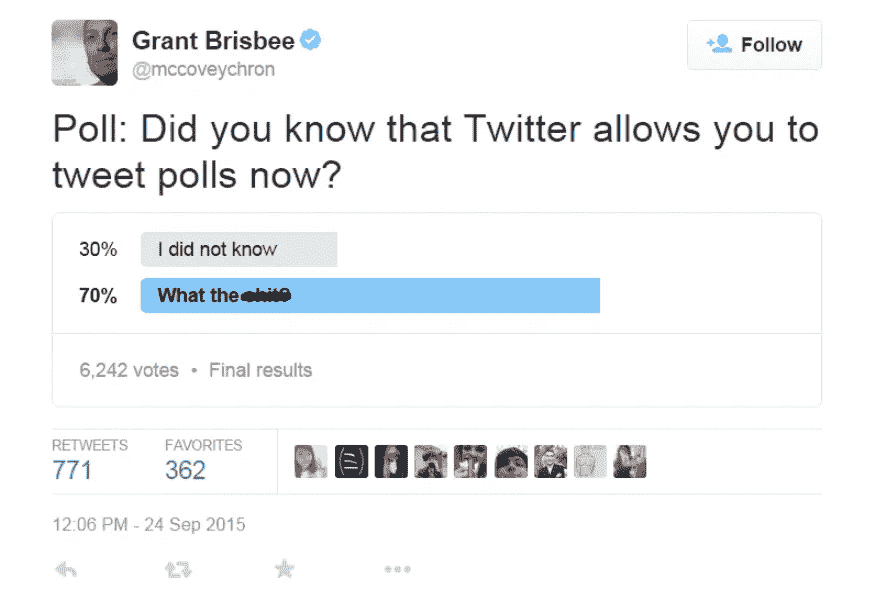
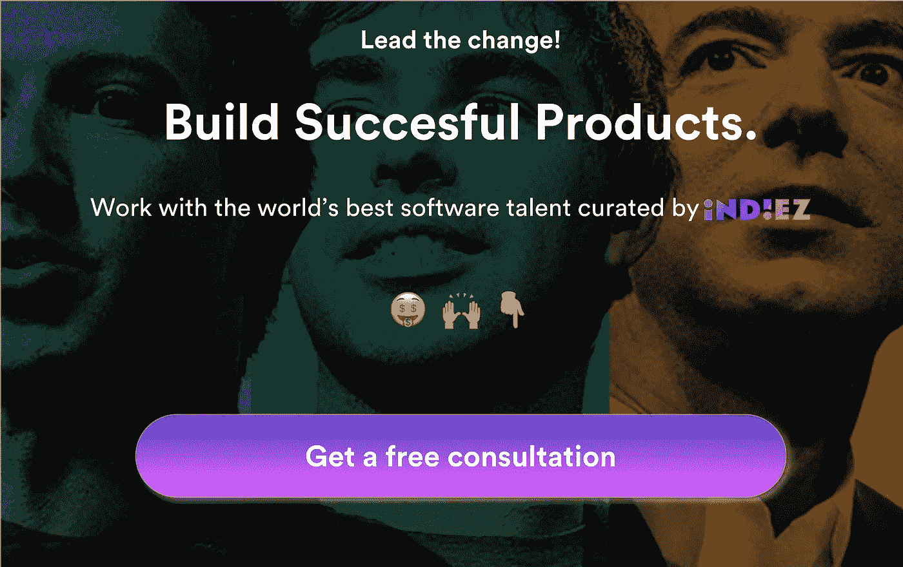

# 7 分钟阅读，为您的应用创意节省 100，000 美元。

> 原文：<https://medium.com/hackernoon/7-minute-read-to-save-100-000-on-your-app-idea-2d17db675a1>

我喜欢创始人。我喜欢他们带给这个世界的能量。我喜欢他们如何在最意想不到的领域找到要解决的业务问题。我喜欢多样性。

在 Indiez，我们已经帮助了 100 多位企业家制造成功的产品。为了帮助这 100 人，我们采访了来自全球各地的 600 多位创始人。

在与这么多创始人交谈后，我注意到成功的创始人都有以下共同的品质

**信念**——作为创始人，你必须相信你正在做的事情。这是一家[初创企业](https://hackernoon.com/tagged/startup)，会有不景气的时候。在那些糟糕的时候，你的信念会推动你走得更远，继续前进！

坚持不懈 —建立一家传奇公司需要非凡的专注和努力。你将不得不错过那些星期五晚上的聚会，减少你的睡眠。你将会解决一个每天都让你抓狂的问题。

> D 是一个借口——创业是有风险的。我不能告诉你你是否能使你的产品成功。还没有。

想想 2000 年代的 Airbnb。你会让陌生人进入你的家并睡在你的床上吗？

事实是，除非消费者开始使用，否则你无法知道你的产品是否会成功。只有消费者才能说你的船是不是要起航了！

然而，在构建产品的同时，您可以遵循一条平行的路径来测试您的想法。这里有几条黄金建议，可能会为你节省大量的金钱、精力，最重要的是节省时间。

# 1.有价值的免费信息

你一定在想——“你在说什么？我每天花很多时间在 Quora 上。我每天都阅读所有的科技博客。这还不够。

这一步可能感觉很初级，有点显而易见，但几乎每个创始人都错过了这一步。

如果你的想法是开发一个应用程序，去 Playstore 和 Appstore，用所有可能的关键词搜索。不要只是在手机上做，因为你所在的地区可能会将其限制在特定的地理位置。在你的桌面上做，看看你会得到什么样的结果。

如果你找到了一个和你相似的应用程序，那就深入研究一下。探索所有功能，阅读有关该公司的信息。记下什么是错的，什么是对的。

现在，用谷歌搜索与你的想法相关的各种关键词。例如，如果你正在构建一个活动策划应用程序，你可以谷歌“最佳活动策划应用程序”、“计划我的活动的最佳方式”、“派对策划工具”、“婚礼策划工具”等等。你会发现各种现有的企业。观察他们做得对与错。

现在你有了一份相关业务的清单——看看你的竞争对手或潜在竞争对手的吸引力。你可以使用类似于 [Similarweb](http://www.similarweb.com) 和 Alexa 的产品来获取这些信息。

你也可以通过 **Google AdWords planner 了解人们是如何找到你的产品的。**你只需输入关键词，就能知道人们在搜索什么，搜索量有多大。记录这些数据，并保存在手边。你以后会需要它的。

# 2.看看周围的空间。

现在你知道了你所在领域的各种现有业务，也知道了你的竞争对手。

下一步是找到更多关于空间的信息。需要回答的几个问题是:

-在这个领域有多少初创公司**正在获得融资**？如果创业公司在这个领域获得资金，这是一个好迹象。我发现 [Crunchbase](http://www.crunchbase.com) 和 [Mattermark](http://www.mattermark.com) 对这项研究非常有帮助。
-谁在给**施压**，他们声称要解决什么？你可以看看 TechCrunch、Venturebeat 和 TNW。
-听你的竞争对手的**创始人的播客/youtube 视频**。这将有助于你了解他们是如何发展业务的。

# 3.你不认识他们，但他们可以帮忙

很难从你的朋友和家人那里得到诚实的反馈。总是有偏见的。但是，你可以用这两个技巧来获得一些对你的想法的反应-

**在星巴克花了 10 美元——走到一个随机的人面前，告诉他你正在创办一家新公司，可能会把你一生的积蓄都投入到你的想法中。如果他们能给你一些反馈，你可以请他们喝一杯咖啡作为回报，这真的会很有帮助。**

**对问题和解决方案要非常清楚明确。你会惊讶于从一个你不认识的人那里得到的信息。**

**如果你是一个害羞的人，你可以在 Fiverr 或 Amazon Mechanical Turks 上雇佣 10 个人，让他们给出一个有条理的反馈。你将为此花费 50 美元，但它将帮助你在几天内评估你的想法。**

# **4.民意调查**

**网上投票是令人惊奇的，并且是收集反馈的一个超级容易的方法。我喜欢 twitter 上的民意调查，因为它们简单且即时。最棒的是，它们是免费的！😃**

****

**你一定在想“那不是我的观众”。好吧，事实是——当很多与游戏无关的人告诉你同样的事情时，你必须倾听。**

**你可以使用其他的[工具](https://hackernoon.com/tagged/tools)比如 Typeform 和 [google](https://hackernoon.com/tagged/google) 表单来构建一个简单的表单，然后把它们发送到你的[网络](https://hackernoon.com/tagged/network)来询问关于你的想法的基本问题。**

# **5.是时候开始营销了**

**到目前为止，你必须知道你能给你的观众提供什么。考验的时候到了！**

**用清晰的信息创建一个基本的登录页面。你可以用 [Bitblox](https://www.bitblox.me/) 、 [@LaunchRock](https://www.launchrock.com/) 和 [Unbounce](https://medium.com/u/eda63d4fd9e4?source=post_page-----2d17db675a1--------------------------------) (我的收藏)来做这个。**

**运行有针对性的 FB 广告，将您的潜在客户吸引到您的页面。这一招是我从 Blake (500 Startups 导师)那里学来的。**

**这非常简单而且非常有效。**

****

**[Kin.today](http://kin.today) 为一个简单的日历应用培养了 10，000 名会员电子邮件列表。该产品仍处于测试阶段，所有这些人都是通过登录页面注册的。**

**投入基本的分析来跟踪有多少用户在访问，有多少用户在注册。**

# **6.强化您的信息:**

**还记得用户在搜索什么吗？让我们使用这些数据，在登录页面上运行一些广告活动。这是赢得需要你产品的潜在客户的一个超级简单的方法。**

****

## **现在你已经证明了你的概念。很好！**

# **7.经验很重要**

**接触行业领袖和评论家，了解他们的想法和问题，并收集一些关于你正在构建的东西的反馈。**

**怎么伸手？冷冰冰的邮件。是啊！简单地给他们写一封简短的信。**

**大多数人喜欢得到关注和赞赏，他们也喜欢给你反馈。**

**记住……保持简明扼要。**

# **以上简单的步骤将帮助你在组建团队或外包上节省 10 万美元。**

**现在，为你自己感到骄傲。你有一个很好的概念证明，很少的潜在用户，并且有一个合适的战略信息。大部分是免费的。🙌**

**马克·安德森说-**

****

> **你已经消除了一层风险。**

**你从这些活动中得到的反馈和信息将会帮助你建立一个更好的企业。**

**但是，不要忘记你的激情和信念是你所做的一切的核心。从数据中学习，继续前进。**

****让我们来建造牛逼吧。****

## **启动？好好做！加入 100 多位与 Indiez 一起打造成功产品的了不起的创始人。**

## **[在此了解更多关于我们的信息— Indiez.io](http://www.indiez.io?utm_source=Medium&utm_medium=Blog&utm_campaign=Blog)**

****