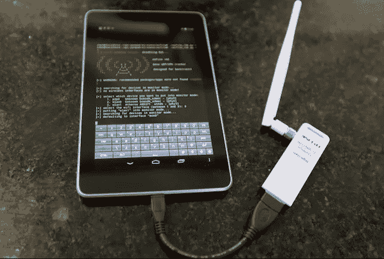

# 2022 年互联网上 7 款最佳安卓黑客应用

> 原文：<https://medium.com/hackernoon/7-notorious-best-android-hacking-apps-on-the-internet-ever-in-2017-4d5cba01fb4f>

> 这些是安卓手机和智能手机上最好的安卓黑客应用之一。必须贯穿整篇文章。

在 android 操作系统时代，它减少了我们的工作量，我们可以用 Android 智能手机只需点击几下就可以放下许多事情。所以伙计们，另一方面，有一个 android 应用程序的黑色世界，黑客可以用来做非法和奇怪的活动。

用技术语言来说，有许多应用程序被用来进行黑客攻击和其他违反 android 政策的非法活动。我们的目的不是推广这些应用，而是了解这些[安卓黑客应用](https://techdator.net/best-wifi-hacking-apps-android/)。许多 android 用户不知道这些应用程序，因为它们在 google play 商店中不可用，但你可以在互联网上免费找到这些应用程序。你甚至可以在网上搜索最好的 android 黑客应用，你可以很容易地得到这些应用。

Best Android Notorious Hacking Apps

google play 商店的广告上有数百万安卓应用可供用户使用，但你知道好的一面也有不好的一面，所以在互联网上也有坏的安卓应用，我们将它们列为黑客和破解者使用的最臭名昭著的安卓应用。

## 职业黑客使用的十大最佳安卓黑客应用(视频):

Best Android Hacking Apps List (LIKE THIS ABOVE VIDEO)

## 以下是互联网上使用过的 7 个最臭名昭著的安卓应用:

你们中的许多人听说过不同类别的最佳安卓应用程序，但今天我们将向你们展示互联网上最臭名昭著的最佳安卓黑客应用程序，人们可以自由地使用该应用程序，进行非法活动，并在他们的安卓智能手机上进行一些黑客活动。你可以用这些应用做很多事情，你们中的很多人肯定会在 android 上搜索破解 wifi 密码。你只需要浏览一下这篇文章。

## 赞蒂

Zanti 是 Zimperium 开发的最著名的应用程序之一，有许多下载。基本上这个 app 都是用于 wifi 网络渗透或者安全评估。但另一方面，许多用户使用这款应用程序进行 wifi 黑客攻击和非法活动。使用这个应用程序，你可以控制那些与你连接相同 wifi 的智能手机、平板电脑设备。你也可以和你的朋友恶作剧，重定向到特定的网址，上传图片到他的屏幕上等等。

## Droidsqli

你们中许多人听说过 SQL 注入攻击，这种攻击大部分时间在易受攻击的网站上执行，现在有一个名为 DroidSQLI 的应用程序，它使您能够通过 android 设备在网站上执行 SQL 注入。这是唯一一个执行 [SQL 注入攻击](http://en.wikipedia.org/wiki/SQL_injection)的应用。许多应用程序都可用，但没有人能打败这个。这款应用也被称为安卓智能手机最好的黑客应用之一。

## Dsploit

Dsploit 是一款用于网络评估的 power suit app。您可以全面分析您的网络，哪些服务和设备正在您的网络上运行。谁连接到您的网络和所有类型的信息？许多黑帽使用这款应用入侵网络并获得设备访问权限，理应在 android 黑客应用列表中。在这个应用程序中，您可以访问登录破解程序、简单嗅探、密码嗅探和终止连接等功能，以及许多黑客和破解程序需要的许多其他功能。

## WPA WPS 测试仪

WPA WPS 测试器 app 通常用于检查 wifi 漏洞，但现在人们用这个 app 进行 wifi 黑客攻击。当你启动这个应用程序时，他们会在绿色标签中向你显示弱 wifi，以轻松应用这个应用程序给出的随机 PIN 并获得该网络的 wifi 密码。该应用程序用于教育目的，但人们使用该应用程序来破解 android 上的 wifi 密码。要正确使用这款应用，需要对智能手机进行 root，以便轻松破解 wifi 密码。这个 app 基本上是为了查找网络漏洞，所以我们建议不要用这个 app 进行黑客攻击。

## Nmap

网络地图是网络地图中最著名的名字之一，因为这是整个网络行业的强大工具，所以他们也为 android 开发了 Nmap 应用程序。它可以在有根和无根的智能手机上运行。它可以映射您的网络，比如谁连接到了它，谁正在尝试连接，以及映射过程需要的这类信息。网络专业人员使用 Nmap 来执行网络探测，以找到网络中易受攻击的部分。

它可以扫描整个网络，包括端口、网络协议、用户以及所连接主机的其他详细信息。它可以在映射后显示您的网络详细信息，以便您可以找到网络中易受攻击的部分并修复它。

## APK 检查员

许多 android 用户都知道这个名为 APK 检查员的应用程序，因为这是逆向工程中最受欢迎的应用程序。你可以使用这个应用程序获得任何 android 应用程序的源代码，对源代码进行更改，并访问它们的全部功能。你可以在任何 android 应用程序上执行逆向工程，并根据你的愿望进行更改，并通过一些应用程序执行任何你想要的任务。你可以通过修改来完全控制任何 android 应用。如果你想在你的 android 设备上访问这个应用，你需要启动你的智能手机。

## 安德罗拉特

第一个 android 远程管理工具允许您从 Android 设备通过远程连接访问另一个系统。你可以用这个小小的安卓应用控制其他机器。许多用户非法使用该应用程序访问某人的计算机或智能手机，并进行非法活动。它基于客户机/服务器连接以及它们之间执行的操作。

> [黑客中午](http://bit.ly/Hackernoon)是黑客如何开始他们的下午。我们是 [@AMI](http://bit.ly/atAMIatAMI) 家庭的一员。我们现在[接受投稿](http://bit.ly/hackernoonsubmission)，并乐意[讨论广告&赞助](mailto:partners@amipublications.com)机会。
> 
> 如果你喜欢这个故事，我们推荐你阅读我们的[最新科技故事](http://bit.ly/hackernoonlatestt)和[趋势科技故事](https://hackernoon.com/trending)。直到下一次，不要把世界的现实想当然！

