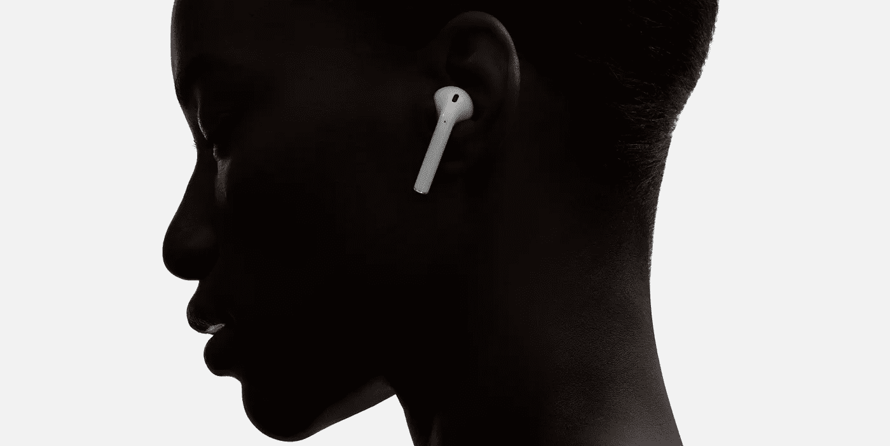

# 对 2017 年语音和人工智能的 7 个预测

> 原文：<https://medium.com/hackernoon/7-predictions-for-voice-ai-in-2017-961183f8d741>

我对语音交互和人工智能领域下一年的创新感到兴奋。下面了望…

## **标准化将出现**

随着标准和直观功能的出现，语音交互将呈指数级提高，各地的数字设计师都应该认识到这是多么重要。我们今天为语音交互创建的一套定义和模型将在未来很长一段时间内影响事物的形态。打个比方，回想一下过去 20 年流行的交互模式(例如，我们如何浏览网页，或者最近我们在应用市场上使用的常见图标、表单和手势风格)。在 Critical Mass，我们正在不知疲倦地工作，以在短期内将更好的语音交互标准转化为客户可用的工具，但我们也希望在塑造这种[技术](https://hackernoon.com/tagged/technology)的未来方面发挥作用，以便品牌和日常用户都能受益。

## **新搜索小牛**

语音交互体验为竞争对手放松谷歌对搜索市场的控制提供了一个小小的机会。在很大程度上，语音交互仍然是精确和上下文搜索结果的练习。尽管这仍然是一个“最佳算法获胜”的游戏，但现在所有的算法都非常好。就像每个人都沉迷于谷歌搜索信息一样，他们也很容易沉迷于一种新的互动习惯，这种习惯与不是由谷歌支持的语音助手有关。我个人并不认为谷歌会被取代——他们在这个领域比任何人都努力——但这只是一个小窗口，如果新进入者偷走了一些用户忠诚度，我也不会感到惊讶。

## **家长咨询**

你是，或者曾经是，新父母吗？如果没有，让我告诉你速度:他们忙得不可开交。字面上。在有小孩的家里，语音交互的条件是完美的。除了能够不间断地给孩子洗澡或做饭之外，每位父母都可以告诉你，如果你试图在幼儿附近与手机保持联系，手机会从你手中被夺走，被用作出牙玩具，然后被扔向房间另一端的猫。而且，事实证明，更换手机非常昂贵。想知道如何提高自己的声音努力？与新父母交谈。

## **AirPods 当耳虫**

不用摸索电线的前景只是稍微有点意思，但我不认为这是苹果转向无线耳塞的真正原因。我认为苹果将 AirPods 视为类似于谷歌眼镜的东西，但负面社会偏见的风险较小。AirPods 为个人连接内容提供了一个永远在线、随时可用的机会。苹果只是在非视觉连接上下了第一注——至少在光学可穿戴技术成熟之前是如此。2017 年，我们将通过 AirPods 一瞥持续连接的未来。

## **品牌个性**

如果 Max Headroom 今天还活着，那么也许他是——我不确定我们如何确定人工生命的真实死亡率——他会对 2017 年将要发生的事情印象深刻。语音交互和人工智能越接近自然语言对话，我们就越能把个性特征应用到我们的虚拟代理上。在 Critical Mass，我们已经开始建议我们的客户打造独特的个性和与他们的核心品牌一致的语调，或者为一个品牌引入一个新的角色，以改变人们的看法或吸引新的观众。无论是哪种情况，都可以期待这些新人在 2017 年通过 voice 首次亮相，但更重要的是，要寻找那些在多个渠道占据主导地位的人。在不久的将来，我们将看到一个新的电视品牌角色，它最初诞生于数字语音体验。

## **外围支持**

苹果在 2016 年将 Siri 整合到多种产品中，这清楚地提醒我们，我们正在走向一个语音化的未来。唯一的问题是，许多产品在设计时并没有考虑到听和说。他们设备中麦克风的质量和能力赶不上亚马逊 Echo 和谷歌 Home 等专用设备。我希望看到为苹果产品推出的外设能在各种实施中带来同等的质量。我们将看到同样的事情发生在其他具有语音交互软件功能，但开箱即用的硬件不完善的 PC 设备上。

## **CMS 打嗝**

这可能是许多人想到的最后一件事，但它将是我们首先注意到的事情之一。主要网站内容管理系统(CMS)和数字资产管理(DAM)的现状将远远不能满足消费者的需求，因为公司仍在围绕文本、表单和图像资产构建基础设施。许多公司没有为未来 3-5 年做好准备，随着他们开始询问 2017 年提供语音体验的问题，差距将开始出现。那不行。如果公司希望通过新的渠道和互动提供产品相关的音频内容，他们需要开始为未来做准备。

*【本文一个版本原载于*[*【12/2/16】创业击败*](http://venturebeat.com/author/grant-owens-critical-mass/)

******

> *[黑客中午](http://bit.ly/Hackernoon)是黑客如何开始他们的下午。我们是 [@AMI](http://bit.ly/atAMIatAMI) 家庭的一员。我们现在[接受投稿](http://bit.ly/hackernoonsubmission)并乐意[讨论广告&赞助](mailto:partners@amipublications.com)机会。*
> 
> *如果你喜欢这个故事，我们推荐你阅读我们的[最新科技故事](http://bit.ly/hackernoonlatestt)和[趋势科技故事](https://hackernoon.com/trending)。直到下一次，不要把世界的现实想当然！*

**