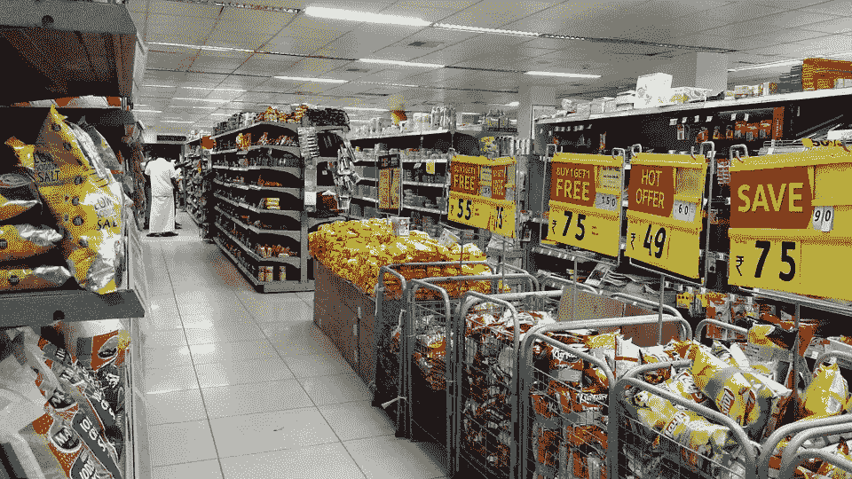
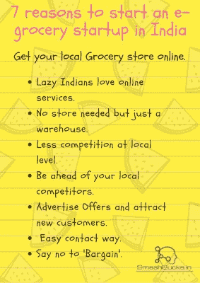

# 现在在印度创办电子杂货店的 7 个原因。

> 原文：<https://medium.com/hackernoon/7-reasons-for-starting-an-e-grocery-startup-in-india-right-now-6610aa40345a>

# 在印度创办一家电子杂货店。

杂货店是每个人都需要的东西，食物是基本必需品，杂货店也是如此。在印度销售食品是有史以来最赚钱的生意，这是唯一一项你几乎在任何地方都能创业并获得丰厚利润的生意。但是如何应对这个网购新时代的人们呢？

答案是让你的商店上线。我们生活在一个懒人的世界，大多数人不喜欢购物，比如食品杂货或日常食品，但如上所述，这是一种必需品，任何人都不能忽视。

大篮子电子食品初创公司。

# 但是你为什么要去网上杂货店呢？

想象一下，您已经在当地拥有了一家杂货店，您已经足够满足当地客户的日常需求并获得利润。

因此，您对您的业务很满意，但是，如果我说您可以获得比当前利润高出 10 倍的利润，该怎么办？

jio 革命后，每个人都开始意识到互联网在印度的力量。网上购物网站为您提供任何您需要的东西，比如买衣服、订票、买家具、电子产品，无论您需要什么，您都可以以合理的价格在网上找到。

现在，如果您到目前为止还不信服，让我们来看看更多说服您的方法。

# 慵懒的一天，没有人想去购物，但感觉饿了。

这是三分之一印度人的共同问题。我们喜欢坐在门口，得到我们需要的任何东西。

我们可以致电或在线订购所需物品，并尽快获得。帮助懒惰的印度人，他们会从新客户转变为您的日常客户。

# 你不需要商店，只需要一个仓库。

当地杂货店需要一个商店和一个仓库，但作为一个电子杂货商店主，您只需要在特定区域有一个仓库。这不仅有助于您省钱，而且易于管理。

# 大型在线杂货店仍未遍布各地。

这太大了。印度是一个幅员辽阔的国家，每个人都需要食品杂货，但是大型电子食品杂货网站仍然无法进入印度的每一个地方，但是您作为一名当地的电子食品杂货商，可以收购您所在的整个地区。

您需要做的是让您的业务上线，并在您的网站上向您的客户提供您提供的所有项目的基本联系方式。

此外，您也可以为他们提供一种简单的方式来选择物品，结账，并在他们家门口得到他们选择的任何东西。

# 领先于您的当地竞争对手。

当地的杂货店是竞争最激烈的地方。如果其他人以同样的价格购买同样的产品，但不是从你那里，而是从你旁边的商店购买，会怎么样？你肯定不会感觉最好。

运用你的大脑，让你的商店上线，这样这个人就不会去你竞争对手的地方，而是直接从你那里坐在他们家里购买。

哇哦！

# 通过展示你最好的产品来吸引人们。

谁不喜欢免费的东西？用买一送一这样的优惠吸引更多的人成为你的常客。这是每个大型超市业主使用的策略。

你一定听说过大集市的优惠活动买这个送这个。他们大多在当地报纸上做这类广告，但是你更聪明，可以更好地展示你的报价。

尽管你是一个小的本地杂货店创业公司，你可以比那些大品牌吸引更多的人。没有人想到包装食品的品牌，但他们想到的是他们节省了多少。

只要掷骰子就能赢得比赛。

# 轻松联系您的客户。

这是互联网最大的优势，它使互动更容易。你可以很容易地了解你的顾客，与他们交谈，了解你的服务的优缺点。

这能让你进步很多，帮助你变得比以前更大。

# 不用担心‘砍价’的老方法。

有了一家电子杂货店，只要有人通过你的网站订购，钱就直接进入你的账户，因此不存在讨价还价的问题。

该人将需要按照书面价格购买该项目。但是要诚实，以合适的价格提供合适的商品。

## 摘要

所以不要想太多，如果你正计划有一个电子杂货创业，那么这是正确的时间。目前，印度是全球最大的互联网消费者，在这个领域，本地竞争并不激烈。现在就开始计划，如果你需要关于你的创业广告设置的帮助，请联系我。我们很乐意以各种可能的方式帮助你。

你喜欢这个吗？

如果是的话，点击下面的图片，因为我还有很多东西要给你看。

