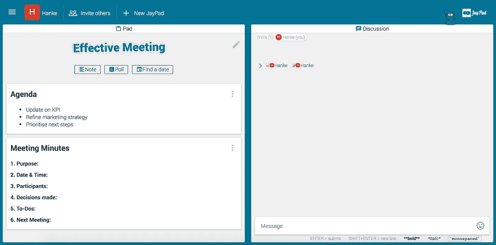
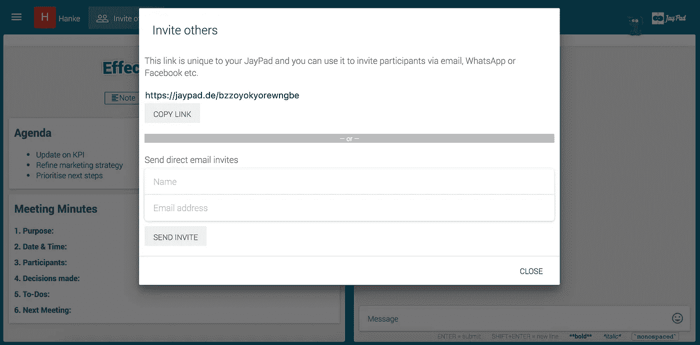
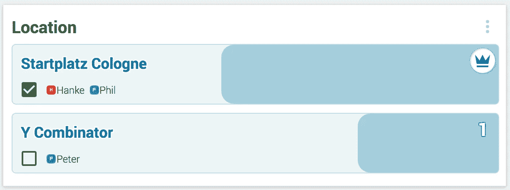

# 应对公司会议的 7 个步骤

> 原文：<https://medium.com/hackernoon/7-steps-to-manage-a-meeting-with-jaypads-47c48d32287e>

## 在开始我们的创业之旅之前，我们是公司环境的一部分。以下是我们在那些年对会议的了解，以及 JayPads 如何帮助这种疯狂。

1。在开始之前，问自己一个问题:你想通过这次会议完成什么？这决定了一切，从合适的参与者，到所需的时间段，到日期和议程。把这个钉牢。再问一次:这次会议的预期成果是什么？大概需要多长时间才能达到这个产量？60 多分钟？从头开始缩小范围。这是非常关键的一点，也是最容易被忽略的一点。我们不能(老实说，为了理智起见，我们可能不想)计算我们在准备糟糕的会议中浪费的时间。

2。为了达到你需要的结果，谁绝对需要参加这个会议？常见的立场似乎是“人越多越好”或“人越多越重要”——好吧，我们很乐意告诉你:这不是真的。一点也不。坦率地说，事实正好相反。所以，帮你自己和其他人一个大忙，仔细决定谁绝对需要出席。当有疑问时:不要邀请。

重要提示:本次会议适合召开电话会议吗？这通常会对日期/时间产生影响，从而增加灵活性，但如果通话偏离方向，则会以效率为代价。此时此刻，我们应该花几分钟时间，回忆一下我们有幸参加的所有电话会议。

3。设置一个 [JayPad](https://jaypad.de/) 。从添加议程和会议记录模板开始。为什么？因为这将为整个事情定下基调。你会把事情做好，这就是你要展示的。

关于会议记录，你应该记住这一点:逐字逐句地写文字记录不会为任何人做任何事。如果你需要它们作为掩护我的策略，这可能是有意义的，但它肯定对你的情况没有帮助(你在第一步缩小了范围)。对于任何想在几周或几个月内重温此事的人来说，最重要的信息是你们为什么会面，谁会面，你们做出了什么决定，以及你们确定的下一步是什么。那个。是。它。

如果你真的需要一字不差地确定每件事，你可能会重新考虑你选择的工作环境。

A tiny yet effective mix of Slack and Post-Its.

4。邀请参与者。现在你已经设置好了你的 [JayPad](https://jaypad.de/) 和议程以及紧迫感/规划感。你可以邀请其他人。只需通过邀请功能直接添加参与者，或者通过 messenger 或电子邮件共享 URL。

5。现在你已经有了自己的团队，找一个对每个人都合适的日期。通过日期查找功能查询可用性和时间段。

如果你也需要决定一个地点，你可以选择不同的地点，点击一下就可以设置好。

此外，您还可以进行群聊。如果有什么事情需要提前讨论——也许你没有完全确定议程，或者短期内出现了更紧急的话题——使用群聊可以让你快速完成，节省大量的电子邮件或电话。

6。在会议期间——我们对此非常认真——找一个计时员。需要有人负责完成目标产出，并通过这次会议管理团队。否则你就听天由命吧。人类历史上每个有幸参加公司会议的人都知道人们(男性似乎尤其容易)是如何劫持这些会议，并让它们成为个人品牌展示的。不要让这种事情发生。事先定好基调，只邀请那些绝对必要的人是第一步，这至少让你成功了一半。

只需打开 JayPad，同时填写分钟。

7。综述。这将使你的生活变得更加容易: [JayPads](https://jaypad.de/) 是群聊和笔记的混合。让每个人都加入这个会议讨论板，可以让与会者立即看到相同的会议记录、待办事项和决策，并在需要时进行进一步的讨论。如果之后有什么要讨论的，聊天会节省大量的邮件。同样，您也不需要发送包含上述会议记录的额外文件。享受节省下来的时间，保持头脑清醒。

*如果你喜欢这篇文章——****请务必在这里给我们关注一下媒体以及*** [***推特***](https://twitter.com/TalkAboutJack)*[***【脸书***](https://www.facebook.com/talkaboutjack) ***。我们将发表关于其他用例场景的文章，以及我们对协作软件的一般看法和一个年轻创业公司的旅程。****

******

> *[黑客中午](http://bit.ly/Hackernoon)是黑客如何开始他们的下午。我们是 [@AMI](http://bit.ly/atAMIatAMI) 家庭的一员。我们现在[接受投稿](http://bit.ly/hackernoonsubmission)并乐意[讨论广告&赞助](mailto:partners@amipublications.com)机会。*
> 
> *如果你喜欢这个故事，我们推荐你阅读我们的[最新科技故事](http://bit.ly/hackernoonlatestt)和[趋势科技故事](https://hackernoon.com/trending)。直到下一次，不要把世界的现实想当然！*

**