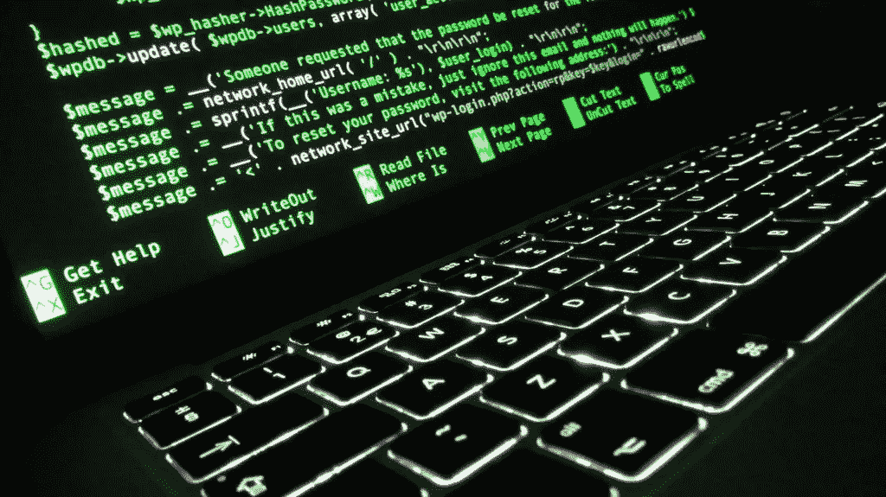

# 人们成为信息安全专家的 7 种令人惊讶的方式

> 原文：<https://medium.com/hackernoon/7-surprising-ways-people-became-infosec-professionals-3a6596032a5a>

如果你喜欢这篇文章，帮助一个不富裕的[网络安全](https://hackernoon.com/tagged/cybersecurity)女人…请点击小绿心推荐我的文章！

自 2009 年以来，在为各种出版物撰写关于信息[安全](https://hackernoon.com/tagged/security)的文章时，我有幸遇到了许多在我的领域里的迷人的人。我们很多人都表现得很偏执。我们都有自己的古怪之处。我们中的一些人非常友好，喜欢和陌生人交谈。信息安全领域有很多白人，但也有各种种族、民族和国籍的人。我也遇到了一些其他的女人。我喜欢为 [Tripwire 的企业博客](https://www.tripwire.com/state-of-security/off-topic/women-information-security-zo%D1%91-rose/)采访我们中的一些人。我甚至遇到了一位跨性别的信息安全专业人士——一位非二婚女性。

有一件事引起了我的兴趣，那就是我们进入 infosec 的许多有趣的方式。没有固定的路径，每个人的故事都不一样！我们各不相同的背景赋予了我们每个人独特的视角，这增强了我们对漏洞、安全强化和总体网络安全文化的看法。

**金·克劳利(我！)**

1993 年，我九岁时开始使用 Windows 3.1。我父亲买了我们第一台采用英特尔 486 处理器的 IBM 个人电脑——在当时是一台功能强大的个人电脑。作为一个小女孩，我彻底探索了他的 PC。我喜欢玩 Windows 和 MS-DOS。我有一些由 Apogee，Sierra，Broderbund 和 Epic MegaGames 为 MS-DOS 发布的最喜欢的游戏。我甚至学会了一些 DOS 命令。

爸爸是一名小说家，他经常遇到技术问题。它们通常与他的激光打印机有关，或者是一般的 Windows 问题。他让我修复他的外围设备问题，我还编辑了 autoexec.bat，这样 Windows 可以启动得更快。令人惊讶的是，即使我还是个小女孩，他也能认出我的电脑知识。

到 1994 年，Crawley 家第一次通过 Prodigy Online 和一个 14,400 bps 的调制解调器接入了互联网。我用马赛克浏览器在万维网上浏览早期的网页。我会看网页的源代码来自学一些 HTML。

虽然我从小就对计算机感兴趣，但世界上的其他人似乎都试图阻止我从事计算机职业。我在学校的数学不是很好，我的老师告诉我，你必须是一个数学天才才能从事计算机工作。她从来没有追求过计算机科学或 IT，她知道什么？但作为一个孩子，我没有质疑过她。媒体对“电脑虫”的描述总是以男性为主，这也于事无补。

快进到我 25 岁左右，那时我已经有了为人们制作网站的经验。出于某种原因，我仍然认为自己不擅长计算机。但是我有一个前男友，他认为我很有潜力。所以我开始获得我的第一份证书；A+、网络+和安全+。这使我能够在技术支持部门找到一份工作。

在我的技术支持工作中，我注意到*很多*罚单都与恶意软件有关。恶意软件开始让我着迷。人们总是告诉我，我擅长文字。我已故的父亲是我学习如何有效写作和商业目的的一个重要因素。2009 年，一个朋友的朋友帮我找到了一份工作，为信息安全研究所的信息安全资源网站写文章。我真的是在那里开始工作的，我为他们写了很多年的信息安全文章。

回到 2014 年 8 月，Gamergate 一炮而红。这是一场令人厌倦的网上仇恨运动，在试图摧毁游戏开发商佐伊·奎因(Zoe Quinn)后，最终瞄准了许多女性和 LGBTQ 人士(以及为他们辩护的人)。有数百个目标，他们往往是在视频游戏行业，在计算机科学和信息技术，在社会正义行动。Gamergate 是人性中绝对最坏的一个令人讨厌的例子，它发展成为一个大规模的在线攻击暴徒。暴民主要由无知和可恶的年轻人组成，他们被反动的愤怒所驱使。荡妇羞辱，同性恋恐惧症，变性恐惧症，伊斯兰恐惧症，种族主义，试图将视频游戏作为一个男性女性憎恨者俱乐部(虚构的女性，如薇薇安·詹姆斯除外)，骚扰视频游戏评论者，因为他们给使命召唤游戏的分数低于 10 分(满分 10 分)……这是一场混乱。

这是一个漫长而复杂的故事，这是一种由帮助唐纳德·特朗普当选美国总统的同一类讨厌的偏执者创造的现象。事实上，唐纳德·特朗普的粉丝和玩家的维恩图会有相当大的重叠。如果这是你第一次听说 Gamergate，并且为了上下文，你真的想了解更多， [RationalWiki](http://rationalwiki.org/wiki/Gamergate) 有一个非常好的、相对简洁的概要[在这里](http://rationalwiki.org/wiki/Gamergate)。

到 2015 年 2 月，Gamergate 仍然表现强劲。许多 Gamergate 骚扰活动和脚本儿童级网络攻击正在 8chan 上策划。开始是因为 [4chan](https://en.wikipedia.org/wiki/4chan) 不再允许真正恐怖和偏执的内容。4chan 的管理员决定停止允许与 Gamergate 相关的帖子。8chan 的创始人 Frederick“hot wheels”Brennan 已经允许其论坛成为传播儿童色情的场所。他需要更多的流量，更多的关注！所以他张开双臂欢迎那些对被 4chan 封杀感到愤怒的游戏玩家。

Gamergate 的主要武器是互联网。他们利用计算机技术试图破坏人们的生活。他们的许多行为都是网络攻击，尽管是业余的和脚本驱动的。SWATing 是指恶作剧电话、电子邮件或其他类型的通信被发送到警察局，试图派遣特警队到目标家庭并恐吓他们。在一些游戏玩家中，拍打是一项受欢迎的活动。其他人喜欢 doxxing。这时，有关目标的敏感信息，如电话号码、家庭住址、信用卡号码和 SSN 号码，会在网上传播，从而为攻击提供便利。所有这些都属于信息安全的范畴。

所以那个月，我为 InfoSec 资源写了一篇关于 Gamergate 和 8chan 的文章。他们出版了它。几个小时内，玩家们发现了我的文章，并被激怒了。他们组织了一场骚扰活动，让我的文章下线。他们找不到我的电子邮件地址(作为一名信息安全记者，我知道如何让自己难以 dox)或电话号码。但是他们发现了各种电子邮件地址连接到 InfoSec 资源。他们在 8chan 和 Reddit 上组织起来，数百封骚扰邮件被发送给信息安全研究所的员工，包括我懦弱的前编辑罗伯特·罗德里格兹。我很快就收到了他的邮件，通知我我的文章被下线了。(如果你好奇并想阅读我的文章，这里有一个[网络缓存](https://archive.is/OzOhn)。谢谢 archive.is！)然后他们把我所有的文章都下线了，因为显然愤怒的 8 频道是信息安全研究所培训项目的主要市场。

罗伯特·罗德里格兹和信息安全研究所应该被我称为懦夫。像报纸和电视网络这样的媒体公司已经被越来越少的大公司收购了。新闻学教授哀叹道，由于企业影响力的增长，太多的新闻业正变成美化的公关和广告。调查性新闻是信息时代一项至关重要的公共服务。如果没有调查记者和各种告密者，人们怎么能了解社会和整个世界的问题呢？许多最好的信息安全新闻都是有调查性和争议性的。

我写了关于 Gamergate 是一个信息安全问题的文章，信息安全研究所决定让网络安全专业人士帮助保护人们免受攻击的黑帽子获胜。我还为他们的 CISSP 和认证道德黑客培训项目提供内容，但从未获得过任何认证。说真的，如果你在 infosec 工作，需要一个培训项目，试试 [SANS Institute](https://www.sans.org/) ，因为他们的好名声是实至名归的。不要在信息安全协会浪费你的钱。

无论如何，在我为 InfoSec Resources 撰稿的那些年里，Rodriguez 让我有机会为 IDG 出版社 [CSO](http://www.cso.com.au/author/2147447451/kim-crawley/articles) 、 [CIO](http://www.cio.co.nz/author/2147447451/kim-crawley/articles) 和 [Computerworld](http://www.computerworld.com.au/author/2147447451/kim-crawley/articles) 撰稿。我还为 SC 杂志写文章。请随意查看链接，阅读我的更多作品。

我真的为我发表在 2600 杂志 2014/2015 冬季的文章感到骄傲。题目是“普通人认为黑客是什么？”与我为其他出版物写的文章不同，我没有报酬。但在 2600 年在一些技术圈是有声望的，我享受了一年的免费订阅。我觉得 2017 年 2600 我还是写点别的吧。这里有一些有趣的琐事。我出生于 1984 年 1 月，也就是 2600 杂志出道的那个月。

成为 Gamergate 的目标对我造成了巨大的精神打击。感觉我的 infosec 写作生涯结束了，当时我才 31 岁。我陷入了持续数月的深度抑郁。有几个星期，我只是离开我的床去上厕所和淋浴。

但就像全能的凤凰一样，我从灰烬中重生。我在信息安全社区交了很多朋友，也有人喜欢我的作品。多亏了我多年来在 Twitter 上与信息安全人员建立的联系，新的机会出现在我面前。我和其他 infosec 出版物的编辑交了朋友，他们看到了我的潜力。

Tripwire 的 Joe Pettit 让我出版了我的[信息安全中的女性](https://www.tripwire.com/state-of-security/off-topic/women-information-security-tiberius-hefflin/)采访系列，该系列于 2016 年 10 月首次亮相。我继续为 Tripwire 的博客撰写关于[量子网络](https://www.tripwire.com/state-of-security/security-data-protection/cyber-security/quantum-networking-end-man-middle-attacks/)和[消费设备中的个人数据](https://www.tripwire.com/state-of-security/security-data-protection/cyber-security/quantum-networking-end-man-middle-attacks/)的文章。还有更多的 Tripwire 文章即将推出！

Alienvault 的 Kate Brew 很喜欢我为 Tripwire 写的文章，并邀请我为他们的公司博客投稿。我为 Alienvault 写的第一篇文章是关于[糟糕的 UX 设计如何成为一个日益严重的信息安全问题](https://www.alienvault.com/blogs/security-essentials/ux-design-an-overlooked-aspect-of-endpoint-security)。她对我关于 Alienvault 博客文章的一些其他想法感到兴奋，所以我正在努力！

我也很自豪在去年我的第一次信息安全大会上发言，2016 年多伦多。我骄傲地保留着我的 t 恤。

在推特上关注我: [@kim_crawley](http://twitter.com/kim_crawley)

布莱恩·克雷布斯

著名的安全研究员 Brian Krebs 的故事在我脑海中留下了深刻的印象。他的背景不是计算机。自 1995 年以来，他一直在《华盛顿邮报》担任记者。他描述了自己是如何偶然进入 infosec 的。2001 年，他家兰被狮子虫袭击了。

Krebs 小时候学过一些计算机编程，并且一直对计算感兴趣，尽管他当时并没有从事这方面的专业。他天生的好奇心促使他探究蠕虫对他的计算机和网络做了什么。这引发了对信息安全的持续关注。

他继续为《华盛顿邮报》撰写安全补丁博客。那次冒险发展成了他现在的安全博客。这些年来，他所有的研究和写作使 Krebs 成为一个广受欢迎的信息安全专家。

在推特上关注克雷布斯:[@布里安克雷布斯](https://twitter.com/briankrebs)

**里克·麦克罗伊**

麦克罗伊对计算的热爱始于孩提时代。他拆开了一台雅达利游戏机，探究其内部工作原理。十几岁时，他参加了一个名为 NORSTAR 的高中项目，该项目完全是关于机器人和计算的。由于与美国国家航空航天局的合作，他在 NORSTAR 进行的一项实验最终被送上了航天飞机！这些经历进一步激发了他对技术的热爱。

17 岁时，他加入了美国海军陆战队。他没有担任计算机技术员的角色，他把自己当时的职位描述为“打杂的”在海军陆战队，计算机技术的工作机会很少，所以最终他决定作为一名文职人员开始他的 IT 生涯。

他进入科尔曼大学追求自己的梦想。在那里，他学到了从网络到如何用硬件组件构建服务器的一切。

毕业后，他在一家向企业出售计算机硬件和服务的公司找到了工作。他们还雇佣了一些网络安全专业人士，他从这些人身上学到了很多东西。他们教他渗透测试、安全加固以及如何向企业销售这些服务，向这些客户解释信息安全的重要性。

这就是他开始信息安全职业生涯的原因，17 年来，他的职业生涯一直在不断壮大。他为《ITSP》杂志写了一篇关于为什么退伍军人会成为优秀的网络安全专家的优秀文章。

在推特上关注麦克罗伊: [@InfoSecRick](https://twitter.com/InfoSecRick)

**吉甜**

退伍军人拥有独特的知识和经验，可以促进信息安全事业的发展。但是也可以…女性和性别研究的学生？没错。

斯威特研究的就是这个。她的经历磨砺了她的批判性思维技能，并让她对社会中的权力结构如何运作有了深入的理解。

我曾经认识的一位网络安全专家说，“业余爱好者黑系统。专业人士黑人。”STEM(科学、技术、工程和数学)背景与信息安全有着明显的联系。但是人们经常忽视心理学、社会学和其他社会科学对信息安全的重要性。大多数网络攻击都涉及某种程度的社会工程——愚弄人们。此外，最终用户的无知通常是一个安全漏洞，还有一些因素，如糟糕的企业文化和工人剥削如何推动内部攻击，以及[糟糕的 UX 设计](https://www.alienvault.com/blogs/security-essentials/ux-design-an-overlooked-aspect-of-endpoint-security)。

斯威特从学校毕业后开始从政。她从事政治活动，先是当听差，然后是立法助理。她认识到，政治可能是一个不稳定的领域，即使你不是一个依靠连任保住工作的政治家。为政客工作的人也可能有不可靠的工作保障。当他们为之工作的政客也在选举中落败时，员工通常会丢掉工作。

想要离开政治，斯威特天生的好奇心促使她自学了计算机编程。安全软件工程和设计是信息安全的一个关键领域。安全令她着迷，所以她进一步探索。她继续参加信息安全会议，做志愿者，并在会上发言。她并不完全觉得自己属于信息安全世界，但在 [DerbyCon 2014](https://www.youtube.com/watch?v=e4aDfc2s3FU&list=PL2RVJLyTfmtjeUb-XMNu1ef3qKJjLiLVV&index=3) 上看到一个关于人们如何从计算机科学和信息技术之外的领域进入安全领域的演示时，她相信了这一点。

去年，她得到了第一份正当的信息安全工作，这个行业因为她的贡献而变得更加美好。

在她的博客[这里](https://thesweetkat.com/blog/2015/11/20/being-an-infosec-latecomer-part-1-education)和[这里](https://thesweetkat.com/blog/2016/6/17/being-an-infosec-latecomer-part-2-election-bugaloo)上阅读她的精彩故事。我还有幸为我的[女性信息安全](https://www.tripwire.com/state-of-security/off-topic/women-information-security-kat-sweet/)系列采访了她。

在推特上关注甜甜: [@TheSweetKat](https://twitter.com/TheSweetKat)

**克劳斯·克莱蒙·豪曼**

Houmann 在他的祖国丹麦的一所大学学习商业管理和信息技术。在商学院时，他作为 ADSL 热线支持者为丹麦最大的 ISP 工作。毕业后，他被 TDC Hosting 聘为流程顾问。

这让他获得了很多与数据中心打交道的经验。通过使用防火墙配置和服务器机房的物理访问控制，他在工作中学习了 infosec，尽管他的重点是可用性和日志记录。

当时的数据中心指标可能侧重于正常运行时间和准确的数据收集，但这些目标取决于安全性。信息安全的中情局三位一体适用于豪曼的工作，即使他并不知道。尤其是完整性和可用性组件。像他工作的环境这样的数据中心与网络相连，这是一种从一些计算机访问数据并将其分发到其他计算机的方法。通常，网络数据中心被连接以包括公共互联网。DDoS 攻击等网络攻击会损害可用性，中间人攻击等网络攻击会损害完整性。网络为这类攻击提供了便利，你甚至不需要互联网连接。心怀不满的流氓员工可能会攻击其雇主位于封闭互联网的 WAN 中的服务器，或者外部攻击者可能会渗透到工作场所的建筑中，以获得与员工相同的物理 WAN 访问权限。

在 TDC Hosting 工作了几年后，Houmann 的雇主让他使用 ITIL-艾克斯洛斯的专有信息技术基础设施库系统进行 IT 服务管理。贸发局主办为他提供了专门的培训和认证学习和考试。随着 2007 年 5 月 ITIL v3 的发布，安全性成为了课程的一个组成部分，尽管 Houmann 说从那以后 infosec 已经发生了很大的变化。但是学习 ITIL v3 帮助 Houmann 了解了一些安全手续。

想象一下，如果像加拿大、美国和英国这样的国家更像丹麦，信息安全领域会有多少聪明的头脑？Houmann 受益于丹麦的公共服务，该服务允许丹麦公民免费上学院和大学。然后，他有了一个雇主，他准备并愿意投资于他在特定信息技术领域的进一步教育。可能有数以百万计的加拿大人、美国人和英国人具有 Houmann 的潜力，但他们永远不会在 infosec 工作，因为他们负担不起所需的教育，而且雇主坚持要求为显然是入门级的职位提供价值 5 万美元的教育。

豪曼随后坠入爱河并结婚了。他的妻子在卢森堡找到了一份工作，所以他辞去了丹麦的工作，和妻子一起生活。他在卢森堡创办了自己的 IT 服务管理公司，ImproveIT Consulting。他最大的客户是一家小型银行机构，他意识到该机构非常需要安全管理。金融数据是高度敏感的，地球上的每个发达国家都有严格的政府法规来保护该行业的数据安全！

意识到安全是多么重要，Houmann 开始参加信息安全会议。他对要学的东西之多感到惊讶。作为一个完美的专业人士和勤奋的头脑，他学到了很多关于信息安全的知识。他总是能学到更多。

他后来离开了 ImproveIT 咨询公司，进入网络安全领域，全职为 Peerlyst 工作。剩下的就是历史了。

在推特上关注 Houmann:[@ ClausHoumann](https://twitter.com/ClausHoumann)

**乔瓦尼·纳塔莱(约翰尼·圣诞)**

黑客是潜在的信息安全专家。我指的是史蒂芬·李维、理查德·斯托尔曼意义上的黑客，而不是通俗的、好莱坞驱动的“黑客都是坏人和黑帽子”意义上的黑客。对技术有一种与生俱来的好奇心，并尝试去探索它能做什么，这就是成为一名黑客所需要的一切。约翰尼·圣诞老人一直有这样的想法，他从来没有让他的环境劝阻他。

Johnny Xmas 对计算机的迷恋始于早年。在百思买工作时，他没有接受过正式的 IT 培训，但他能够用从雇主的垃圾箱里找到的零件组装他的第一台个人电脑。他后来因为被抓而被解雇，即使警方承认他没有做任何违法的事情。有多少好产品零售商总是扔掉，这是一种奇耻大辱，因为他们认为如果他们扔掉卖不出去的东西，消费者就不太可能买东西。这就是资本主义的浪费。

《2600》杂志让他融入了黑客文化，并向他展示了还有其他人和他一样。

在大学期间，Johnny Xmas 用他的黑客头脑揭露了一些正在发生的事情。出于法律原因，他对细节三缄其口，但他说缺乏对道德披露的理解是他被学校开除的一个因素。哦好吧。正如阿兰妮斯·莫利塞特曾经唱过的，你活着，你就学习。

探索计算机系统和网络，无论合法还是非法，都教会了他系统管理员的技能。不幸的是，大多数雇主不会雇佣没有正式专业经验的人担任这个职位。因此，带着系统管理员的梦想，Johnny Xmas 开始在一家电脑维修店工作。在雄心的驱使下，他获得了 CompTIA A+、Network+和思科 CCNA。但是这对于系统管理员雇主来说还是不够的！

好奇心促使他探索打印机设备，他还获得了该领域的供应商认证。一个朋友注意到他在打印机方面的专长，给他找了一份修理打印机的高薪工作。那个雇主管理不善，他担心公司会倒闭。因此，他竭尽全力提高他们的工作效率，包括简化他们的审计流程。通过这样做，Johnny Xmas 学到了很多关于 Linux、网络和数据库的知识。

他自学了很多关于黑客的知识，阅读了很多关于网络攻击的书籍，做了大量的安全加固工作，事后看来，他认为这些工作可能有些过头了。但他的雇主对他的知识以及他如何超越职责范围印象深刻。

他的系统管理员梦想实现了，最终他在一个新开的第二个仓库中负责所有的 IT 工作。但是不可避免的事情发生了。他的雇主管理不善，导致他们倒闭，他也失业了。就像当 Gamergate 和 InfoSec Institute 的懦弱反应暂时中止了我的 InfoSec 写作生涯时，Johnny Xmas 陷入了抑郁。

为了激励自己离开家，他加入了一个每月玩一次棋盘游戏的小组。在某个时候，一个小组成员给他的室友发了一封电子邮件，问他是否认识具有信息安全技能的人。该小组成员正在为一家财富 500 强公司招聘。

你知道这是怎么回事。由于 Johnny Xmas 诚实的性格和在工作面试中的热情，他比其他具有更正式资格的候选人获得了安全工程师的职位。

当他没有参与分配的任务时，他获得了渗透测试和漏洞验证的实践经验。在行业活动中，他遇到了一个在一家信用卡公司从事 Red Teaming(渗透测试)工作的人。他们谈论测试，并互相分享知识。在一家新公司，他的信息安全朋友被指派帮助组建一个新的红队。Johnny Xmas 得到了推荐，因为他的朋友知道由于公司合并，他被解雇了。是的，他得到了那份工作。

Johnny Xmas 将他目前的渗透测试职业描述为“合法地抢劫银行和联邦机构”听起来很有趣！

在推特上关注约翰尼·圣诞: [@J0hnnyXm4s](https://twitter.com/J0hnnyXm4s)

**谢丽尔·比斯瓦斯**

谢丽尔·比斯瓦斯在学校学习政治学。在成为信息安全记者之前，我是一名政治记者，我羡慕她所拥有的机会。

政府和选举对我们的日常生活有着至关重要的影响。最近，在北美、欧洲和菲律宾，我们一直背负着越来越离奇和可怕的政治领导人和候选人的重担，希望人们对此更加欣赏。

但比斯瓦斯没有成为一名政治记者，或像凯特·斯威特那样的政治工作者，而是进入了 IT 部门，成为一名服务台代理人。嗯，我们还有一些共同点。

但她没有像我一样为美国 ISP 的外包商工作，而是在加拿大著名的加拿大太平洋铁路公司找到了一份好工作。该公司以前被称为 CP 铁路公司，它开始运营的时间可以追溯到 1881 年！

CPR 的 IT 部门有很好的声誉。比斯瓦斯说，这是向一些最优秀的人学习的绝佳机会。辅导是他们企业文化的一部分。直到今天，她仍和以前的一些同事保持联系。

为了做母亲，她不得不中断工作 10 年。公司可能会对那些因为怀孕和抚养孩子而需要暂停工作的女性做出评判。这一点和令人发指的儿童保育费用可能会伤害社会，即使在这里理应更进步的加拿大。

但是比斯瓦斯很幸运。她拥有管理服务提供商所需要的沟通技巧、人际交往技巧和技术知识。他们雇用她做兼职，这有助于她平衡事业和母亲身份。

2010 年震网病毒来袭时，她的工作场所有一份卡巴斯基的时事通讯。她被迷住了。Stuxnet *是*引人入胜。这是非常复杂的恶意软件。它包含一个蠕虫病毒、一个链接文件和一个针对可编程逻辑控制器的 rootkit。它的开发可能是有史以来最昂贵的恶意软件——它需要一个民族国家来创造。有传言称这是美国和以色列针对伊朗核设施的联合行动。这个谣言后来被证实了。比斯瓦斯研究了震网病毒，并在好奇心的驱使下为她的老板写了一份报告。

当她的公司决定开设 Twitter 时，她被赋予了运营的责任。这有助于她进一步探索信息安全。她喜欢研究网络战、社会工程、恶意软件以及与这些领域相关的一切。

比斯瓦斯喜欢与同事分享她的研究。尽管她的同事宁愿解决眼前的问题，也不愿考虑长期的解决方案和大局。

但是 2014 年 9 月，人们首次发现了一种壳震虫，这只是众多发现中的一种。它影响了许多 UNIX 系统中使用的 Bash shell。世界范围内的许多互联网服务都使用这个程序，所以这些漏洞的安全隐患是巨大的。比斯瓦斯的同事向她寻求帮助。她参与了每周的安全会议和客户咨询。

她很快就在公司网站上工作，[她自己的安全博客](https://whitehatcheryl.wordpress.com/)。

她的雇主帮助她参加了她的第一次信息安全大会，Circle City。对她来说，学习和建立关系网是一次很好的经历。拉斯维加斯有一个叫做试验场的项目。它给了新的信息安全大会发言人接受指导的机会。比斯瓦斯得到了这个机会，她成功了。她参加了更多的信息安全会议，撰写了更多的安全博客，并像她被指导的那样指导其他人。

去年，她在毕马威获得了一个网络安全职位。她很高兴自己决定从事信息安全专业，她的网络观察博客总是值得一读。

在推特上关注谢丽尔·比斯瓦斯: [@3ncr1pt3d](https://twitter.com/3ncr1pt3d)

— -

如果你喜欢我的信息安全写作，帮我买杂货。[请支持我的 Patreon](https://www.patreon.com/kim_crawley) 。谢谢你。

如果您喜欢这篇文章，请帮助一位非富即贵的网络安全女性……请点击小绿心推荐我的文章！

> [黑客中午](http://bit.ly/Hackernoon)是黑客如何开始他们的下午。我们是 [@AMI](http://bit.ly/atAMIatAMI) 家庭的一员。我们现在[接受投稿](http://bit.ly/hackernoonsubmission)并乐意[讨论广告&赞助](mailto:partners@amipublications.com)机会。
> 
> 如果你喜欢这个故事，我们推荐你阅读我们的[最新科技故事](http://bit.ly/hackernoonlatestt)和[趋势科技故事](https://hackernoon.com/trending)。直到下一次，不要把世界的现实想当然！

