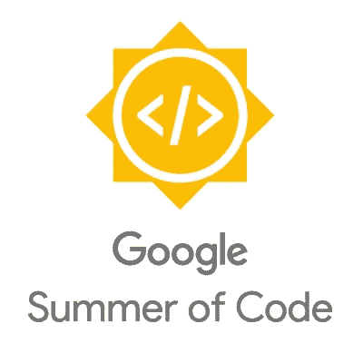

# 要想赢得 GSoC 提案，你需要知道的 7 件事

> 原文：<https://medium.com/hackernoon/7-things-you-need-to-know-to-ace-your-gsoc-proposal-8e422f2b6abe>

因此，又到了一年中的这个时候，学生们将开始为他们的[谷歌](https://hackernoon.com/tagged/google)代码之夏提案忙碌，特别是因为组织将从今天开始接受它们。

在您继续之前，请在您的日历上做好标记，**2017 年 4 月 3 日**是**提交提案的最后一天**。

# **1。提案的结构**

> 把你描绘成一个有条理的人

在写建议书时，你必须始终牢记的最重要的一点是，你的建议书是你最好的广告。

这个向客户(组织/导师)推销产品(自己)的广告(故事)的流程就在你的手中。那么，为什么不把它组织成这样一种方式，让人们在阅读时全神贯注，就好像你要告诉他们《权力的游戏》中下一个角色的死亡一样。

# **2。发现问题，提出解决方案**

> 表明你已经理解了这个项目

**明确**定义你希望通过这个项目解决的问题。印象分，如果你也能告诉为什么这是一个问题，因为它会告诉读者，你已经向前迈出了一步，了解项目的基本思想。

提及项目的技术方面。提案的这一部分可以而且应该很长，因为详细描述你将如何完成这个项目是很好的。

尝试强调:-

*   你觉得有挑战性的事情。
*   一些你现在还不知道的事情。
*   你可能有的其他阻滞药。

然后还要提到你打算如何克服所有这些障碍。

# 3.交付件—带项目符号

> 展示你以结果为导向

一个好的提案应该总是包含可交付成果。这些是你想要传递的东西或者你想要实现的目标，以便能够成功地通过所有的评估，并作为一名成功的 GSoC 学生毕业。

> 尽可能把它们分成最小的部分。

当你开始从你的清单上勾掉事情时，这会给你信心。

# 4.定义明确—时间线

> 描述你如何管理时间

当在竞争同一个项目的学生中进行选择时，这有时会改变游戏规则。

> 一份谦逊的、现实的、详细的时间表要比一份承诺移山倒海的时间表好得多。

*   显示周目标
*   投入足够的时间来编写测试和文档。
*   诚实地讲述你在暑假期间将要做的任何其他活动，这些活动将占用大量时间，包括但不限于:考试、课程、旅行和假期、实习、工作、志愿者工作等。

# 5.关于我——疯狂地在这里吹嘘你自己

这必须是一个或多或少有点像你的简历的部分。在这里介绍你自己，给出你使用的所有沟通渠道。

以下是开源软件中很多人使用的一些(所以要确保你已经设置好了所有的东西) :

*   因特网中继会谈
*   闲聊
*   网络电话
*   电子邮件
*   谷歌视频

不要忘记在这里提到你的开源贡献，如果他们在同一个组织/项目中做得很好的话！如果没有，还是可以提的。

# 6.尽可能地重复

不要急着提交提案。在最后一天提交完全没问题，因为组织通常不会在那之前开始审阅。

> 从尽可能多的来源获得评论。

最重要的是来自您的:

*   导师
*   往届 GSoC 学生
*   在技术堆栈或您正在从事的项目中拥有相关专业知识的人。(你可以从他们那里看到问题和解决方案，他们甚至会给你一个更好的解决问题的主意。)

# 7.价值 1000 字的图片

> 展现你的奉献精神

试着花些时间创建和添加**模型**、**流程图**、**图表**或任何你发现可以用图片表示的相关内容。

我很乐意看一下你的提议。前往 github 项目，将您的建议作为 PR 提交给评审。

[https://github.com/ishan1604/gsoc-proposals/](https://github.com/ishan1604/gsoc-proposals/)

阅读更多关于 [Android 开发和职业成长](https://www.droidchef.dev/)的文章。

> [黑客中午](http://bit.ly/Hackernoon)是黑客如何开始他们的下午。我们是阿妹家庭的一员。我们现在[接受投稿](http://bit.ly/hackernoonsubmission)并乐意[讨论广告&赞助](mailto:partners@amipublications.com)机会。
> 
> 如果你喜欢这个故事，我们推荐你阅读我们的[最新科技故事](http://bit.ly/hackernoonlatestt)和[趋势科技故事](https://hackernoon.com/trending)。直到下一次，不要把世界的现实想当然！

