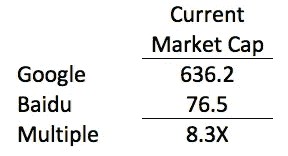
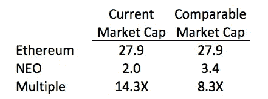
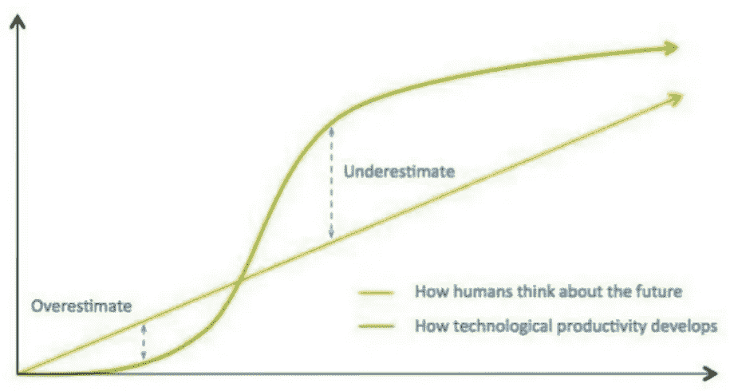
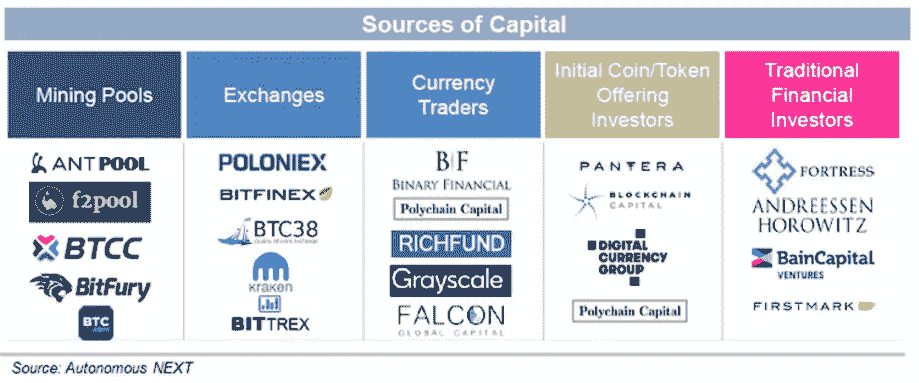
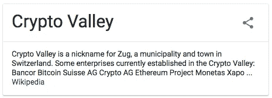
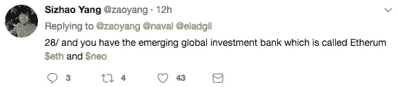

# 经历了加密货币兔子洞的史诗般的一周之后的 6 个想法

> 原文：<https://medium.com/hackernoon/7-thoughts-following-an-epic-week-going-down-the-cryptocurrency-rabbit-hole-3d18be586249>

这是 cryptoland 史诗般的一周，突出表现在比特币现金价值的快速上涨和分散加密交易所 Ox 的创新和成功的 ICO。 [CoinMarketCap](https://goo.gl/xubY1t) 追踪的加密货币总市值为 1450 亿美元，本周上涨 50 亿美元(感谢比特币现金)。所有伟大的东西，但噪音从长远来看。

对于加密货币的长期成功来说，重要的是基础设施正在建设，以实现规模化、持续创新、清晰的监管框架和机构采用。考虑到这一点，这里有。在你掉进兔子洞的路上要思考的 6 个加密货币想法:

# 1.加密货币的价值仍然是 1450 亿美元的问题

在很大程度上，最好的分析 ICOs 的文章集中在技术方面，就像 crypto expert 和康奈尔大学教授 Emin Gün Sirer 的博客上的这篇文章。这篇文章是由康奈尔大学的一名教授、一名博士后、一名博士生和另外三名相关人员撰写的。

加密货币的估值技术仍处于起步阶段。正如我所写的，[我见过的关于如何评估加密货币“效用”的最好文章是](https://goo.gl/UCJ2dZ) [cburniske](https://medium.com/u/2a8f9285c9aa?source=post_page-----3d18be586249--------------------------------) 的 [The Crypto J-Curve](https://goo.gl/UCJ2dZ) 。

在将比特币作为价值储存手段/与黄金相比的价值评估方面，我见过的最有思想的作品是 Fundstrat 的托马斯·李(Thomas Lee)的作品。他的观点在《巴伦周刊》最近的一篇文章中有所概述。上周五，Lee [预测比特币将在 2018 年年中达到 6000 美元](https://goo.gl/UD92qe)。

对加密货币进行估值的另一种方法是将其与相关的公开交易实体进行比较。这在传统股权分析中被称为[可比公司分析](https://goo.gl/ofa4Rq)。例如，这里有一种方法来评估 [NEO](https://goo.gl/oh8WMT) 的价值，它是市值 19.5 亿美元的第九大硬币。2017 年迄今，NEO 上涨了 27，000%(1 万美元现在是 270 万美元)。NEO 被广泛认为是“[中国的以太坊](https://goo.gl/XVc2zc)”，支持智能合约，并准备成为中国 ico 预期冲击的首选平台。那么，相对于以太坊，中国以太坊应该值多少钱？通过比较分析，我首先观察了中国谷歌(百度)相对于谷歌的交易价格:

Market Caps are In Billions

然后，我用这个倍数来看 NEO 在以太坊的交易倍数与百度在谷歌的交易倍数相同时的交易倍数:

Market Caps are in Billions

这一分析表明，如果 NEO 与以太坊的可比市值倍数与百度和谷歌的可比市值倍数相同，NEO 有 70%的上升空间。这种过于简单的分析有多个潜在的缺陷(例如，以太坊的估值是否合理，百度是谷歌的好选择吗，NEO 是以太坊的好选择吗)。然而，我要说的重点是，真正的机构采用加密货币需要行业开发普遍接受的加密货币估值方法，并将继续这样做。这是我将继续研究和写作的内容。

# 2.我们处于加密货币泡沫中吗？阿马拉定律和卡洛塔·佩雷斯提供了历史背景

罗伊·阿玛拉是帕洛阿尔托智库未来研究所的主席，他创造了阿玛拉定律:“我们倾向于高估一项技术在短期内的效果，而低估其长期效果”。这是因为人类以线性方式思考，而技术以“S 曲线”发展:

加密货币处于 S 曲线的早期，人们高估了新技术被采用的速度。这就是泡沫产生的时候。这也被称为“[炒作周期](https://goo.gl/DtQ4aT)”。

许多伟大的著作都是关于泡沫的，包括卡洛塔·佩雷斯的《技术革命和金融资本:泡沫和黄金时代的动力》。阅读[这篇外事评论](https://goo.gl/dmV6jU)来看看加密货币的未来(以及所有伟大的技术创新)。

因此，除非“[这次是不同的](https://goo.gl/BTJHDu)”，它从来没有，那么我们是在一个泡沫中。但 10 年后，这一切都将是噪音，从长远来看，从事 it 行业的人将收获早到的回报。

# 3 .本地协议基金是加密货币资金栈的最新成员

鉴于加密货币和去中心化网络的巨大颠覆性潜力，资金栈日益强大:

我们可以在上面的图表中添加另一个来源，协议基金。过去一周，我最喜欢读的是 [Yannick Roux](https://medium.com/u/6098e80b175b?source=post_page-----3d18be586249--------------------------------) 的《[本土协议基金的崛起](https://goo.gl/yfp28p)》，该书强调了这些基金的出现以及它们将在生态系统中扮演的角色。

在 8 月份的更新中，Tezos 宣布“……承诺向寻求在 Tezos 平台上构建的公司提供 5000 万美元的风险投资。这笔资金将通过即将宣布的风险投资合作伙伴以及直接的风险投资机构进行部分配置。”换句话说，Tezos ICO 筹集的一些资金将用于资助公司开发技术，以增强或利用 Tezos 平台。

在下面的视频中，Blockstack 宣布了 2500 万美元的 Blockstack Signature Fund，概述了它与传统风投合作的计划，以资助开发者在 Blockstack 上构建分散化应用。

获得资本始终是公司成功的关键因素。在原生协议的世界中，使用给定协议的开发人员获得资金对于协议的成功也是至关重要的。因此有了这些协议基金，更多的协议基金肯定会随之而来。

# 4.ICO 顾问是多样化的，除了…

大多数拥有 ICO 的公司都有很小的员工基数，并由提供有价值的技术或商业见解的顾问来补充。随着 ico 越来越多地受到公关的驱动，拥有知名的顾问"[..正在成为必须具备的](https://goo.gl/ya3U3c)”。因此，我分析了 10 个成功的 ico 的顾问组成，发现除了性别之外，顾问群体存在巨大的多样性。现在，我的取样并不科学，但是 46 个顾问中有一个女性强调了这个行业需要解决性别问题。以下是 46 位顾问是如何爆发的:

顾问在地理上是分散的。除了美国和中国，与会的国家还包括加拿大、英国、荷兰、俄罗斯、以色列、西班牙和德国。

最后，最值得注意的是，很少有顾问是为了公关目的而装点门面的。几乎所有的顾问都有深厚的行业和/或技术专业知识。

# 5.纽约州正在输给楚格的密码领导权

对于一个住在纽约的加密货币爱好者来说，很少有什么事情比去一个加密相关的网站(例如，Shapeshift，Kracken，Poloniex)更无聊的了..)和阅读“……可以在任何地方使用，除了纽约和朝鲜。”WTF。谷歌对 CryptoValley 的搜索结果如下:

我听说了一些很棒的事情关于最近由那里的密码社区举办的为期三天的楚格实地考察。新加坡也是一个主要的枢纽，直布罗陀似乎正在成为一个目的地。但是纽约应该是加密谷。

现在，美国作为一个整体，由于其不确定的监管环境，正在导致一些 ico[阻止美国投资者的参与](https://goo.gl/7ycmQk)。然而，纽约的监管者对该州的行业造成了更大的损害。2015 年 8 月 8 日，纽约州开始要求拥有[比特许可证](https://goo.gl/UeG7Mm)才能从事加密货币活动。尽管有 20 多家公司提出申请，但只有三家公司获得了许可证(比特币基地、瑞波和 Circle)。大多数加密公司/ico 都避开了纽约，避免了大约 10 万美元的许可费用，并避免了法律要求的"[鲁莽和道德上不允许的](https://goo.gl/NpN6dD)"侵犯隐私。

如果纽约的情况没有开始好转，我期待 18 年的楚格。

# 6.本周推特风暴

阅读[50+推文风暴](https://goo.gl/GzFVpv)作者[杨](https://medium.com/u/b6e60ac2ed57?source=post_page-----3d18be586249--------------------------------)。它很好地将这个秘密时刻放入了许多层面的背景中(包括比较 NEO 和以太坊)

[点击此处](https://goo.gl/1rgjHL)了解 9 月 7 日加密货币估值电话会议

*如果你从这篇文章中获得了至少* 0.00000001 比特币*的价值，或者喜欢阅读，那么* ***继续，在*** *下方“鼓掌”。*