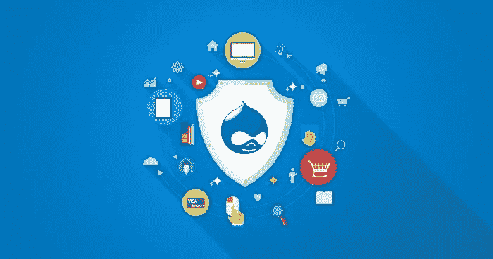

# 增强 Drupal 7 网站安全性的 7 个技巧

> 原文：<https://medium.com/hackernoon/7-tips-to-fortify-your-drupal-7-websites-security-e4c48c1905f4>

安全是当今网络世界的首要问题。随着业务变得突出，它成为网络罪犯一个诱人的目标。一个典型的例子是最近的勒索软件攻击狂潮，这些攻击只针对经济上有利可图的目标。

安全性的问题在于它是一项多方面的工作，需要持续不懈的努力。这就是为什么现代数字系统和财产的安全已经成为一项专家任务。此外，网站所有者需要了解网站安全的基本知识。

虽然我不会在本文中告诉您如何保护您的整个数字设置，但我会列出一些保护您的 Drupal 7 网站的技巧。一旦你的 Drupal 网站建立并运行，这些提示就适用了:

1.  保持一切更新
2.  移除未使用的模块
3.  使用安全登录模块
4.  配置。htaccess 文件
5.  删除默认用户
6.  查看用户角色
7.  选择合适的主机提供商

## 保持一切更新

您应该始终确保您的网站和所有安装的模块都更新到最新版本。人们推迟更新，因为这需要时间，而且经常妨碍日常工作。因此，一切都被推迟，直到灾难降临。

Drupal 平台和模块的开发人员及时发布更新，修复安全漏洞和可能导致问题的问题。在许多情况下，获取更新的过程是自动的，网站所有者所要做的就是单击更新按钮。请确保在收到通知后立即点击该按钮。

## 移除未使用的模块

这是没有多少网站所有者经常思考的事情！未使用的模块是一个安全风险，因为攻击者可以利用未使用模块的过时代码闯入网站。为了防止这种情况，请定期进行模块使用情况审计，并删除所有可能造成安全相关情况的模块。

## 使用登录安全模块

登录页面是你网站的大门。那么，抵御不速之客的最佳方法是什么呢？巩固你的第一道防线。通过在您的登录页面上实施安全措施，您可以阻止大多数不受欢迎的访问者。为此，请安装登录安全模块。此模块限制授权登录尝试的次数，并向您发送有关登录相关问题的电子邮件。当我们谈到登录的话题时，使用验证码形式来防止机器人试图搞乱你的网站。

## 配置。htaccess 文件

在 Drupal 安全性的上下文中。htaccess 文件具有特殊的意义。这个文件包含关于网站访问的所有细节，以及 Drupal 站点的各个部分和文件的凭证。通过这个文件，你应该阻止或限制访问你的 Drupal 站点的重要文件，包括 install.php 和 update.php。您甚至可以指定可以访问各种文件和子域的 IP 地址。

## 删除默认用户

当你第一次创建一个 Drupal 网站时，你需要创建一个帐户。这个默认用户帐户可以访问你的 Drupal 站点的每个部分和所有文件。一个好的安全做法是阻止该用户帐户并创建另一个管理员帐户。

**重要提示:**在阻止默认管理员帐户之前，请务必创建第二个管理员帐户。否则你会被锁在你自己的网站之外！

## 查看用户角色

许多网站管理员忽视了用户在网站上的角色。攻击者经常利用这种疏忽并使用这些。确保您为每个用户角色设置了适当的权限，并且权限不超过要求。请确保定期检查用户角色，并且只为每个角色提供所需的最低权限。

## 选择合适的托管提供商

最后，你的 Drupal 网站的主机提供商在你的网站的安全中扮演着非常重要的角色。除了提高网站的速度和正常运行时间之外，合适的托管解决方案提供商还可以确保您网站的安全。在这种情况下，[通过 Cloudways 托管 Drupal](https://www.cloudways.com/en/drupal-cloud-hosting.php)总是一个不错的选择。Cloudways 提供了一个安全第一的 Drupal 托管解决方案，所有的服务器端安全措施都到位了，比如让我们加密的 SSL，服务器级安全补丁。

这些都是一些基本的安全技巧，应该成为你的 Drupal 网站安全计划的基础。

现在，继续巩固你的 Drupal 网站吧！

> [黑客中午](http://bit.ly/Hackernoon)是黑客们开始他们下午的方式。我们是 [@AMI](http://bit.ly/atAMIatAMI) 家族的一员。我们现在[接受提交](http://bit.ly/hackernoonsubmission)并很高兴[讨论广告&赞助](mailto:partners@amipublications.com)机会。
> 
> 如果您喜欢这个故事，我们建议您阅读我们的[最新科技故事](http://bit.ly/hackernoonlatestt)和[趋势科技故事](https://hackernoon.com/trending)。直到下一次，不要把世界的现实视为理所当然！

