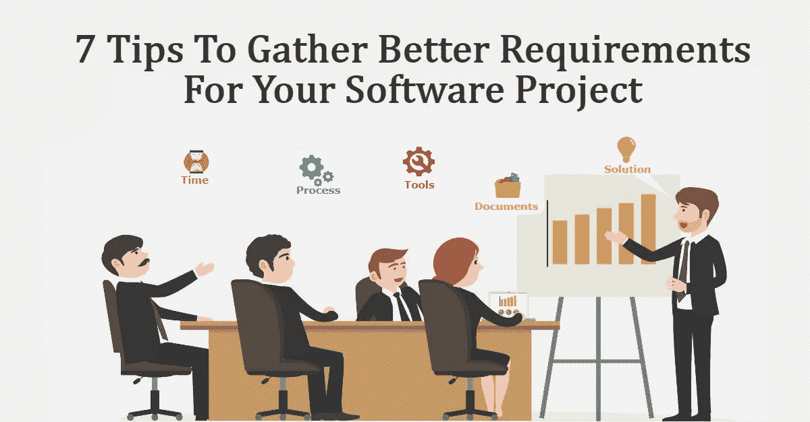
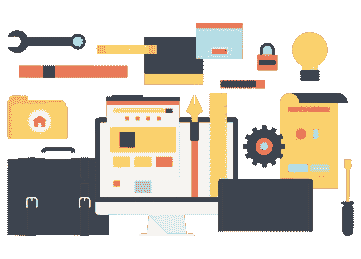
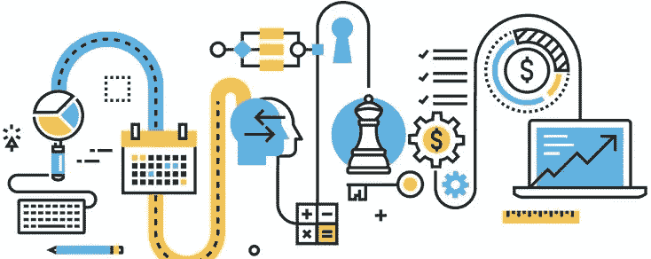

# 为软件项目收集更好需求的 7 个技巧|需求收集清单

> 原文：<https://medium.com/hackernoon/7-tips-to-gather-better-requirements-for-software-project-requirements-gathering-checklist-8418034687a>

是的，昨天我们的一个潜在客户问了同样的问题，你能帮我收集一些软件开发项目的更好的需求吗？这是我在与潜在客户的销售会议中经常遇到的情况。与我交谈的潜在客户来自营销背景。过去 15 年来，他经营着一家非常成功的企业。他有一个软件产品的想法要建立。由于他的经验，他想更多地了解软件业务和产品开发。他比我之前说过的人有更多的问题。讨论时间比标准的销售电话长得多。在某个时候，我和他交流过，说我会发一些网络参考。我以为他可以自己阅读和理解这些概念。去谷歌上查询“收集软件项目更好需求的技巧”

# 最佳结果如下:

*   [捕捉软件项目更好需求的 8 个技巧](http://www.cmswire.com/cms/web-cms/8-tips-to-capture-better-requirements-for-your-software-project-012470.php)
*   [收集更好软件需求的 7 种工具— LiquidPlanner](https://www.liquidplanner.com/blog/7-tools-to-gather-better-software-requirements/)
*   [收集需求的 10 种技巧— TechRepublic](http://www.techrepublic.com/blog/10-things/10-techniques-for-gathering-requirements/)
*   [提高要求的 19 个技巧 Dobb 博士的](https://www.google.co.in/url?sa=t&rct=j&q=&esrc=s&source=web&cd=15&cad=rja&uact=8&ved=0ahUKEwiYkNf6p6nVAhWFlZQKHQW1C48QFghpMA4&url=http%3A%2F%2Fwww.drdobbs.com%2F19-tips-for-better-requirements%2F184415812&usg=AFQjCNE-89aCSc9wGFD-heAfhLcRnPguJA)

令我惊讶的是，所有这些物品都年代久远了。软件项目开发的需求是永无止境的现象。但是参考文献并不是最近才有的。所以决定自己写这个话题。

首先是要点:

> "需求是任何项目成功的关键."

为了开始讨论，在当前的场景中，人们应该理解在开发软件产品的任何步骤中:

1.  [技术可能会改变](http://smallbusiness.chron.com/impact-technological-change-business-activity-2191.html)
2.  提高产品用户的知识水平
3.  每隔一天在工具包中添加新的项目执行模型
4.  团队的技能是不同的
5.  支持开发的工具非常丰富

最重要的是，我可以继续添加更多这样的点。但是无论我要添加什么，有一点是不会改变的。

> **没错，就是** [**【需求】汇聚**](http://its.unl.edu/bestpractices/requirements-gathering) **。**

现在有合适的工具来收集需求。但作品中的人情味从未改变。记录良好的需求表示半成品。

这里有一些有用的提示，可以用来收集软件产品的需求

# 1)产品所有者合作:

首先，所有伟大的开发经验都是从这个开始的。[产品负责人](https://dzone.com/articles/product-owner-top-10)应该接受记录需求的重要性。转换成黑色&白色文件的限时讨论是成功的基础。花在这个需求文档上的时间永远不会是多余的。相互信任和合作非常重要。

# 2)右工具:

此外，您必须选择正确的工具来记录需求。对于非技术利益相关者来说，工具也应该易于使用。

该工具应该涵盖需求的所有方面，如用户故事、验证标准、讨论板等。我们使用“ [Trello](http://trello.com/) ”来捕获需求。

# 3)基于目标的会议:

为理解需求而安排的[会议](http://business-analysis-excellence.com/business-requirements-meeting/)应该是客观的。如果讨论无涯，很有可能错过高峰。对灰色区域的充分探索是强制性的。不应该有任何假设或结论更少悬而未决的要点。

# 4)使其可视化:

软件应用程序的屏幕应该能够被业务分析师捕捉到。视觉表现非常有助于达成共识。软件产品的视觉效果会随着更好的视觉效果而变得更好。这种视觉不一定是 HTML。用铅笔在纸上画一个屏幕也有帮助。我们使用 [Balsamiq](https://balsamiq.com/) 来捕捉屏幕模型。产品利益相关者甚至可以在 Balsamiq 模型中开发之前就看到应用程序的活动部分。

# 5)技术前景:

当讨论想法以记录需求时，避免考虑技术前景总是一个好的实践。需求收集的目的是首先记录业务需求。可能有现成的技术方案可用。“技术”讨论需要在“[解决方案](https://en.wikipedia.org/wiki/Solution_architect)阶段进行。在需求收集阶段考虑技术瓶颈可能会影响文档编制过程。

# 6)工艺标准:

在需求阶段，利益相关者也将定义“过程标准”。
相互接受对以下几点很重要:

*   跟踪用户故事以进行开发的方法
*   如何根据用户故事跟踪屏幕模拟
*   如何将[测试用例](http://softwaretestingfundamentals.com/test-case/)(单元、系统、集成)与用户故事对应起来
*   开发周期中管理积压工作的方法
*   如何执行验证和确认流程

同样，这些是开始过程方面的头脑风暴的一些基本问题。确保在收集软件项目需求的过程中，关于过程标准的足够信息被讨论和接受。

# 7)非功能需求:

软件项目的需求不仅仅是针对产品的“功能”方面。因此，有许多未知的“非功能性”的东西作为软件包的一部分。应用程序用户总数、安全性、兼容性等。我们必须考虑的非功能性需求很少。这些期望非常关键。根除这些非功能性需求可能需要更多的时间。但是适当的调查问卷、对利益相关者进行这方面的教育、集思广益等等。将有助于揭示软件产品隐藏的期望。

*注:请参考* [*非功能性需求—维基百科*](https://en.wikipedia.org/wiki/Non-functional_requirement) *全面了解该主题。*

# 更多关于我的经历:

**相信我；在我们不久前开发的所有软件产品中，我们有 7 分。**

我们可以看到迎合这些观点的产品成功推理的清晰模式。每个产品开发都应该注意这 7 点，这 7 点可能不是一个完整的列表，但这是一个基本的列表。开发高质量软件产品的过程是一门艺术。需求收集是这门艺术的关键部分，它依赖于科学的探索方法。

希望听到更多关于您的软件产品开发经验。请随意写下你的经历，或者在下面的评论区提出任何问题。

我们 Agira 团队非常乐意帮助您开发产品。我们在软件产品开发方面有丰富的经验，因此我们可以让您的梦想成真。如果我们能有机会帮助您并与您合作，我们将非常高兴，请立即[【联系我们】](http://www.agiratech.com/contact-us/)。希望收到您的来信！！！

*原载于 2017 年 7 月 31 日*[*www.agiratech.com*](http://www.agiratech.com/tips-to-gather-better-requirements-for-software-project/)*。*

***很想听听你对这个话题的看法和经验…***

***联系我:*** *您或您的公司是否正在寻找一个有才华、有创新精神、善于沟通的&动手型专家开发/设计团队&概念化帮助* ***构建+扩展您的网络&手机 app*** *？本人(直接)发邮件至****ganapathi@agiratech.com****免费咨询！*

我很乐意帮助你。

***关于作者:*** *作者是 Ganapathi M，Agira Technologies(# agiratech)CEO。在* [*技术*](https://hackernoon.com/tagged/technology) *领域有着大约 14 年的记录，加纳王国对技术有着惊人的热情，是一位热情的企业家。作为一个亲民的人和天生的领导者，他在 Agira (#agiratech)建立了一个强大而专注的技术专家团队。*

***关于公司:*** *Agira (#agiratech)致力于解决不断变化的行业需求的软件解决方案。凭借 Agira 在 Web、移动、云、开源框架、咨询和未来技术等领域的专业知识和面向客户的服务，Agira 帮助客户实现他们的愿景/梦想。*[*www.agiratech.com*](http://www.agiratech.com/)*将更加突出其服务和资历。#agiratech*