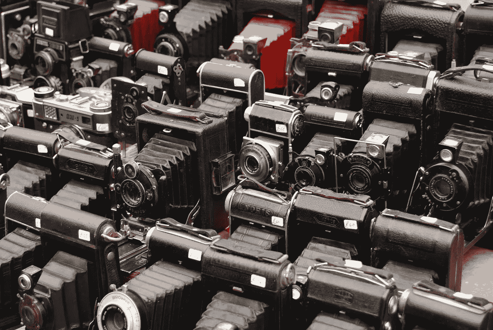
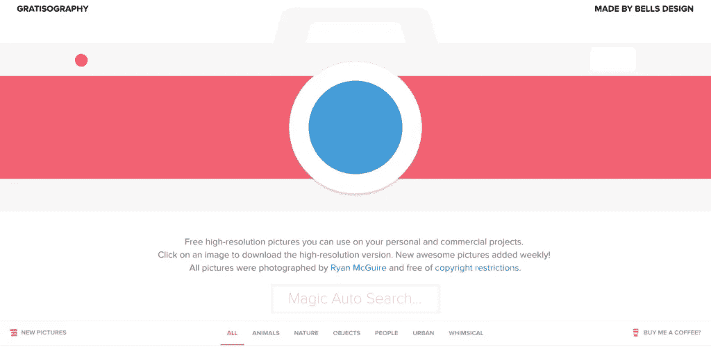
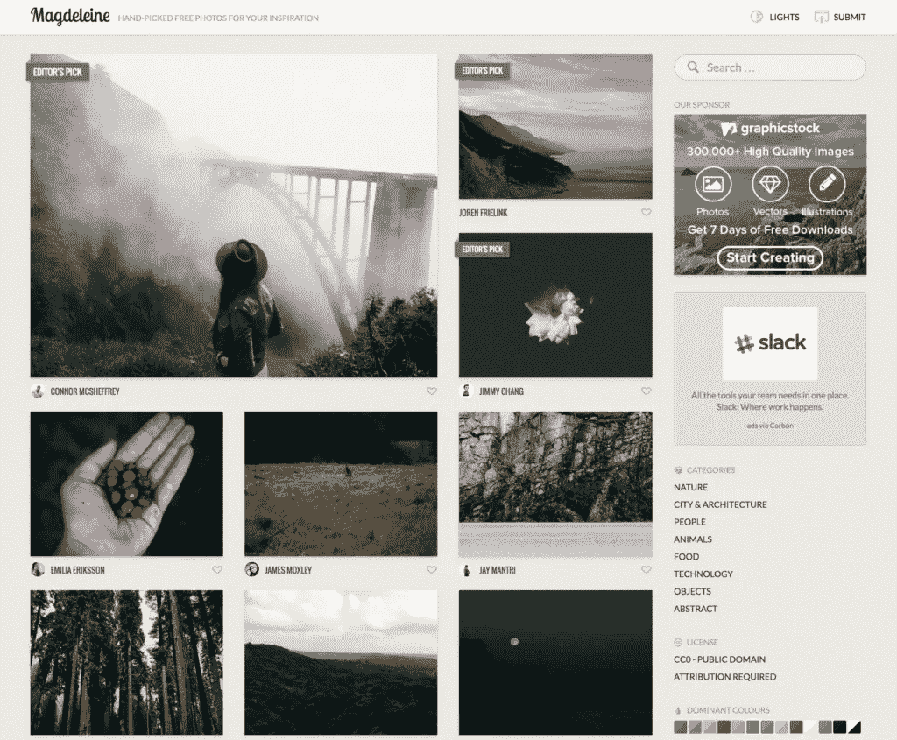
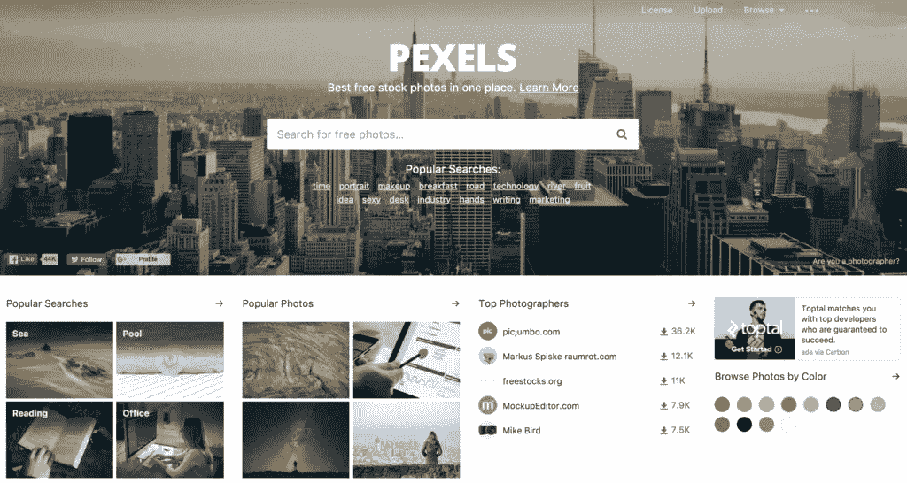
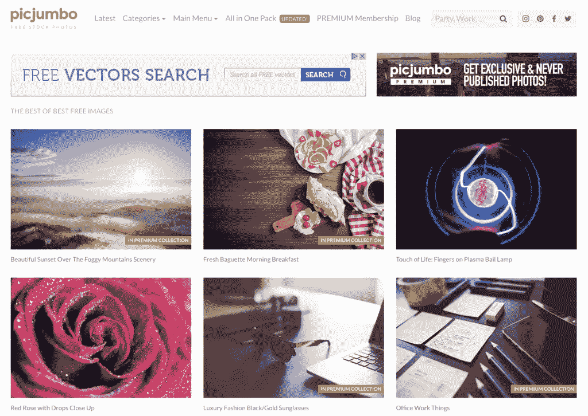
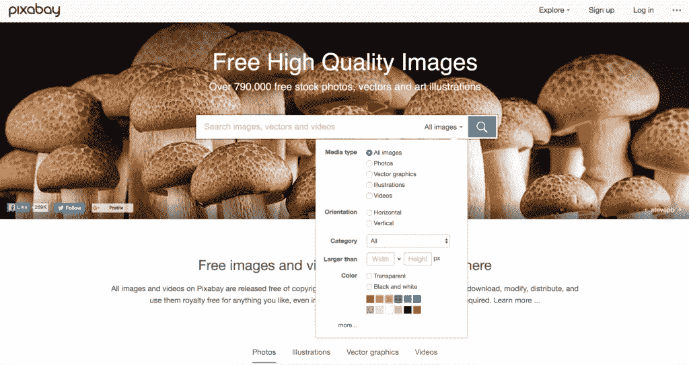
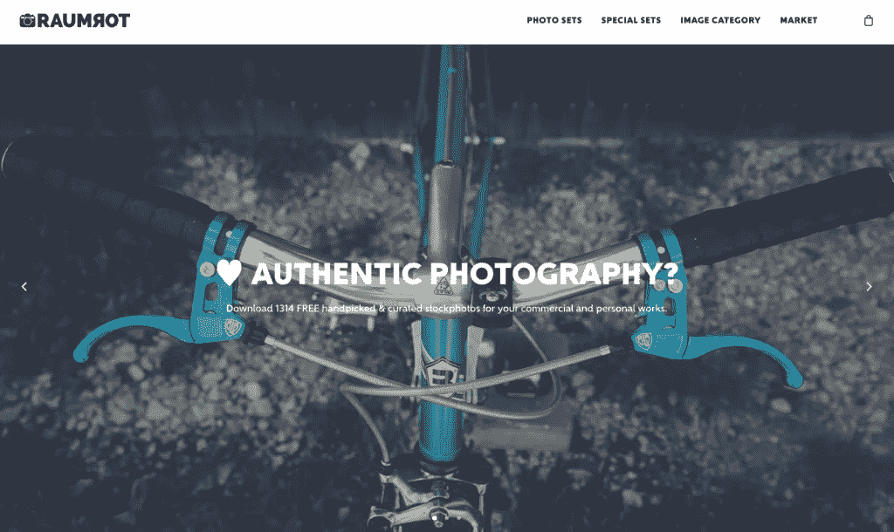
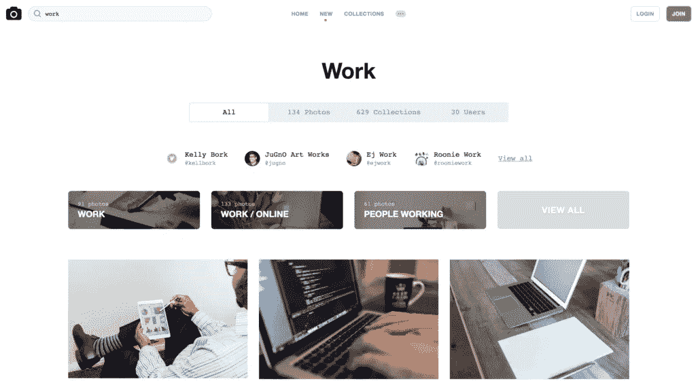
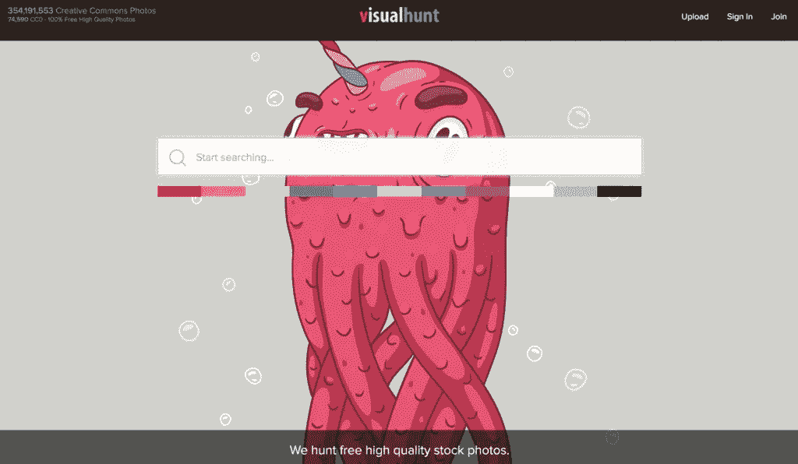
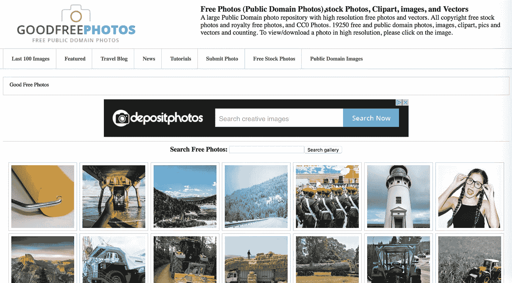

# 8 个拥有最佳免费库存照片的惊人网站

> 原文：<https://medium.com/hackernoon/8-amazing-sites-with-best-free-stock-photos-5a7e8aff8a59>

有多少次你需要一个好的博客文章、时事通讯、在线广告或者网页设计的图片？图像对于你创作的内容质量非常重要。因此，当你没有自己的图片时，最好在提供免费图片、插图、图标和其他视觉内容的在线服务中寻找。

这些服务中有一部分提供高分辨率的图像下载，还有一部分要求你在下载更大的图像之前注册成为用户。不管怎样，这都是值得的，因为这些图片很棒，我推荐你使用它们。

# [地形图](http://www.gratisography.com/)

免费的高分辨率图像供个人或商业使用。每周都会添加新的图像。这个[网站](https://hackernoon.com/tagged/site)上图片的作者是瑞安·麦奎尔。它们分为六个主要类别(动物、自然、物体、人、城市、异想天开)，你可以通过搜索工具浏览它们。通过点击图片，你可以自动下载到你的电脑上。

# [马德琳](http://magdeleine.co/)

整洁的图像，但你不会从“工作”或“计算机”等类别中找到图像。相反，你会找到自然、人、动物、食物或技术的图像。有趣的是，这些图片可以通过分类、搜索引擎甚至是主色来浏览。有意思！

# [像素](https://www.pexels.com/)

也是一个很好的图像服务。搜索栏就在顶部，最流行的标签就在下面。图像很好，我很肯定每个人都会在那里找到有用的东西。

# [Picjumbo](https://picjumbo.com/)

一个优秀的图像选择组织在 16 个类别。总有东西可以找。搜索是基本的，但足以通过关键字找到图像。高质量的[照片](https://hackernoon.com/tagged/photos)！

# [Pixabay](https://pixabay.com/)

免费图像，插图，矢量图形和视频。服务顶部的一个非常好的搜索引擎允许你选择媒体类型、图像方向、类别、大小，甚至主色。

图片分为 20 类，我相信你会在这里找到适合你需要的东西。

# [劳姆罗特](http://www.raumrot.com/)

一个免费的高分辨率图像的好选择，您可以用于个人或商业目的。图像被组织到“集合”中，但也分类，这使得浏览和搜索合适的图像更加容易。

这里的一个小缺点是，没有一个清晰的搜索引擎可以让你查找图片，因为你可以下载一套图片，一包 20 张或更多的图片。

# [去飞溅](http://www.unsplash.com/)

免费的高分辨率图像，你可以随心所欲，不受限制。可以通过关键字、使用搜索引擎或浏览集合来浏览图像。每张图片还包含作者的名字，所以你甚至可以按作者进行搜索。伟大的图像！

# [Visualhunt](https://visualhunt.com/)

这项服务的核心正是我们最需要的——搜索引擎。输入关键字并从一开始就选择一种颜色。在初始结果之后，您可以通过附加的过滤器进一步缩小范围。

**奖励资源:**

# [好的免费照片](https://www.goodfreephotos.com)

一个大型公共领域存储库，拥有数万张免费照片。他们按地点对照片进行分类，并有世界各地的照片。

**您是否碰巧使用了上述的一些服务？有没有我没列出来的好的？请随时让我们知道并分享您的经验。**

*本文原载于* [*阿瓦隆博客*](https://www.avalon.host/blog/8-amazing-sites-with-best-free-stock-photos/) *。*

> [黑客中午](http://bit.ly/Hackernoon)是黑客如何开始他们的下午。我们是 T21 家庭的一员。我们现在[接受投稿](http://bit.ly/hackernoonsubmission)并乐意[讨论广告&赞助](mailto:partners@amipublications.com)机会。
> 
> 如果你喜欢这个故事，我们推荐你阅读我们的[最新科技故事](http://bit.ly/hackernoonlatestt)和[趋势科技故事](https://hackernoon.com/trending)。直到下一次，不要把世界的现实想当然！

