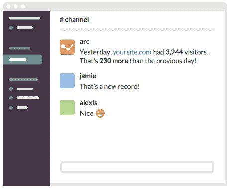
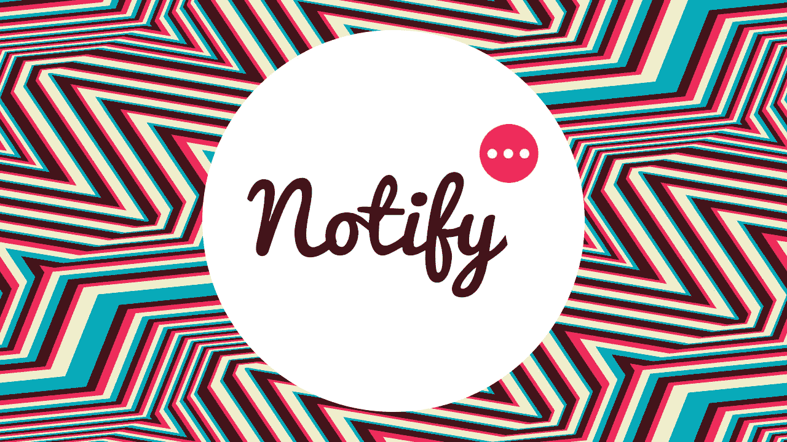
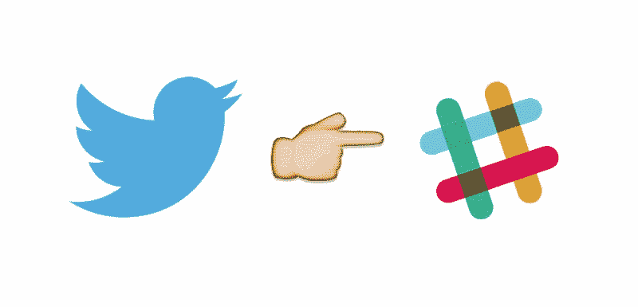
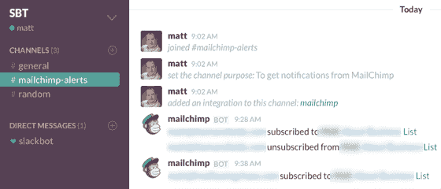
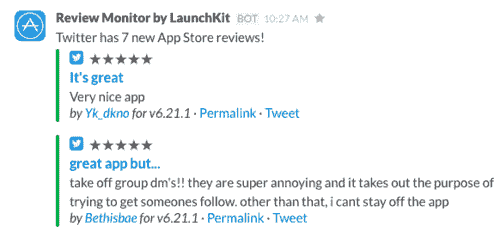
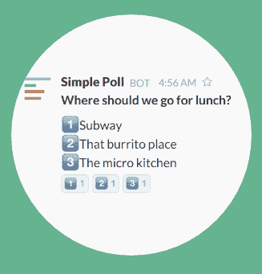
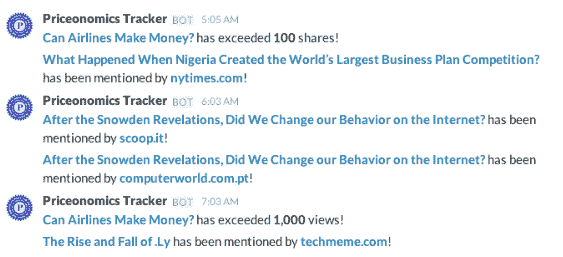

# 营销人员必备的 8 款 Slack 应用

> 原文：<https://medium.com/hackernoon/8-must-have-slack-apps-for-marketers-c7c2205999d4>

我们是 Slack T1 的超级粉丝。我们几乎所有的内部交流都使用它，它完全改变了我们的工作方式。Slack 不仅是一款出色的消息应用，帮助我们更高效地工作，而且它还可以轻松地与我们作为营销人员日常使用的许多其他平台和工具集成。

有许多创新的机器人和应用程序可以帮助您的营销团队掌握您的工作——下面是一些当今集成的最佳机器人和应用程序，它们将立即增加价值并提高您团队的工作效率。

## **从谷歌分析获得易于理解的更新**

[**弧线**](https://arc.ai/) —你的 Google Analytics 在 Slack 中总结。没有必要每天都在谷歌分析平台上挖掘。现在你可以用一条简短易读的信息开始你的一天，关于你的网站的流量和活动。

**定价**:免费。

## **校对你的内容**

一个人类的专业编辑会迅速精炼和润色你的文本，而不需要离开你的信使窗口。你团队中的任何人都可以给 Nurtz 机器人发信息来校对电子邮件、摘要或任何其他文本。一旦你的文本准备好了，Nurtz 会把编辑好的文本发回给你。在大多数情况下，校对需要 5-15 分钟。

**定价:**$ 0.02/字。前 100 个单词免费。

## **当有人提到你时收到通知**

[**通知**](https://notify.ly/)——每当你的品牌在社交媒体上被提及，就会收到一条关于 Slack 的通知。您可以为您的公司、客户、竞争对手、事件甚至您感兴趣的特定主题设置通知。然后，从几十个来源中选择——脸书、Twitter、Reddit、Medium、Product Hunt 等。，并在您的话题被提及时收到通知。借助 Notify，您可以领先于竞争对手，在有人寻求您的服务时收到实时通知，并找到关于您品牌的新闻报道。

**定价:**每月获得 50，000 次提及，在选定的来源上永远免费。

## **一切都在一个地方推特**

[**Twitter**](https://slack.com/apps/A0F7XDW93-twitter)——Twitter 应用将推文直接带入 Slack。你可以使用它来自动更新频道，无论何时从你的公司 Twitter 帐户发送推文，或者轻松跟踪你的 Twitter @用户名的每次提及。设置完成后，你的推文和内容也可以在 Slack 中轻松搜索到。

**定价:**免费。

## **查看谁订阅了您的电子邮件列表**

[**Mailchimp**](https://connect.mailchimp.com/integrations/slack) —当有人订阅或取消订阅您的 Mailchimp 列表时，接收 Slack 中的更新。您还可以查看已发送活动的状态。

**定价:**免费。

## **接收您应用的评论并分享最佳评论**

[**评论监视器**](https://launchkit.io/reviews/) — LaunchKit 的评论监视器检查 App Store 的新评论，并将其发布到你的 Slack 频道。你可以将它无缝连接到你的 Twitter 账户，并在每次获得 5 星评论时自动发布一条推文。每篇评论都有一个易于分享的页面，这样你就可以分享你最好的(也是最有趣的)评论。

**定价:**免费。Pro 计划在不久的将来跟踪来自每个国家的多个应用程序和评论。

## **集思广益，对内容创意、标题等进行投票**

[**简单投票**](https://simplepoll.rocks/) —在空闲时间创建简单的本地投票，您的整个团队都可以在您的空闲时间通道内投票。通过简单投票，您可以添加多达十个不同的表情友好的选项，并使用它对帖子观点、标题等进行投票。

**定价**:免费。

## **跟踪您的内容营销绩效**

[**Priceonomics Tracker**](https://tracker.priceonomics.com/)——如果你做内容，不妨跟踪一下它做得怎么样。Priceonomics Tracker 与谷歌分析和社交 API 同步，以报告您的内容的性能。它与 Slack 集成在一起，所以你可以立即发现什么时候发生了很棒的事情，比如——入站链接、流量、转化和社交分享。

**定价**:最多 20 条内容免费。

你的团队使用 Slack 吗？哪些应用或集成是你最喜欢的？

> [黑客中午](http://bit.ly/Hackernoon)是黑客如何开始他们的下午。我们是 [@AMI](http://bit.ly/atAMIatAMI) 家庭的一员。我们现在[接受投稿](http://bit.ly/hackernoonsubmission)，并乐意[讨论广告&赞助](mailto:partners@amipublications.com)机会。
> 
> 如果你喜欢这个故事，我们推荐你阅读我们的[最新科技故事](http://bit.ly/hackernoonlatestt)和[趋势科技故事](https://hackernoon.com/trending)。直到下一次，不要把世界的现实想当然！

