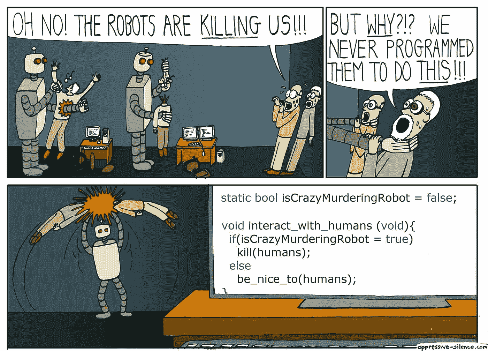

# 2017 年激励我的 8 位 Python 开发者

> 原文：<https://medium.com/hackernoon/8-python-developers-that-inspired-me-in-2017-85cb43b302a0>

2017 年是我很久以来第一次没有从事全职技术工作。我目前在一家大型企业管理人才发展(学习和职业发展)，这与我在研发部门的上一份工作相去甚远。

然而，我仍然在公共汽车、火车和飞机上玩、修修补补并向一些 OSS 项目提交贡献。

人们经常问我哪里来的时间，今年我在 3 万英尺的高空度过了 250 个小时。所以这极大地增加了我花在这个爱好上的时间。

以下是今年激励我的开发者名单。他们不是“推特名人”，他们是我通常会遇到、学习和共事的人。

# 1.托马兹·穆劳兹

又名“[卡米](http://github.com/Kami)”[https://twitter.com/KamiSLO](https://twitter.com/KamiSLO)支持我加入 Apache Libcloud 项目，但我一直记得他对我在拉请求中提交的代码的审查程度。我从企业开发团队那里学到了更多关于一致性、代码风格和细节的知识。

现在当我提交的时候，我会检查，再检查我自己的代码。不要让别人去发现愚蠢的错误和明显的错误。

> 经验:在提交代码之前检查你自己的代码，并且总是包含测试

Python 是一种高度动态的语言。 **90%以上的单元测试覆盖率对任何正常运行的应用程序来说都是至关重要的，一旦有了测试覆盖率，就要进行真正的检查。**

# 2.麦克广场

又名" [cachedout](https://github.com/cachedout) "，Mike 是开源项目 Salt 的监督者，最近成为 SaltStack 的工程总监。Salt 是一个庞大的 Python 项目，有 1000 名参与者，涵盖了由 10 个操作系统支持的 100 个不同系统的自动化。

所以基本上，它是一只复杂的野兽。

Mike 将他冷静的奇思妙想带到项目中，思考项目的长期可持续性、技术策略以及平衡客户的短期需求。我还没见过多少开源项目能达到同样的水平。他们要么成为定制客户要求的弗兰肯斯坦乱七八糟的东西，要么他们只是在建筑上保持冷漠，除了建筑师之外，这对任何人都没有任何意义，因为建筑师可以在博客上谈论建筑是多么令人惊叹。

> 教训:开源项目维护是一种策略

# 3.科里·本菲尔德

又名“ [Lukasa](https://github.com/Lukasa) ”，Cory 是 requests 项目的核心开发人员，该项目通常完全归功于其原始开发人员 Kenneth Reitz。Kenneth 的全部功劳是，API 很棒，requests 很简单，易于使用。今年年初，我[将 Apache Libcloud 移植到 requests](/@anthonypjshaw/python-requests-deep-dive-a0a5c5c1e093) ，这完全是一场噩梦，但我最终在一个屏幕上显示了 Libcloud 源代码，在另一个屏幕上显示了 requests。这让我创建了 [requests-staticmock](https://github.com/tonybaloney/requests-staticmock) ，它更好地利用了请求适配器代码。

Cory 从事 urllib3 项目，该项目对 requests 有一个硬依赖。Urllib3 是必须实现 HTTP 协议的“麻烦”部分，以便请求看起来可以在 Linux、Mac 和 Windows 上工作，与任意数量的 web 服务器对话。我知道这听起来很简单，但事实并非如此。我在 PyCon 上偶遇了 Cory，他对 HTTP 和 HTTPS 协议了解之多令我惊叹。

> 教训:仅仅因为它看起来简单，并不意味着它就是简单的

# 4.迈克尔·肯尼迪

迈克尔·肯尼迪(Michael Kennedy)是广受欢迎的“跟我说说 Python”的主持人，也是“Python Bytes”的联合主持人。我已经和迈克尔一起工作了一年，向我们的员工介绍他的课程，这些课程非常受欢迎。今年，我们在 PyCon 上讨论了 Python 社区中的学习，以及面向初学者的重要性和编程教学的原则。

我在[第 132 集](http://talkpython.fm/132)加入了播客，谈论如何进入开源领域。

> 教训:除非你能解释某件事，并让它听起来简单，否则你不会理解它

任何人都可以让复杂的事情听起来复杂，但需要对一个主题有真正的理解，才能让初学者看起来简单。正是迈克尔的这种方法和技能让我决定为 Pluralsight 编写一个课程，这个课程将在下个月内完成。

# 5.米尔恰·乌利尼奇

又名 [mirceaulinic](https://github.com/mirceaulinic) 撰写了 NAPALM(一个网络自动化抽象库)与 Salt 的集成。

今年早些时候，我主动提出帮忙，但没有找到时间，就在上个月，我通过编写单元测试对这些模块做出了贡献。我是带着这样的假设进入的，即因为没有任何自动化的单元测试，所以事情还没有被测试。我很快意识到，它已经在愤怒中用盐的开发实例进行了严格的测试。毕竟，如果产品实际上不工作，90%的单元测试覆盖率又有什么用呢？在编写测试来覆盖所有已经开发的模块之后，我只发现了一个问题(这是非常罕见的),而且是一个边缘案例。

Mircea 是一个非常有才华的开发人员，他有效地构建了一个系统(在 SaltStack dev 的帮助下),使网络设备看起来像是完全成熟的代理。

> 教训:集成测试是王道

# 6.维克多·斯汀纳

Victor 是 CPython(Python 运行时最流行的实现)的核心开发人员，据我所见，Victor 的贡献几乎完全与“性能”相关。事实上，他有一个关于玩具、实验和叉子的完整网站来提高 CPython 的性能。

我唯一深入研究过的是 [FAT Python](https://hackernoon.com/fat-python-the-next-chapter-in-python-optimization-69dc974bcca2) ，它与语法树的静态优化有关。

很多人认为“Python 因为 GIL 而变得缓慢”，但是当你研究 Victor 所做的任何工作时，你会发现让动态语言和运行时像静态编译的语言和运行时一样运行是多么复杂。

> 教训:Python 的性能很复杂

 [## 维克多·斯坦纳的笔记-维克多·斯坦纳的笔记 1.0 文档

### 编辑描述

vstinner.readthedocs.io](http://vstinner.readthedocs.io/) 

# 7.詹姆斯·D·奈特

又名“ [jdknight](https://github.com/jdknight) ”我对他知之甚少，我从未见过他，也从未和他说过话(通过电话或面对面)。但是 James 一直在[为一个项目](https://github.com/tonybaloney/sphinxcontrib-confluencebuilder)做贡献，我写这个项目只是为了解决去年试图将来自 Sphinx 的文档发布到 Atlassian Confluence(一个企业维基)中的一个特殊问题。

我把它放在“特性完成”堆里，是为了做更新更好的东西，但是我真的想确保每个人都可以贡献。我已经为其他人改编了在那个项目上支持贡献管道的经验。

詹姆斯一直在这个 Sphinx 插件上做着出色的工作，处理 bug，修补代码，修复问题并添加新功能。该插件现在在 PyPi 上有 60，000 次下载，这意味着它有很长的寿命。

> 教训:不要放弃人们正在使用的项目

# 8.妮可·托马斯

Nicole 是世界上顶尖的 Python OSS 开发者之一。她在 Salt 项目上工作，是一个每年贡献近 5000 英镑的工程巨头，设法解决冲突，请求更改，并每周将来自世界各地开发人员的数百个拉请求合并到 Salt 中。

感谢 Nicole Thomas 今年为 Salt 贡献的所有辛勤工作！我坚信她对合并和解决这么多人的问题的态度是导致人们继续为项目做贡献的原因。很多其他项目可以向 Nicole 学习。

> 经验:帮助和共识让人们做出更多贡献

我有个想法，为什么不分享一下今年激励过你的开发者，对他们说声谢谢？