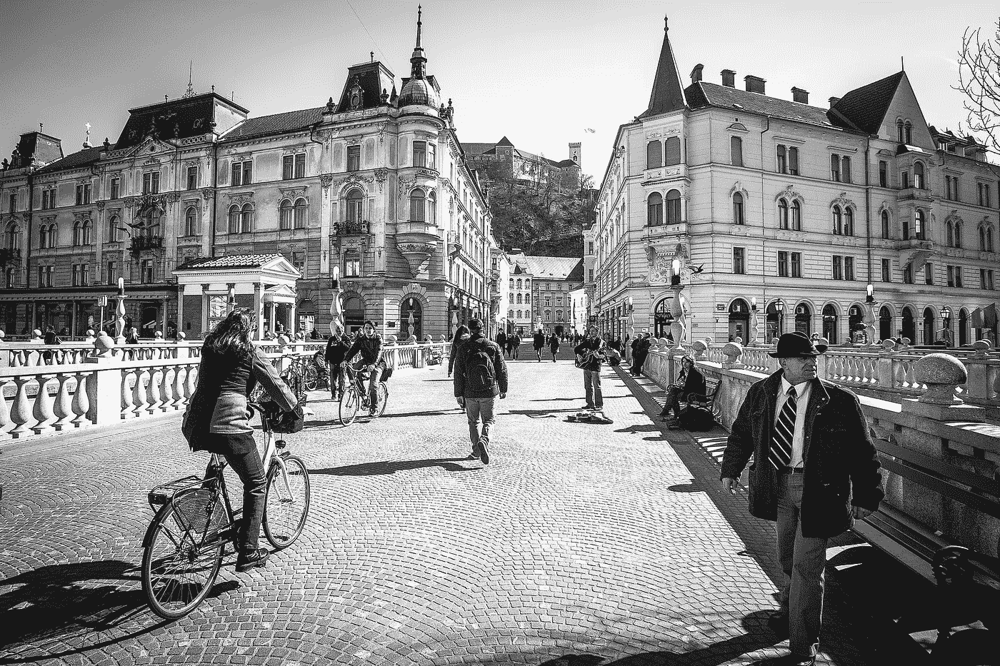
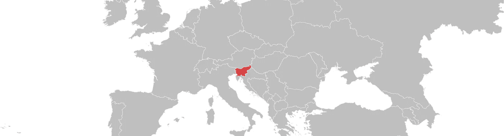

# 在斯洛文尼亚创业的 8 个理由

> 原文：<https://medium.com/hackernoon/8-reasons-to-bootstrap-your-startup-in-slovenia-e99c9841c1ba>

像 levels.io 这样的数字游牧民甚至在《T4》推出四小时工作制之前就已经开始利用 T2 的收入套利了。

在泰国的海滩上埋头苦干听起来像是创业的史诗般的方式。但之后沙滩上的沙子开始卡在你的 Macbook 键盘里。你厌倦了每栋建筑上都挂着国王的画像。你会发现这种*萨拜*思维方式与你成长过程中的资本主义生产力思维模式并不兼容。

要么是生活成本低，因此创业的跑道更长**要么是进入现代西方国家的途径和时区。你不能两者兼得。还是可以？**

[Image source](https://www.flickr.com/photos/robertotaddeo/13885857592/in/photolist-rKPFyi-na3DFN-nc69oe-v9jHBq-5ys7nw-zNRxZ3-7LZrq-8CUYbC-5wnjai-dmjpiQ-5ysh79-5vN8mU-yRrptn-qaZ4Ze-5Apxcz-f53woE-yRrWWW-pyWM6H-pVoCA5-Asv94x-vwwEgy-eiHcmA-5uPH4K-dGn6hQ-tZg7ay-frZrVe-5vN3Z3-rGJ3J2-rBfSj2-sex2Jj-s2ngcM-rzU7Sd-Bf7ZL4-5uU5Ah-rAoL7f-xAfYiL-zMY6pv-5AtQdy-5wrLcW-5ynPK2-5wLbsx-5vJdzx-5uPKzp-8vceC7-ze4Xg7-A6KCKj-AyU8c7-4YvRt-4N9Lx-6ack8h)

来看看斯洛文尼亚吧，这个欧洲国家占地 20.000 平方公里(8.000 平方英里)，只有 2M 居民，首都卢布尔雅那这个名字很难发音。

在这篇文章中，我将解释为什么它非常适合创业。

# 1.值得 Instagram

尽管斯洛文尼亚很小，但它的地理位置极其多样。想滑雪吗？我们有山。想游泳吗？有一个海岸。想要一个放松的周末吗？去他妈的矿泉水里游泳吧。是的，*真的*。

当然，我们没有像泰国那样的沙滩，但是你知道我们还没有什么吗？*登革热。*而且这里美丽的峡谷和山脉还是能让你 Instagram 出名的。

这里有一些你本可以拍的照片。

 [## 完美的阳光周六☀️#戈伦日斯卡#自然

### “阳光明媚的周六，☀️#戈伦日斯卡#自然”

www.instagram.com](https://www.instagram.com/p/6-axjKMzop/?taken-by=ialja)  [## #时光倒流# 2014 年夏天#记忆#漫游癖#皮兰#斯洛文尼亚#斯洛文尼亚#旅游爱好者…

### " #怀旧# 2014 年夏天#记忆#旅游#皮兰#斯洛文尼亚#斯洛文尼亚#访问斯洛文尼亚#斯洛文尼亚海岸…

www.instagram.com](https://www.instagram.com/p/_4qcVjv8eH/)  [## 文特加尔峡谷-斯洛文尼亚#文特加尔#文特加尔戈热#斯洛文尼亚# ig _ 斯洛文尼亚# ig _ 自然#instatravel…

### “文特加尔峡谷-斯洛文尼亚#文特加尔#文特加尔戈热#斯洛文尼亚# ig _ 斯洛文尼亚# ig _ 自然# instatravel #绿色#瀑布……

www.instagram.com](https://www.instagram.com/p/_6rLOXLF-I/) 

更多华丽的照片[这里](https://www.instagram.com/igslovenia/)和[这里](https://www.instagram.com/geoslovenija/)。

# 2.啤酒卖 2.6€

斯洛文尼亚的生活费用低得惊人。

当地人平均每月收入 1000€。与[德国的 2100€或英国的 3000€](https://en.wikipedia.org/wiki/List_of_European_countries_by_average_wage) 相比，斯洛文尼亚显然有点像中欧的菲律宾。

咖啡从€**1 号**开始。一杯酒是 **1.2€** 。你在卢布尔雅那坐公共汽车也要付同样的钱。你可以得到一份有三道菜的€午餐。一个月的宽带光纤费用大约是 25€。Poligon 合作空间的月会员费为 95€。

这些价格在首都以外明显较低。

低成本让你的公司有了更长的发展空间，同时也让你可以住在欧洲的中心。但更多的是关于这个问题。

年轻的斯洛文尼亚人租公寓(不是房子)很常见，通常是长期的。在卢布尔雅那市中心租一套一居室公寓每月要花费大约 400€ +水电费(大约 100€)。

如果你愿意通勤(或者想在远离人群的地方建造你的产品)，同样的价格可以让你在 20 公里外买到一套 3 居室的公寓。租房子不需要复杂的手续和信用审查:通常你在签租约时会先交一两个月的租金。

这里有一个租赁和购买房产的最佳数据库的链接。(斯洛文尼亚语)

# 3.有限的分心

这真的是一种很好的方式来表达这里无事可做。但是想象一下，如果没有夜生活的诱惑和晚上 9 点后开门的商店，你的工作效率会有多高。

除了周五和周六晚上，卢布尔雅那几乎没有夜生活。然而，斯洛文尼亚人仍然他妈的爱他们的酒，所以在首都，酒吧和酒馆至少开到凌晨 1 点左右。

哦，对亚马逊 Prime、优步和 Spotify 说再见吧。现在只有你和你的创业公司了。

我们现在有了网飞，尽管电影选择非常有限。

# 4.联系紧密的社区

创业社区在过去几年里蓬勃发展。创业周末和[网络营](http://2016.webcamp.si/)正在组织中。[加速器](http://blog.startuptravels.com/startuptravels-city-guide-ljubljana/)和[共同工作空间](http://poligon.si/)也在开放，而且不仅仅是在卢布尔雅那。

在这里雇佣开发人员也很便宜——如果你能找到他们的话。像在东方国家一样，许多好公司已经被美国和西欧的创业公司雇佣了。

我发现创业社区的人非常友好。这让我想到了斯洛文尼亚另一个很棒的社区——LGBT+。

一些 LGBT+场所在过去几年中已经消亡，但蒂芙尼和莫诺克以及科拉和其他一些人仍在坚持。尽管最近的公投结果和不公平的流浪者分数，卢布尔雅那对同性恋来说仍然是一个非常安全的城市。

# 5.良好的互联网

卢布尔雅那几乎所有的咖啡馆都有免费 Wi-fi。卢布尔雅那市中心和一些较小的城镇也提供公共无线连接。

斯洛文尼亚电信公司不久前开始提供 LTE 服务。许多地方都有光纤，甚至在城市之外。不过，这并不是一条规则——我建议你去每一个你想租的地方核实一下。

平均网速 **14.8 Mbps** 。

# 6.人们说英语

斯洛文尼亚语在世界上不是很有用——甚至前南斯拉夫的其他地方也不说。对我们来说，学习英语是必要的，年轻一代中的很大一部分人英语说得很好。不过，你必须习惯斯拉夫口音。

如果你喜欢挑战，试着学点斯洛文尼亚语。你应该只需要大约 1100 个小时。

# 7.在欧洲的位置

斯洛文尼亚位于欧洲中部，为巴尔干国家和西方国家提供了通道。这实质上意味着，在周末，你可以去参观克罗地亚的普利特维采湖，在工作日，你可以乘坐 T2 的易捷航空公司的飞机去伦敦，单程只需 10€。萨格勒布、威尼斯和格拉茨及其豪华的大城市机场都在附近。

[Map source](http://freevectormaps.com)

诚然，火车连接是相当糟糕的。使用 [GoOpti](http://goopti.com) 或 [Prevoz](http://prevoz.org) 往返各大机场。

# 8.美味的农产品

我在柏林买过一次大蒜，味道像猪肉。但我们更惊讶的是它居然有味道。

*另一方面，斯洛文尼亚大约 90%是农场。*

好吧，也许不是真的。但是这里的蔬菜味道确实好很多。我猜这是因为从农场直接把食物送到市场或商店要便宜得多，也容易得多。

曾在麦当劳工作过的人告诉我，甚至那里的食物都是本地生产的，质量也比其他国家的好。在对许多国家的麦当劳餐厅进行了大量仔细的检查后，我可以客观地证明这是真的。

为什么这对创业公司的创始人很重要？因为为了省钱，你可能想在家做饭。好的食材是美食的核心。

然而，当你出去吃饭时，在卢布尔雅那和其他地方有各种各样的好选择。别忘了点一种斯洛文尼亚著名的当地葡萄酒。

美丽的自然风光、温和的气候和低廉的成本使得斯洛文尼亚成为花几个月时间打造你的产品的完美之地。

然而，我不建议永久搬到这里，甚至不建议开公司。在英国，通过网络开一家有限责任公司更容易，向一个支持同性恋权利的国家纳税也更容易。而且有亚马逊 Prime。

> [黑客中午](http://bit.ly/Hackernoon)是黑客如何开始他们的下午。我们是阿妹家庭的一员。我们现在[接受投稿](http://bit.ly/hackernoonsubmission)并乐意[讨论广告&赞助](mailto:partners@amipublications.com)机会。
> 
> 如果你喜欢这个故事，我们推荐你阅读我们的[最新科技故事](http://bit.ly/hackernoonlatestt)和[趋势科技故事](https://hackernoon.com/trending)。直到下一次，不要把世界的现实想当然！

