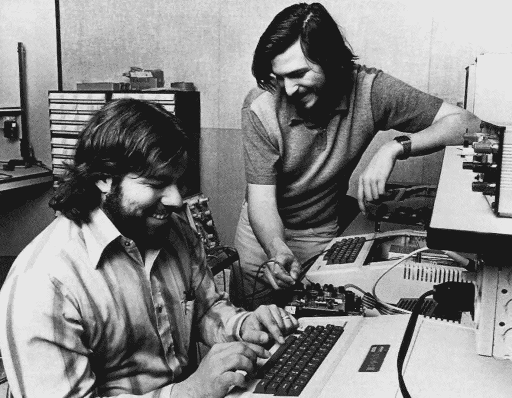
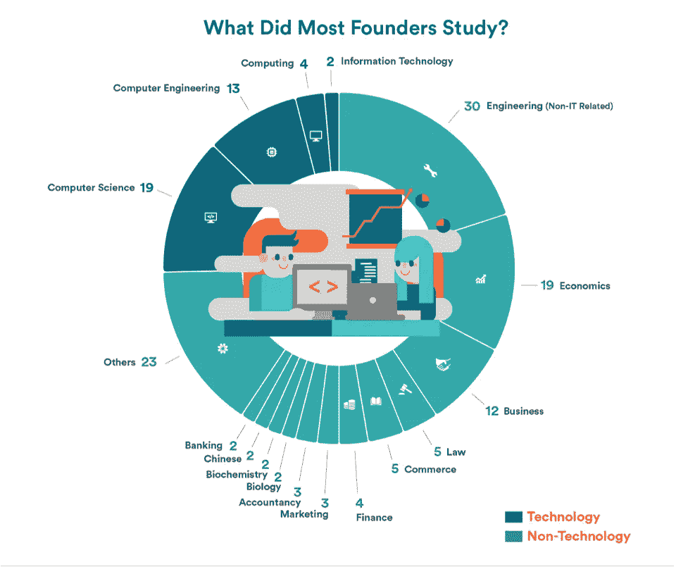
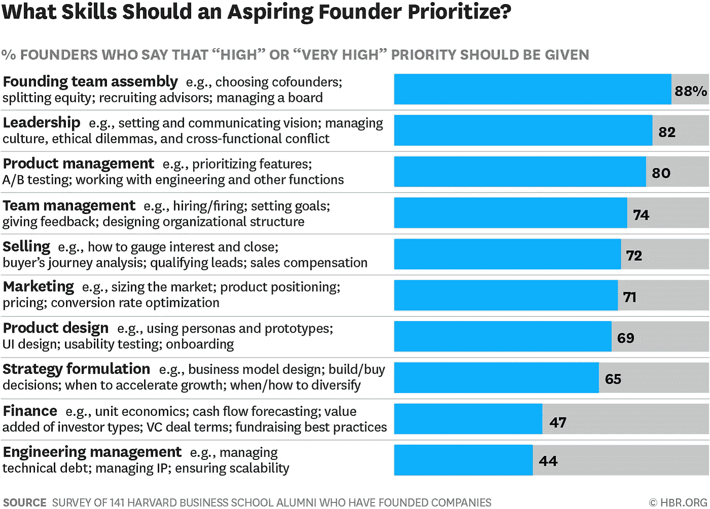
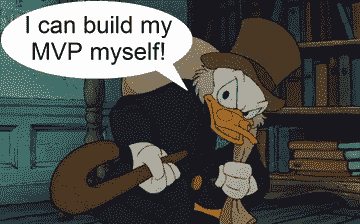
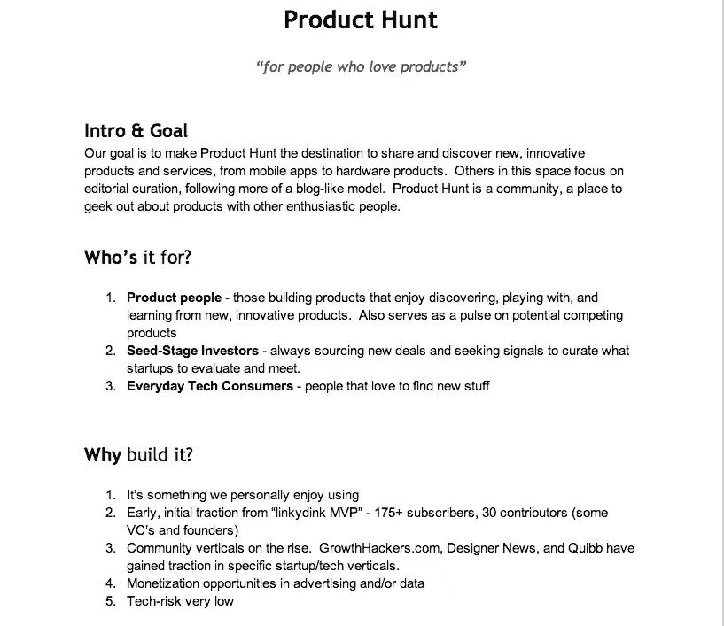
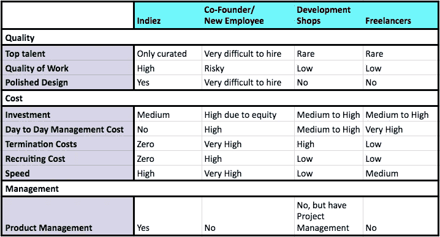
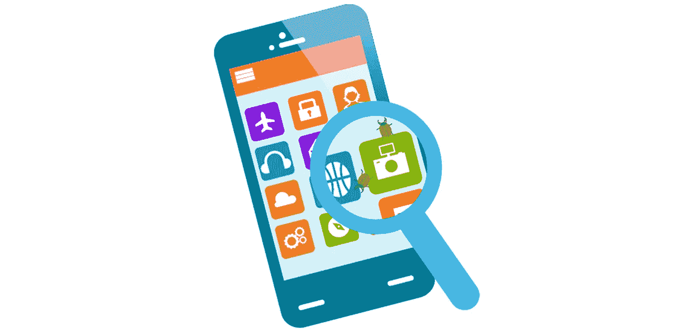
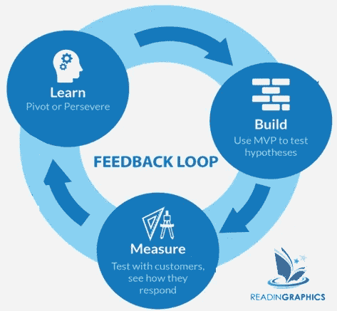

# 如何成为一个成功的非科技创始人？

> 原文：<https://medium.com/hackernoon/8-steps-to-become-a-successful-non-tech-founder-3e69e5323f0>

## 关键是你的热情和信念，而不是你的编码技能。

我的文章[得到了很多人的喜爱，我从最成功的非科技创业者那里学到的 9 件事](https://hackernoon.com/9-things-that-i-learnt-from-the-most-successful-non-tech-founders-9525efd2716)，我意识到没有太多的资源适合非科技创业者。这篇博客是同一主题的延续。

*(本文原载于* [*博客*](https://www.indiez.io/blogs)*at*[*indiez . io*](https://www.indiez.io/)*)。)*

看看微软、IBM、谷歌、苹果和亚马逊等公开市场主要参与者的创始人简介，会让任何非技术型创始人望而却步。

[伊桑·什里瓦斯塔瓦](https://medium.com/u/aa2095802095?source=post_page-----3e69e5323f0--------------------------------)和我( [Indiez](http://www.indiez.io/?utm_source=Blog&utm_medium=medium_top_link&utm_campaign=8%20steps%20to%20become%20a%20successful%20non-tech%C2%A0founder.&utm_content=non_tech) 的联合创始人)是非技术人员，在我们让阿姆罗斯(我们现在的首席技术官)加入之前，他们已经让 [Indiez](http://www.indiez.io/?utm_source=Blog&utm_medium=medium_bottom_banner_link&utm_campaign=8%20steps%20to%20become%20a%20successful%20non-tech%C2%A0founder.&utm_content=non_tech) 发展到 250 多名社区成员，并与 400 多名创始人合作。

你知道吗，杰夫·贝索斯拥有电气工程和计算机科学两个理学学士学位，比尔·盖茨在 13 岁时就编写了第一个计算机程序，谷歌的创始人也是从斯坦福大学获得的 P.Hd 学位。这份清单还在继续…

他们是技术人员，自己制造了产品的第一个版本。

最重要的是——他们都相信自己在做什么。他们被这个问题困扰着，发自内心地想解决它。

这就是全部的重点！

如果你相信这个问题必须解决，世界上没有任何力量可以阻止你去做。

但是，你有一个简单的问题，你不是技术人员。**哎哟！**

你是厨师、消防员、学生、设计师、教师还是经济学教授？没关系。你一点都不懂科技？没关系。你仍然可以引领技术变革。

怎么会？

一句话回答— **通过打造产品来证明你的痴迷。**

我可以给你举几个例子——肖恩·拉德(Tinder 的创始人，现在是 iOS store 上最赚钱的应用程序)、布莱恩·切斯基(AirBnB 的创始人)、迈克尔·戴尔(戴尔的创始人)建立了一些价值最高的科技公司，即使他们没有科技背景。

他们的故事以及其他许多故事证明，非技术类创始人也能成功。

Credits: iPrice

# 首先，让我告诉你一个没人告诉你的事实！

在 Indiez，我们与 600 多名非技术创始人进行了交流，他们与我们分享了他们的产品想法和担忧。我们发现了一种模式。

有两种创业公司——“技术型”创业公司和“基于网络的”创业公司。像[谷歌](https://hackernoon.com/tagged/google)和[脸书](https://hackernoon.com/tagged/facebook)这样拥有复杂算法核心的创业公司是“科技”创业公司，而像阿里巴巴这样的其他创业公司只是“基于网络”的。他们认识到，网络可以在一个全新的规模上，以非常低的成本，将买家和卖家聚集在一起，并进行匹配。

他们建造了它！

**结论——你可能对每个问题都有面向技术的解决方案，但解决问题的不仅仅是技术。**

Jay-Z 就是这么建立 Tidal 的。他有一个问题要解决，还有一个可以利用的网络。他利用技术解决了这个问题，并开发了一个应用程序。

所以如果他能做到，你也能！

现在，我们已经解决了这个问题。我们继续吧。

这里有一个分步指南来帮助你使用你的第一个产品。

# 1.找到一个值得解决的问题

最棘手的部分是找到一个值得解决的问题，然后想出正确的方法来解决它。

“最好的[创业](https://hackernoon.com/tagged/startup)想法往往有三个共同点:**它们是创始人自己想要的东西**、**他们可以创建**和**很少有人意识到值得去做**。”—保罗·格雷厄姆

找到你自己生活中缺失的东西，并满足它——不管它对你来说有多特别。史蒂夫·沃兹尼亚克给自己造了一台电脑；谁知道会有这么多人想要它们呢？

**快速提示**——现在不要想十亿美元的主意！

阅读这篇精彩的文章 [7 分钟，先测试一下，为你的应用创意节省 10 万美元](https://hackernoon.com/7-minute-read-to-save-100-000-on-your-app-idea-2d17db675a1)。

# 2.加倍你的技能

作为一个非技术型的创始人，你最大的特点是你产生创造性想法的能力。拥有**的感染力**、**的能力**和**对愿景**的奉献远比任何硬技能都重要。

AirBnB 的创始人布莱恩·切斯基说:“作为首席执行官，我是这艘船的船长，我有两项工作:第一项工作是，我必须担心任何可能使船沉没的事情。除此之外，我必须**专注于两到三个我深深热爱的领域**。

他选择的三个领域是**产品、品牌和文化**。

你需要相信，你可以用你所拥有的和可以获得的技能让你的船继续航行。这种信念将决定一切。

There are a lot of skills that are crucial for a founder, other than tech

通过积极阅读和与聪明人交往，在学习其他东西的同时，发挥你的优势。

阅读本[指南，培养非技术型创始人的正确心态](https://entrepreneurshandbook.co/how-to-launch-a-tech-startup-when-you-are-a-non-technical-founder-94ef449a058c)。

# 3.开始勾画你的想法

你需要一个很好的方式把你的想法传达给潜在的用户、联合创始人、开发者甚至投资者。最好的方法就是开始画草图，哪怕是在纸上！

以下工具将会很方便—

**获得灵感**——使用 [SketchAppResources](https://www.sketchappsources.com/) 、 [UI 模式](http://ui-patterns.com/)或 [ProductHunt](https://www.producthunt.com/) 寻找伟大产品的灵感，甚至使用一些开源的免费应用程序接口([freebiebug](https://freebiesbug.com/))并稍微调整一下。

**设计—** 使用 [Sketch](https://www.sketchapp.com/) 、 [Balsamiq](https://balsamiq.com/) 和 AdobeXD 来设计你的 app 的界面。

**网站—使用**[**Unbounce**](https://medium.com/u/eda63d4fd9e4?source=post_page-----3e69e5323f0--------------------------------)**或 Instapage(我的最爱)。**

**简易模板建筑** — [五福](http://www.wufoo.com)、[定型模板](https://medium.com/u/f9ec0e0e5d0?source=post_page-----3e69e5323f0--------------------------------)

Zapier 将帮助您连接所有工具，将您的 MVP 放在一起。

*如果一个原型在前端看起来不错，你会更容易说服人才来帮你做后端工作。*

[Ryan Hoover](https://medium.com/u/c2146664c8e4?source=post_page-----3e69e5323f0--------------------------------) 坐在旧金山的 Philz Coffee 用 [Linky dink](http://www.linkydink.io) 在 20 分钟内创建了一个[产品搜索的 MVP，Linky dink](https://medium.com/u/b8b4445269d0?source=post_page-----3e69e5323f0--------------------------------) 是一个简单的链接共享工具，群组贡献者可以通过其他群组成员提交的链接接收每日更新。

真的就这么简单！

阅读这篇文章，获得更多的[工具来帮助非技术型创业者建立原型](https://brainhub.eu/blog/how-to-prototype-app-as-non-designer/)。

# 4.创业=商业

寻找行业中有影响力的人，他们的经验和见解值得你学习。给他们发电子邮件，跟进直到他们同意给你反馈。

以 MVP 的形式与他们分享你的想法，并询问他们关于如何赚钱的意见。你将如何获得用户？

**让他们指出他们注意到的产品缺陷。**

**快速提示**——花时间和有经验的人在一起可以避免明显的错误，帮你节省 1000 美元。

例如，在 Indiez 工作的 Rahul 找到我们，他想开发一个成本 10 万美元的应用程序。但是在了解了他的需求之后，我们向他建议了一个简单的解决方案——建立一个聊天机器人。

他继续获取他的第一个 1000 付费用户，而没有花费昂贵的广告。从以 100，000 美元的价格与顶级代理商谈判，到以 10000 美元的价格运送合适的产品，这些学习改变了他的生活！

Flutebot built by Indiez

# 6.定义您想要构建的内容

理解和记录项目需求是一个耗时的过程。PRD 是定义目的、描述特征、设定完成标准和草图期限的文件。

我个人最喜欢的是[产品搜索的 PRD](https://docs.google.com/document/d/1yrU5F6Gxhkfma91wf_IbZfexw8_fahbGQLW3EvwdfQI/edit)。它被很好地记录了下来，你可以使用这个模板来写你自己的。

**快速提示** —跳过技术细节。这些问题可以在以后解决

# 5.你知道该造什么。现在让我们建造

你可以**找到一个科技联合创始人**，**雇佣一个自由职业者**或者**开发店**，与**新锐模特**(像 [Indiez](https://goo.gl/EVuCYV) ) **一起工作，提供咨询和产品开发**。

您应该使用您在上面创建的 PRD 来获取报价。

**快速提示 1**——警惕那些渴望与你共事的人，即使他们没有详细了解你的要求。如果有人能在五分钟的电话或一封电子邮件后给你一个准确的价格标签或时间表，他们就是在让你失败。

**快速提示 2**–75%的项目因项目疲劳而失败。确保项目被分成小的及时的可交付成果。

# 6.掌握全局

不要坐等开发过程结束。

请你的开发伙伴向你展示功能软件。至少每两周，最好是每周，下载并演示您的产品。

有一些技术可以让你实时看到开发人员远程所做的改变。在你的手机上获得它的一个版本，并在构建应用程序时使用它的功能。不要等到测试版发布好了。

如果公司不允许你这样做，最好不要和他们合作。

如果某个功能没有正确实现，请进行纠正，并继续听取用户的反馈，如果需要的话，提出修改建议。

**快速提示**——在一周内捕获错误，而不是在构建后的 3-4 周内捕获，这将节省金钱、时间和大量的返工。掌握主动权，永远领先一步！

# 7.开始获取用户

通过在媒体和其他社交媒体渠道上积极地报道你的产品，开始为你的产品建立受众。谈论你的愿景，分享你的心得，围绕产品制造一些刺激。

与那些可能有兴趣为你测试产品并给出真实反馈的人接触。

一个简单的方法是，当他们注册 beta 测试时，建立一个带有简单交付内容(如电子书或独家通行证)的登陆页面(使用 Instapage 等工具)。

向相关受众投放脸书广告，开始产生一小批测试版用户。考虑注册 [beta-list](https://betalist.com/) 、Ship by Product Hunt 和其他预发布网站。

阅读这篇精彩的 7 分钟文章，为你的应用创意节省 10 万美元，获得更多营销技巧。

# 8.装运时间

现在你的产品已经准备好了，是时候对它进行有力的测试了。如果你想让更多的人参与到测试过程中，可以从 Fiverr 雇佣自由测试者。

完成基本测试后，进行测试版发布。积极与用户交流，获取对产品的反馈。了解什么可行，什么不可行。

使用[构建-测量-学习](http://theleanstartup.com/principles)循环来实现产品与市场的契合。一旦你确定了这一点，加倍努力，开始向潜在的团队成员和投资者推销。

现在出去吧。大胆尝试，大胆挑战。

如果你想解决一个问题，你没有理由找不到解决方案。

你建立想法的热情和信念是你所做的一切的核心。从数据中学习，继续前进。

**让我们建造令人敬畏的。🙌**

A [Indiez](http://www.indiez.io?utm_source=Blog&utm_medium=medium_bottom_inline_link&utm_campaign=8%20steps%20to%20become%20a%20successful%20non-tech%C2%A0founder.&utm_content=non_tech) 我们努力从谷歌[谷歌](https://hackernoon.com/tagged/google)、脸书、优步、Spotify、Booking.com 等公司中挑选和管理顶尖的 1%技术人才。

加入 100 多位与 [Indiez](http://www.indiez.io?utm_source=Blog&utm_medium=medium_bottom_inline_link&utm_campaign=8%20steps%20to%20become%20a%20successful%20non-tech%C2%A0founder.&utm_content=non_tech) 一起打造成功产品的了不起的创始人。

## [在这里了解我们更多— Indiez.io](http://www.indiez.io?utm_source=Blog&utm_medium=medium_bottom_inline_link&utm_campaign=8%20steps%20to%20become%20a%20successful%20non-tech%C2%A0founder.&utm_content=non_tech)

