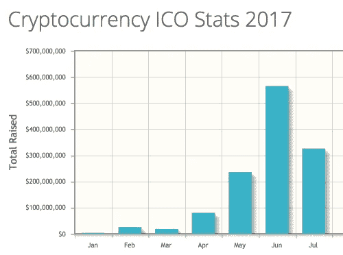

# 从 ICO 电话会议中你需要知道的 8 件事

> 原文：<https://medium.com/hackernoon/8-things-you-need-to-know-from-the-ico-conference-call-370dd249f152>

7 月 27 日，我们与 [Geektime](https://goo.gl/KkWCsr) 合作，与三位加密货币/ICO 思想领袖(以及超过 125 名参与者)举行了一个小时的电话会议。)演讲者就他们对 ico 的想法谈了 10 分钟，然后开始向观众提问。电话的回放可以在下面的 Soundcloud 上找到。点击[此处](https://www.slideshare.net/loukerner/presentations)，可在 SlideShare 上找到此次电话会议的幻灯片。

截至 7 月 18 日，93 个 ico 已经筹集了超过 12.5 亿美元的资金:

Source: CoinSchedule.com

鉴于 ICO 的急剧增长(追踪到 2016 年募集金额的 10 倍)，我们举行了 ICO 电话会议，以帮助人们了解投资者和企业家考虑发行自己的 ICO 的背景。

对我来说，这个电话的最大收获是 ICO 市场和 IPO/VC 市场有多少共同点。这似乎是下面帖子中的一个共同主题，它强调了我对电话会议中提出的八个最重要问题的看法:

**1。ICO 的买家基础正在演变，变得更加全球化-** ，[最初，ICO 主要是由“鲸鱼](https://goo.gl/TSCTBF)”驱动的，这些长期持有[比特币](https://hackernoon.com/tagged/bitcoin)和以太坊的人通过他们持有的[加密](https://hackernoon.com/tagged/crypto)货币变得富有，并希望分散投资于其他货币。这些鲸鱼得到了小买家的青睐，仅比特币基地就有 890 万个账户。许多较小的 ICO 购买者也是“自然购买者”，他们也是将提供给令牌持有者的协议、商品或服务的购买者或企业合作伙伴。最后，随着生态系统的发展，专门投资加密货币的 Polychain Capital 等机构买家和前瞻性家族理财室也成为了买家。虽然美国、中国和俄罗斯长期以来一直是加密货币的活跃买家，但日本、韩国和印度等其他国家的份额正在增加。

2.**Kik ICO 被寄予厚望，这是有充分理由的-** Kik 是一款成立 8 年的独立消息应用程序，已经从主要风投那里筹集了超过 1.2 亿美元，其中包括联合广场风险投资公司(Union Square Ventures)的长期加密货币支持者弗雷德·威尔逊(Fred Wilson)。上一次估值是 10 亿美元，当时微信在 2015 年投资了 5000 万美元。虽然该应用程序注册了超过 3 亿用户，但 [Kik 不再增长](https://goo.gl/N7qhAH)，其活跃用户群每月只有 1500 万，主要是美国青少年。

[Kik 的 ICO 计划](https://goo.gl/C23mcc)是让投资者把他们在 Kik 的股权换成 for Kin，一个开源的加密 ERC20 令牌(利用以太坊平台)。Kin 将是一种通用加密货币，用于 Kik 和其他数字服务，如聊天、社交媒体和支付。只有一小部分亲属供应将在短期内变得流动，大部分亲属供应是为亲属奖励引擎预留的。但重要的一点是，Kik 是第一个由传统风险投资支持的公司演变为加密货币支持的实体的例子，希望从“[令牌网络效应](https://goo.gl/PTruAw)中受益，用户增长是由经济上有利于用户的硬币升值推动的。

3.**今天的 ICO 可能成为明天的收购者** -小组成员认为即将到来的另一个市场演变是以硬币支付的收购。Soundcloud 是一个潜在的例子，说明一种资产可以从“令牌网络效应”中受益。一枚硬币能被创造出来用于收购 Soundcloud 或其他数字资产的特定目的吗？此外，当一家拥有硬币的公司被收购时会发生什么？硬币有出价吗？

4.**评估 ico 类似于评估任何初创公司，外加令牌经济学** -与所有早期投资一样，团队和技术至关重要。对于 ico，还有一个额外的因素，即令牌经济学。有哪些代币网络效应？它大到足以颠覆一个行业吗？考虑到评估 ico 的复杂性，通过“专业人士”创建基金来帮助买家投资 ico 池就不足为奇了。

5.将一个 ICO 推向市场的过程也类似于 IPO——一个 ICO 通常需要大约三个月的时间。像 IPO 一样，ico 也有需要解决的披露问题、法律问题和税务问题。虽然 ICO 白皮书通常非常技术性，但它们相当于需要在 IPO 中归档的 S-1。像首次公开募股一样，ico 通常有详细的全球营销计划，包括媒体宣传和公共关系。营销计划通常还包括会议上的地面游戏，以及与知名基金/家族办公室的一对一。有一些讨论是关于 ICO 流程的成本是否可能会随着所需稀缺资源的价格上涨而上升，或者成本会下降，正如我们在传统融资的某些方面看到的那样，如建立一个公司，随着免费在线资源的提供，成本下降了 99%。

6.**重要的非稀释性融资是一个主要的竞争优势** -虽然这是显而易见的，但重要的是要注意到成功从 ICO 融资的公司的战略意义。与其他年轻的竞争对手相比，该公司可能会得到更好的资金支持，这可能是一个主要优势，因为它能够更快地雇佣更多有才华的人。资本也可能是营销的一大优势。此外，令牌网络的影响可能是显著的。鉴于 ico 的流动性比风投通常经历的更快，ico 也可能成为风投的一大胜利。

7.**ico 的条款正在像 IPO 市场一样演变**——锁定、分层定价和转售限制在 ico 中越来越受欢迎，被视为市场成熟的积极迹象。

8.**SEC 最近的公告对 ICO The Market 来说是积极的**——7 月 25 日，[SEC 发布新闻稿](https://goo.gl/LcgZh1)称“美国证券法可能适用于虚拟组织的利益要约、出售和交易”。所有小组成员都认为这是向前迈出的积极一步。随着监管者在市场上更加活跃，坏苹果将会减少。这份通知被普遍认为是经过深思熟虑的，它没有说什么和它做了什么一样重要。最值得注意的是，它似乎将公用事业置于监管机构的监管范围之外。

— — — — — — — — — — — — — —

Lou Kerner 是 Flight Venture 公司的合伙人，他投资于以色列人创办的科技公司，也是 partner Chameleon 公司的合伙人，该公司致力于帮助数字企业发展和转型。

***如果你喜欢这个帖子，请点击💚这样其他人就可以在媒体上看到它了！***