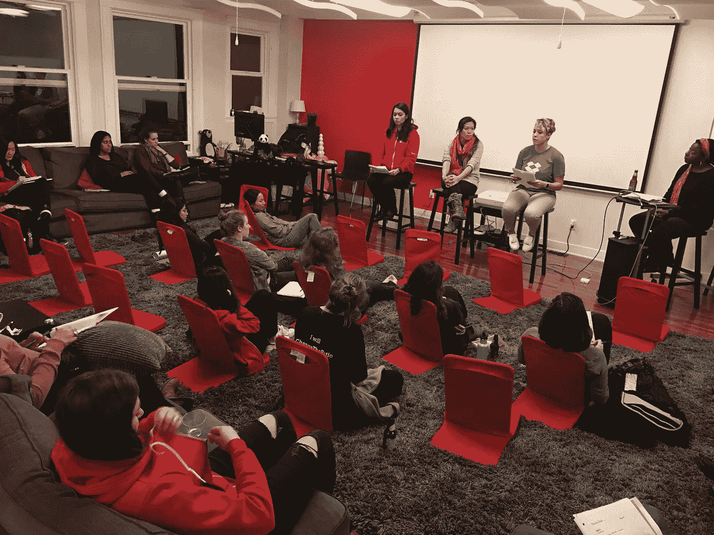
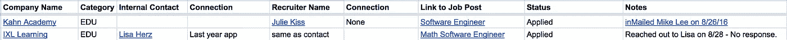
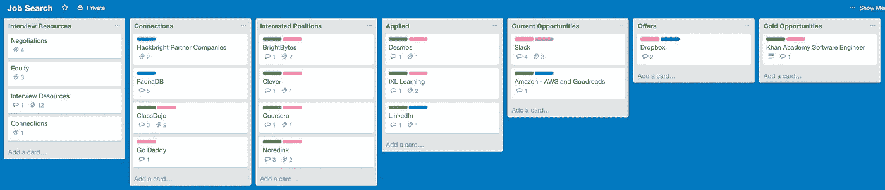
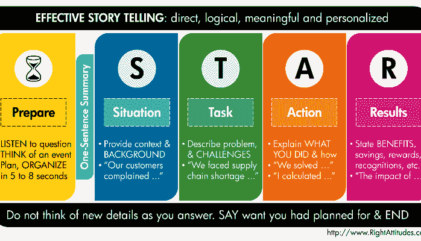
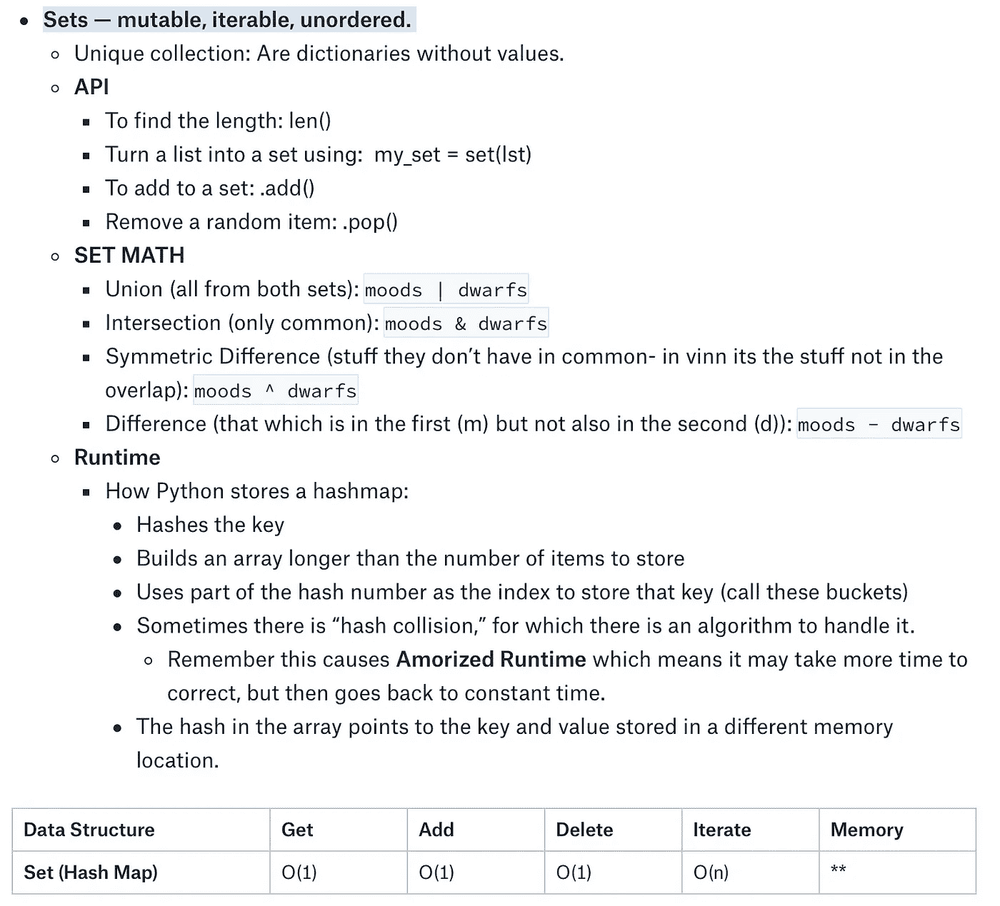
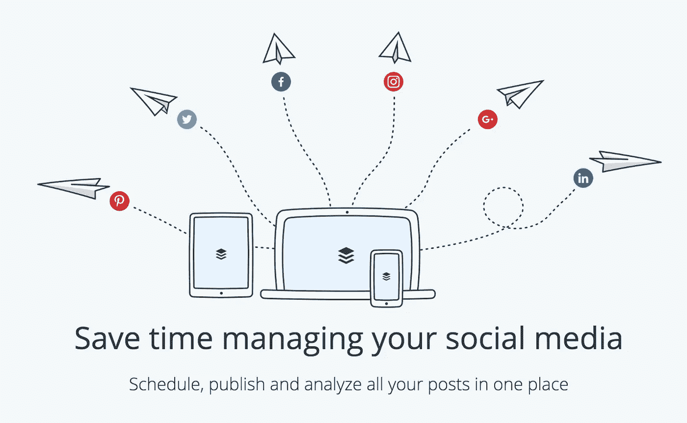
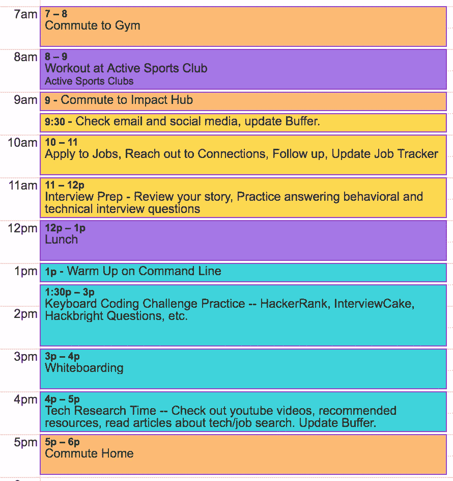

# 整理训练营后求职的 8 个工具

> 原文：<https://medium.com/hackernoon/8-tools-for-organizing-your-job-search-post-bootcamp-abe9b2d54c12>

How I Got My Job Alumni Panel at Hackbright Academy, December 2016\. Credit: Diane Phillips.

本周，我在哈克布莱特学院参加了一个名为“我如何找到工作校友小组”的小组讨论在这次活动之前，我准备了一份我在求职过程中所做的事情的清单，这些事情最终让我在 Hackbright 结束后不久在 Dropbox 找到了一份网站可靠性工程师的工作。

作为一名 SRE 人，我在过去的六周里学到的一件事就是思考缩放的重要性。座谈会结束后，我心想，我该如何分享和扩展我的知识，让更多的人知道呢？我决定写一篇关于我的策略的文章，可以和像我一样的训练营的毕业生分享，也可以和其他希望转行到科技行业的人分享。

我在这里列出的许多策略可以在你职业转变的任何时候应用。在我训练营经历的中途，我开始开发和使用许多这样的框架。开始计划找工作永远不会太早！

# 1.巩固你的故事

当你开始社交和面试时，人们会要求你讲述你的故事。用 3-5 句话创造一个你能轻松说出的故事(<30 seconds) and write it down. Practice with your friends and family.

Since you are making a career change, take the time to think critically about your transferrable skills and be able to articulate them. Remember to never downplay your learnings and experience from your previous career, use them to demonstrate your uniqueness. Check out [这篇文章](https://www.themuse.com/advice/a-simple-formula-for-answering-tell-me-about-yourself)讲述你的故事。

Hackbright Career Day where I shared my story with several companies, September 2016

# 2.创建您的路线图

一些职业顾问会建议你申请尽可能多的工作。我更倾向于通过确定你的兴趣和公司的特点来为你的求职创造焦点，这将为你提供最好的发展机会。我在下面提供了一个框架来指导你完成这个过程:

## ***目标公司简介***

你的公司简介更多的是对你正在寻找的公司类型的总结。先不要开始考虑具体的公司。我发现提前做这些真的可以帮助你找到符合你需求和兴趣的公司。

*   你在一家公司寻找什么样的使命？你想从一个特定的任务开始，然后朝着另一个目标努力吗？在此指定。(如教育、生产力、社会、金融等)。
*   你在一家公司里寻找什么样的价值观？(例如，多元化、协作、支持训练营毕业生等)。
*   公司的规模？(例如构建或维护？你能接受一家初创公司吗？大公司更有吸引力？).
*   你正在寻找的公司有什么具体的微观特征吗？(例如结对编程、指导、特定益处等)。
*   你对使用什么语言或框架感兴趣？
*   位置，位置，位置。

## ***目标公司列表***

现在使用您的公司简介开始选择公司。创建您感兴趣的公司的表格或列表。列出每家公司的原因。如果可能，按类别/主题进行分组(例如，教育、生产力、社交、金融、注重多样性、创业等)。

我发现，通过围绕我感兴趣的东西(教育和生产力工具)创建主题，我很容易回答这个著名的问题“你为什么想在这里工作？”因为我把它们和我的兴趣联系起来了。

## 确定要关注的角色

有许多类型的工程职位。有一段时间，我只知道全栈、前端和后端工程角色。随着我开始研究，我意识到有更多的种类，遇到了像网站可靠性工程师，UX 工程师，客户支持工程师，产品管理等头衔。详细阅读招聘职位，找到你感兴趣的。

> 如果你有兴趣了解成为 SRE 意味着什么，看看我和 Dropbox 的 SRE 经理塔米·布图(Tammy Bütow)整理的资源清单(T5)。

# 3.微调您的 GitHub 和 LinkedIn 个人资料

## **GitHub**

*   ***清理你的 repos。*** 这是一个回去整理你的回购的好时机。确保你有标准的命名惯例，使你的项目在练习和评估中容易辨认。记得[钉上你的项目回复](https://github.com/blog/2191-pin-repositories-to-your-github-profile)，这样如果有人去你的 github，他们就能清晰的[看到](https://github.com/khardsonhurley)。在这里查看我是如何组织我的回复的。
*   ***清理你的代码。雇主会看你的代码，回去确保你从你的项目中删除打印的陈述和不必要的评论。如果你真的雄心勃勃，做一些重构，并添加一些测试！***
*   ***创建 ReadMes。*** 花时间为你参与过的任何动态项目写一份自述，甚至是团队项目。包括截图或 gif([giphy capture](https://giphy.com/apps/giphycapture)是一个很棒的工具)。最好包括上下文信息，比如数据模型选择、设计选择、测试覆盖率和关于作者部分。如果您要部署，请在自述文件中包含您的网站链接！
*   ***创建视频。*** 如果您无法部署您的项目，请创建一个关于您的项目的视频。您的视频应该展示关键功能、使用的技术以及您在整个开发过程中所做决策的背景。别忘了在你的 LinkedIn 个人资料上链接到这个！

> 记住，雇主不仅想看你能做什么，还想了解你决策背后的想法。

## **领英**

*   ***完善你的总结。还记得你一直在写的那个故事吗？它应该与你在总结中所说的一致。清楚地说明你在寻找什么样的角色，以及你拥有的资格，列出那些可转移的技能，最好有量化这些技能的数据。***
*   ***显示你的项目。*** 理想情况下，你的 LinkedIn 个人资料上至少要有 3 个项目。如果你以前从未在科技行业工作过，这些应该比你的工作经历更重要。黑客马拉松是让你在面试中谈论更多项目和团队经验的好方法。确保您的个人资料包含指向您的项目网站、视频和/或 github repos 的链接。
*   ***形容你以前的角色。不要以为招聘人员和雇主会根据你的职位来了解你的技能，这一点非常清楚。为您的角色创建带有量词和强动词的描述。***

# 4.创建一个工作跟踪器

创建一个框架来帮助你跟踪你的过程。我使用 LinkedIn 寻找我的关系网中与我感兴趣的公司的联系。我调查了我的大学校友网络以及 Hackbright 校友网络。我想要一个地方来组织所有这些信息，所以我创建了一个详细的电子表格，后来它变成了一个 Trello 板(当我发现这篇很棒的文章时)。)

## **电子表格**

如果您选择创建电子表格，这里有一种方法可以组织您的数据。下面，我提供了该图中显示的每一列的上下文。

Example of a Job Tracker Spreadsheet

*   ***公司名称***
*   ***类别/主题***——我把我的搜索组织成主题，并使用了像 EDU 和 PROD 这样的缩写。
*   ***内部联系人*** —我只在我认识目前在该公司工作的人时才填写。我还链接了他们的 LinkedIn 资料。
*   ***与内部联系人的联系*** —用于陈述我是如何认识内部联系人的。
*   ***招聘人员联系人***——我在 LinkedIn 上搜索每家公司，寻找头衔为“技术招聘人员”或“招聘人员”的人我附上了他们的名字，并链接到他们的个人资料。
*   ***与招聘人员的联系***——这一栏大部分时间都是空的，以防我与招聘人员有直接联系。
*   ***链接到职位***——我在这一栏写了职位名称，并把它链接到了职位。
*   ***状态****——我用这个栏目来表示我的申请状态，包括“已申请”、“已拒绝”、“9/18 预定电话筛选”等条目。*
*   ****注释*** —我用这个栏目来填写关于工作和/或招聘人员的背景。*

*另一个很棒的电子表格技巧是根据主题、职位类型或地位对你的行进行颜色编码。*

## *特雷罗*

*在我创建了一个电子表格后，我看到了这篇惊人的[文章](http://blog.trello.com/using-trello-for-a-job-search-less-stress-more-process)关于如何使用 Trello 来组织你的求职。我决定把我的电子表格里的所有东西都转移到 Trello 板上。*

**

*Snapshot of my Job Tracker Trello Board*

*我的“求职”板上有 7 个列表，标题如下:*

*   ****面试资源****——*这里我收录了我在求职过程中想要反复查阅的任何资源。我有“协商你的薪水”、“股权和股票”、“面试资源”和“网络”的卡片。在每张卡片中，我都包含了资源链接以及对我一路上所学的任何东西的评论。*
*   ****人脉****——*我在这里列出了我知道有人在那里工作的任何公司的名片。在卡片里，我链接了那个人的简介，并写下了我是如何认识那个人的。我也记录了我们的互动。*
*   ****感兴趣的职位****——*我在这里列出了我感兴趣职位的公司的名片。在卡片里，我链接了职位以及与职位相关的任何内容。一旦一张卡进入这里，我每天都试图把它移到下面的列表中。*
*   ****应用****
*   ****当前机会****
*   ****优惠****
*   ****冷机遇****

*Trello 还允许你为你的卡片创建标签。我围绕我的主题(EDU 和产品)以及职位类型(全栈、前端、后端、UX 工程师、SRE/基础设施等)创建了标签。*

*Trello 也是一个很好的方法来组织你用来帮助你学习的资源。我创建了一个“学习资源”板，帮助我组织编码挑战、精彩视频、求职文章等的链接。*

# *5.构建和使用您的网络*

**

*Hackbright Career Day, September 2016.*

*还记得你在工作追踪中发现的所有关系吗？非常注意你如何与这些联系互动是很重要的。这里有一些接触这些联系的技巧:*

*   ****问一个直接的问题。*** 想知道什么，就问。大多数人自然想帮助别人，但也必须保护自己的时间。Y-Combinator 的首席执行官迈克尔·赛贝尔说，包含直接问题的电子邮件会得到最快的回复。*
*   ****不要向陌生人要电话/咖啡。伸出手时要有目的和重点，在请别人喝咖啡之前与他们建立融洽的关系。请一个完全陌生的人喝杯咖啡不会增加你找到工作的机会。从问具体问题开始，尊重他们的回答。如果你们的关系导致了一个电话或一杯咖啡，明确你想讨论什么。确保这个人是你谈论这个话题的最佳人选，你不想浪费他们的时间。****

> *请一个完全陌生的人喝杯咖啡不会增加你找到工作的机会。*

*   ****求介绍人。如果你有一个朋友认识你想认识的人，写一封电子邮件，让你的朋友转发给你介绍。让他们轻松点！在你的电子邮件中，准确地陈述你为什么想和这个人联系。当他们回应时，直接问你想知道的。****

*无论你做什么，不要发论文！记住，你要联系的人可能很忙，所以要直奔主题！*

# *6.创建一个采访包*

**

*Photo in my ‘Personal Reminder’ section*

*从大学开始，我意识到当我花时间为自己创建一个学习指南或“采访包”时，我做得很好。这是你可以在课程结束后就开始做的事情，并且可以在每次面试时进行调整。Dropbox paper 是一个非常好的工具，它可以让你粘贴各种类型的媒体。以下是我如何组织我的采访包:*

*   ****个人提醒****——**包括你在面试前需要提醒自己的任何事情。上面的照片是我在个人提醒部分的一个例子。**
*   *****角色**** *—* 包含一个你正在面试的职位的链接。将该职位的重要部分复制并粘贴到此部分。仔细检查并确保你澄清了任何你不清楚的词汇或技术。在这一部分做笔记。**
*   ****——*记下产品、公司价值观以及任何关于公司的最新消息。批判性地思考这与你的兴趣有什么联系，并在这里做笔记。***
*   *****突出显示的项目*** **—* 你应该准备好讨论你简历/LinkedIn 个人资料上列出的任何项目。想一想哪些项目/技能最能表明你为这个角色做好了准备，记下你想在这里强调的内容。**
*   *****行为面试问题解答****——*面试都是讲一个好故事，确保你能讲出你的。此外，思考你生活中的不同经历(工作、学校或个人),这些经历展示了你如何与他人合作、管理冲突、完成任务、处理挫折/曲线球、应对失败、执行长期目标等。把这些经历连同你从经历中学到的东西一起写下来，即使是不好的经历。当你身处困境时，提前做好这种反思可以拯救你。**
*   *****要回答的技术面试问题*** *—* 在这一部分，你可以记下任何你必须陈述的技术问题。如果你的训练营和 Hackbright 类似，你应该有一个清单。[破解编码面试](https://www.amazon.com/Cracking-Coding-Interview-Programming-Questions/dp/0984782850/ref=sr_1_1/156-4204963-1138650?ie=UTF8&qid=1482051148&sr=8-1&keywords=cracking+the+coding+interview)也是一个很好的资源。每当你遇到一个新问题，把它添加到这个部分。这里可能会出现一些问题，例如“面向对象编程的好处是什么”或者“一个`get`请求和一个`post`请求之间有什么不同？”**

****

**Snapshot of one section in My Interview Packet**

*   *****详细的技术知识****—**这一节可能对你有用，也可能没用，但我用它来包含我在训练营中学到的每一种数据结构和算法的信息。我包括的数据结构是字符串、列表、元组、集合、字典、链表、队列、栈、树、图和类。在每个数据结构下，我包括了它是否是可变的、可迭代的、有序的和可索引的，以及我想记住的任何方法，关于内存和运行时的注释，例子等等。我还加入了关于排序算法(冒泡排序、插入排序、快速排序、合并排序等)的注释，确保我理解了它们的工作方式和运行时间。***
*   ******问雇主的问题****——*提前想好你要问的问题总是个好主意。一些可以考虑的好话题包括:文化、职位、经理/导师、团队/流程以及关于公司的一般性问题。***

******每次面试都会改变的部分。*****

**当你遇到这些主题的资源时，把它们链接到你的包里。这是一份活的文件，你可以在整个求职过程中不断补充。**

**当您进入全职学习模式时，将复习此资料与进行编码挑战和白板挑战结合起来。在面试的前一天，打印你的资料，花些时间浏览一下。我真的很喜欢在练习回答问题和解释我的包中的主题时大声说话。在你面试的那天，为了给你的大日子做好心理准备，通读你的资料。**

# **7.管理您的媒体**

****

**下载 [Buffer](https://buffer.com/) ，这是一款神奇的应用，让你轻松管理自己的社交媒体。你可以设置一个帖子队列，可以安排在你的 Twitter、LinkedIn、Google+、脸书、Instagram 和 Pinterest 账户上发布。当你在学习的时候，当你读到一篇有趣的文章时，当你参加一个值得注意的活动时，创建一些关于令人敬畏的资源、你学到的新东西的帖子。将它们添加到您的缓冲队列中，以便在您的帖子发布时分散开来！**

# **8.创建学习时间表**

**制定学习计划是关键。我发现最好每天都做一点点，在面试的时候做些调整。我建议根据你在某项活动中表现最好的时间来制定你的时间表。例如，如果你在早上考虑技术方面的事情，那么就把编码安排在早上，而把求职任务安排在下午。**

> **了解自己的学习方式，根据自己的学习需求制定时间表。**

**这是我用谷歌日历创建的一个日程表样本。请注意这些关键要素:**

*   ****在你的通勤和自我保健活动中加入。**我发现在早上进行锻炼有助于我准时开始新的一天。我包括了我的通勤，以帮助我保持正轨。**
*   ****颜色编码。**谷歌日历允许你改变事件的颜色。在这个例子中，你可以看到通勤是橙色的，自理是紫色的，求职是黄色的，编码是蓝绿色的。**

****

**Sample Study Schedule**

*   ****分配时间。就像在学校一样，你只能在短时间内真正专注于一项任务。为任务分配一点点时间，坚持你的时间表。如果有什么事情你没有做，记下来，明天再做。记住，这是一场马拉松而不是短跑，你所有的努力都会随着时间的推移而积累。****
*   ****白板独立于编码挑战**。作为一名前教育工作者，站在白板前讨论问题的行为与在电脑上做完全不同。找一个有白板的地方学习，为你的家买一个，或者利用你浴室的镜子。即使你是一个人，也要确保在你解决问题的时候大声说话。如果你在一个小组里做白板演示，要积极主动地去做志愿者。这不是你能伪造的，它需要练习！**

****

**感谢您的阅读！我希望这些策略对你有用，并祝你一路顺风！**

**克里斯勒**

****觉得这个帖子有用？请点击下面的❤按钮，与正在找工作的朋友分享吧！****

**想要更多提示吗？看看[菲利克斯·冯](http://www.linkedin.com/in/felix-feng)写的这篇令人敬畏的[文章](http://www.linkedin.com/pulse/5-key-learnings-from-post-bootcamp-job-search-felix-feng)，他是[黑客反应堆](http://www.linkedin.com/edu/school?id=163104&trk=prof-edu-school-logo)的毕业生，现在是 Radius Intelligence 的软件工程师。**

## **关于作者**

**Krishelle 是一名前高中数学和西班牙语教师，后来成为 Dropbox 的网站可靠性工程师。[阅读](http://www.huffingtonpost.com/entry/5824e18ce4b094483eef3690?timestamp=1478812083540)关于她从教育到科技的旅程，并在 [Twitter](https://twitter.com/khardsonhurley) 和 [LinkedIn](https://www.linkedin.com/in/khardsonhurley) 上与她联系。**

************

> **[黑客中午](http://bit.ly/Hackernoon)是黑客如何开始他们的下午。我们是阿妹家庭的一员。我们现在[接受投稿](http://bit.ly/hackernoonsubmission)并乐意[讨论广告&赞助](mailto:partners@amipublications.com)的机会。**
> 
> **如果你喜欢这个故事，我们推荐你阅读我们的[最新科技故事](http://bit.ly/hackernoonlatestt)和[趋势科技故事](https://hackernoon.com/trending)。直到下一次，不要把世界的现实想当然！**

****