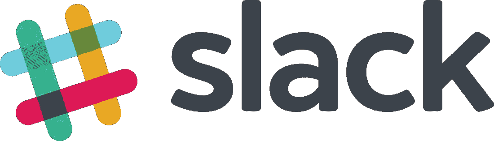
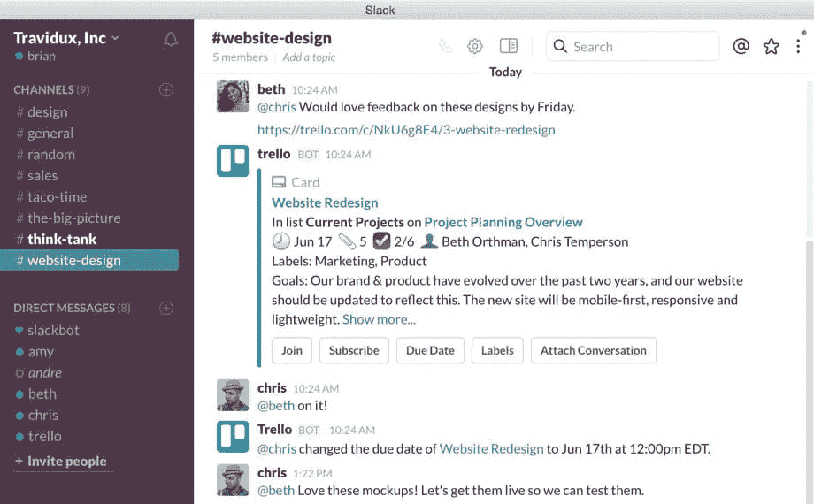
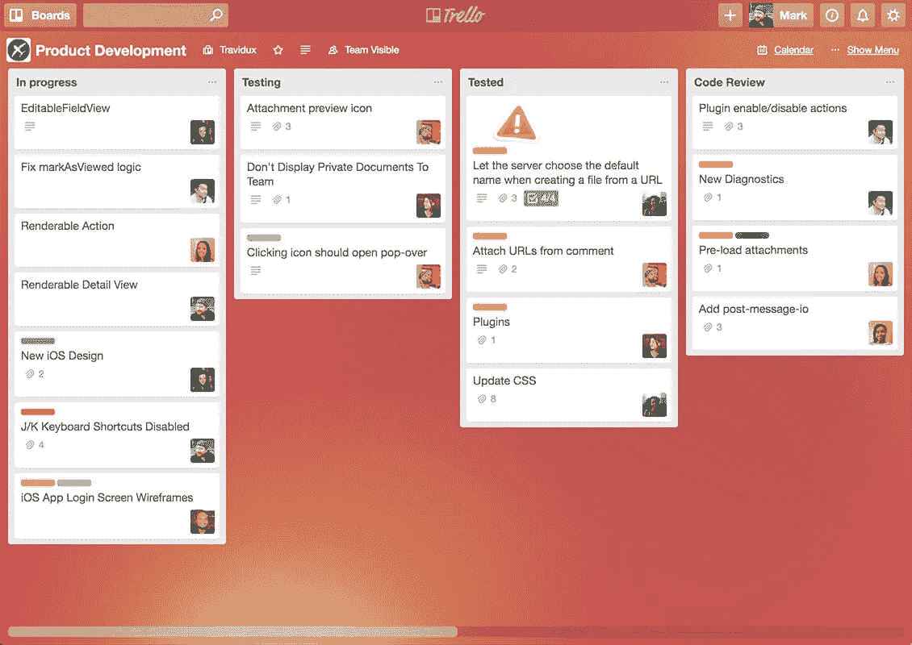
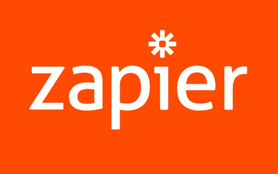
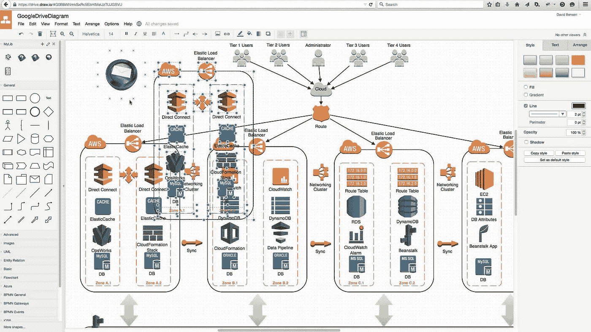
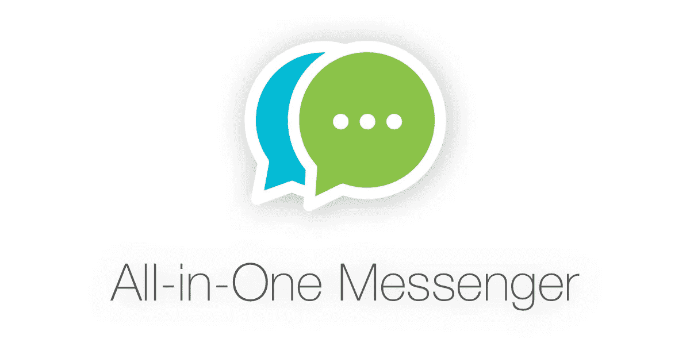
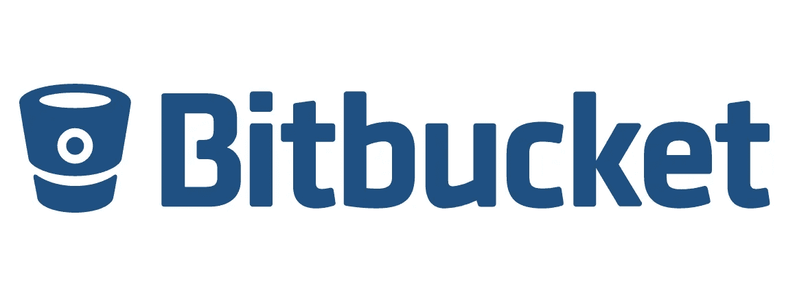
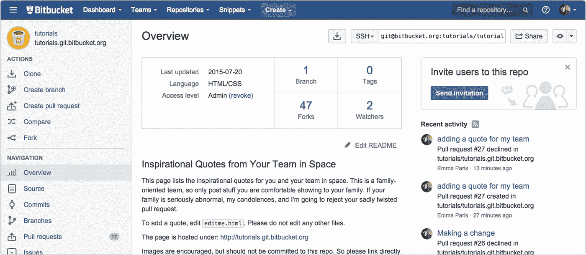
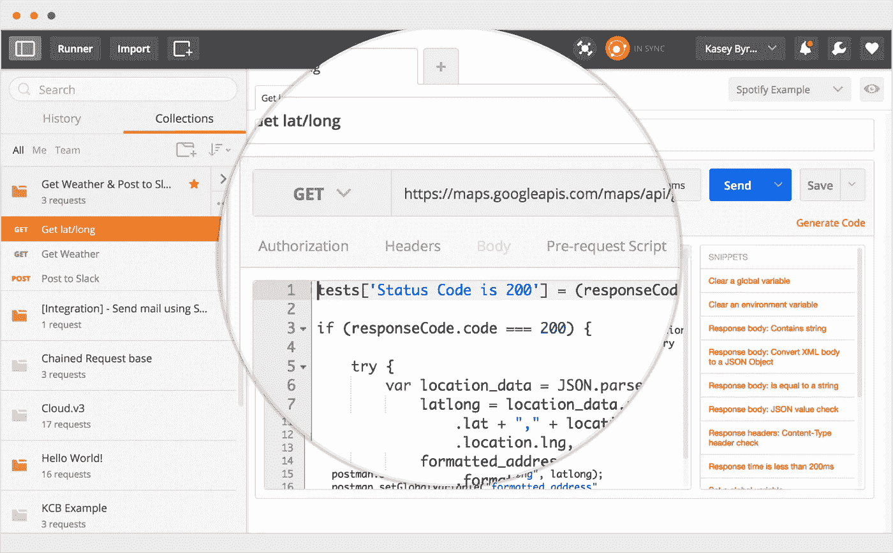

# 8 大必备工具，提升您的 web 开发工作流程

> 原文：<https://medium.com/hackernoon/8-top-must-use-tools-to-boost-your-web-development-workflow-de44018a7b98>

作为开发人员，在我们[部署我们的应用程序](https://codingstartups.com/deploy-django-nginx-gunicorn-postgresql-supervisor/)之前，甚至在我们[选择我们的云提供商](https://codingstartups.com/choose-cloud-computing-technology-startup/)之前，我们应该考虑在我们的日常内部工作流程中使用哪些工具。我们工具箱中包含的工具可以极大地提高我们的生产力，或者使我们的 web 开发项目变得极其复杂和难以维护，或者通过招募更多的团队成员来扩大规模。

将我们自己从初级开发人员成长为高级开发人员的一个主要部分涉及简化我们的任务管理过程的工具的适应，使与其他团队成员的沟通无缝，并在我们使用的工具之间建立集成，以便他们和谐地一起工作，创建最适合您和您的团队的完美堆栈。

作为一家技术初创公司的联合创始人，我们有责任创建大规模工作的工作流，并且易于加入我们团队的大多数开发人员使用、调整和维护。为了给我们的团队实现最高效的工作流，我们首先需要自己掌握它们。

在这篇文章中，我将向您介绍大多数初级 web 开发人员日常使用的管理、分析和维护产品的工具集。您可能已经非常熟悉其中的一些工具，因此，我的目标不仅是向您介绍这些工具，而且还为您提供如何使用它们以及如何将它们集成在一起以创建适合您的和谐的最佳实践。

在我开始列出这些工具并深入研究它们之前，我想提一下最重要的考虑因素，即您使用的操作系统。我不打算在这里深入讨论关于操作系统考虑的细节，因为我已经在之前的帖子[从 Windows 迁移到 Ubuntu](https://codingstartups.com/moved-windows-linux-lessons-learned/) 中深入讨论过了。

# 松弛的

# 它的用途是什么

Slack 是一个团队的交流平台。尽管 Slack 最初的目标是完全取代对电子邮件的需求，但在我看来这个目标还没有实现，Slack 还有很多额外的优势。即使你仍在独自工作，继续阅读——Slack 对个人来说也是一个神奇的工具。

Slack 引入了一种新的无缝方式来与团队成员进行内部交流，掌握里程碑、目标和问题，安排会议，甚至预订午餐。

Slack 没有一次让所有团队成员交流的聊天，而是通过渠道向我们介绍。渠道是你可以讨论公司、风险或项目不同方面的房间:开发、销售、PPC 活动、UI / UX 等等。

Slack 为您提供了管理与团队成员丰富对话所需的一切:表情符号、图像共享、YouTube 视频嵌入，当然还有集成。

集成使您能够将第三方工具连接到您的 Slack 组中。您可以安装来自 Slack 市场的公共工具，或者使用 Slack API 开发您自己的工具，并在您的 Slack 组中使用。松弛集成允许您通过发送消息来安排与团队成员的会议，设置定期提醒，在新用户注册或订阅时进行通知，点午餐，通过对特定消息做出反应来娱乐团队等等。

Slack 的搜索系统是强大的。每条消息都有索引，因此很容易恢复任何频道中的任何内容。

# 谁应该使用它

自然，懈怠是为团队打造的。但是，作为一个独立完成一个辅助项目的开发人员，我鼓励你自己建立一个 Slack 团队，并利用 Slack 提供的一切。您可以通过向自己发送设置提醒和安排会议的消息来提高工作效率，而不是访问浏览器中的许多应用程序。

# 最佳实践

*   通过将他们集成到您的团队中，调查 Slack 的市场能够提供的顶级集成。
*   通过使用利用 Slack API 的开源库来开发您自己的集成。您可以推送新订阅用户的通知，让您的团队了解公司的重要事件。使用 Slack 可以建立完美的文化。
*   学习 Slack 的键盘快捷键以提高工作效率。
*   查看适用于 Slack 的 BitBucket 集成，以便为每次推式生产通知特定渠道。
*   查看本文中的**多功能一体信使**工具，以便更好地在您的台式电脑上使用 Slack。

# 定价模型

[Slack 的定价模型](https://slack.com/pricing)提供了一个免费计划，能够完美地为小团队服务，并且只能够搜索和访问最新的 10K 消息(一旦您订阅，就可以访问您所有的消息)。对于标准和 Plus 计划，您按团队成员付费，并获得更多集成、优先支持等。

# 高级用户提示

松弛不仅用于内部团队，也用于公共社区。有成千上万的 Slack 社区可供您加入(其中大多数是免费的)，与来自世界各地的人们讨论产品、设计、开发等等。列出时差社区的目录之一是[时差列表](https://slacklist.info/)。

[链接到时差](https://slack.com/)

# 特雷罗

# 它的用途是什么

Trello 是一个简单而精彩的任务管理(或项目管理)工具。Trello 可用于管理开发工作流程和任务，以及营销项目、博客、在线业务等。

Trello 的用户界面非常简单和简约，但拥有管理多达 10 名团队成员的项目所需的一切，包括任务标签、附件、任务分配和任务调度。

# 谁应该使用它

作为一名独立开发人员，他经营着自己的副业项目，Trello 是管理您的任务和工作流程的最佳人选。一旦您添加了新的团队成员(最多 10 个)，Trello 包含了您保持项目高效管理所需的一切。注意，对于超过 10 个团队成员或者有许多移动部分的项目，Trello 可能不够。

# 最佳实践

*   为同一个团队的不同项目使用白板。可以开板做营销，后端开发，前端开发等。
*   为了便于识别，每块板使用不同的背景颜色。
*   保持左侧菜单打开，以便快速导航。
*   通过将个人资料图片从右侧菜单拖放到特定任务，将任务分配给团队成员或自己查看任务。
*   当开始一个项目时，通过打开一个任务并点击*标签*来定义你的标签。在那里你可以给标签加上标题，这样你就可以在以后给你的任务加标签。
*   在白板上使用不同的栏来列出你系统中不同组件的任务，或者列出*要做的事情，做*和*完成*的任务。

# 定价模型

Trello 提供的所有基本功能都可以在免费计划中找到。对于集成、更好的安全性和支持，请查看[业务和企业计划](https://trello.com/pricing)，尽管在我看来，当扩大您的项目时，您可能想要查看不同的任务管理解决方案。

# 给高级用户的提示

要查看 Trello 板的示例并从中获得灵感，[浏览此处](https://trello.com/inspiration)。

[链接到 Trello](https://trello.com/)

# 红灰

# 它的用途是什么

Redash 是一个很棒的开源工具，可以在一个专用的仪表板中可视化您的数据。它为您提供所需的一切，让您的团队能够查询数据、可视化和共享数据。

它集成了所有最流行的数据源，包括 MySQL、PostgreSQL、MongoDB、ElasticSearch 等等。

使用 Redash，您可以生成可视化来跟踪里程碑，并让您自己和您的团队参与到项目中。

您还可以创建提醒，主动提醒您重要的更改。

# 谁应该使用它

一旦您[将您的应用程序部署到生产环境](https://codingstartups.com/deploy-django-nginx-gunicorn-postgresql-supervisor/)并开始通过将数据推送到您的数据库来收集数据，您应该考虑使用 Redash。它可以帮助您监控潜在问题，跟踪您实现里程碑的进度，从您的数据中获得洞察力等等。

# 最佳实践

*   将 Redash 每日指标与 Slack 集成起来，每天自动推送。这样你就不需要每天进入你的仪表盘，而只需要呆在你的空闲组里，让你的团队成员也参与进来。

# 定价模型

Redash 是开源的，因此完全免费。如果你想得到一个托管的 Redash 实例，你可以选择[付费计划](https://redash.io/pricing/)。

# 给高级用户的提示

一旦你觉得少了什么，就去实现它，贡献给 Github 库。

[链接到 Redash](https://redash.io/)

# 扎皮尔

# 它的用途是什么

有多少次你对自己说:如果我们能把脸书广告的数据放到谷歌的电子表格里，那该多好啊！然后几分钟后，您发现自己在努力使用 API 来完成集成？

正是因为这个原因，Zapier 是一个值得研究的伟大工具。它教导我们，作为开发人员，我们不必运行和实现我们想要在公司中实现的每个集成。不仅如此，我们系统中的代码越少，内部开发越少，越好。

Zapier 通过集成 750 多个应用程序，自动在 web 应用程序之间移动信息。只需点击几下按钮，您就可以创建自动化的流程和工作流，这些流程和工作流将永远存在。

例如，使用 Zapier，你可以在 2 分钟内将每期杂志从 BitBucket 推送到 Slack，或者从 Google Form responses 创建 Trello 卡。

# 谁应该使用它

作为开发人员，我们习惯于每天与 API 打交道。我鼓励您在开始编写自己的集成代码之前，先看看 Zapier 下次能提供什么。这可能会节省你很多时间。

如果你在经营自己的公司，考虑尽快使用 Zapier，以避免重复的开发项目、错误和可维护性。

# 最佳实践

*   今天就和 Zapier 签约吧。
*   查看 [Zapier 示例](https://zapier.com/learn/automate-apps-examples/)以获得自动化可以达到多广的启发。

# 定价模型

Zapier 提供了一个免费的永久计划，其中包含有限的两步 zaps 和集成。免费的永久计划绝对足够玩这个工具了。一旦你从 Zapier 那里获得了真正的价值，你可以考虑一个[付费计划](https://zapier.com/pricing/)，对你可以自动化的 zaps 没有限制。

# 给高级用户的提示

尽可能多地使用 Google Sheets。它会为你简化事情。

[链接到扎皮尔](https://zapier.com/)

# Draw.io

# 它的用途是什么

Draw.io 是一个非常棒的原型、实体模型和架构设计工具。由于其模板集合，它可以以多种方式使用，而使用 Draw.io 的主要目的是在用代码(或 photoshop)实现之前设计流程、系统和视图。

Draw.io 是 Google Drive 的一个插件，因此它公开了 Google Drive 拥有的所有共享和协作功能。例如，在设计服务器架构时，您可以与其他团队成员无缝协作。

Draw.io 提供了许多组件，便于插入到草图中。你可以从流程图一直到 Android、Bootstrap 或 iOS 屏幕。

# 谁应该使用它

Draw.io 是我知道的最好的素描工具之一，而且完全免费。我鼓励你在设计阶段尝试并在你的下一个项目中使用它。

# 定价模型

Draw.io 是免费提供的。

[链接到 Draw.io](https://www.draw.io/)

# 多功能信使

# 它的用途是什么

我们大多数人都有不止一个与同事、朋友和家人沟通的渠道。通常，每个沟通渠道，如 WhatsApp、Slack 或 Facebook Messenger，都有自己的网络应用程序，这使得它相对难以掌控一切。

一体式 Messenger 是一个很棒的 Chrome 应用程序，可以在一个地方收集所有的通信渠道。它使您能够为每个通信渠道打开一个新标签，并支持所有最流行的渠道。它们的行为和感觉都是一样的，因此很容易操作。

# 谁应该使用它

从个人开发人员到公司，All-in-one messenger 适用于每天处理多个通信渠道的每个人。

# 最佳实践

*   虽然不太清楚，但是您可以为同一个通信频道添加多个选项卡。例如，如果您是多个可宽延时间组的成员，您可以将所有这些组添加为不同的选项卡，并相应地命名它们。

# 定价模型

多功能一体信使是免费的。

# 给高级用户的提示

如果你想在工作中更有效率(我猜你是这样想的，否则你不会读这篇文章)，帮你自己一个忙，取消设置标签中的通知。

[链接到多功能一体信使](https://chrome.google.com/webstore/detail/all-in-one-messenger/lainlkmlgipednloilifbppmhdocjbda?hl=en)

# 比特桶

# 它的用途是什么

BitBucket 是一个分布式版本控制系统，让你和你的团队合作变得容易。BitBucket 归 Atlassian 所有，Atlassian 拥有吉拉、HipChat 和 Trello，这些对开发者来说都是很棒的产品。

与 Github 不同，BitBucket 免费为最多五个用户提供私有存储库。BitBucket 的用户界面非常友好且易于使用，BitBucket 提供的集成非常有用。

# 谁应该使用它

对于开发团队来说，版本控制系统的使用是显而易见的(希望如此)。作为一名 solo 开发者，我鼓励你使用 BitBucket 作为版本控制系统来管理你的代码版本，将你的应用部署到产品中，与第三方工具集成以进行代码检查等等。

# 最佳实践

*   使用 BitBucket & Slack 集成将通知从 BitBucket 直接推送到您的 Slack 组内的发展渠道。

# 定价模型

如前所述，BitBucket 为多达五个合作者提供无限的私有代码库。一旦你想扩大你的团队，你需要[升级你的订阅，按每个用户每月付费](https://bitbucket.org/product/pricing?tab=host-in-the-cloud)。

[链接到 BitBucket](https://bitbucket.org/)

# 邮递员

# 它的用途是什么

作为 web 开发人员，我们经常需要创建 API 来将我们的后端代码暴露给不同的客户端，如前端应用程序、移动应用程序和第三方合作。当构建 API 或使用不同实体拥有的 API 时，有时很难测试、记录和监控它们。

Postman 是一个 Chrome 应用程序，它允许你用任何你需要的参数、标题和认证设置轻松地向本地或全局服务器发送 HTTP 请求。

与其他工具不同，Postman 有一个很棒的 GUI(图形用户界面),用于定义 HTTP 请求和分析响应。

# 谁应该使用它

从开发或测试自己的 API 的个人开发者到需要团队协作和共享的公司。

# 最佳实践

*   开发 web 应用程序时保持 Postman 开放，您很可能会发现它很有用。

# 定价模型

Postman 的免费永久计划提供了你作为一个独自开发自己的项目的开发者所需要的一切。对于团队协作和高级功能，请参见[付费计划](https://www.getpostman.com/pricing)。

[链接到邮递员](https://www.getpostman.com/)

为您的 web 开发工作流调整生产习惯是必须的。为了你自己的工作效率，也为了你即将掌管的团队，尝试使用不同的工具来找出你的完美匹配。

如果你觉得这篇文章有用，请鼓掌以示感谢。

[CodingStartups](https://codingstartups.com/) 是一个面向具有企业家思维的开发者的社区。

最初发布于 [CodingStartups](https://codingstartups.com/8-top-must-use-tools-boost-web-development-workflow/) 。