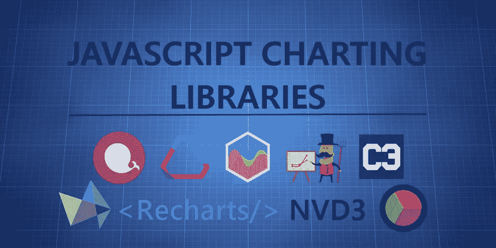
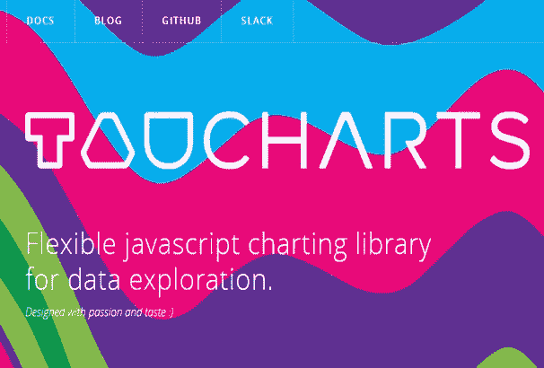
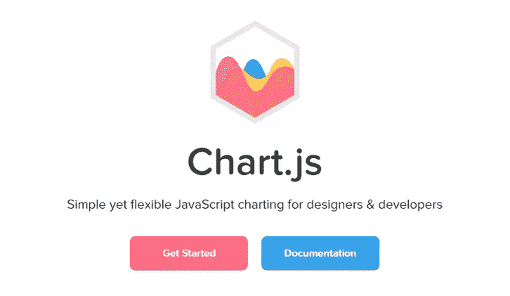
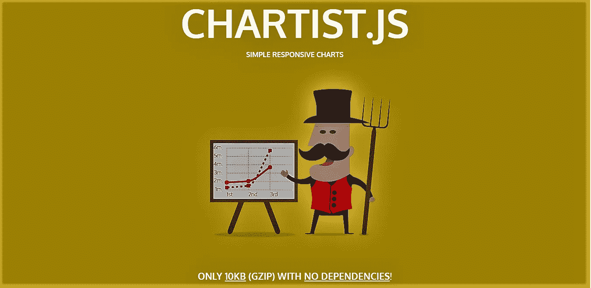
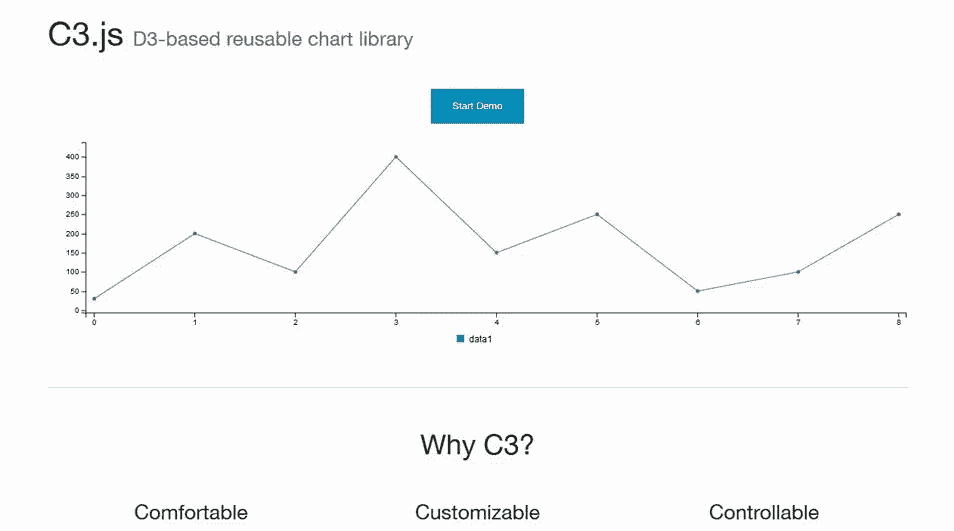
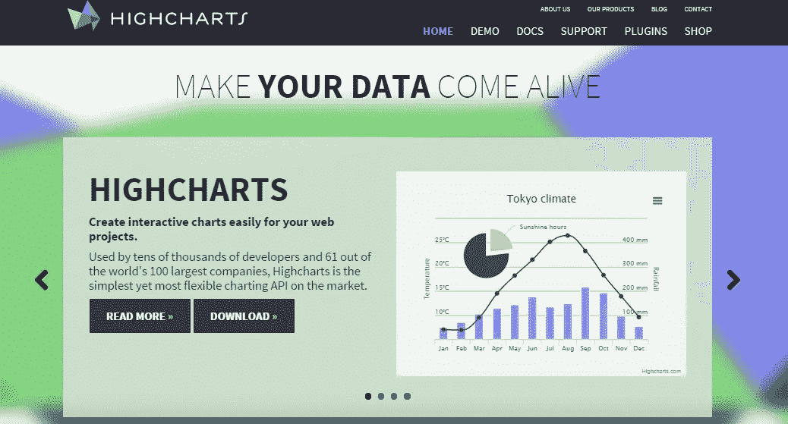
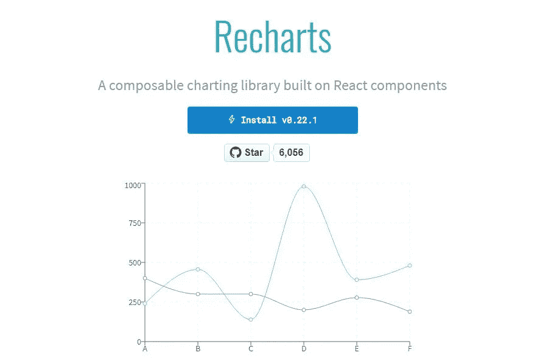
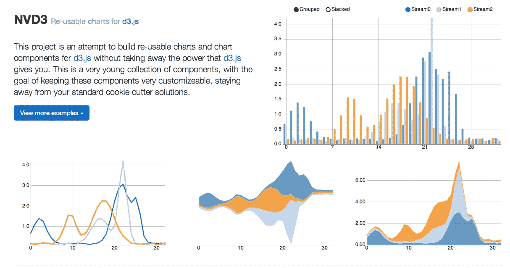
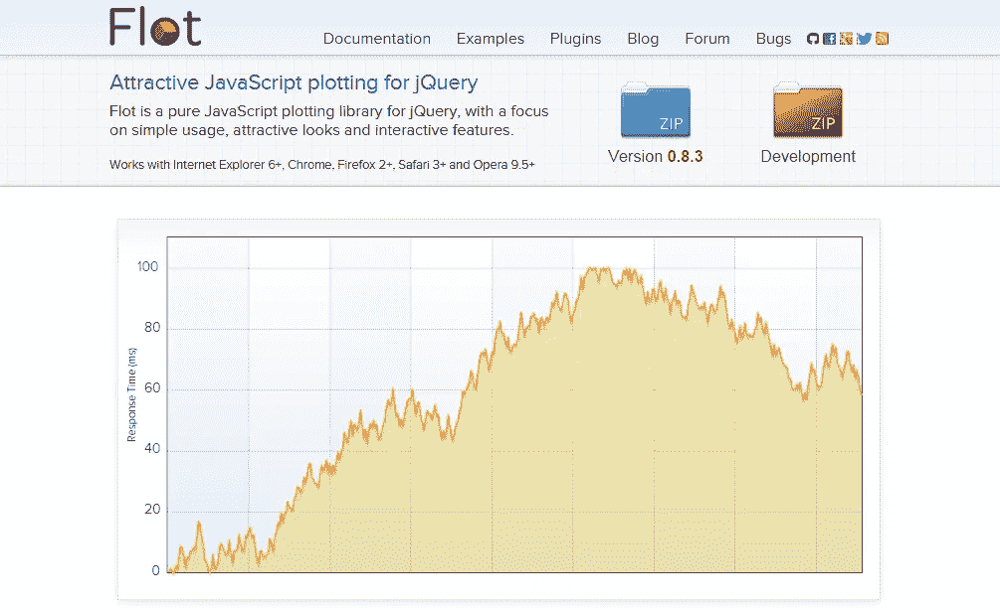
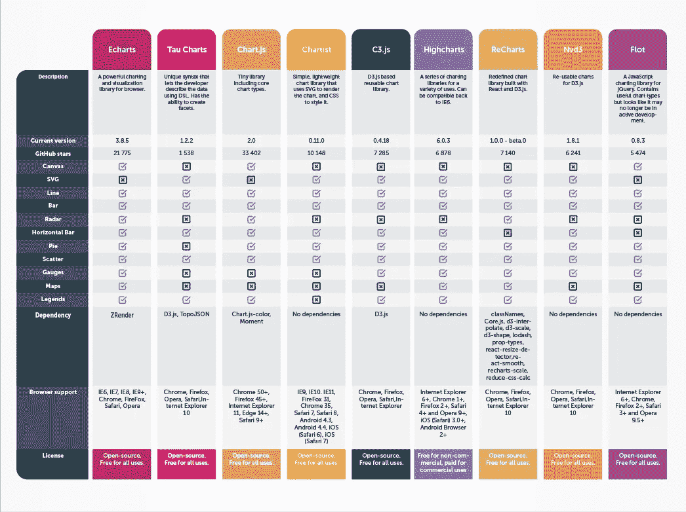

# 9 个最好的 JavaScript 图表库

> 原文：<https://medium.com/hackernoon/9-best-javascript-charting-libraries-46e7f4dc34e6>

对于正在阅读本文的你来说，[数据可视化](https://hackernoon.com/javascript-visualization-frameworks-review-f3cccf78ccf0)已经成为当今 it 世界非常重要的一部分，这肯定不是什么新闻了。不同的网络技术产生的大量数据需要被适当地提炼和可视化，以供世界使用并从中获得洞察力。

理解数据的优势是巨大的，并且随着时间的推移，它会导致做出明智的决策。一个组织提取、清理、可视化和分析数据的能力在很大程度上决定了盈利或亏损。

作为一名前端 web 开发人员，能够像制作漂亮的交互式网页一样可视化数据是一项很好的技能。这些 JavaScript 库使这项任务变得更加容易，因为开发人员不必忍受语言语法的变化来将这些神奇的数字转换成可理解的图表。

有很多用于这个目的的 JavaScript 库。这就是为什么这九个被挑选出来的原因。他们从其他人中脱颖而出，将非常适合所需的目的。在我们继续之前，这里有一个列表库，我挑选了出来:

*   [埃查尔兹](https://hackernoon.com/interesting-javascript-libraries-born-in-china-d50d1bb81355)
*   Tau 图表
*   Chart.js
*   宪章派
*   C3.js
*   高图表
*   雷查尔兹
*   Nvd3
*   Flot

需要注意的是，本文不是教程。然而，为了使学习工作更容易，已经添加了到每个库的链接。

# 埃查尔兹

如果中国大腕百度公司创造的产品不是高质量的，你还能从它身上得到什么？

Echarts 对于在网页上可视化数据非常有用。有了它，您可以创建直观的、可定制的交互式图表，使数据的解释和分析更加容易。

很多 JavaScript 图表库已经移植到 JavaScript，这意味着它们的使用并不是无缝的。但是 Echarts 的情况并非如此，因为它是用普通的 JavaScript 编写的。

这个图书馆的官方网页[、](https://ecomfe.github.io/echarts-doc/public/en/index.html)上有相关文档，你不必担心它是中国图书馆。它有很好的英文记录。

使用 npm 很容易安装这个库:`npm install echarts -- save`

要了解这个库的更多信息，你可以从[官方网站](https://ecomfe.github.io/echarts-doc/public/en/index.html)查看，也可以查看 [GitHub 页面](https://github.com/ecomfe/echarts)。

**示例** —大规模散点图

# TAU 图表

TauCharts 是最灵活的 JavaScript 图表库之一。它也是基于 D3 的，是一个以数据为中心的 JavaScript 图表库，允许改进数据可视化。

谈到它的灵活性，TauCharts 允许轻松访问他们的 API。为用户提供无缝映射和可视化数据的机会，以获得更惊人的洞察力。

它不只是灵活。它还可以快速绘制图表，并且易于学习。

要通过 npm 安装，只需输入:`npm install taucharts`

要了解更多这方面的信息，您可以查看[官方网站](https://www.taucharts.com/)以及 [npm 页面](https://www.npmjs.com/package/taucharts)上的一些教程。

**示例** —水平线

# 图表。射流研究…

简单。干净。方便用户。

完美的词语来描述图表 JS 库。Chart JS 库是一个基于 HTML5 的 JavaScript 库，用于创建动画、交互式和可定制的图表和图形。

使用 Chart JS，您可以轻松地可视化您的混合图表类型，没有任何麻烦，创建默认的响应性网页。

该库允许您快速开始可视化数据。易于设置，对初学者友好。有了它，你将不必卷入浏览器兼容性问题，因为它支持旧的浏览器。

使用 npm 安装图表 JS:`npm install chart.js -- save`

关于这个库的适当文档和一些教程在他们的官方网站和 GitHub 页面上。

**示例** —雷达

# 宪章派

如果你想创建漂亮的、反应灵敏的、读者友好的图表，Chartist 是你可以利用的库。

Chartist 使用 SVG 来呈现图表。它还提供了使用 CSS 媒体查询和创意动画定制图表的功能。你可以将你所有的创造力带入你的图表。

Chartist 非常容易配置，也很容易用 Sass 进行定制。然而，它不像它的“姐妹”Chart.js 那样支持老版本的浏览器。

你可以想象你可以得到多少完美，因为你可以通过 CSS 样式化和创建所有你想要的可爱的动画来美化你的 SVG。

这个库也可以使用 npm 安装:`npm install chartist -- save`

在它的[官网](https://gionkunz.github.io/chartist-js/)上有很多关于使用这个库的信息。

**示例** —带有自定义标签的饼图

# C3。射流研究…

就像 TauCharts，C3 是另一个非常有效的基于 D3 的图表可视化库。另外，它允许您创建可以根据个人喜好或风格轻松定制的类。

表面上看，C3 像是一个难以使用的库。然而，一旦你掌握了它的技术，就没有什么能阻止你。

有了这个图表库，您甚至可以在第一次呈现后通过创建回调来更新图表。很容易找到使用这个库的方法，因为它还允许您为 web 应用程序创建可重用的图表，从而减少了要做的工作。

使用 npm 安装 C3 图表库:`npm install c3`

关于这个库的更多信息可以在[官方网站](http://c3js.org/)和 [GitHub 页面](https://github.com/c3js/c3)上阅读。

**示例** —组合图

# 高图表

使用 HighCharts.js 让您的数据栩栩如生。

使用 Highcharts，您可以使用纯 JavaScript 创建交互式图表。当您尝试将交互式图表添加到 web 应用程序中时，它可以很容易地使用 SVG 进行渲染，并与 HTML5 完美配合。

它非常轻量级，因为它不需要任何插件。这并没有使它比其他图表库效率更低。你可以创建任何你能想到的图表，无论是柱形图、条形图、饼图还是极坐标图，而无需耗费内存。

由于其简单性，Highcharts 也非常兼容旧的浏览器，所以如果您不需要使用高级图表样式来表示数据，可以选择它。

也可以使用 npm: `npm install highcharts -- save`进行安装

要了解这个库的更多信息，可以查看[官网](https://www.highcharts.com/products/highcharts/)和 [GitHub 页面](https://github.com/highcharts/highcharts)。

**示例** —带有径向渐变填充的高图表气泡

# 雷查尔兹

ReCharts 是一个用 React 构建的图表库，基于 D3 图表库。

它被重新定义以使 React 爱好者更容易，因为您可以在 React web 应用程序中无缝地编写图表。

Recharts 是非常轻量级的，并且使用 SVG 元素进行渲染，以创建令人印象深刻的图表。

可以使用 npm 安装:`npm install recharts`

Recharts 没有冗长的文档，因为它直截了当，而且当你遇到困难时也很容易找到问题的解决方案。

官方网站有更多关于这个图书馆的信息，还有 [GitHub 页面](https://github.com/recharts/recharts)。

**示例** —自定义内容树形图

# NVD3

受 Mike Bostock 的启发，目前由 Novus Partners 的前端软件工程师团队维护，NVD3 是另一个基于 D3 的高质量 JavaScript 库。允许您在 web 应用程序中创建漂亮的可重用图表。

它具有可视化数据的强大功能，并带有可爱的图表，如箱线图、旭日图和蜡烛图。如果您正在寻找 JavaScript 图表库中的大量功能，NVD3 是值得期待的。

虽然速度有时可能是这个库的一个问题，但在安装了 [Fastdom](https://github.com/wilsonpage/fastdom) 的情况下使用它会使它快得多。

你可以很容易地从[网站](http://nvd3.org/)和 [GitHub 页面](https://github.com/novus/nvd3)了解更多关于这个库的信息。

**示例** —简单折线图

# FLOT

随着时间的推移，jQuery 已经成为 web 开发人员非常重要的工具。有了 Flot.js，事情变得简单多了。

Flot 是当今 JavaScript 世界中最古老的图表库之一。然而，这决不会减少它的功能，因为它支持折线图，饼图，条形图，面积图，甚至堆积图。

Flot 已经开发了一个巨大的以下超时，也有一个精彩的文件。所以遇到砖墙更容易找到解决问题的办法。

它也支持旧的浏览器。

有了 Flot，你不一定需要使用 npm 来安装。你需要做的就是在包含 jQuery 之后，在 HTML5 中包含 JavaScript 文件。要获得更多关于 Flot 的信息，只需查看[官方网站](http://www.flotcharts.org/)和 [GitHub 页面](https://github.com/flot/flot)。

**示例** —基本用法

# 包装它

最后，很难从这些库中选出最好的，因为它们都是高质量的库。然而，你可能会发现有些更难学，要么是因为陡峭的学习曲线，要么是因为网络上缺乏学习材料。所以，最好用一个库来补充另一个库。除了本文讨论的九个库之外，还有许多其他的库，所以万一您没有从这九个库中找到您想要的，您可以做进一步的研究。

然而，并非所有这些库都是免费的，因此，查看它们的官方网站以了解与使用这些工具相关的条款和条件是很重要的。然而，这不应该阻止你以最美丽的方式可视化你的数据。继续用图表表示这些数字。

[**2018 年 10 个 JavaScript 动画库跟进**](https://dashbouquet.com/blog/frontend-development/10-javascript-animation-libraries-to-follow-in-2018)

[*安东·沙利尼科夫*写的](https://www.linkedin.com/in/anton-shaleynikov-45812a1/)