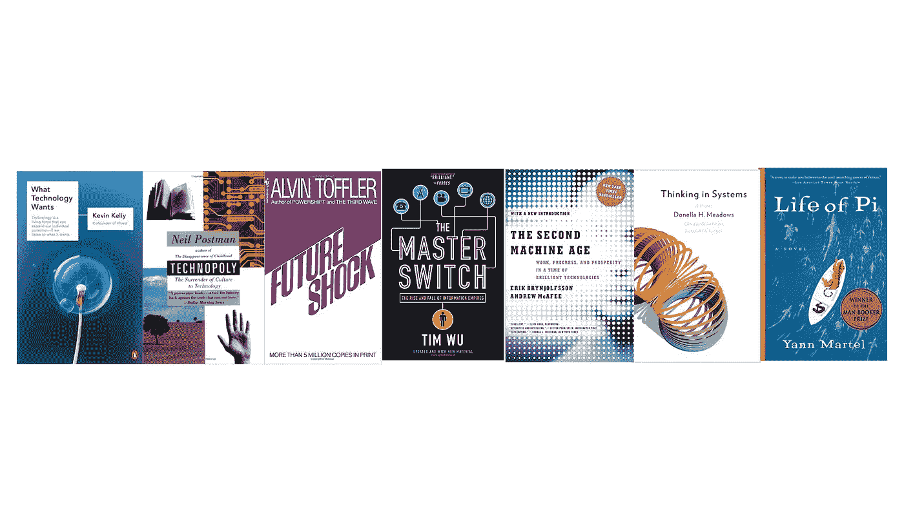
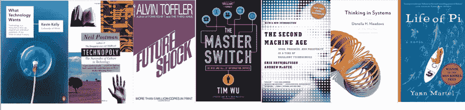

# 9 本书帮助您加深对技术和系统的理解

> 原文：<https://medium.com/hackernoon/9-books-to-help-you-understand-technology-and-systems-bb3f4d2d9dda>

我们听说马克·扎克伯格可能有兴趣竞选总统。我们直呼埃隆的名字。比尔·盖茨是世界上最富有的人。每个大学生都梦想成为科技亿万富翁。企业家精神有一定的“T2 好莱坞化”。

创业也容易多了。使用众多模板中的一个创建一个网站，将其托管在亚马逊网络服务或 GoDaddy 上，找到一个你认为存在的难题，并着手解决它。在某些情况下，人们甚至试图在想法完全具体化之前筹集资金。感觉就那么简单。这导致了一个关于你需要什么来建立业务的理解水平的错误叙述。

> 这是世界上最容易创业的时候，但创业也从来没有这么难。

在我与创始人的多次交谈中，我听到了这种对业务和技术的基础理解上的差距。虽然我建议实际做创业工作并把它搞砸是最好的学习方式，但我也分享了“ [*大象和瞎子*](https://en.wikipedia.org/wiki/Blind_men_and_an_elephant) ”的故事

> 一群盲人都摸一头大象，想知道它是什么样子。每个人触摸不同的部分，因此认为它不是大象。

并分享一个不能区分整体和部分的课程；因为你认为你看到了一个行业中问题的一小部分，并不意味着你明白如何解决问题。大多数企业家在没有真正理解问题的全貌或“为什么”的情况下就匆忙解决问题。

为了帮助这些创始人，我推荐一些系统理解技术的书籍。这里有 9 本书可以帮助你快速起步，这样，当你开始创业时，你就能了解你正在驾驭的趋势，你正处于商业周期的哪个阶段，以及你将面临什么样的基础系统/模式。

1.  [**要什么技术**](http://amzn.to/2lM9d1H) **凯文·凯利**。一个好朋友兼公用事业技术爱好者朋友([尤金·格拉诺夫斯基](https://www.linkedin.com/in/euggra/))向我介绍了这本书。凯文·凯利被认为是尼尔·波兹曼(Neil Postman)的对立面，因为他是我们可以从生活中不可避免的技术变革中获得价值的最重要支持者之一。在他的新书《不可避免的事情》中，他分享了更多他对我们周围技术系统变化的期望。我们已经看到 HOLOS = Tech/The Machine+70 亿灵魂，这是他阐述的一种力量，在我们周围发挥作用。
2.  [**系统思维:唐内拉·梅多**著](http://amzn.to/2lq5juy) **初级读本。上面的大象和盲人我的故事也包含在这本书里，这是我个人最喜欢的一本书，解释了从整体上理解系统的必要性。在任何破坏发生之前，对系统和在这些系统中运行的模型的整体理解是必要的。正如我喜欢说的，不幸的是我不记得我是在哪里或从谁那里第一次听到这句话的'*要破坏一件事，你必须真正理解它*。**
3.  Erik Brynjolfsson，Andrew McAfee:当前对人工智能和机器人等的强烈反对。并不新鲜。这本书着重于指数和组合技术变化对人类工作的影响。阅读这篇文章是为了传达这样的信息(我们需要积极主动地做一些事情来扭转技术带来的收入差距不断恶化的状况)，同时也是为了研究受到人工智能和机器学习等改变游戏规则的技术进步影响的系统。
4.  [**总开关**](http://amzn.to/2lGMRyo) 吴添:我是大蒂姆·吴梵。在这本书中，他讨论了技术(以及我们的技术使信息流成为可能)对电视、电影和互联网行业的影响。这本书既是对这些行业生活的一次旅行，也是对技术变得无处不在时所经历的周期的描述；所有有用的技术在变得普遍之前都是创新的。将这本书与他的新书《[**】The Attention Merchants**](http://amzn.to/2lSBzaW)》配对，以了解更多关于我们如何在互联网生活中走到这一步的[。](https://artplusmarketing.com/technology-attention-merchants-the-snap-ipo-f80737bdaf09)
5.  [**未来的冲击**](http://amzn.to/2liJWZN) 阿尔文·托夫勒:我最近又在读这本书，在这本有先见之明的书中引用了许多话，其中一句是“T14”……但在几乎所有其他的传播媒介中，我们都可以发现对大众受众的依赖在下降。到处都是“市场细分，流程在起作用”。另一个与人工智能时代的第二个机器时代的前提密切相关的是'*人类可以吸收的变化量是有明显的限度的，在没有首先确定这些限度的情况下，通过无休止地加速变化，我们可能会让大量的(人类)人屈从于他们根本无法忍受的要求。虽然他的一些背景可能已经过时，但这本书是在 1970 年写的，其总体思想(变化和信息过载的加速步伐)在今天仍然适用。可能更是如此。*
6.  [**Neil Postman 著 Technopoly**](http://amzn.to/2lMuloD) 我看的这本书的复印件其实是我老婆本科时代的复印件。显然，在她斯坦福的专业中，她不得不阅读这本书，并分享她对尼尔·波兹曼在这本与当前技术景观非常相关的书中提供的观点的看法。这是我读过的最引人注目的书(她很勤奋)，但其中的元素，其他人的笔记，使它成为一本专注于技术给社会带来的不平等的伟大著作的绝佳读物。
7.  扬·马特尔的《少年派的奇幻漂流》 :在你读到为什么之前，把这个故事写在这里可能看起来很奇怪。我和[杰瑞米·阿德尔曼](https://www.linkedin.com/in/jadelman/)就这篇博文进行了交谈...你知道吗，我会让他比我更雄辩地解释为什么这本书能帮助你理解技术(提示:因为它帮助我们理解我们的偏见，我们都知道我们的偏见渗透到我们构建的产品中)；很少有书强迫你面对你是谁，以及你对形势和趋势的看法。我们都有过滤器和透镜，通过它们我们感知世界，我们对现在和未来的解释完全是通过这些透镜。如果你想关注技术趋势，并打造一款既符合趋势又能持久解决人类痛苦的产品，这是一个关键的认识。 [*《少年派的生活》*](http://amzn.to/2lSBWCl) *真实地让我们思考这些镜头和偏见。*

你会把哪些书加入书单？

## 如果你喜欢这篇文章，请点击下面的心。这有助于其他人看到这个故事，也有助于我知道你想看到我写更多(我们都需要一些验证:)。

> [黑客中午](http://bit.ly/Hackernoon)是黑客如何开始他们的下午。我们是阿妹家庭的一员。我们现在[接受投稿](http://bit.ly/hackernoonsubmission)并乐意[讨论广告&赞助](mailto:partners@amipublications.com)的机会。
> 
> 如果你喜欢这个故事，我们推荐你阅读我们的[最新科技故事](http://bit.ly/hackernoonlatestt)和[趋势科技故事](https://hackernoon.com/trending)。直到下一次，不要把世界的现实想当然！

