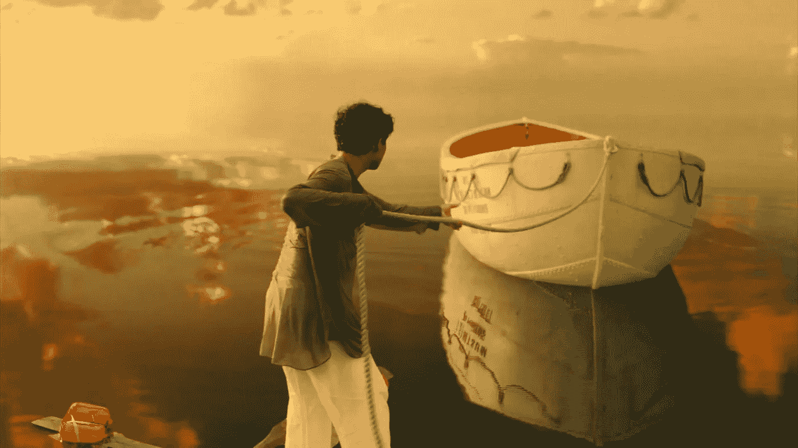
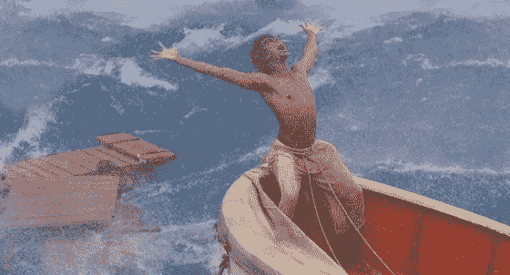

# 来自电影的 9 个难以置信的教训可能会改变你的生活

> 原文：<https://medium.com/hackernoon/9-incredible-inspirational-movies-that-could-change-your-life-1a1771c0c802>

[Image: Life of Pi]

灵感可以来自任何地方，任何人。我的灵感通常来自书籍和电影——书籍和 [*电影*](https://goo.gl/vpZV6T) *将生活故事与精神旅程结合在一起。*

以下是我的 10 句励志咒语和电影台词，它们可能会像对我一样对你产生影响。

# 1.活着就是探索。

> “去看世界，去看危险的事物，去看墙后的世界，拉近距离，去寻找彼此，去感受。这就是生活的目的。”——沃尔特·米蒂的秘密生活(2013)

# 2.做你该做的。

> “我知道我现在必须做什么，我必须保持呼吸，因为明天太阳会升起。谁知道潮水会带来什么？”——抛弃(2000 年)

# 3.相信你真实的挥杆。

> “是的……在我们每个人的内心深处，都有一个真实可信的秋千……一些我们与生俱来的东西……一些只属于我们自己的东西。”——贝格·万斯的传奇(2000 年)

# 4.唯一真正的失败是没有尝试。

> “唯一真正的失败是没有尝试。衡量成功的标准是我们如何应对失望。一如既往。我们来到这里，我们尝试。我们所有人，以不同的方式。我们会因为觉得自己太老而无法改变而受到责备吗？太害怕失望而不敢重新开始？我们每天早上起床，竭尽全力。其他都不重要。”—最佳异国情调万寿菊酒店(2011 年)

# 5.保护你的梦想。

> “嘿，不要让任何人告诉你你不能做一些事情。包括我，好吗？如果你有梦想，就要捍卫它！人们自己做不到的事情，他们想告诉你也做不到。你想要什么，就去得到它。句号！”——追寻海蓓娜斯(2006 年)

# 6.永远不要放弃希望。

> “记住，红一。希望是件好东西，也许是人间至善，而美好的事物永不消逝。要么忙着活，要么忙着死。”—《肖申克的救赎》( 1994 年)

# 7.证明给自己看。

> “在这一生中，你不需要向任何人证明什么，除了你自己。在你经历了这一切之后，如果你现在还没有这样做，那就永远不会发生。”鲁迪(1993 年)

# 8.你是自己命运的主人。

> “在笼罩着我的黑暗中，我感谢上帝赐予我不可征服的灵魂。我是我命运的主人:我是我灵魂的船长。”——Invictus(2009 年——朗读威廉·欧内斯特·亨利的诗歌 Invictus)

# 9.放手说再见。

> “我想最终整个生活变成了一种放手的行为。但最令人伤心的是没有花一点时间说再见。我永远也不能感谢我的父亲，因为我从他那里学到了一切，告诉他，如果没有他的教训，我将永远无法生存。”—《少年派的奇幻漂流》( 2012)

[**@ faisalhoque . com**](http://faisalhoque.com/2015/04/19/10-mantras-from-inspirational-movies-that-could-change-your-life/)**和**[**@ huffington pointst**](http://www.huffingtonpost.com/faisal-hoque/movie-quotes-inspirational_b_7056880.html)**。**

*版权所有(c) 2016，费萨尔·霍克。保留所有权利。*

我是一名企业家和作家。创立 [SHADOKA](http://shadoka.com/) 等公司。Shadoka 能够促进创业、增长和社会影响。作者“ [*万事俱备——如何在创意、创新和可持续的时代转型和领先*](http://www.amazon.com/Everything-Connects-Creativity-Innovation-Sustainability/dp/0071830758/ref=sr_1_1?ie=UTF8&qid=1376488798&sr=8-1&keywords=everything+connects%2Bfaisal+hoque)”(McGraw Hill，2014)和“ [*生存与繁荣:富有韧性的企业家、创新者和领导者的 27 项实践*](http://survivetothrive.pub/) ”(励志出版社，2015)。关注我的推特[费萨尔·霍克](https://medium.com/u/66953a6e238f?source=post_page-----1a1771c0c802--------------------------------)

> [黑客午间](http://bit.ly/Hackernoon)黑客们就是这样开始下午生活的。我们是 [@AMI](http://bit.ly/atAMIatAMI) 家族的一员。我们现在[接受提交](http://bit.ly/hackernoonsubmission)并乐于[讨论广告&赞助](mailto:partners@amipublications.com)机会。
> 
> 如果你喜欢这个故事，我们建议你读一读我们的[最新科技故事](http://bit.ly/hackernoonlatestt)和[趋势科技故事](https://hackernoon.com/trending)。直到下一次，不要把现实世界视为理所当然！

