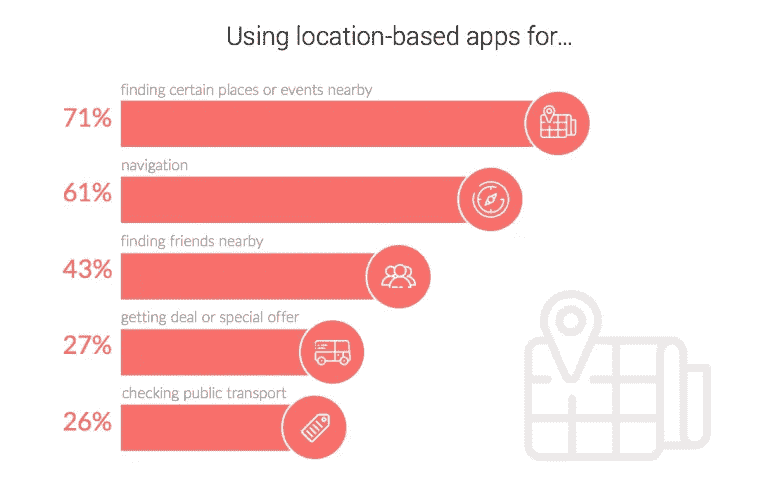
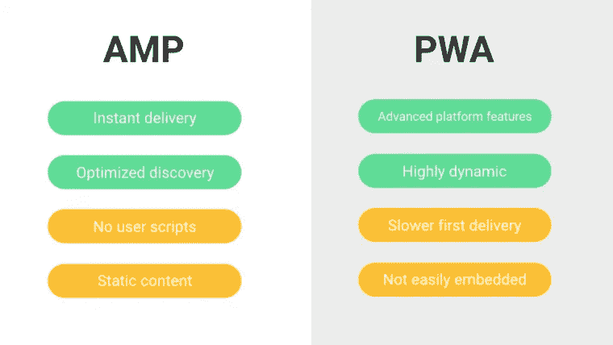

# 2017 年值得关注的 9 大移动应用发展趋势

> 原文：<https://medium.com/hackernoon/9-mobile-app-development-trends-to-watch-in-2017-cb5bacc8c5f>

[https://unsplash.com/@anckor](https://unsplash.com/@anckor)

## 2017 年已经过去一半，我们认为这是分析主要移动应用程序发展趋势的好时机。

我们注意到我们的客户对开发创新的移动应用越来越感兴趣。

我们还希望关注塑造移动领域的最新技术趋势、流行的编程语言或重要的安全更新。

现在，我们想在本文中与您分享这些趋势。

# 2017 年你需要关注的科技相关移动应用发展趋势

我们正在报道移动应用程序开发趋势的技术方面，因为它塑造了应用程序的构建方式，无论是消息传递、旅游还是购物应用程序。

事不宜迟，让我们来看看 2017 年对移动应用开发至关重要的 9 大趋势:

# 1.更多 AR 应用

随着 Pokemon Go 等游戏或 Snapchat 和 Instagram 等消息应用程序中的 AR 滤镜取得不可否认的成功，我们已经看到了增强现实应用程序可能会有多受欢迎。

这一趋势将会增长，因为更多的企业将尝试实现 AR 来展示他们的产品。

如何将 AR 和零售结合在一起的一个例子是苹果和宜家在[的联合努力，创建一个应用程序，帮助在买家的房子里展示宜家的家具。它将使用苹果的 ARKit，新产品将首先通过应用程序提供。](https://9to5mac.com/2017/06/19/ios-11-apple-ar-augmented-reality-ikea-app/)

如果这款应用被证明是成功的，其他各行各业的制造商将会跟进。

# 2.人工智能将改变科技

人工智能的进步改变了我们与移动应用程序交互的方式。像 Siri、Cortana 和谷歌助手这样的虚拟助手现在可以帮助我们收集信息、组织我们的日程或优化我们的生产力。

自然语言处理和机器学习的发展使虚拟助手更具上下文意识，使他们的反应更好、更准确。根据 Venture Scanning 的数据，机器学习是基于人工智能的风险投资中获得资金最多的一类，达到了 1.5 亿美元。与此同时，脸书、微软、谷歌和亚马逊等大公司投资于基于机器学习的解决方案，以创建更好的对话界面。

去年，我们看到了像 Prisma 这样的移动应用程序，它们使用神经网络和人工智能来创建其他人认为简单的过滤器可以做到的事情。效果是惊人的，我们可以期待其他应用程序开发人员尝试类似的解决方案。

> 你想为你的企业建立一个移动应用程序吗？[给我们写封短信](http://apptension.com/contact)，让我们来写代码吧！

# 3.安全性仍然是开发人员最关心的问题

2017 年，移动应用安全是最重要的趋势之一。

行业的普遍增长、数十亿用户、第三方 SDK 和公司存储的大量用户数据使得安全性成为移动应用程序开发人员最关心的问题。

我们已经看到 Telegram 等加密消息应用的增长趋势，保护用户隐私的移动浏览器以及保护用户数据的行业转变，包括苹果的应用传输安全(ATS)和谷歌提高应用权限的努力。同时，两家公司都为他们的操作系统提供了自动安全更新。

我们肯定会在 2017 年看到移动安全方面的更多改进，特别是在移动支付、数据加密和隐私保护方面。

# 4.基于位置的应用

随着基于位置的服务(LBS)改变用户与企业的互动方式，基于位置的应用将会扩大。

位置智能的创新和跟踪用户访问过的地方的能力，帮助营销人员和出版商更好地瞄准他们的客户，提供相关的广告。我们将看到基于 LBS 的应用程序的[增长，特别是在旅游和旅行、导航、安全功能、零售优惠、特定位置支付门户和室内地图方面。](http://www.business2community.com/mobile-apps/2017-mobile-app-market-statistics-trends-analysis-01750346#zudd4EqdIJlp1tfu.99)

*我们用基于位置的应用程序做什么？来源:App 解决方案*

借助易于获得的 API 和谷歌地图技术，移动应用程序开发人员现在比以往任何时候都更容易为用户创建基于位置的解决方案。

# 5.Android: Kotlin vs Java

Kotlin 已经成为 Android 开发者对 Java 的替代，类似于 iOS 上的 Swift 和 Objective-C。它越来越受欢迎，并成功用于商业项目，这使得 2017 年成为 Kotlin 最终以更大规模起飞的一年。

这样做的原因是易于使用。

[对于 Java 开发人员和 C#开发人员来说，学习 Kotlin 非常容易，因为这两种语言有一些相似之处。开发人员也可以在一个项目中使用 Kotlin 和 Java，因为它们可以顺畅地协同工作。他们也可以在 Android Studio 上使用它，Android Studio 是 IntelliJ 的一个工具。](https://hackernoon.com/tagged/learning)

它还有助于避免一些 Java 陷阱，比如空引用，这提高了产品的质量。

这就是 Kotlin 被命名为[“类固醇上的 Java”](https://techbeacon.com/6-code-framework-trends-you-should-follow-2017)的原因，我们将会看到更多的 Android 应用使用它。

# 6.iOS: Swift 将继续增长

Swift 越来越受欢迎的趋势不会在 2017 年停止，因为它被认为是一种强大而简单易学的移动编程语言。

凭借其简洁的语法和清晰的文档，Swift 被认为比 Objective-C 更流畅。

而且就像 Kotlin 和 Java 一样，Swift 和 Objective-C 可以在相同的项目中使用，完全访问 Objective-C API。

Swift 今年可能不会接管 Objective-C，但我们会发现越来越多的 iOS 应用基于它。

# 7.加速移动页面

加载速度对于移动用户来说仍然是一个至关重要的因素。

为了改善它，谷歌推出了加速移动页面。这是一个开源项目，旨在改善移动浏览体验。你可以很容易地识别基于 AMP 的网站搜索谷歌手机，因为他们是这样标记的。

网络开发商、企业和出版商将需要考虑这一解决方案，因为它不仅改善了用户在移动设备上的体验，而且也是一个 SEO 因素(AMP 网站在谷歌中排名更高)。

同时，开发和维护 AMP 比构建本地或混合移动应用程序更便宜。

*AMP 和 PWA 比较。来源:粉碎杂志*

# 8.渐进式网络应用

渐进式网络应用程序(PWA)被称为下一代移动网络应用程序。他们不受移动网站的限制，如速度慢和需要持续的互联网连接。

PWAs 带来了一种类似本机的感觉，包括离线和全屏模式，主屏幕启动器，访问摄像头和推送通知。此外，它们比移动网站速度更快，消耗的数据更少。

渐进式 Web Apps 不需要下载安装，这是解决移动碎片化和多操作系统的答案。

一些公司，如《金融时报》,已经放弃了原生应用程序，转而支持 PWAs，而 Twitter 等其他公司为自己的原生应用程序推出了一种更轻便、更先进的替代产品(如 Twitter Lite)。随着像 Flipboard、全球速卖通或 Telegram 这样的流行应用程序的不断增加，我们可以期待向 PWAs 的转变。

# 9.Android 即时应用

考虑到应用程序商店中的大量移动应用程序，谷歌意识到用户出于不同目的不时下载和更新新应用程序是多么令人生畏。

这就是为什么该公司推出了 Android 即时应用程序，并在今年的谷歌 I/O 开发者大会上进行了预览。

使用 Android Instant Apps，用户可以只下载应用程序中最需要的部分，通过 URL 立即访问其余内容，从而节省设备空间。Android 即时应用程序与谷歌的渐进式网络应用程序同时开发。

[据谷歌](https://www.digitaltrends.com/android/android-instant-apps/)报道，已经有 50 个即时应用程序被开发出来，开发者可以很容易地将他们的原生应用程序转换成即时应用程序，而不需要建立一个单独的应用程序。

# 结论

这些趋势无疑塑造了今天的移动网站和应用程序。

无论你是想创建下一个聊天应用程序、照片共享平台还是拼车服务，这些趋势中的许多都适用于你。

> **你想为自己的企业打造一款移动应用吗？** [**给我们一行**](http://apptension.com/contact) **让我们来做代码！**

*关于移动趋势，你还有什么要分享的吗？请随时给我们留下评论！*

*原载于 2017 年 7 月 27 日 blog.apptension.com***。**