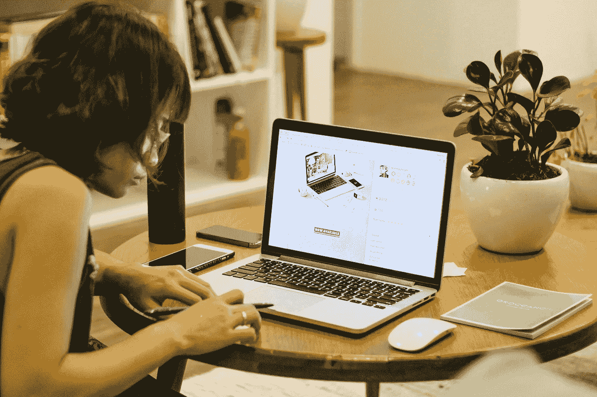

# 在工作中培养天才的 9 个步骤

> 原文：<https://medium.com/hackernoon/9-steps-to-cultivating-genius-in-your-work-550b106d95f3>

**[Image: Unplash user** [**Tran Mau Tri Tam**](https://unsplash.com/@tranmautritam)**]**

## 在创造某种东西的过程中，无论是一项业务、一个应用程序、一本书还是一件艺术品，我们都把只能来自我们自己的东西带到了这个世界。

在“[《艺术之战》](https://www.amazon.com/War-Art-Through-Creative-Battles/dp/1936891026)”[中，Steven Pressfield](http://www.fastcompany.com/person/steven-pressfield) 解释说，罗马人用“天才”这个词来表示一种神圣不可侵犯的内在精神，它守护着我们，指引我们去完成自己的使命。

“一个作家用他的天才写作；一个艺术家用她的画；每个创造的人都从这个圣礼中心运作，”他写道。"它是我们灵魂的座位，是承载我们潜在存在的容器，是我们恒星的灯塔和北极星."

那么我们如何培养自己的内在天赋呢？

## 1.从正念开始

当你成为自己行动的更好的观察者时，你自然会发展出更现实的自我意识。

例如，也许你比你表现出来的更担心那个截止日期，也许你可以对自己承认你需要和一个信任的朋友谈谈这个问题。

正念帮助我们看到我们的行为与我们对自己的印象不相关，这有助于我们更加意识到自己的内心状态。这导致对他人更多的同理心和更多的真实性。反过来，真实性培养自信和全面发展。

## 2.实践有意识的开放

生活没有食谱。所以，你不应该按照别人的公式来准备你接下来的生意，书，或者歌。

一位[地道的厨师](http://www.businessinsider.com/cooking-can-boost-your-creativity-2014-3)喜欢尝试、混搭、创造自己独特的饭菜。他们根据可用性、同伴和一天中的时间来做决定。理解食材之间的关系以及它们之间的相互作用对于做出一道成功的菜肴至关重要。

这种有意识的开放正是任何创造性过程的核心，不管是什么媒介。

## 3.故意杂食

无论是在我们的个人工作生活中，还是作为团队的一部分，身份建设的一个持续部分是练习邀请广泛的经验，一个我们可以在以后的生活中借鉴的经验库。想法只能来自经验。

获得不同的经历，需要我们有意识地成为杂食者。那么我们从哪里收集这些杂食的味道呢？

**您使用的媒体:**

吸收一系列艺术、新闻和学术知识可以帮助你获得跨领域的洞察力。如果你通常阅读商业书籍，那就去看看艺术。

**你看到的人:**

网络理论发现，一个团队的成功是由其成员所拥有的联系的质量和数量来预测的，尤其是跨学科的联系。同样，在我们的个人生活中，我们受益于培养多样化的伙伴关系。是的，一个真正的伴侣确实是一件罕见的事情，但这种珍贵是寻找他们并关心他们的部分原因。

**您参加的活动:**

找到那些伙伴关系——你的部落成员，如果你愿意的话——是困难的，因为它是肯定生命的。会议、谈话、阅读和社交聚会都是你能遇到对你的生活有影响的人的地方。

## 4.实践积极肯定

我们的情感是美妙的，因为它们使我们成为人类。情感让我们感受到激情、创造力和快乐。然而，我们的情绪也可能成为我们的败笔。情绪会阻止我们创造我们渴望的现实。

毕竟，怀疑、恐惧和不确定也是情绪。它们是破坏性的情绪，会阻碍我们实现目标。如果我们不断重复积极的肯定，但内心却充满了怀疑和恐惧，那我们就是在挫败自己的目标。我们正在收回我们发出的信息。

如果你总是专注于你没有的东西，你会继续经历更多的缺乏。如果你因为正在经历的匮乏而感到沮丧和抑郁，你将会经历更多的匮乏。

积极思考和使用肯定肯定有助于我们实现自己的愿望。

## 5.学习，忘却，再学习

作家兼未来学家[阿尔文·托夫勒](http://en.wikipedia.org/wiki/Alvin_Toffler%29)有一句名言:“21 世纪的文盲将不是那些不能读和写的人，而是那些不能学习、忘却和再学习的人。”

有一个词代表不知道:无知。

虽然这个词有负面含义——如果有人说我们无知，我们会跳出来为自己辩护——但我认为它可以是正面的。我们可以通过承认这是一个复杂的，甚至可能是不透明的世界来巧妙地无知。

从那里，我们可以学会做一个善良的无知者:在个人层面上，我们可以学会掌握我们需要的新技能。在人际和组织层面上，我们可以让自己周围的人照亮我们的各种盲点，并以鼓励扩张行为的方式对待他们。

## 6.控制有害情绪

情绪是人类的自然组成部分，控制情绪并不意味着成为机器人。但是我们如何管理我们的感受不仅影响我们自己的表现，也影响我们与他人的互动。我们都曾遇到过让你感到筋疲力尽的人。很可能你不喜欢和他们一起工作。

请记住，为了实现你的目标，你可能需要以某种形式与他人合作。如果你成为那种人，你会赶走潜在的合作者、导师、伙伴和其他人。培养一种吸引支持而不是排斥支持的态度。

同理，警惕别人可能带入你轨道的有毒情绪。这需要有意识和持续的努力。我们周围的人可以决定我们是成功还是失败，就像我们的情绪自控能力一样。

## 7.不要想当然

不管我们有多自我激励或驱动，我们的生活总是被外部力量塑造。成功的人不会想当然。他们有意识地练习感恩。

不要只是花时间去确定你感谢什么；也表达你的感谢。对他人表示欣赏，并回报他人对你的善意。毕竟，表达感激的行为不是单向的。它在几个方面改变了我们的生活:

*   这让我们更有耐心
*   它增强了我们的自信
*   它巩固了我们与他人的关系
*   它帮助我们重新思考我们的目标，并确定它们为什么重要

## 8.接受不完美

矛盾的是，只有接受不完美，我们才能最大化成功的机会。设立太高的标准会导致我们立即解雇有才能的人，忽视大的机会，并且不能为有价值的事业贡献我们的全部。换句话说，坚持追求更好的东西通常会让我们变得更糟。

正如一句古老的谚语所说，如果你把绳子拉得太紧，它就会断。如果你把它拉得太松，拨弦时它就不会发出音乐。在你开始做新的事情之前，调整你的期望。要知道，结果可能达不到你的理想，但仍可算作成功。

## 9.不要试图取悦每个人

试图取悦每个人就像试图把整个海洋装进一个杯子；不可能的。无论我们做了什么好事，无论我们变得多么优秀，那些不重视我们的计划或成就的人总会让我们知道。

在我们担心别人怎么想之前，我们需要承诺爱自己，接受自己。这听起来像是一种自助溴化物，但却有着深刻的实际重要性。如果我们对自己不满意，那种自责会渗透到我们所有的关系、工作、信仰和未来中。

通过自我接纳变得更加真实和[有三个组成部分:](http://survivetothrive.pub/)

*   自爱
*   自我表达
*   自信

正是通过自我接纳，我们发现了自己情绪的复杂性、脆弱性和不完美性。这是真正真实的基础——没有真实，我们通常无法充分发挥自己的潜力。

没有真实性，我们最终会把精力浪费在不该浪费的地方。对他人认可的需求摧毁了我们按照自己的方式取得成功的自由。当让人们喜欢我们的愿望激励着我们的个人和职业选择时，我们只会倒退。

**精选图片:未刷用户** [**陈茂三潭**](https://unsplash.com/@tranmautritam) **。**

**原创文章**[**@ business insider**](http://www.businessinsider.com/9-steps-to-cultivating-genius-in-your-work-2017-3)**。**

*连续创业者* [*费萨尔·霍克*](http://www.fastcompany.com/user/faisal-hoque) *是* [*沙多卡*](http://www.shadoka.com/) *的创始人，该公司以其加速器和解决方案，让志向引领、创新、转型。他是《万物互联:如何在创造、创新和可持续发展的时代进行变革和领导》和其他书籍的作者。免费使用* [*万物互联领导 app*](http://app.everythingconnectsthebook.com/login.php)*。*

*fais al Hoque 版权所有 2017。保留所有权利。*

> [黑客中午](http://bit.ly/Hackernoon)是黑客如何开始他们的下午。我们是 [@AMI](http://bit.ly/atAMIatAMI) 家庭的一员。我们现在[接受投稿](http://bit.ly/hackernoonsubmission)并乐意[讨论广告&赞助](mailto:partners@amipublications.com)机会。
> 
> 如果你喜欢这个故事，我们推荐你阅读我们的[最新科技故事](http://bit.ly/hackernoonlatestt)和[趋势科技故事](https://hackernoon.com/trending)。直到下一次，不要把世界的现实想当然！

