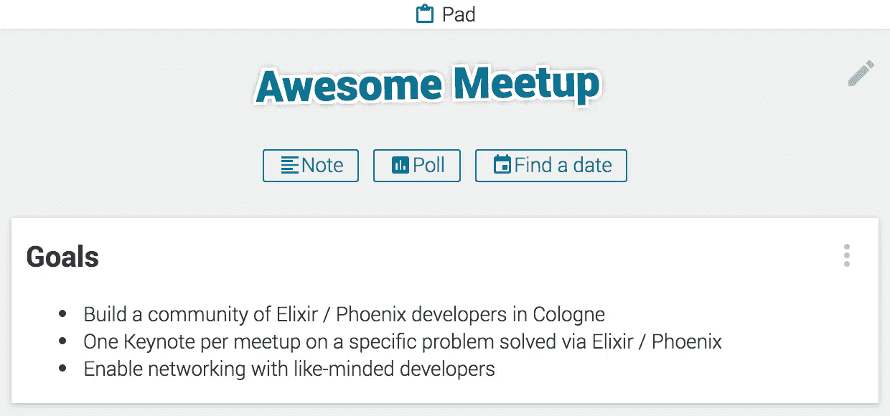
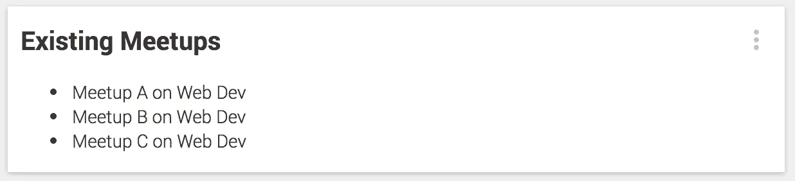
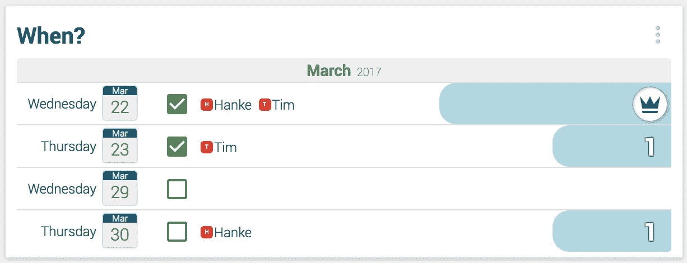
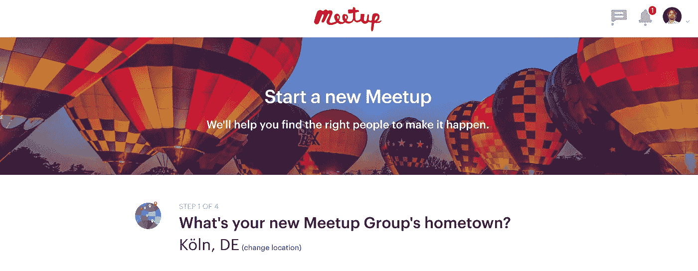
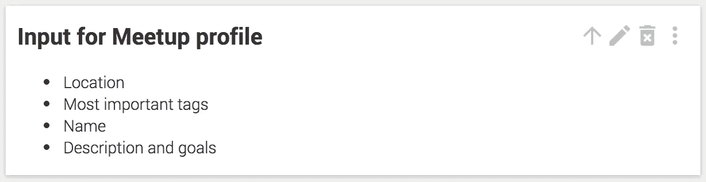
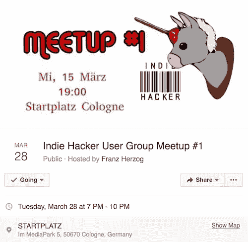
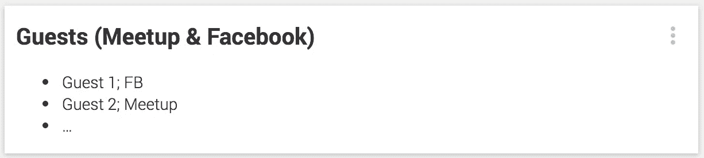
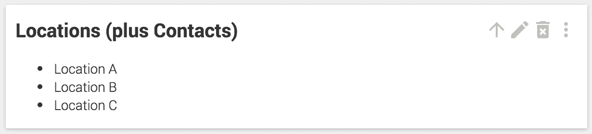

# 使用 JayPads 计划和安排聚会的 9 个步骤

> 原文：<https://medium.com/hackernoon/9-steps-to-plan-and-set-up-a-meetup-using-jaypads-a93d98b50fcd>

## 考虑围绕你关心的特定话题建立一个本地社区？这个 9 步指南让你开始行动。

聚会是一种很好的方式，可以把你的在线网络带到一个更实际的真实世界场景中，并聚集这个志同道合的社区来创造伟大的事物。组织一次聚会通常与通过群聊或电子邮件进行某种形式的计划密切相关——两者都同样痛苦。那就是我们将概述一群用户如何使用 [JayPads](https://jaypad.de/) 以一种非常有效的方式建立他们的聚会。

Planning in a group chat (yes, any group chat) is the gateway to chat hell and you know it!

1 首先，你想完成什么？讨论你的目标是什么——越具体越好。头脑风暴。为了锁定正确的目标，这是至关重要的一步。在 JayPad 中，你会使用群聊来让想法流动起来，一旦你决定了一个主题，你就在“Pad”(Jay Pad 的永久内容区，更详细的描述[在这里](https://hackernoon.com/how-planning-a-weekend-trip-with-our-buddies-changed-our-perception-of-slack-and-whatsapp-1d53058f51d0#.geyhc31ar))中写下一个笔记，并存储这些信息以便于访问，把它想象成聊天中产生的重要内容的便利贴。如果你选择“主题演讲加 Q & A”的形式:你的主题演讲将会是什么样的？谁在送货？谁管理 Q & A？对于一个小型聚会，我们建议:第一个主题演讲直接来自你，问题的管理可能不会是一个问题——只是顺其自然。

What do you want to accomplish? How are you going to go about it?

2 研究当地的聚会。浏览已经建立的社区，看看你们的目标是否互补(至少浏览 Meetup 和脸书)。你以后会用这些资料作为你自己的灵感:这些人已经完成了你要做的事情，所以你最好研究一下他们。了解他们如何接近他们的成员，他们如何宣传他们的聚会和在哪里。这可能需要重新校准您在步骤 1 中所做的工作。

Make a quick research of different meetups and try to find best practices.

3 找个对象。这就是 JayPads 的初衷，也是它的一大优势:让人们在特定的时间和地点聚在一起。只需调查团队的可用性。我们发现，与业务相关的聚会在周三或周四效果最好。

Poll the date which works best for you.

在 [Meetup](https://www.meetup.com/) 安排一次聚会——他们非常擅长向可能有兴趣参加的人提供你的活动。该社区非常活跃，响应迅速，人们定期浏览建议。这是你让事情运转起来的机会。

Setting up your meetup on Meetup is a thing of minutes.

第一步需要的输入是:

1.  **地点**。这很清楚，因为你想建立一个当地社区。
2.  **meetup 的标签**。选择正确的关键词对于 Meetup 了解你想聚集哪些人非常重要。看看你的竞赛笔记:那些家伙是如何标记他们的聚会的。Meetup 本身提供了很好的建议，并给出了有多少团体在关注这个话题的指标。
3.  **名称**。这应该很容易——但是看看你的竞争对手会帮助你更好地感受“好”和“不那么好”的名字。
4.  **更冗长的描述。**描述您的目标以及为什么有人应该加入(至少 50 个字符)。还是那句话，要具体。

头脑风暴第一点。敬 4。使用群聊并将结果存储在另一个笔记中——这很重要。去做吧。

Discuss in the group chat and store the results in a note.

如果您正在进行第 2 步。第三。如果不止两个人，考虑投票选择，得出一个民主的结果。这将节省大量的时间，JayPads 为这一步提供了一个简单的功能。

5 搞个脸书事件。是的，Meetup 是一个很棒的工具——但是脸书也提供了建立你的社区的好方法。这就是为什么你需要设置这个东西作为一个额外的脸书事件。这是没有办法的。这甚至比设置您的 Meetup 个人资料更容易，所需信息已经在第 4 步中建立。只要把所有东西粘在一起，你就是金色的。

Setting up a Facebook event does not take long — if you like: You can build a nice logo for your meetup.

6 获取初始会员。你已经有一个网络，这就是为什么你认为应该有你的超级聚会。现在是邀请他们的时候了。只需通过电子邮件向他们发送您的 Meetup 个人资料链接，或者通过脸书邀请他们(这正是脸书活动非常方便的地方)。争取至少 10 个固定承诺。我们认为这应该是一个基线，以便让彼此并不熟悉的人有一个富有成效的会议，从而为那些来过的人创造利益，使他们更有可能 a)回来，b)从他们的网络中带来你还不知道的志同道合的人。

Keep track of commitments to your meetup.

为你的聚会寻找并准备一个场地。一旦你对你要聚集的人群规模有了更好的感觉，你就可以寻找地点了。你应该随时准备好一个 10 人的房间，但你也应该制定后备计划，以防这件事不知何故爆发并传播开来。做好准备。设置职责:如果位置不好找，则制作标志，获取并检查所需设备，检查 Wifi，并在需要时张贴带有访问代码的标志。在另一个便笺中存储信息和联系人。

Prepare a note with options for your locations, contacts included, and make sure you can call them on short notice.

8 为之后的小型聚会做准备。这是至关重要的一步。你绝对需要照顾好啤酒。对一些人来说，这听起来很傻:不要低估和志同道合的人喝几杯的力量。我们对这一点非常认真，你也应该如此！联系潜在的赞助商，通过“这快乐的时光是由……带给你的”做广告是你可以提供的一个强有力的营销渠道。看在上帝的份上，带上名片——他们还在用。

Yes. This is vital for your meetup — just do it.

让这帮人团结在一起。在 Twitter、LinkedIn 和其他资源上互相关注，成为脸书的朋友。如果你想让头脑风暴继续下去，并促进社区和参与，我们已经在特定的 meetup JayPads 上获得了很好的体验(即使这只是为了让每个人都有一个中心目录来共享他的社交账户的链接)。它们是平台无关的，你可以将来自脸书的用户与通过 Meetup 或其他渠道获得的用户合并。构思、存储和分享有趣文章以及文件和图片的链接(文件上传是 JayPad 的一项功能，很快就会发布，我们目前正在 Alpha 中进行测试)非常方便，我们还不知道有哪种工具可以轻松完成这些任务。

Keep the gang together.

我们构建了一个工具，我们想称之为**“世界上最小的辅助项目管理工具”**——这是一个误导，因为 JayPads 是一个更通用的通信框架。但是我们发现并验证的是:当一小部分人想要离开地面的时候，乱穿马路的人是非常强大的。这种力量可以被利用的时间比普通的懒散爱好者可能想象的要长得多。如果你有兴趣进一步阐述这一点:[这个](https://hackernoon.com/how-jaypads-help-us-build-jaypads-c66c07c6c3ae#.vhkzkbhs8)和[这个](https://hackernoon.com/how-we-build-a-slack-competitor-by-accident-b2935dd2064d#.b375rapka)可能适合你。

> 当一小群人想从地上拿东西时，乱穿马路的人会变得非常强势。这种力量可以被利用的时间比普通的懒散爱好者可能想象的要长得多。

试一试，安排你的下一次聚会，和朋友聚会，边项目等等。通过你的第一个 [JayPad](https://jaypad.de/) 。

*如果你喜欢这篇文章——****请务必给我们一个关注这里的上媒以及*** [***推特***](https://twitter.com/TalkAboutJack) ***和*******。我们将发表关于其他用例场景的文章，以及我们对协作软件的一般看法和一个年轻创业公司的旅程。****

******

> *[黑客中午](http://bit.ly/Hackernoon)是黑客如何开始他们的下午。我们是 [@AMI](http://bit.ly/atAMIatAMI) 家庭的一员。我们现在[接受投稿](http://bit.ly/hackernoonsubmission)并乐意[讨论广告&赞助](mailto:partners@amipublications.com)机会。*
> 
> *如果你喜欢这个故事，我们推荐你阅读我们的[最新科技故事](http://bit.ly/hackernoonlatestt)和[趋势科技故事](https://hackernoon.com/trending)。直到下一次，不要把世界的现实想当然！*

**