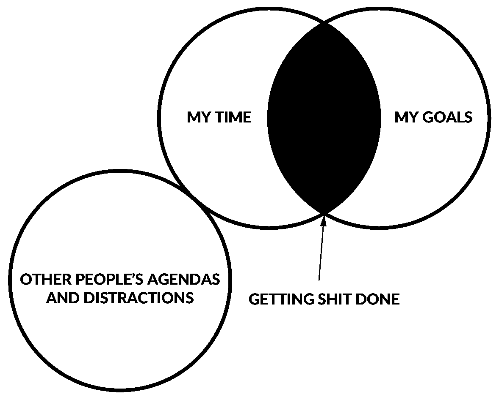

# 9 个令人惊讶的提高工作效率的方法

> 原文：<https://medium.com/hackernoon/9-surprising-productivity-hacks-improving-time-at-work-f3a8b2ceff2>

这里有几个提高效率的窍门，当我第一次看到或尝试它们时，我感到很惊讶。有些来自“每周 4 小时工作制”，夹杂着我自己作为开发人员的经历。都是用我的亲身经历审核过的:)。

## 1.减少信息输入

不要看或看新闻。尽可能少地消耗不相关的、负面的和随机的信息(如果不是为了你刚才正在做的任务)。避免看电视。没有不必要的阅读你现在不需要的内容。尤其是新闻大多与你无关。你可以一周或一个月更新一次自己最重要的事情，并且保持最新。

## 2.及时准备

不要为未来几周或几个月的事情做准备。在您需要时准备=及时消费信息。否则，您需要重新阅读一遍。大部分信息都会被遗忘，如果消费和执行差距很大的话。

## 3.不要完成它

如果某件事对你的目标没有帮助，就不要去完成它。停止阅读无聊的书、文章、博客等，如果它们不能提供有用或有趣的信息。不要因为已经开始了就去完成一件事。

## 4.只是问问

问人们具体的问题，谁经历了它，你想实现什么。不要羞于给更有名或更有成就的人打电话或发电子邮件。不是所有人都会回应，但有些人会。但是确保不要问那些你可以在两秒钟内搜索到的垃圾问题。

## 5.关闭你的电子邮件客户端，也放松一下

不要整天查看电子邮件、统计数据、分析和/或即时消息。只在一天中特定的时间段检查它们。有些数据，比如你的股票投资组合或者你的页面浏览量，甚至不必每天检查，也许每周检查就足够了。关闭您的即时消息和电子邮件应用程序或电子邮件浏览器标签。否则你会一直看着它，而不是聚焦。重点是将检查工作减少到最低限度。

## 6.定量

将类似的任务分成更大的时间段，而不是分散到一天或一周。例如，周一写所有的文章，周二做采访，周五开会，等等。这样你可以更快地完成任务，因为你的大脑已经为这个特定的任务加载了所有需要的元数据，你也节省了设置的时间。就像如果你录制播客，你只需要设置一次麦克风和其他小工具就可以录制多个会话。

## 7.设定不可能的截止日期

设定难以实现甚至不切实际的期限。这将迫使你集中精力，分清主次。否则你倾向于拖延和做小的、无用的和不重要的任务，这些任务你不需要去做来达到同样的目标。参见[帕金森定律](https://en.wikipedia.org/wiki/Parkinson%27s_law)或[琐碎定律](https://en.wikipedia.org/wiki/Law_of_triviality)。是的，那些截止日期**可以是任意的，只要它们让你受到攻击。每个人都倾向于拖延或夸大小问题。**

## 8.没有会议

避免开会和打电话。大多数情况下，他们没有必要，没有议程，没有目标，包括很多社交活动。如果你打电话或开会，那么要有明确的目的，并尽早结束。尽可能把事情写在有条理的电子邮件里。写邮件需要思考问题，不鼓励闲聊或其他浪费时间的社交活动。

## 9.关闭所有不需要的东西

关闭浏览器窗口中的所有标签，关闭所有打开的应用程序，除了那些你现在工作需要的。任务完成后，立即关闭选项卡。如果有用的话，把链接保存在某个地方。不必要打开的标签和应用程序会妨碍你运行所需的标签和应用程序。

[**像这样把更多的生产力传递到你的收件箱。**](http://eepurl.com/cEoDhn)

*——Eduard Metz ger，* [*笔记计划*](http://noteplan.co/?utm_source=medium&utm_medium=article&utm_campaign=todolistproductivitymachine) *的创建者。在这里阅读更多关于 NotePlan 的内容:*

 [## Markdown +日历+笔记？

### 日常计划

hackernoon.com](https://hackernoon.com/markdown-calendar-notes-28b87f965e5d) 

> [黑客中午](http://bit.ly/Hackernoon)是黑客如何开始他们的下午。我们是 T21 家庭的一员。我们现在[接受投稿](http://bit.ly/hackernoonsubmission)并乐意[讨论广告&赞助](mailto:partners@amipublications.com)机会。
> 
> 如果你喜欢这个故事，我们推荐你阅读我们的[最新科技故事](http://bit.ly/hackernoonlatestt)和[趋势科技故事](https://hackernoon.com/trending)。直到下一次，不要把世界的现实想当然！

