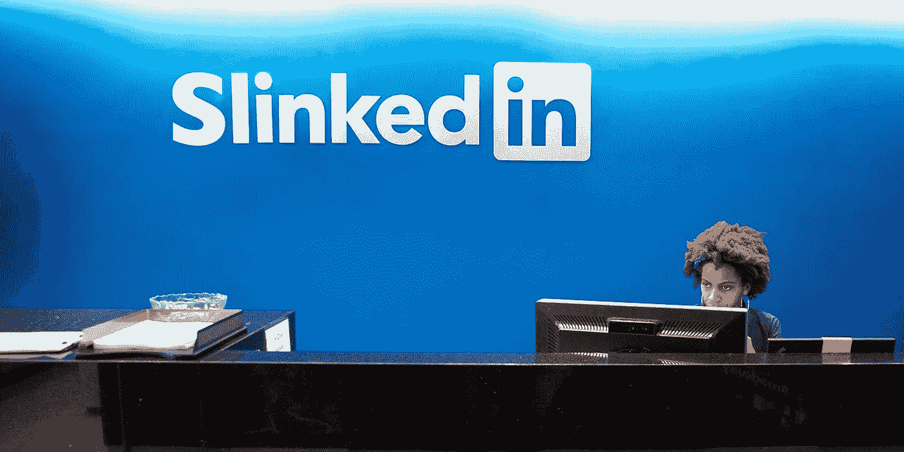
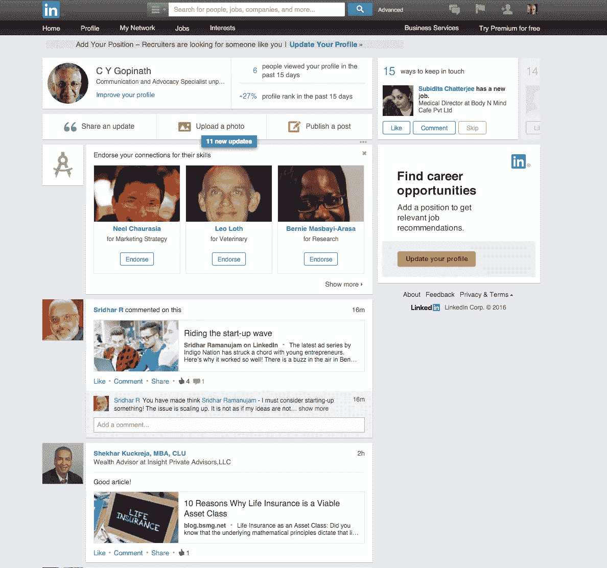
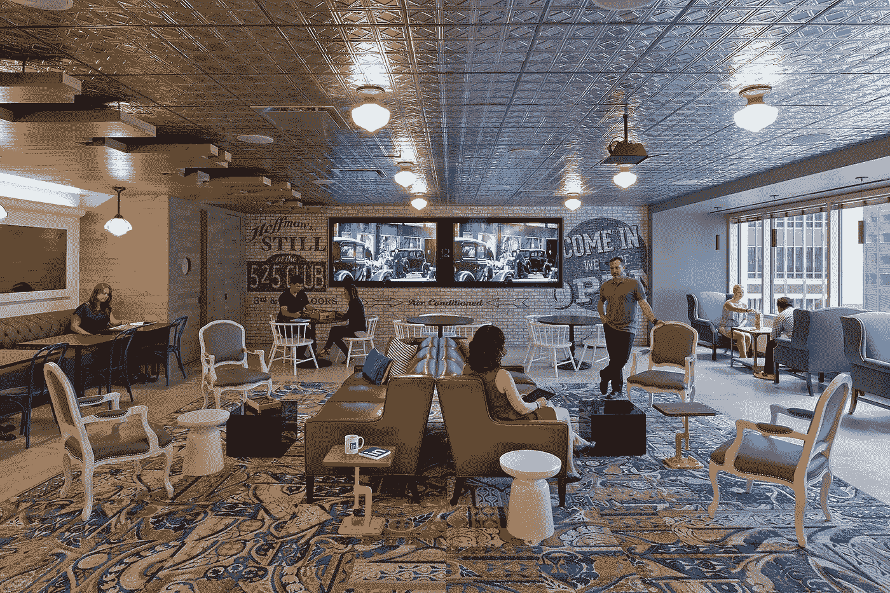

# 我最讨厌 LinkedIn 的 9 件事

> 原文：<https://medium.com/hackernoon/9-things-i-hate-about-linked-in-ca713710450e>

是不是该有人说皇帝没穿衣服了？

1 **我讨厌 LinkedIn 上有人决定我有一个纪念日**，然后告诉人们给我发祝福邮件。一年前，我失业了，开始做自由职业顾问。事情不是很好，我当然没有庆祝的心情。但整整一周，在我失去稳定收入的周年纪念日，我都收到完全陌生的人写来的热情洋溢的信。好像他们在乎似的。即使我一年前找到了第一份工作，也轮不到 LinkedIn 来决定是时候祝贺我了——这可能是一份糟糕透顶、累死累活的烂工作，薪水高得吓人，老板也是个怪物。

我讨厌陌生人给我的技能背书，他们对我一无所知，可能也不在乎。LinkedIn 告诉我的泛泛之交，我是某某方面的天才，他们很高兴地点击“背书”，我怀疑，主要是为了摆脱窗口。就像另一位出色的高级兽医官洛斯博士发誓说我是一名伟大的记者一样，几乎就像他 30 年前就认识我了，而不仅仅是过去五年。像我一样的另一位 LinkedIn 会员 John naught on 称这是一个“愚蠢的喘息”和 LinkedIn 为获得更多页面访问的廉价尝试。

3 我在我的 iPhone 上接受连接请求和回复信件——但后来不得不在我的桌面上重复所有这些，因为对 LinkedIn 来说，除非你在所有设备上完成了这些，否则“是”就不是“是”。这告诉我有一个懒惰的软件程序员，他懒得去做界面的小细节。

我讨厌徽章数量不会消失，即使你已经处理了通知。我读一封信，或者回复它，或者看到一个通知——它会显示那个红色的未读标记。

我讨厌他们的主页如此杂乱、笨重、冗长、不雅。在响应式设计的时代，少即是多，大图片和整洁的布局意味着卓越的沟通，像 LinkedIn 这样的超级富豪公司没有理由不雇佣最好的设计师和程序员，提供出色的用户体验。

T2:我讨厌他们无情地向我扔盒子，要求我把我的 Gmail 朋友带进 LinkedIn。我已经被会计师和房地产经纪人的联系请求淹没了，除了我们是“专业人士”(读*在某个地方工作*)之外，他们和我毫无共同之处。我已经拒绝添加我的联系人一百次了，但是 LinkedIn 相信如果他们长时间骚扰我，我会屈服的。不对！取而代之的是，我将退出 LinkedIn，因为我是一个如此轻率的讨厌鬼。因为—

我恨自己在成为 LinkedIn 会员的所有时间里没有从 LinkedIn 收到一件有用的东西，甚至是高级会员。不是一份工作，不是一个发自内心的让专业有所不同的推荐，也不是一个让我思考的帖子。和我交谈过的 10 个 LinkedIn 会员中有 9 个说了同样的话。虚假的支持和不真诚的祝贺，以及每天看我的人的名单，因为现在是午餐时间，他们除了 futz 没有更好的事情可做。听着，妈，我很受欢迎！他们爱我！

我讨厌在 LinkedIn 上发表博文时，以一堆赤裸裸的 HTML 代码开始。我给 LinkedIn 写了信，但他们正在午睡。我谷歌了一下，了解到有一些方法可以清理这些乱七八糟的东西，只是你需要知道 HTML 并遵循几个具体的步骤。为什么在 LinkedIn 上表现良好需要复杂的策略，而其他媒体却不需要？

我讨厌他们有如此豪华的办公室，而他们提供的服务却如此简陋，而且不注意细节。有这么大的总部，躺椅和颜色协调的餐厅座位，可调节的坐站式办公桌，以及所有这些，我想要的不仅仅是陌生人的掌声。你不会吗？

> 黑客中午是黑客如何开始他们的下午。我们是这个家庭的一员。我们现在[接受投稿](http://bit.ly/hackernoonsubmission)并乐意[讨论广告&赞助](mailto:partners@amipublications.com)机会。
> 
> 如果你喜欢这个故事，我们推荐你阅读我们的[最新科技故事](http://bit.ly/hackernoonlatestt)和[趋势科技故事](https://hackernoon.com/trending)。直到下一次，不要把世界的现实想当然！

