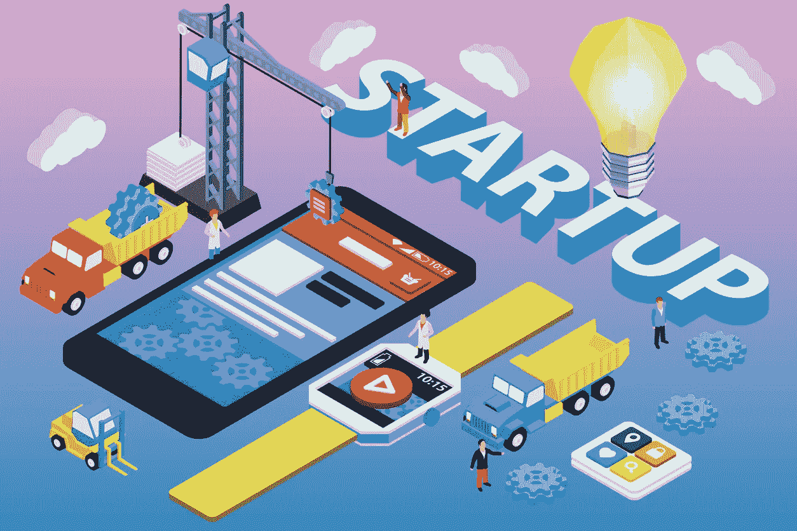
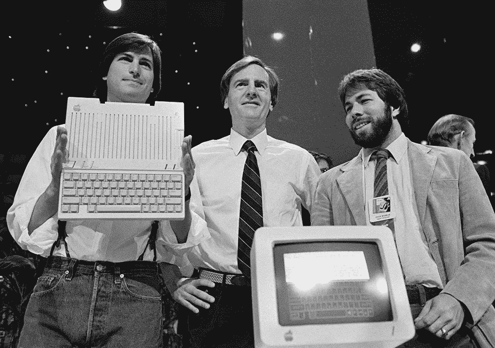
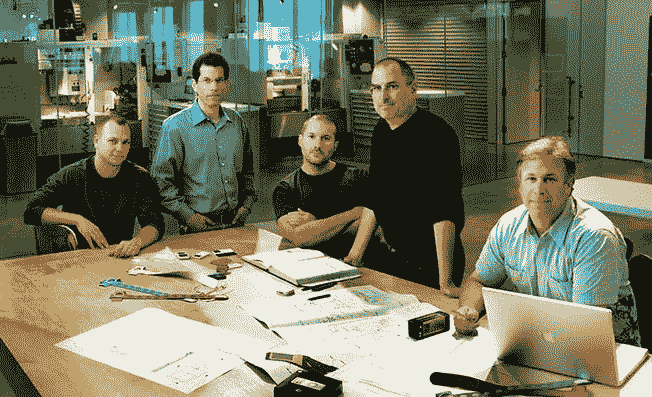
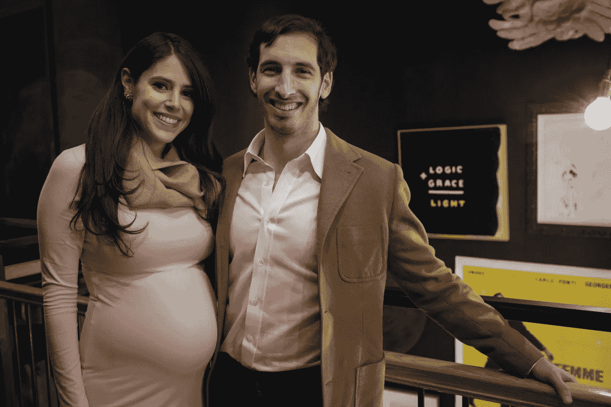
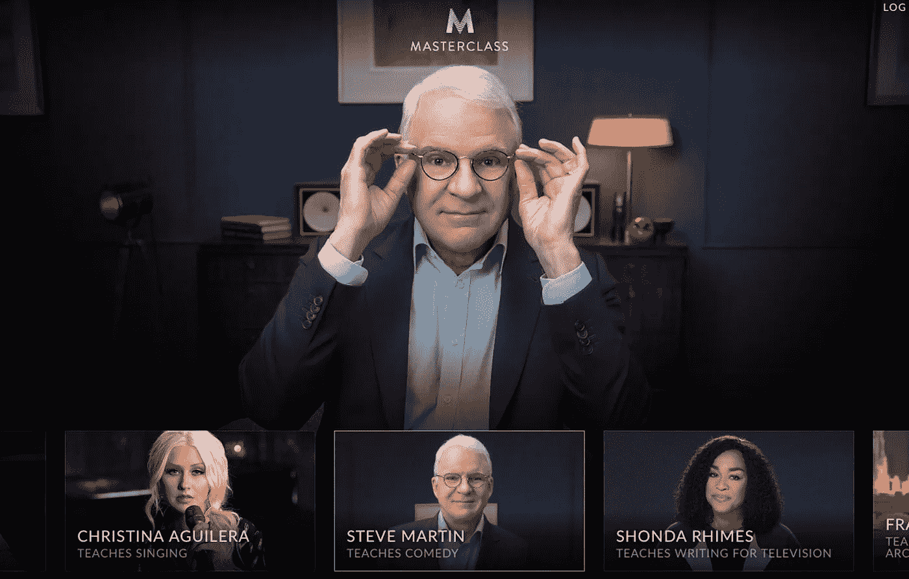
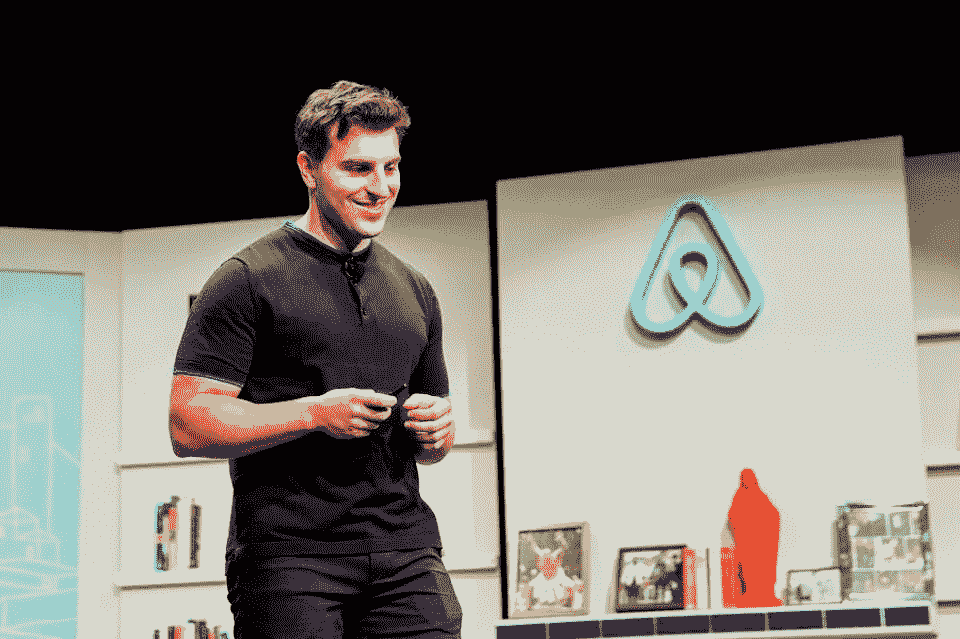
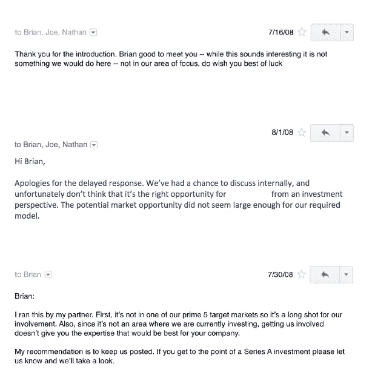
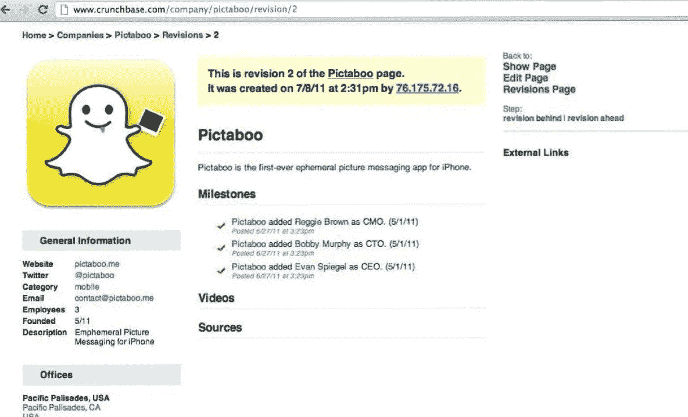
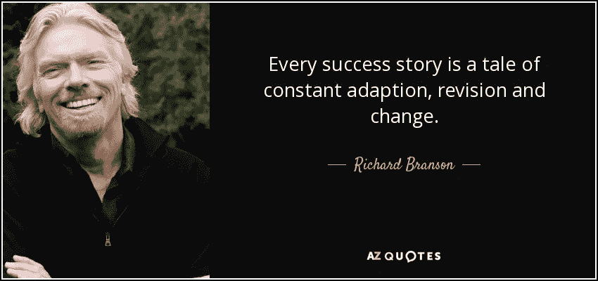
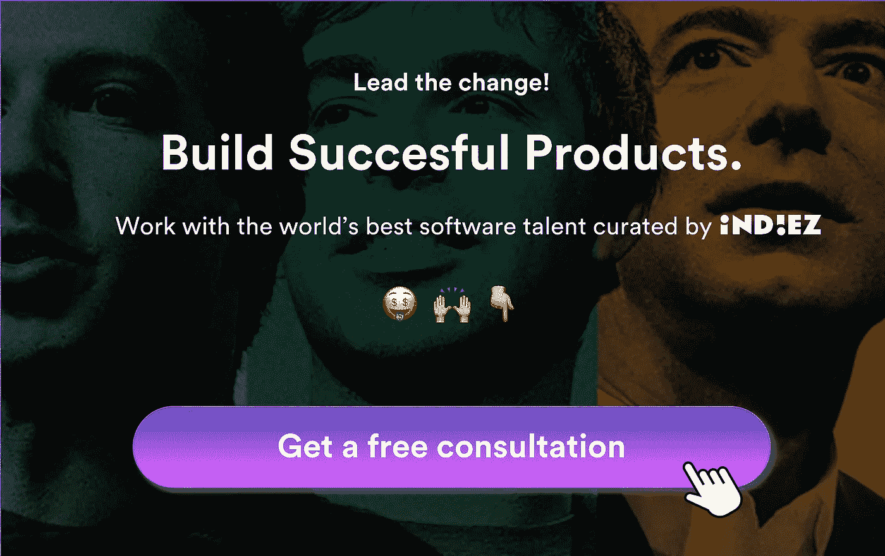

# 我从最成功的非科技创业者身上学到的 9 件事

> 原文：<https://medium.com/hackernoon/9-things-that-i-learnt-from-the-most-successful-non-tech-founders-9525efd27163>

## 提示:这与你的编码技能无关。

大多数[初创公司](https://hackernoon.com/tagged/startup)的创始人都是技术人员。为什么？

因为对于一个非技术型的创始人来说，[初创公司](https://hackernoon.com/tagged/startup)的世界似乎更难征服。

创业公司有生有死。一千个。每一天。技术或非技术人员？没关系。

很难说清楚到底是什么让一些人出乎意料地成功，而另一些人悲惨地失败。绝对不仅仅是工程方面的知识。

在 [Indiez](http://indiez.io/?utm_source=Blog&utm_medium=Medium_tag_inline_link&utm_campaign=Greatest%20traits%20of%20the%20most%20successful%20non-tech%C2%A0founders&utm_content=non_tech) ，我们与 600 多名非科技创始人进行了交流，他们与我们分享了他们的产品创意和担忧。我们一直听到他们面临的挑战。

但是，最成功的创始人不会停止。

“是什么让一个非技术型的创始人成功？”这个问题真的困扰着我，我开始阅读它。

你知道苹果、AirBnB、Snapchat 都是由非技术型创始人构想出来的吗？他们的故事鼓舞人心！

最重要的是，我注意到这真的不全是关于“技术”的。建立一个成功的创业公司需要更多的东西。

**这些是从他们的故事中学到的关键知识，对你非常有帮助—**

# 战胜对未知的恐惧

作为一名非技术型的创始人，对不了解和理解足够多的技术的恐惧是令人生畏的。为了战胜这种恐惧，这些来自成功的非科技创业者的经验将会帮助你走得更远

## 1)实验，失败，做学习机器

虽然你很可能对技术了解不够，但是记住即使是最优秀的人也是通过实践、失败和学习来学习的。

史蒂夫·乔布斯的妻子劳伦·鲍威尔称他为“学习机器”他从很多方面学到了东西，但最重要的是，他决心从他在技术上的每一次失败中吸取教训。

> 苹果第二代电脑是苹果第一个也是第一个 10 年里唯一成功的产品，它是许多此类失败实验的结果。

## 2)让你周围都是一流的球员，并向他们学习

史蒂夫·乔布斯决定让自己周围都是不仅工作能力超强，而且敢于挑战他的优秀员工。当乔布斯 1996 年回到苹果时，他建立了一个一流的团队。

> 乔布斯在技术方面变得完全可教，向他人学习，以便应用和掌握技术和商业法则。

这种好奇心和学习意愿成为了苹果公司建立的基础。

## 3)明白永远不是“技术第一”

技术只是解决问题的手段。使用产品的“人”才是最重要的。苹果从第一天起就考虑到了这一点。正是因为这个原因，它是有史以来最成功的科技公司之一。

极客工程师被他们所掌握的[技术](https://hackernoon.com/tagged/technology)弄得眼花缭乱，并且经常创造一些东西，因为他们可以。但苹果的做法却截然不同。

> **创造苹果产品的工程师实际上是为自己制造产品。而乔布斯在世时就是苹果产品的首席“用户”。**

苹果的所有产品都是基于这样一个事实:乔布斯代表了真正的消费者。他的工程师在设计产品时不得不面对这一点。”—行业专家蒂姆·巴加林

# 爱上这个问题

最成功的非科技创业者不是想出一个惊人的产品创意，并尽最大努力将其变为现实，而是痴迷于一个问题。他们没有锁定任何一个解决方案，而是不断迭代，直到找到解决问题的最佳方法。

## 4)从自己比较了解的问题入手

黛博拉和杰克·安德森-比亚利斯是一对来自旧金山的已婚夫妇，他们正期待着他们的第一个孩子，他们发现找到合适的医生的经历“完全是地狱。”

他们决定致力于帮助其他夫妇做出更明智的选择。最终，他们辞去了日常工作，通过自己的创业公司 [FertilityIQ](https://www.fertilityiq.com/) 帮助那些面临生育挑战的人找到合适的供应商。

因为他们非常了解这个问题，所以他们能够精心设计一个解决方案。

> 我们觉得没有好的信息，也没有好的数据。这在很大程度上是我们为解决自身问题而打造的产品。—黛博拉

看看你在生活中经历的问题，通过你的技能和知识可以解决的问题，这是一个很好的起点。休息随之而来。

## 5)找到好 10 倍的解决方案

如果你正在解决一个已经被很多人解决的问题，你成功的唯一方法就是创新，让你的解决方案大大超越现有的解决方案。

大师班就是一个很好的例子。在线课程已经存在很多年了，但是他们所建立的是一个*10 倍的更好的解决方案* — **向业内顶尖人士学习。**

这在以前是不可能的。

> “我们决定，我们的使命是打造我们希望在成长过程中拥有的那种班级——由世界上最好的老师讲授引人入胜、引人入胜的课程的班级。”—大卫

## 6)无技术起步

“美元剃须俱乐部”是在没有技术的情况下创业的最好例子之一。首席执行官迈克尔杜宾承诺一个更好的价格点:每月 1 美元，他们将发送一个高质量的剃须刀。他制作了一个粗糙而愚蠢的[病毒视频](https://www.youtube.com/watch?v=ZUG9qYTJMsI)来支持发布会，该视频获得了 1900 万次观看。

> **这个视频让他们在 2012 年从洛杉矶的一位天使那里获得了 10 万美元的天使轮融资。**

以创新的方式解决一个引人注目的问题才是最重要的。你并不总是需要技术来建立一个原型，并测试你的想法在市场上是如何被接受的。有时候，像视频这样简单的东西也能起作用！

尽一切努力在没有技术的情况下建立一个原型，与用户、投资者、产品专家和有技术专长的人交谈。让他们对你的想法感兴趣。只有这样，投资于构建实际的产品。

# “要有必胜的态度”

如果你不了解你应该了解的技术，那也没关系。对于一个成功的创始人来说，还有其他一些极其重要的特质。如果你掌握了这些，它们对你的成功起着巨大的作用。

## 7)有韧性，坚持不懈

作为一名创始人，最重要的一件事就是不要放弃。在一个失败的产品后你不会停止。或者没人愿意投资你的想法。无论发生什么，你都应该有能力回到游戏中来。

这方面最鼓舞人心的例子之一是 AirBnB 的创始人 Brian Chesky 发布的 [7 拒绝](/@bchesky/7-rejections-7d894cbaa084)帖子，他在其中分享了 7 位决定不投资 AirBnB 的投资者的电子邮件。

> 下次当你有一个想法被拒绝时，我希望你能想到这些邮件。—布莱恩·切斯基

## 8)分析失败并迭代产品-市场匹配

伟大的产品诞生于对失败的分析和对最初的原型做出正确的改变。要做到这一点，重要的是分析到底哪里出了问题，听取客户的反馈，做出改变并重新推出。

埃文·斯皮格尔和他的朋友鲍比·墨菲和弗兰克·布朗推出的 Snapchat 的最初原型 Picaboo 是一个失败，只吸引了大约 100 名用户。**经历了 30 多次失败，才诞生了现在被称为 Snapchat 的完美产品。消失图像的功能最初是由 Picaboo 推出的。**

> “真正使用 Picaboo 的人可能只有我妈妈。”—埃文·斯皮格尔

Snapchat 的出现不是偶然的；它有一个精心绘制的路线图，由致力于了解用户并理解他们之间关系的人创建。和失败是他们成功的重要因素。

## 9)讲述有说服力的销售故事

注意到几乎所有成功的非科技类创始人的共同点了吗——理查德·布兰森、史蒂夫·乔布斯等等？他们都是了不起的故事讲述者。

作为一名非技术型的创始人，要想成功，你需要掌握的一件事就是推销你的想法、你的愿景以及通过你的故事打动人们的能力。

最伟大的沟通者和故事讲述者都属于这两种类型。他们 ***教育、简化、激励、发动运动或点燃我们内心的火*** 。确定什么最适合你和你的企业，并努力掌握它。

> 维珍的故事——它的兴衰、机遇和挑战——是吸引人们关注其产品和服务的原因，也是吸引员工加入维珍大家庭的原因。**没有我们的故事，我们什么也不是。**”—理查德·布兰森

现在出去吧。大胆尝试，大胆挑战。

如果你想解决一个问题，你没有理由找不到解决方案。

你建立想法的热情和信念是你所做的一切的核心。从数据中学习，继续前进。

**让我们来建造牛逼吧。🙌**

## 启动？好好做！加入 100 多位与 Indiez 一起打造成功产品的了不起的创始人。

## [在此了解更多关于我们的信息— Indiez.io](http://www.indiez.io?utm_source=Medium&utm_medium=Blog&utm_campaign=Blog)

