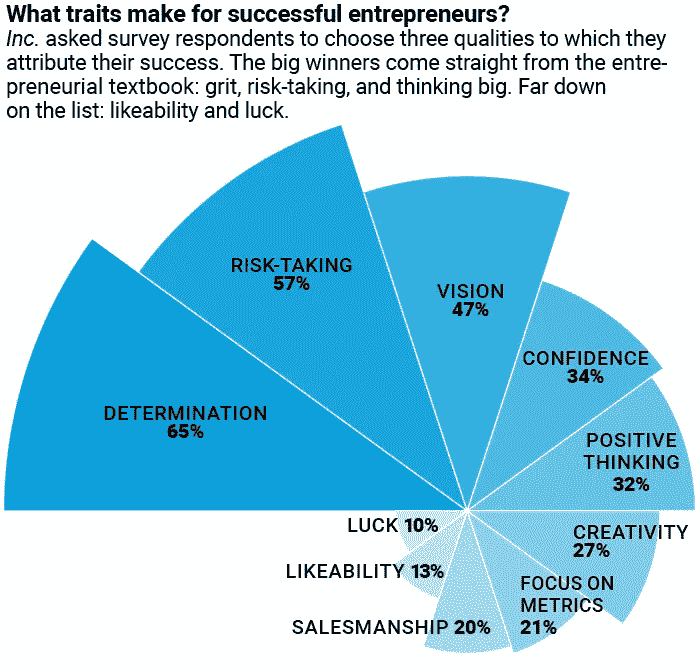

# 我从最成功的连续创业者身上学到的 9 件事

> 原文：<https://medium.com/hackernoon/9-things-that-i-learnt-from-the-most-successful-serial-entrepreneurs-6f6680e72429>

## 建立多个成功的公司需要什么？

\

*本文原载于*[*indiez . io*](https://www.indiez.io/blogs/9-things-ive-learned-from-the-most-successful-serial?utm_source=Medium&utm_medium=Content&utm_campaign=9_things_I_learned)

创建一家公司需要的不仅仅是不同的技能和网络。

虽然创业公司每天都在诞生和消亡，但很少有人能长期生存，更少有人能取得最高水平的成功。很容易看出为什么这是一场淘汰赛。

太多的人在第一次失败/挫折后就放弃了。然而，也有一些连续创业家一个接一个地建立了不止一个而是多个成功的公司。

在 Indiez，我和 100 多位连续创业者交谈过。这些企业家擅长破解建立一家成功公司的所有方面——团队、产品、增长等等。

最重要的是，他们无所畏惧，敢于冒险！即使遇到一连串的失败，他们也不放弃。

看看一些最大的例子，我们可以从一些连续创业者的旅程中学到很多东西，比如麦克斯·拉夫琴、杰克·多西、Ev Williams 等等。

在这篇博客中，我从他们的故事中总结了一些最重要的经验，我发现这些经验非常有启发性和相关性。

## 1.实验、生成数据和学习

贝宝前首席技术官、现 [Affirm](https://mixpanel.com/blog/2016/05/11/max-levchin-rethinks-consumer-finance/) 创始人马克斯·莱文(Max Levhin)坚信，“数据”有能力摧毁旧的方式，并重建新的方式。

无论是作为一名 25 岁的首席技术官在贝宝重塑如何防止欺诈，还是现在在 Affirm 为千禧一代创造一种新的消费金融，他都依赖“数据”作为每个连续制造和破坏周期的原材料。

怎么会？

在 PayPal，为了建立一个反欺诈软件，他们通过首先从欺诈中损失大量资金来生成大量数据。他称之为“交学费”。每周，PayPal 都会因欺诈损失数百万美元，而 Max 和他的团队则致力于将这些数据整合到他们的欺诈检测模型中。

同样，在 Affirm，他们每年花费 50 万美元用于高风险贷款，这些贷款可能会有负回报。这些贷款将为 Affirm 的承保算法提供丰富的数据。

> 连续创业者强烈依赖实验的力量来产生数据，他们可以从这些数据中获得深刻的见解。

## 2.不要等待太久，只是做梦

Twitter 和 Square 的创始人杰克·多西认为，真正的学习发生在你真正有东西可以玩的时候。这是所有连续创业者谈论的最大和最普遍的学习之一。

你越快做出决定，越快建立想法，越快编写代码，你就能越快回答你的问题，越快吸引人们关注你的想法。杰克还建议不要和任何人交谈——风险投资人、投资者、客户、其他你想雇佣的人——直到你有东西可以展示。

## 3.通过制造摩擦来区分

Twitter 和 Medium 的创始人 Ev Williams 从他的经验中了解到，一定量的摩擦是让你的产品与众不同的一个好方法。

例如，开始使用 Twitter 比创建一个账户更难。“如果很难理解，而你理解了，你就很酷，”伊夫说。他对 Medium 采用了同样的策略，一开始就让它成为一个只接受邀请的平台。

如果你在非常拥挤的市场中竞争，这是特别有用的。这就是为什么很多社区平台都是邀请制的。这种策略的另一个很大的优点是，它允许你用有限数量的用户慢慢测试和改进你的产品。

## 4.成为一名优秀的领导者

**Zynga 创始人马克·平卡斯**在一次采访中分享了一件很酷的事情。他说，他喜欢把所有员工都变成首席执行官。

他把白色粘纸贴在墙上，然后在其中一张纸上写下每个人的名字，并说，“到这个周末，每个人都需要写下你是谁的首席执行官，而且必须是真正有意义的东西。”

随着时间的推移，人们开始越来越多地拥有自己的工作。这带来了巨大的积极变化。就像他的接待员一样，承担越来越多的责任，最终开始管理所有的办公室运作！

这是一个很好的领导力课程——如果你给人们真正重要的工作，让他们感到害怕，他们会有更多的乐趣，他们会更快地提高自己的水平。

> **连续创业者是伟大的领导者，他们相信授权给他人**。

## 5.最好的技能是终身学习

马克·库班是白手起家的亿万富翁，也是美国广播公司热播剧《鲨鱼池》的主演，他利用业余时间钻研计算机编程和人工智能。他真的相信最大的技能是拥有这种终生学习的诀窍。

> 在一个不断变化的世界里，如果你停止学习，你就不会成功。

例如，不管你现在正在学习什么，如果你没有跟上深度学习、神经网络等的速度。，你输了！

当我们看到未来 10 年比过去 30 年有更多的技术进步时，一切都会被吹走。你需要站在一切事物的边缘才能保持领先。

## 6.尽快带来收入

你可能会在一段时间内享受正面的客户评价、媒体报道和行业奖项。如果一位炙手可热的天使投资人或风险投资公司抓住了你的机会，你甚至会变得很开心。但是，如果没有一条可行的盈利之路，你的企业将无法持续发展！

Print Syndicate 的首席执行官塔尼莎·罗宾逊(Tanisha Robinson)去年获得了 425 万美元的风险投资，为公司的扩张提供资金，但她并没有依靠这些资金来养活自己和 140 名员工。“如果资本市场崩溃，没有人能筹集到任何资金，我们还会在这里，”她说。她的公司设计新颖的服装、配饰和家居用品，在 2013 年的第一年就实现了 400 万美元的销售额！

> 归根结底，仅仅识别市场机会是不够的。你还必须**评估顾客对你想出售的产品或服务的热情，然后卖给他们**。

## 7.永远保持忙碌的心态

预算较少的公司被迫创造性地思考，努力解决问题，而不是向问题砸钱。

Egghead 教授的创始人 Shaun 和 Gary Tuch 最初花费了 75，000 多美元用于印刷和在线广告，以将他们为孩子们开设的互动科学和工程课程扩展到多个地方。但是，他们没有得到预期的回报。

有趣的是，当他们削减 75%的营销预算时，这迫使他们专注于更实惠的方式，通过 Twitter、[【脸书】](https://hackernoon.com/tagged/facebook)、YouTube 和 science、 [technolog](https://hackernoon.com/tagged/technology) y、 [engineering](https://hackernoon.com/tagged/engineering) 以及数学会议和协会来联系父母、教育者和潜在的合作伙伴。在六个月内，他们产生了足够的兴趣，开设了两个新的位置。

有时候，解决方案太简单了，我们没有发现，因为我们太专注于寻找一些花哨的东西。

> 成功的连续创业者都有奔忙的心态，无论如何都会把事情做好，即使预算有限。

## 8.对失败有正确的态度

Groupon 的首席执行官埃里克·莱夫科夫斯基经历了一系列失败，包括布兰登服装集团和 Starbelly，这些失败导致他在 2001 年濒临破产。

但是有了坚持，一系列的失败可以变成一系列的成功。后来，他创办了[inner works](http://www.inwk.com/)，这是一家成功的印刷采购公司。莱夫科夫斯基坚持认为，什么有效，什么无效，并没有什么神奇之处。他不断地工作和尝试新事物，直到最终他开发出了内部工作原理，一切都很顺利。

> 这就是连续创业者对待失败的态度。**他们把失败视为人生旅途中必不可少的一部分。对他们来说，不是输赢**。永远都是要么赢要么学。

## 9.痴迷于你正在解决的问题

虽然看起来连续创业者痴迷于建立公司，但**他们真正痴迷的是解决问题**。

马克·扎克伯格认为，当创始人推动某种社会变革时，最好的公司就会建立起来，即使只是在一个地方——而不是因为他们想赚一大笔钱或让很多人为你工作或以某种方式建立一些公司而开始。

马克·库班表示，企业家应该从一开始就专注于自己的公司，而不是寻求出售并继续前进。

> 成功的连续创业者不会创办一家公司，除非它是一种痴迷，是你绝对热爱的事情。

我们希望这对你来说是一个小小的启发。现在出去吧。大胆尝试，大胆挑战。

如果你想解决一个问题，你没有理由找不到解决方案。

你建立想法的热情和信念是你所做的一切的核心。从数据中学习，然后继续前进。

## 让我们建造令人敬畏的。🙌加入 100 多位与 Indiez 一起打造成功产品的了不起的创始人。

## [在此了解更多关于我们的信息— Indiez.io](http://www.indiez.io?utm_source=Blog&utm_medium=medium_bottom_inline_link&utm_term=serial_entrepeneurs)