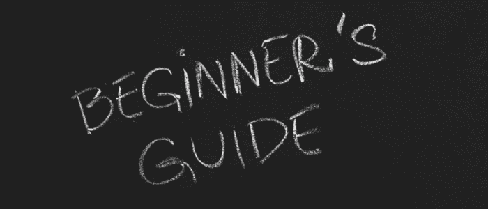
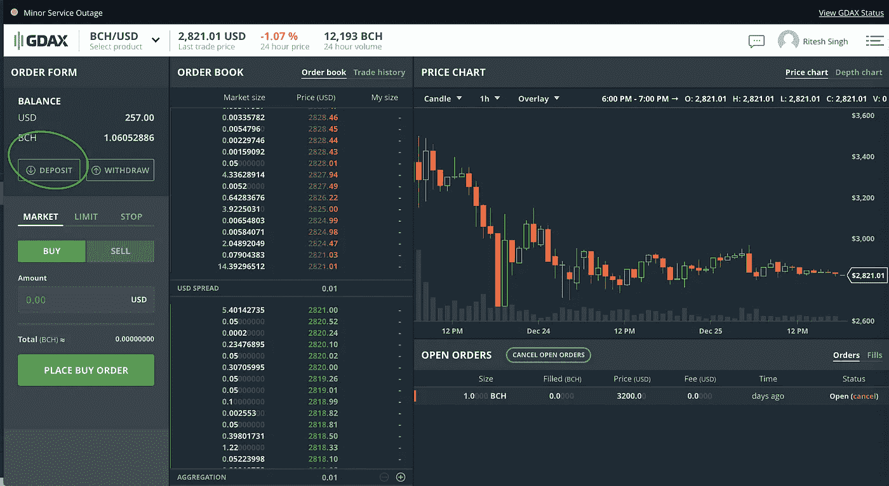
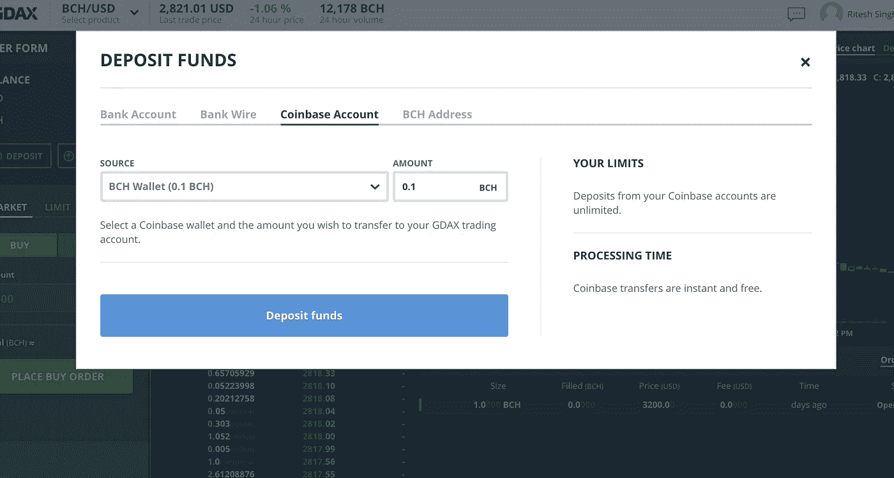
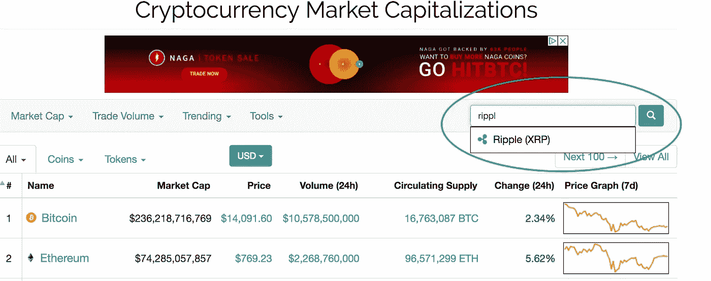
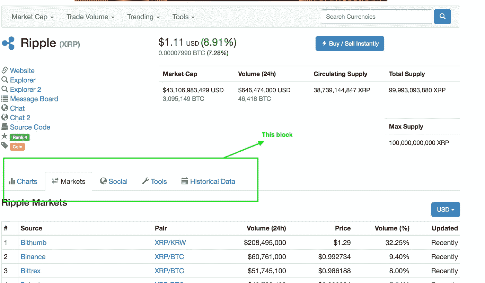
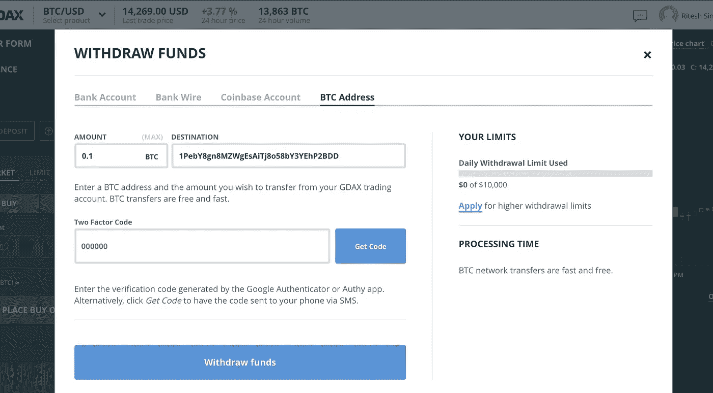
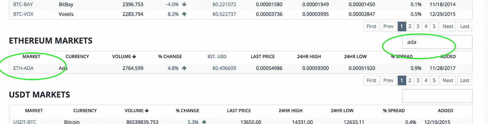
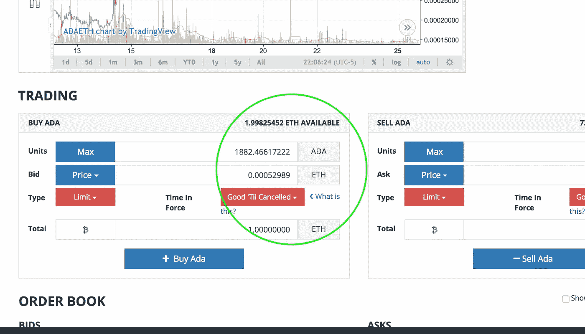
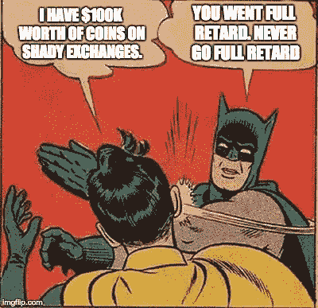
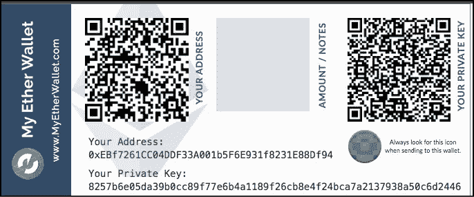

# 购买、出售和存储加密货币的 10 分钟指南！

> 原文：<https://medium.com/hackernoon/a-10-minute-guide-to-buy-sell-store-cryptocurrencies-d7d06c384998>

**Source**: [https://tinyurl.com/ydczbovq](https://tinyurl.com/ydczbovq)

学习任何东西的最好方法就是玩它——如果你是在玩你的血汗钱，那就在一定范围内玩。这篇文章试图简化新投资者(或交易者)经常遇到的自举过程。

*如果你不了解区块链或* [*加密货币*](https://hackernoon.com/tagged/crypto-currency) *的基础知识，我建议你看看我上周写的一篇* [*文章*](https://hackernoon.com/blockchain-101-only-if-you-know-nothing-b883902c59f7) *。*

作为初学者，我们面临的明显问题是:

*   买什么？
*   从哪里购买以及如何购买？
*   “如何”正确储存它们？—有点特定于加密货币。

*“买什么”？*是一个更广泛更复杂的问题，我们假设你从一个“朋友”那里知道那个答案。

本文将回答另外两个问题。即使是这些问题也很难对每个国家(法规，你知道)和每个 A-Z 硬币做出一般性的回答，但我会尽力而为。

# **如何购买&出售硬币？**

为了购买你最喜欢的加密货币，你*通常*必须先购买[比特币](https://hackernoon.com/tagged/bitcoin) (BTC)或以太坊(ETH)。

***如何购买 BTC 或 ETH？***

购买 BTC 或瑞士联邦理工学院的一个简单方法是通过[比特币基地](https://www.coinbase.com/dashboard) ( [注册](https://www.coinbase.com/join/5938fa5367df2a08ea5f7f8f))。比特币基地是一个易于使用的交易所，提供基本的功能，目前支持这些货币*——比特币、以太坊、比特币现金、莱特币。*

*虽然比特币基地在从你的备用账户转账方面简单快捷，但它收取的费用很高，而且不涉及限价单等基本功能(以指定价格或更好的价格买入或卖出)——*在加密货币这样动荡的市场中，这是一项必备功能。**

****不是比特币基地又如何？****

*使用 [**GDAX**](https://www.gdax.com/trade) —与比特币基地相同的实体，因此，相同的凭证起作用并增加了对限价&止损单的支持。**GDAX 的费用非常便宜(特别是限价单)**。GDAX 的唯一问题是它没有移动应用程序，从银行来回转移资金需要一段时间，这应该不是什么大问题。*

*哎呀，我不知道，我的硬币是在比特币基地上买的。我可以将我的资金从比特币基地转移到 GDAX 吗？*

*是的，这非常简单。*

*a.进入 GDAX，点击相应货币的“存款”——在这个例子中，我已经转移了比特币现金。*

**

*b.选择“比特币基地地址”,并选择“来源”作为各自的钱包，在本例中为“BCH 钱包”。输入您要转移的硬币数量。我正在从比特币基地转移 0.1 BCH 到 GDAX。*

**

*c.点击“存款”，你就大功告成了。您的硬币将几乎立即反映在 GDAX 帐户*中，而不收取任何费用*。*

*现在你已经找到了一种几乎不需要任何费用就可以购买比特币基地/Gdax 上所列货币的方法。*

***想买其他币——alt coins 怎么办？以下是当今世界上一些被问得最多的问题。***

*   *我如何购买 IOTA？*
*   *我如何购买 Ripple？*
*   *我如何购买边缘，卡尔达诺，尼奥，创等。等等。？*

*这些是我遵循的步骤，我发现它们非常可靠和简单。*

***步骤 1:** 转到 [Coinmarketcap](https://coinmarketcap.com/)*

***第二步:**搜索你感兴趣的加密货币*

**

***第三步:**访问页面，查看底部包含“图表”、“市场”、“工具”等的部分。*

**

*如果你想买一枚硬币，所有这些标签都很重要(包括左上角的链接)，但“市场”是告诉你在哪里可以买到这枚硬币的标签。它们都是交易所，根据硬币的范围/口径，它们被列入“n”个不同的交易所。我交易过的有——[Bittrex](https://bittrex.com/)、[币安](https://www.binance.com/)和 [HitBtc](https://hitbtc.com/) 。*

*大多数硬币都可以在这些交易所找到。如果没有，您可以找到您的硬币所在的交易所，并在那里创建您的帐户。*

***第四步:**现在把你的比特币(或者 ETH，如果交易所允许的话)转移到你的比特币上市的交易所。*

*a.举个例子，去 Bittrex，点击“钱包”。*

*b.搜索您要转移的硬币，然后单击左侧的“+”号。*

**

*c.它会打开一个顶部有地址的盒子。使用该地址从您的 Gdax 帐户存入硬币——点击“取款”并提供地址。*

**

*d.一段时间后，您的 Bittrex 帐户中将会显示金额。*

*e.不用说，第一时间转少量。*

***第五步:**从交易所**购买硬币。***

*a.点击左上角的“Bittrex”。*

*b.根据你从 Gdax 转来的东西，去“以太坊市场”或者“比特币市场”。*

*c.选择你想买的硬币——在这张图片中，我正在以太坊购买 Cardano。*

**

*d.在最后的登录页面上，将您准备支付的每枚硬币的限价和基本细节放在一起。如你所见，转换是基于瑞士法郎而不是美元。这是大多数不直接交易法定货币的交易所的正常情况。*

**

*好了，你已经买完硬币了。很简单，对吧？*

*的确如此。人们大多会迷失在寻找交换的过程中，这是一个简单的过程，然后是交换的界面，但一旦你习惯了几次交换，一切都是一样的。*

*哦，我没说出售的事。但这与购买过程相同，只是方向相反。*

*   *你在你购买的交易所出售你的代用币。*
*   *你可以在交易所买到瑞士联邦理工学院或者 BTC。*
*   *您将您的 BTC 或 ETH 转移到您的 GDAX 帐户。*
*   *你卖掉你的 BTC/ETH，把法定货币寄到你的银行账户。*

# *安全性——如何存放硬币？*

> *“唯一真正安全的系统是关闭电源，浇铸在一块混凝土中，密封在一个有武装警卫的铅衬房间里。”*
> 
> **–吉恩·斯帕福德**

*既然你知道了如何交易加密货币，那么最重要的方面来了——储存它们。*

*这是一个初学者指南，这就是为什么我们将只涵盖安全的基本方面。*

*那么，*“加密货币存放在哪里？”***——装在钱包里。***

*这是否意味着我们的货币在钱包里？*

*不，硬币不放在钱包里，这是人们最大的误解之一。*

*硬币存放在区块链，我们所有的钱都在那里。*

*那么，*“钱包是干什么用的？”**

*您的钱包存储秘密(或私人)密钥和您的公共地址，以安全地与区块链交互。如果你没有你的“私人”密钥，尽管钱可以在区块链上使用，但是没有办法访问它们——这就像忘记你的密码而没有“忘记密码？”选项。*

*这是加密投资世界中最大的威胁——丢失你的私人密钥。*

*那么，“*你怎么会丢失你的私钥呢？”**

*好吧，要失去它，你必须拥有它——是的，没有多少人随身携带他们的私人钥匙。如果你把你的比特币或以太币放在 GDAX/比特币基地，你就永远无法获得你的私人密钥。使用 Bittrex、币安或任何其他交易所的情况也是如此。如果你的硬币留在交易所，相应的交易所保存你的私钥，他们有责任确保你的数据安全——听起来很简单，对吧？安全很难，保护数百万个账户更难。如果黑客设法让[破坏交易所的安全](https://www.coindesk.com/hacks-scams-attacks-blockchains-biggest-2017-disasters/)，很多人会失去他们的血汗钱。*

**

*有许多其他方式可以在不危及交易所安全的情况下危及我们的账户。*

*那么，如何安全地保存您的私钥呢？有不同的方法将它们存放在你自己的钱包里:*

*   ***软件钱包** —私钥存储在你的电脑(桌面钱包)、手机(移动钱包)或第三方服务(在线或云钱包)上，你可以在任何需要的时候使用。*
*   ***硬件钱包** —这些钱包不同于软件钱包，因为密钥存储在一个单独的设备中，除非你必须进行交易，否则它们实际上与互联网断开连接。*
*   ***纸质钱包** —存储加密货币的最佳方式之一是使用纸质钱包。简单地说，你在一张纸上写下你的公钥和私钥，并保证这张纸的安全——很明显。*

*让我们用你可以使用的参考来涵盖一些基本概念。*

## *软件钱包*

*第三方软件钱包更容易设置，但它们有一个固有的问题，那就是你的密钥被别人保存了。桌面钱包属于这一类，因为它们大多是离线的，只要你的电脑没有被黑客攻击，它们就相当安全。所以，让我们来讨论一下桌面钱包。*

*[Exodus](http://www.exodus.io/) 是一个非常新的，但是易于使用和设置的桌面软件钱包，你可以下载到你的电脑上。它的备份不仅包括您的密码，还包括自动生成的密码。Exodus 还与 Shapeshift.io 整合在一起，以防你想交易一些加密货币。*

*无论你使用哪种钱包，总是建议备份你的钥匙，并且有一个简单易行的指南，用于 [**备份&恢复**](http://support.exodus.io/category/15-backup-restore) 以备外出。*

## ***硬件钱包***

*如果你定期交易，并且愿意花~ 100 美元，这可能是存储你的账户私钥的最好方法之一。*

*硬件钱包可以兼容几种网络界面或应用程序，并且可以支持一堆硬币。虽然密钥存储在硬件设备中，但进行交易很容易。您只需将您的设备插入任何支持互联网的设备，输入您的 pin 码并执行交易—确认通过硬件设备进行管理。*

*市场上有一些好产品，但[莱杰纳米 S](https://www.ledgerwallet.com/products/ledger-nano-s) 是我个人最喜欢的。*

*如果你决定购买莱杰 Nano S，请按照[网站上的说明](https://www.ledgerwallet.com/start/ledger-nano-s)进行设置。*

*以下是一些需要记住的小而重要的事情:*

*   *从授权网站订购。*
*   *收到设备后，请务必重置设备。*
*   *备份—在两个(或更多)物理位置保留种子的副本，即 n 字表，以恢复数据。*

**可以用硬件钱包存储 Altcoins(比特币以外的其他币)吗？**

*是的，一堆。只要他们遵循以太坊合约( [ERC20 兼容](https://en.wikipedia.org/wiki/ERC20))，你就可以使用 [MyEtherWallet](https://ledger.zendesk.com/hc/en-us/articles/115005200009-How-to-use-MyEtherWallet-with-Ledger) 通过 Ledger Nano S 来交易替代硬币，此外，Ledger Nano S 通过一个更干净的接口为一堆硬币提供了[原生支持](https://ledger.zendesk.com/hc/en-us/articles/115005304449-Which-altcoins-and-tokens-are-supported-by-the-Ledger-products-)。*

**我的钱包不支持硬币怎么办？**

*像 IOTA 这样的一些硬币有着根本的区别，它们在许多钱包上都不被支持。各个硬币通常都有一种方式[如何安全地储存](https://iota.guide/seed/how-to-set-up-cold-storage/)这些硬币。*

## *纸质钱包*

*纸质钱包可能是储存加密硬币最安全、最老派的方式。如果你打算长期投资，并且不打算进行大量交易，我建议你选择纸质钱包——否则，硬件钱包更合适。*

*纸质钱包中的私钥保存在一张没有连接到互联网的纸上(假设你没有使用额外的软件来使它们成为桌面钱包)。但是任何人都可以阅读和复制这些信息，如果他们设法找到那张纸的话。硬件钱包甚至不会把那把钥匙给你——尽管硬件钱包有一个种子，可以以类似的方式受到损害。*

**如何打造纸质钱包？**

*我们使用像 [WalletGenerator](https://walletgenerator.net/) 或 [MyEtherWallet](https://www.myetherwallet.com/) 这样的在线工具来首次生成密钥并永久保存。我们只在交易时使用它们。*

*如果你打算拥有一个纸质钱包的话，blockgeeks 上有一个非常好的[分步指南。](https://blockgeeks.com/guides/paper-wallet-guide/)*

**

*Sample Paper Wallet for ETH*

## *….如果把你的硬币放在交易所里*

*这不是推荐选项，但如果你刚刚开始，你可能会懒得设置自己的钱包或购买硬件钱包。*

*即使有一个好的交换，这些是必须记住的事情:*

*   *每次交换使用不同的密码。*
*   *使用 [Google Authenticator](https://play.google.com/store/apps/details?id=com.google.android.apps.authenticator2&hl=en) 应用程序进行双因素认证—不要使用基于[文本消息](https://www.wired.com/2016/06/hey-stop-using-texts-two-factor-authentication/)的双因素认证。*

*希望这些细节能帮助你迈出小步，让 2018 年成为一个伟大的投资年。*

*新年快乐！*

**还有疑问？欢迎留言，我会尽力回答你的问题！**

> ***免责声明**:本帖纯属教育性质，观点为本人所有。请不要将此作为专业投资建议。*