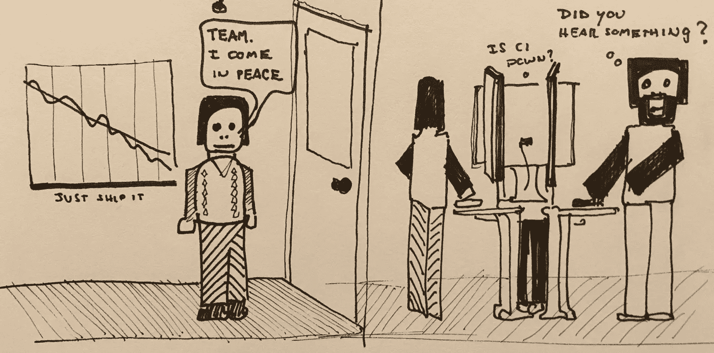
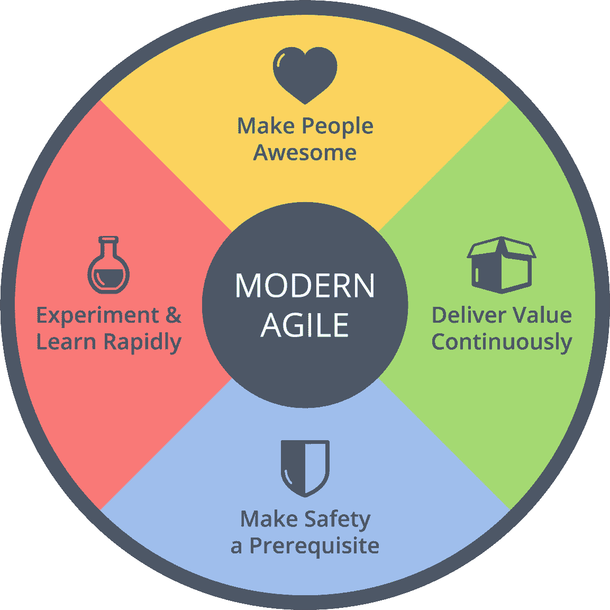

# 恢复产品经理的 12 步计划

> 原文：<https://medium.com/hackernoon/a-12-step-program-for-recovering-product-managers-cd02fb2b6709>

我经常听到产品经理想要打破[功能工厂](https://hackernoon.com/12-signs-youre-working-in-a-feature-factory-44a5b938d6a2#.cyaqivj9x)的恶性循环。你知道这对你的团队和你的客户来说是错误的，但你无法挣脱。有时你会质疑产品管理是否是一个合适的职业。

相信我。我去过那里。有希望，一切从你开始！是时候重申你对自己职业的承诺了。

更新(2016 年 12 月 16 日):我录制了一个 45 分钟的视频，讲述了这 12 个要点，并在下面添加了每个要点的快捷方式。我的建议是…在开始看视频之前，先读一读。

1.  **我将**接受我自己的[易错性](/@johnpcutler/40-lies-pms-tell-themselves-20be00570dc#.7ofz5sevq)，以及认知偏见对我决策的影响力( [2:35](https://youtu.be/1sej105qY1E?t=155) )
2.  **我将**努力赢得团队的信任，并致力于创造一个有利于冒险、实践技能、透明和诚实的安全环境( [5:20](https://youtu.be/1sej105qY1E?t=320) )
3.  **我将**拒绝做出影响团队的承诺，除非事先与团队协商( [8:36](https://youtu.be/1sej105qY1E?t=516) )
4.  **我会**尊重制造者[需要不间断的时间](http://paulgraham.com/makersschedule.html)去思考、实验和建造的事实。我会随时准备好，但不会打断团队的工作流程( [10:10](https://youtu.be/1sej105qY1E?t=610) )
5.  **我将**专注于让我们生态系统中的所有人——[客户/用户](https://vimeo.com/131407754)、直接团队成员、扩展团队成员、“业务”、投资者和合作伙伴——都变得令人敬畏。不是通过强迫或操纵，而是通过不断尝试那些可能让人们发挥出最佳水平的事情
6.  **我 WIL** 我从我喜欢的解决方案(以及河马和客户提供的解决方案)中抽身出来，转而专注于收集关于值得解决的问题的数据。团队(我也是其中一员)将决定哪些问题和解决方案值得研究( [17:00](https://youtu.be/1sej105qY1E?t=1020)
7.  **我会**缩短客户/用户与团队的距离，[抵制诱惑充当中间人](/@JoshuaKerievsky/customer-obsessed-teams-dont-have-product-owners-7c20a01c195f#.yxdq0s9s1)。只要有可能，我们将努力让客户代表他们自己，除了人们所说的以外，我们还将参考实际使用数据( [19:32](https://youtu.be/1sej105qY1E?t=1172) )
8.  **我将**与团队合作，交付持续的价值(而不是功能或故事点)。当面对大批量时，我们将致力于分解这些批量，并增量地交付价值(和学习)。有了心流，许多仪式(例如评估)将会半途而废，我将会支持团队停止没有增加价值的仪式的决定。就过程而言，我将提倡尽可能少的过程来保护安全，并挑战我自己对确定性和控制的需要( [23:10](https://youtu.be/1sej105qY1E?t=1390) )
9.  **我将**与团队合作，根据我们工作的实际影响进行衡量、迭代和庆祝。我们会经常失败，但会留下足够的时间从那些失败的实验中吸取教训，并提供可能的最佳结果( [28:16](https://youtu.be/1sej105qY1E?t=1696) )
10.  **我将**停止不惜一切代价试图“让团队忙起来”，并将鼓励团队为个人项目、职业发展和工作之外的生活留出足够的空闲时间。只要有可能，我们将[将利用率保持在一个合理的水平](https://hbr.org/2012/05/six-myths-of-product-development) l，并努力交付成果，同时“[最大化未完成的工作量](http://agilemanifesto.org/principles.html)”([29:50](https://youtu.be/1sej105qY1E?t=1790))
11.  **我将**尊重[不偷工减料的强烈愿望](/@johnpcutler/cutting-corners-and-electric-fences-c8fbfaa4d91a)，并尽一切可能促进“正确完成工作”和/或承诺作为一个团队在可预见的将来的某个时候解决这些偷工减料的问题( [33:30](https://youtu.be/1sej105qY1E?t=2010) )
12.  **我会**反思以上几点，寻求反馈和指导，接受并解决我的弱点，继续做有效的事情(直到它停止工作)。我会照顾好自己，冥想，不要成为一个紧张/可怕的人

我最近成为了约书亚·克里耶夫斯基的四个现代敏捷原则的粉丝，这四个原则与这 12 点非常吻合。如果你对“敏捷工业综合体”感到厌倦，那么它们值得一试。

> [黑客中午](http://bit.ly/Hackernoon)是黑客如何开始他们的下午。我们是阿妹家庭的一员。我们现在[接受投稿](http://bit.ly/hackernoonsubmission)并乐意[讨论广告&赞助](mailto:partners@amipublications.com)的机会。
> 
> 如果你喜欢这个故事，我们推荐你阅读我们的[最新科技故事](http://bit.ly/hackernoonlatestt)和[趋势科技故事](https://hackernoon.com/trending)。直到下一次，不要把世界的现实想当然！

