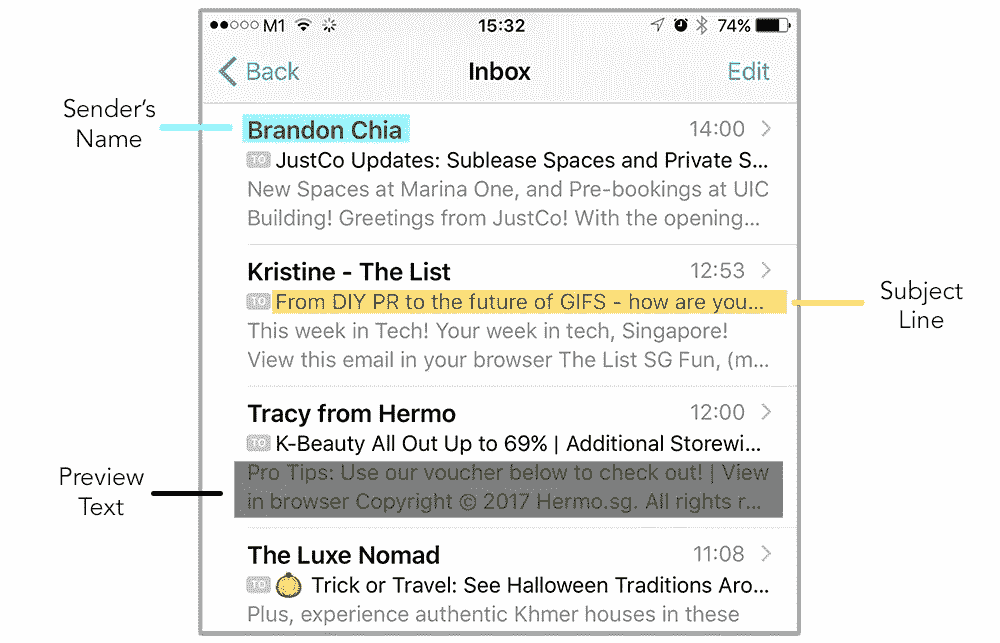
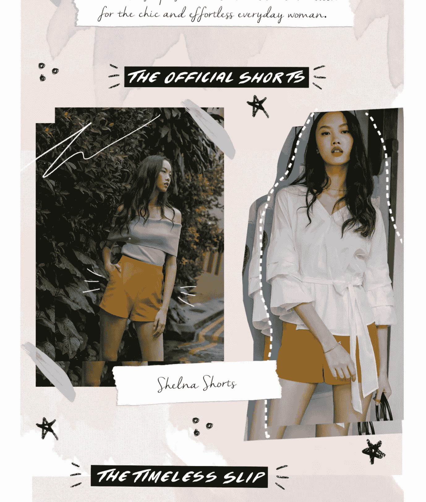
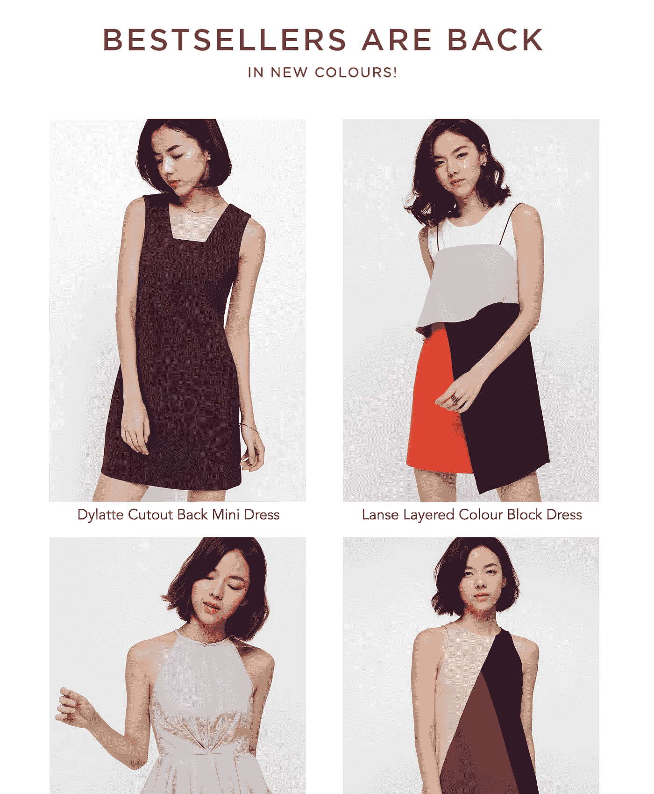

# 电子邮件营销的 A/B 测试——你应该测试什么？

> 原文：<https://medium.com/hackernoon/a-b-testing-for-email-marketing-what-should-you-test-for-7efb399a4c27>

当涉及到 A/B 测试时，每个测试背后有不同的假设是很重要的。这一次 A/B 测试的目的不仅仅是为了获得更好的打开率或点击率或转化率，而是为了更好地了解你的受众，这是一个永无止境的过程。这并不是说随便扔些东西看看有什么粘在一起，而是测试你对你的订户的假设。A/B 测试可以让你知道相比之下什么更好，但你创造出来测试的可能元素仍然来自你的营销本能和策略。

Hypothesize and test like a scientist!

*每一次成功的 A/B 测试都会积累关于用户的知识，帮助您创建更好的内容和信息，最终提高您营销工作的投资回报率。*

一旦你对要测试的内容有了大致的了解，一次测试一件事是很重要的。混合变量可能很有诱惑力，例如尝试不同的主题，在不同的时间发送邮件，但是**不要被诱惑！如果你这样做，将很难从数据中得出任何有用的结论，充其量也只是碰运气。**

当你进行 A/B 测试时，下面是一些值得尝试的元素:

# 首先也是最重要的—发件人姓名、主题行和预览文本

取决于你的电子邮件客户端，当一封邮件到达你的收件箱时，你首先看到的是发件人的姓名/电子邮件地址或主题行，然后是可选的预览文本。

发送者的名字有三种选择

1.  使用个人姓名(如 Gerald Yeong)
2.  使用公司名称(如 Mailworks)
3.  使用两者(例如 Mailworks 的 Gerald)。

你应该使用哪一个？这取决于具体情况。使用个人名字可能会在一开始给你一个更好的打开率，但如果你主要是发送类似群发简讯的电子邮件，可能会有一个断开，这可能会减少你的信息，导致点击率较低。一般来说，除非有很强的理由，否则尽量满足期望，即以个人名义发送类似对话的电子邮件，以公司名义发送类似营销的电子邮件。如果有疑问，你可以选择第三个选项，即两个都选。

你可以在 A/B 测试中真正试验的是主题行，我们建议预览文本应该相应地支持它。重要的是退一步理解你所追求的模式，而不是仅仅为了测试而进行小的复制更改。

例如，你可能很想知道一个“扣人心弦”类型的主题行或传达紧急情况的东西是否对你的电子邮件受众有更好的打开率。你可以用这样的东西-

1.  🎵在圣诞节的第二天…
2.  ⏰是时候寻找最后一分钟的圣诞礼物了！

相比之下，如果你在你的 A/B 测试中使用下面的主题行，这种差异可能是可以忽略的，因为两者都主要激发紧迫感。

1.  🎄离圣诞节只有两周了，现在就去找你的礼物吧！
2.  ⏰是时候寻找最后一分钟的圣诞礼物了！

查看此指南，获取主题行模式列表！

*注意:预览文本通常是由 preheader 生成的(基本上是 HTML 电子邮件中包含文本的第一个元素)，但它可以由电子邮件顶部的隐藏文本元素显式定义。更多信息，* [*看这个终极指南*](https://litmus.com/blog/the-ultimate-guide-to-preview-text-support) *。*

# 一天中的时间

您的订户可以根据一天中的时间做出不同的响应。虽然您无法控制他们何时会阅读您的电子邮件(虽然您可以根据一天中的不同时间制作动态图像，但这将在下次讨论)，但您可以控制您发送的电子邮件通知何时到达您的用户邮箱。如果您的订阅者是国际用户，您的 ESP 可能会为您提供一个选项，让您根据他们的本地时区一次发送电子邮件(例如，使用 Mailchimp 的 Timewarp)。

虽然已经有很多关于一天中最佳时间或一周中最佳日子发送电子邮件的研究，但你不能真的认为这些研究直接适用于你的用户。毕竟，女性时尚的消费者与视频游戏的消费者有很大不同，你能识别什么与你的订户相关的唯一方法是 A/B 测试。

再一次，你必须有一些假设，尽管一开始可能会过于简单。例如，如果你正在运行一个关于当地艺术场景的每周电子邮件时事通讯，你可能会假设发送这个的最佳时间是

1.  在一个星期五的早上，当你的用户在为周末做准备的时候
2.  周三下午是周中，周五似乎有点太晚了

从表面上看，这两种方法都是有效的，测试它们的唯一方法是首先通过 A/B 测试，也许再加上一些定性的方法，比如调查。

# 设计

设计不是艺术——每个设计决策都应该以实现特定目标为理想目标，而不是基于个人偏好，但传统上测试这些决策的假设是昂贵的。借助能够衡量参与度(阅读电子邮件所花费的时间)的[高级电子邮件分析](https://litmus.com/email-analytics)，我们可以评估不同的设计变量，而不仅仅是点击率和转化率。

例如，在时尚电子邮件营销领域，我们经常会看到基于图像的电子邮件，它们的布局非常动态，并且使用了小众字体来搭配当季的外观手册:

Email Newsletter From [Love, Bonito](https://www.lovebonito.com/)

给定邮件客户端不支持的自定义字体和旋转文本，这样的布局将不可能在 HTML 电子邮件的混合文本图像布局中精确构建。仅使用基于图像的电子邮件也有缺陷，例如默认的[图像屏蔽](https://litmus.com/blog/the-ultimate-guide-to-email-image-blocking)行为。

然而，即使有这些陷阱，我们可以说，这些图片确实为 Love，Bonito 品牌增加了独特的价值，而不是缺点。从转换的角度来看，将这样一个 lookbook 风格与下面这样一个更标准的网格进行比较是很有趣的。或者，也许有一种方法可以设计出适合这个季节的外观手册，同时围绕[电子邮件开发的基本原则](/mailworks/principles-of-designing-and-building-a-custom-html-email-a710ccb3acf5)和邮件客户端当前状态的注意事项开展工作。

Email Newsletter From [Love, Bonito](https://www.lovebonito.com/)

或者 A/B 测试可以更简单，比如比较 3 x 4 网格和 2 x 6 网格。就设计原则而言，一个 3 x 4 的网格能更好地传达多样性(对知名产品的打折市场有好处吗？)而不是 2 x 6 的网格，这样可以更好地查看各个图像(对于拥有完美图像的独立品牌来说更好？).至于表达多样性对于你的特定受众和你的特定目的是否更好**，最好的衡量方式是通过 A/B 测试。**

**当然，这意味着需要更多的努力来构建这些变体。(这就是为什么我们首先有 [Mailworks](http://www.mailworks.io) 的原因，这样你的团队就不会疯狂地构建和测试所有这些变体！)**

# **结论**

**你同意在电子邮件营销的 A/B 测试中假设的重要性吗？你在 A/B 测试中测试的其他元素是什么？请在评论中告诉我们！**