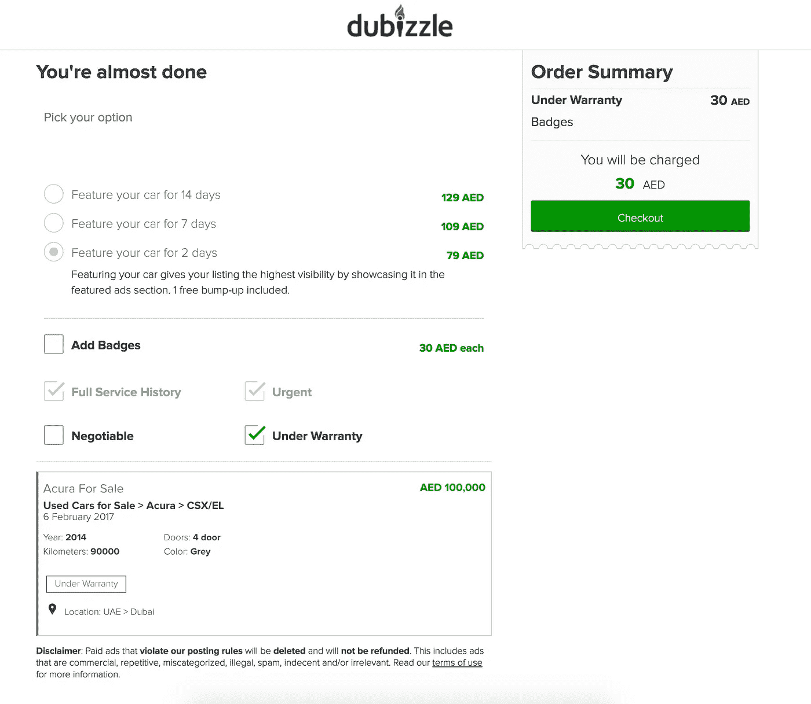
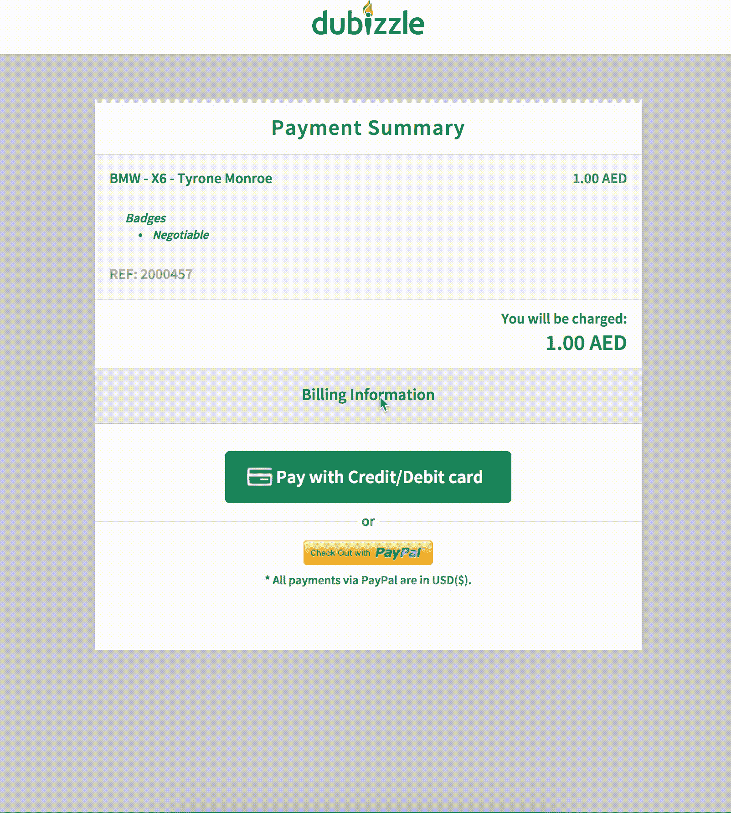
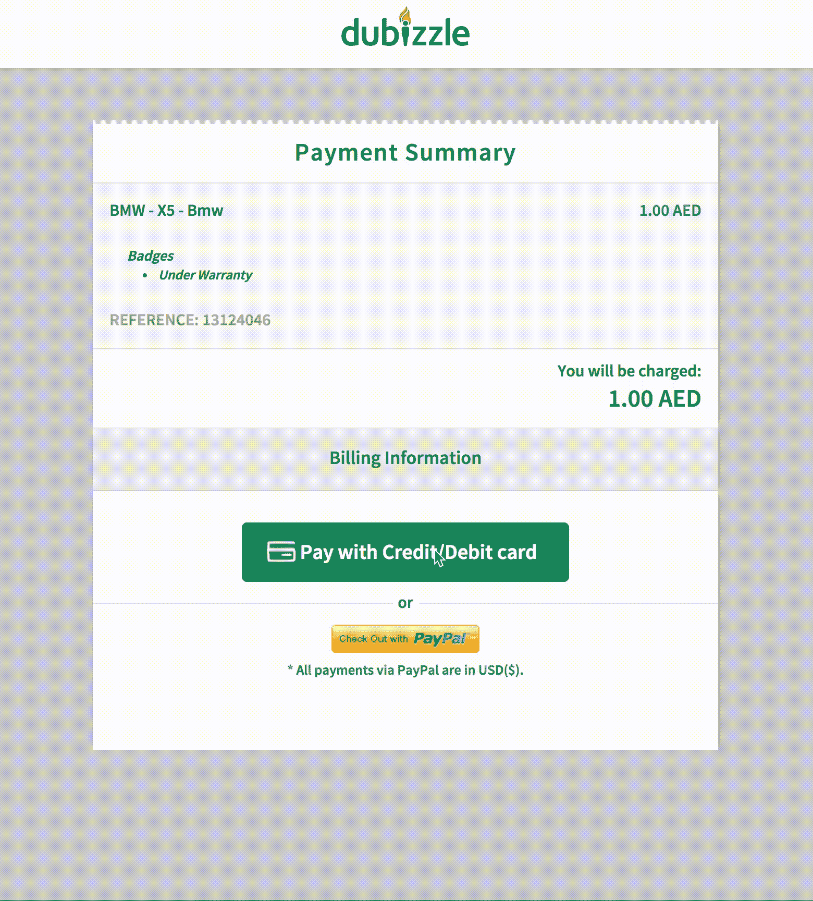
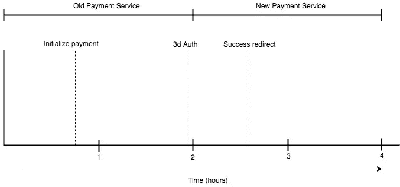
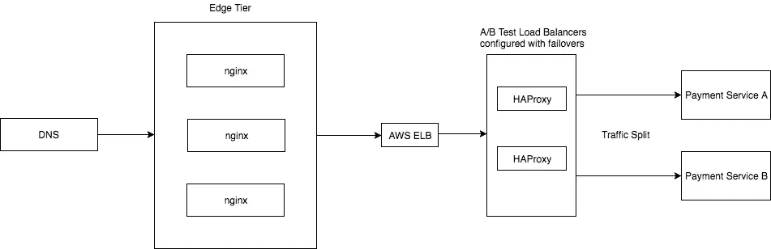

# A/B 测试我们通往更好的支付网关的道路

> 原文：<https://medium.com/hackernoon/a-b-testing-our-way-to-a-better-payment-gateway-d291b86dd74b>

想象一下，由于各种业务用例，您必须重写现有的 web 服务，以迁移到新的支付网关(PSP 或支付服务提供商)。你的第一个想法可能是用新的完全取代旧的，然后推出新的。这是一种幼稚的方法，尤其是当您使用支付网关时，这些网关有自己的 SLA、与收单银行的协议、风险和欺诈检测软件等。这使得这一过程在转化率、收入、客户保持和最终业务方面风险更大。在这篇博客文章中，我们讨论了在转换支付网关时降低风险的方法，以及为什么它如此重要。



dubizzle Checkout Page

## 这一切都始于我们过去的支付服务…

我们旧的支付服务是用 Python 2 编写的，与旧的支付网关(支付服务提供商)高度耦合。当我们第一次剖析这个问题时，我们认为在相同的流量、URL 和 [Python 瓶](https://bottlepy.org/docs/dev/)视图中集成一个全新的支付网关是微不足道的。当我们开始着手第一个 POC 时，我们意识到我们已经生成了大量的意大利面条式代码，因为这两个支付网关的 API 流完全不同。虽然旧的支付网关 API 设计不得不严重依赖 [Redis](https://redis.io/) 和 [Gevent](http://www.gevent.org/) 来优化用户和支付流程，但绝对没有理由从新的 API 中重新引入这种依赖性。



Payment Service Integrated with Old Payment Gateway

> **只要简单，A/B 测试就是好的**
> 
> A/B 测试在做出产品决策时非常有力。在 OLX dubizzle 公司，这些测试传统上更倾向于面向用户的组件，如页面流量、页面组件、位置和产品。
> 
> 然而，当您想要测试高度相互依赖的底层系统时，这些测试会使事情变得复杂。

当我们还在进行 POC 时，我们意识到我们想要执行的 A/B 测试不应该使用诸如[优化](https://www.optimizely.com/)之类的工具来完成，即使我们设法在相同的视图和用户流中集成了新的网关。原因如下:

*   在支付服务上引入第三方托管的 JavaScript 可能会捕获信用卡的详细信息，这是一个巨大的安全风险。
*   走优化路线将要求我们在 web 服务的每个视图上实现一些 A/B 测试逻辑，以确保我们基于 cookie 将跨所有视图的交易请求定向到正确的支付网关。在每个视图中，这可能类似于以下内容，并且肯定不整洁:

```
if cookie == ‘OLD’:
  use old payment gateway API
else:  
  use new payment gateway API
```

*   调试两个不同的支付网关，使用相同的名称空间，如 Redis，UUID 生成和日志肯定会火回来，我们会在任何时候抓我们的头。

> 请注意，一旦用户进入 bucket A (web 服务与旧的支付网关对话)，该 web 服务需要确保该用户的支付流在最初启动时所在的支付网关上继续。例如，web 服务不应该在旧的支付网关上启动交易，而尝试在新的支付网关上完成交易。这个问题可以使用 Optimizely 和 HAProxy 都支持的粘性会话来解决。

## 两种支付服务的故事…

一旦我们对我们试图处理的问题有了一些想法，我们决定编写一个与新网关集成的新支付服务，并通过 50-50 分割 A/B 测试来比较性能。整个 A/B 测试必须至少满足以下要求:

*   新服务的卡详细信息页面的外观和感觉应该与旧服务完全匹配，以确保我们不会扭曲任何转换。在这种情况下，转换被视为卡“提交”事件。
*   与旧服务相比，任何内部后端任务或 API 调用都不能增加新服务中的事务失败率。这意味着大多数用户流本质上应该以与旧的相同的方式工作。



Payment Service Integrated with New Payment Gateway

## 通过 HAProxy 进行的 A/B 测试

由于 Optimizely 不在考虑范围内，我们决定利用 HAProxy 来运行测试。

HAProxy 是一个强大的第 4 层和第 7 层负载均衡器，具有广泛的功能。其中一个特性是它能够在后端支持基于 cookie 的持久性，这发生在第 7 层。

我们将 HAProxy 配置为具有三个后端:

*   主后端
*   旧服务后端
*   新服务后端

为了让您体验一下，下面是我们 HAProxy 后端的一个示例:

你可能会想为什么我们有静态后端？一旦我们来到 HAProxy `frontend`这就变得很清楚了，所以让我们先讨论一下`main`后端。

我们采用加权循环法来平衡`old-service-old-pg`和`new-service-new-pg`之间的负载请求。这对于 A/B 测试来说是有意义的，在 A/B 测试中，您只需将流量分成 A 和 B 两个存储桶，但需要注意的是，在会话持续期间，任何到达存储桶 A 的请求都不应到达存储桶 B。我们通过非常强大的 T2 指令巧妙地实现了这一点。假设任何发起事务的用户都将在 2 小时内完成事务，我们告诉 HAProxy 在 2 小时后丢弃一个会话 cookie，并根据 round robin 为该请求决定的内容生成一个新的 cookie。

这为我们解决了两个非常重要的使用案例:

*   让我们能够灵活地调整 A/B 测试权重，在 2 小时内传播给所有用户，而不会中断任何会话或用户流。
*   增加了用户在 A/B 测试的生命周期内尝试在两个服务上进行交易的概率。这有助于我们识别问题，即一个网关拒绝另一个网关接受的同一张信用卡。我们真的很惊讶地看到，在涉及跨大洲的多个级联系统的更大环境中，事情会如何发展！

我们的设置中有一个小漏洞，你可能还没有注意到。请考虑下图:



Payment Flow Through HAProxy

用户在收到 cookie 后的第 45 分钟开始在旧的支付服务上进行交易。然后，他在 1 小时 59 分进入银行的[三维安全](https://en.wikipedia.org/wiki/3-D_Secure)页面，并在 2 小时标记后被重定向回我们的成功 url。由于 HAProxy 配置了 2 小时的 cookie `maxlife`，它将丢弃会话 cookie，并尝试在重定向到成功 url 时插入一个新的 cookie。如果我们运气不好，round robin 可能会将新的会话绑定到新的支付服务，而新的支付服务不知道如何处理旧服务配置的成功重定向。

在我们的例子中，我们选择忽略这个问题，因为我们之前已经看到，发起事务的用户通常会在两个小时内完成事务。但是，举例来说，如果我们将 cookie `maxlife`设置为 1 分钟，你能想象这个问题的严重性吗？

让我们回到我们的讨论，为什么我们有`old_service`和`new_service`后端以及`main`。HAProxy 通常配置有一个处理所有 ACL(访问控制列表)的`frontend`代理，在我们的例子中是这样配置的:

您在配置中看到的这些 webhooks 和端点是处理来自外部网关的请求的特定视图。由于新旧服务无法与彼此的支付网关对话，将它们置于循环负载均衡器之下将意味着多达 100%的请求使用 400 或 404。此外，由于这些请求来自支付网关，因此不需要任何类型的持久性，因为这些请求不包含跨越不同视图的流(所有请求都是一触即发的 200)。

解决这个问题的最好方法是在负载均衡器上，我们通过定义 ACL 来控制通过`old_service`和`new_service`静态后端到适当应用服务器的请求流。简而言之，这将是*支付网关发起的请求*和 HAProxy 之间的常规对话，最终将到达适当的应用服务器:

*支付网关:嘿，我是来自旧支付网关的内部请求，我需要告诉你，我已经成功收到付款。*

嘿，我认得你！您应通过 `*old_service*` *门到达您申请的目的地。*

*目的地申请:嘿，我知道怎么处理你了！让我们为该用户激活订单。我会给你 200 这个数字作为回报！*

## 监控请求流

在所有条件都具备的情况下，您将如何测试如此复杂的 A/B 测试？

HAProxy 为您提供非常精确的日志来调试如此复杂的系统。让我们通过实际的 A/B 测试日志中的一些例子来理解这一点。

注意针对同一订单 id 的每个请求的标志`NI`、`VU`和`VN`。这些标志提供了大量关于客户端、服务器和 HAProxy 如何处理持久性的信息，是测试和调试时最重要的指标之一。

在此引用 HAProxy [文档](http://cbonte.github.io/haproxy-dconv/1.6/configuration.html#8.5)**:**

**—***暂留 cookie 未启用。* **这是请求路径为** `webhook-new` **并且将其置于 A/B 测试下没有意义的情况。**

**NI :** *客户端没有提供 cookie，在
响应中插入了一个。这通常发生在“插入”模式下来自每个用户
的第一个请求，这使得统计真实用户变得容易。* **这是循环法为用户决定测试桶的地方。**

**VU :** *客户端提供了一个 cookie，其上次访问日期
不是完全最新的，因此在
响应中提供了一个更新的 cookie。如果根本没有日期，或者如果
有日期但没有设置“maxidle”参数，也可能发生这种情况，因此
cookie 可以切换到无限时间。*

**VN :** *客户端提供了一个 cookie，在
响应中没有插入任何 cookie。对于客户端已经获得 cookie 的大多数响应，都会发生这种情况。* **这就是 HAProxy 如何为用户找到当前的桶，并引导他到正确的后端。**

注意，一旦 HAProxy 决定了服务器`new-service-new-pg`并设置了 cookie，来自该用户的所有后续请求都通过`main`后端被定向到`new-service-new-pg`。

对于匹配其中一个 ACL 的其他所有东西，HAProxy 直接请求而不设置任何 cookie。这也确保了 A/B 测试结果不会被来自计算机而不是人类的 HTTP 调用所歪曲。

## A/B 测试的架构布局



Architecture Layout For The A/B Test

请注意，DNS 和边缘层在我们所有的微服务中都是通用的。所有的 A/B 测试奇迹都发生在流量通过 HAProxy 负载平衡器之后。

## 结论

虽然这对我们来说已经很完美了，但是还有更复杂的负载平衡用例，它们可能需要比会话持久性更多的参数。Shopify 通过利用 Nginx 和 OpenResty 在一篇出色的博客文章[中谈到了这一点。](https://engineering.shopify.com/232808527-surviving-flashes-of-high-write-traffic-using-scriptable-load-balancers-part-i)

这个 A/B 测试是整个 dubizzle 基础设施团队和产品工程团队的主要工作。感谢所有参与的人！

希望你喜欢这篇文章。请随意添加评论或提问。你也可以通过我的推特账号联系我: [mrafayaleem](https://twitter.com/mrafayaleem)

***PS:*** *本帖也发表在* [*dubizzle 工程博客*](http://blog.dubizzle.com/boilerroom/2017/03/07/changed-payment-service-provider-ab-test-via-haproxy/) *上。*

[](http://bit.ly/HackernoonFB)[](https://goo.gl/k7XYbx)[](https://goo.gl/4ofytp)

> [黑客中午](http://bit.ly/Hackernoon)是黑客如何开始他们的下午。我们是 [@AMI](http://bit.ly/atAMIatAMI) 家庭的一员。我们现在[接受投稿](http://bit.ly/hackernoonsubmission)，并乐意[讨论广告&赞助](mailto:partners@amipublications.com)机会。
> 
> 如果你喜欢这个故事，我们推荐你阅读我们的[最新科技故事](http://bit.ly/hackernoonlatestt)和[趋势科技故事](https://hackernoon.com/trending)。直到下一次，不要把世界的现实想当然！

