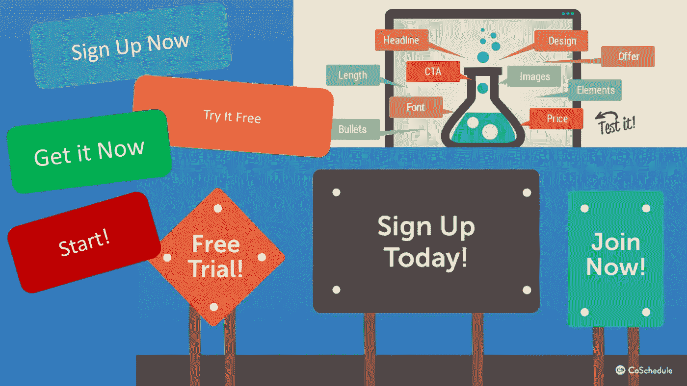
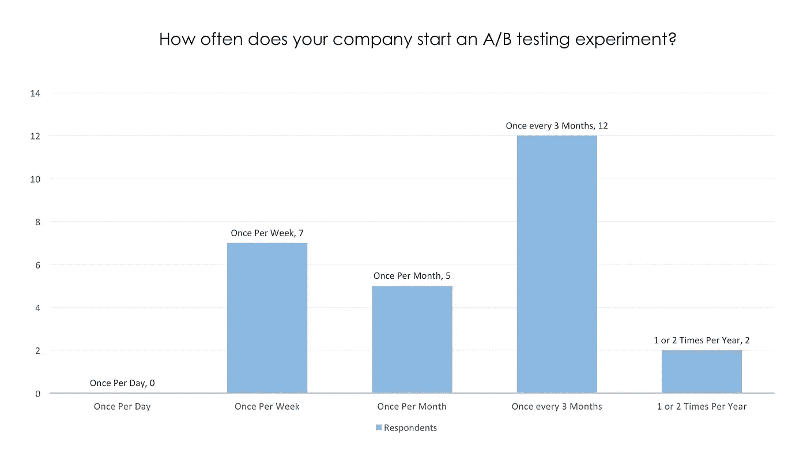
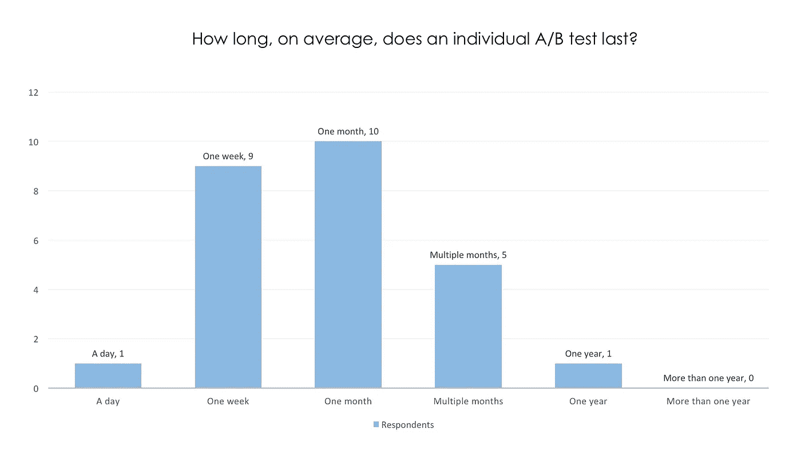
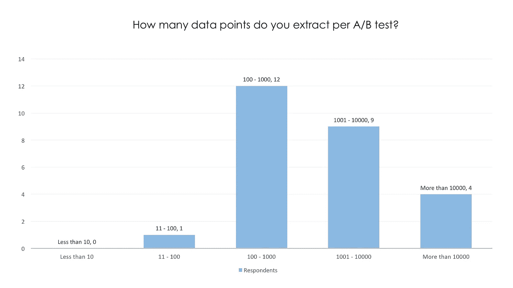
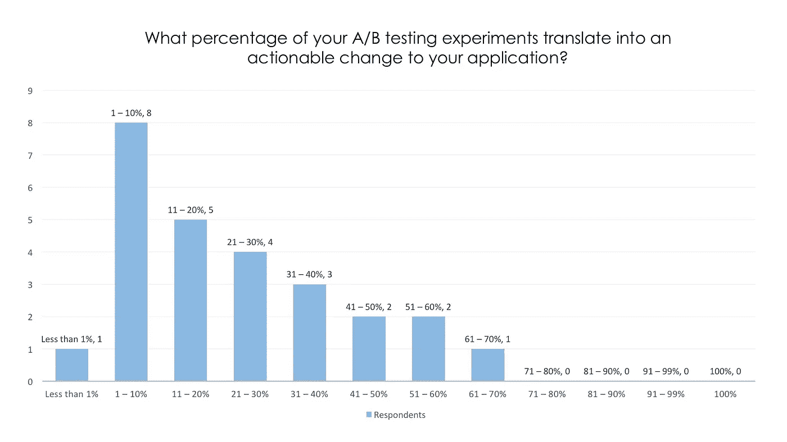
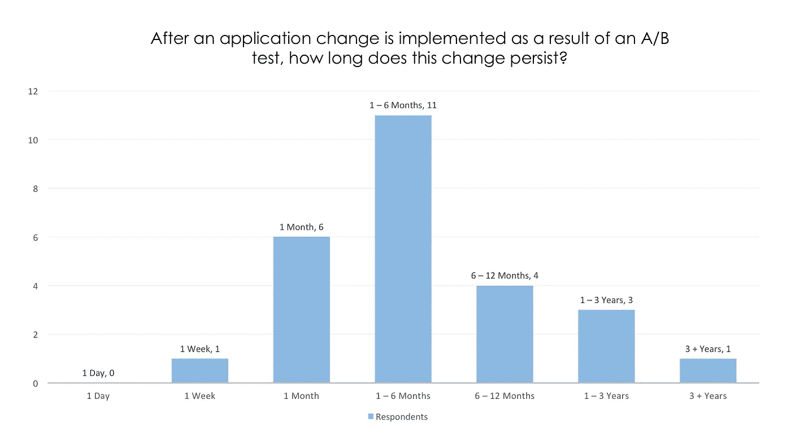

# A/B 测试——你做错了

> 原文：<https://medium.com/hackernoon/a-b-testing-youre-doing-it-wrong-77d628ac9518>

## 如何有效地进行 A/B 测试，以获得持久的结果

所以，你的公司想通过做一些营销网站调整来增加收入和采用率。他们想要更多的转化，更多的点击，更多的分享，更多的用户。他们让你先做什么？嗯， [A/B 测试](https://vwo.com/ab-testing/)！比较一个页面的两个版本，定义一个关键目标(例如点击)，看看你是否得到更多的点击。但是，这真的有用吗？这真的是你应该采取的方法吗？我们来看数据。

> 从本质上来说，A/B 测试是一种实验，它评估一个特性或页面相对于一个定义的度量标准的多个(通常是 2 个)版本。
> 
> 这篇文章关注于表面的 A/B 测试——分散团队交付有意义的客户价值的表面变化的测试。

# A/B 测试创可贴

对于拥有数百万用户的应用程序来说，对你的应用程序进行一些小的修饰，比如颜色、布局和语言，可能会让你的关键指标有一些明显的增加，比如更多的点击和用户参与。真正的问题是:对于用户基数较小的公司，你是否应该尝试专注于不同的“注册！”按钮颜色还是专注于让你的产品变得更好？

许多公司的 A/B 测试变成了劣质价值主张的权宜之计。如果你的内容没有被分享，也许你的内容实际上不值得分享，不管你的“现在分享”有多棒按钮。

此外，也许你的目标不应该是让潜在客户点击按钮。也许你的主要目标应该是建立信任，提供沙盒演示，或者授权潜在客户做出决定。

# 调查数据

[AppSumo 估计](https://vwo.com/blog/a-b-testing-tips/)只有 25%的 A/B 测试实际上产生了显著的结果。问题是为什么？好吧，让我们来定义有意义的结果。对于这些测试中的许多，主要的度量机构试图移动的是*对话率*。所以，如果比率没有增加，那么测试就失败了。

> 不到 25%的 A/B 测试产生显著的阳性结果——AppSumo

然而，我们可以从不同的角度来看待它。如果更改标题标语、英雄形象或 CTA 没有改变指标，那么这可能表明存在更大的问题。失败的测试应该表明:

1.  你的访客还没有准备好改变信仰
2.  除了注册，你的访问者还在寻找其他的东西
3.  你的核心产品根本没有吸引力
4.  你需要推动更多**合格的**销售线索流向你的产品

下一个数据集来自 2016 年 5 月 1 日至 5 月 30 日对 26 名 A/B 测试从业者进行的定性和定量 A/B 测试调查(西北大学，IDS-Justin Baker，2016)。虽然这不是调查的全部，但它仍能给我们一些有意义的见解。

**要点**

*   45%的受访者表示，他们的公司每 3 个月开始一次新的 AB 测试，40%的人每周或每月开始一次；
*   **60%的受访者说他们的 AB 测试持续 1 周到 1 个月；**
*   **38%的受访者表示，他们的 AB 测试实验中只有不到 10%真正转化为行动；和**
*   45%的受访者表示，来自 AB 测试的应用程序变更会持续 1 到 6 个月。

> 只有 10%的 A/B 测试实验产生了可操作的变化——正式发布页面或功能的新版本。

# 采访数据

为了补充定量研究，A/B 测试人员(有 2 至 6 年的 A/B 测试经验)被问及关于 A/B 测试功效的开放式问题。以下是一些关键要点:

> 50%的团队无法从 A/B 测试实验中做出决策，因为数据不确定或测量不当

*   *12 名受访者中有 10 人*指出 A/B 测试的一个主要缺点是**90%或更多的实验“失败”；**
*   *12 名受访者中有 6 人*指出，很难根据 A/B 测试结果做出产品决策，因为大多数**结果没有结论或明显不合格**。这意味着大约 90%的时间维持现状；和
*   *12 名受访者中有 10 人*指出 A/B 测试的主要好处是“**增加收入**”。

# 让 A/B 测试变得有用

总的来说，这些结果告诉我们什么？

> 公司可能在很短的时间内过于频繁地运行 A/B 测试，导致高失败率，从而降低了 A/B 测试结果的价值和意义。

这里有一些技巧可以帮助你的应用程序使用 A/B 测试。

1.  **不要分心—** 改变颜色、行动号召文本和布局可能会对你的关键绩效指标产生微小的影响。然而，这些成果似乎很短暂。可持续发展不是把一个按钮从红色变成蓝色，而是创造一个人们想用的产品。
2.  **不要给一头猪涂口红—** 两头猪更好的版本还是一头猪。如果你想卖一头猪，那么你做得很好。如果不是，那就专注于创造更好的用户体验和更好的价值主张。
3.  **使用实际统计数据—** 不要依赖简单的一对一比较指标来决定什么可行，什么不可行。版本 A 产生 20%的转换率，版本 B 产生 22%的转换率，因此我们应该转换到版本 B 请不要这样做。使用实际的置信区间、z 分数和统计显著性数据。
4.  **时间越长越好—** 运行测试的时间越长，数据对波动和外部变量的解释就越好。不要在阵亡将士纪念日周末使用红/白/蓝主题进行测试，然后在今年剩余的时间里切换到该主题。
5.  **失败是可以接受的，但失败是昂贵的—** 如果您不断发布人们讨厌的应用程序版本，那么这对您的指标有什么影响？如果大多数实验都失败了，那么你是弊大于利吗？你在设计和实施 A/B 测试实验上花了多少时间？失败和尝试是建立公司的自然副产品。如果有些东西不工作，也许不是因为你的按钮需要一个更亮的颜色，也许是因为你需要让你的功能更好。

# TLDR

有效的 A/B 测试是为了给你的客户带来长期的、积极的价值。如果你陷入了琐碎变化的循环中，那么你基本上是在搅动流沙，而不是推动你的产品前进。

> 有效的 A/B 测试是关于解决问题——为你的客户带来长期的、积极的价值。

测试有意义的特性，使用真实的统计数据，获得真实的反馈，并运行更长时间的测试。向用户提供真正的价值，而不是玩弄色彩和巧妙的口号。我不是想贬低确保你的布局优化，你的文案是强大的，你的信息层次是流动的重要性。我试图让团队考虑通过增加价值和解决问题来改善用户体验，而不是通过给猪涂口红或试图设计一个新标题。