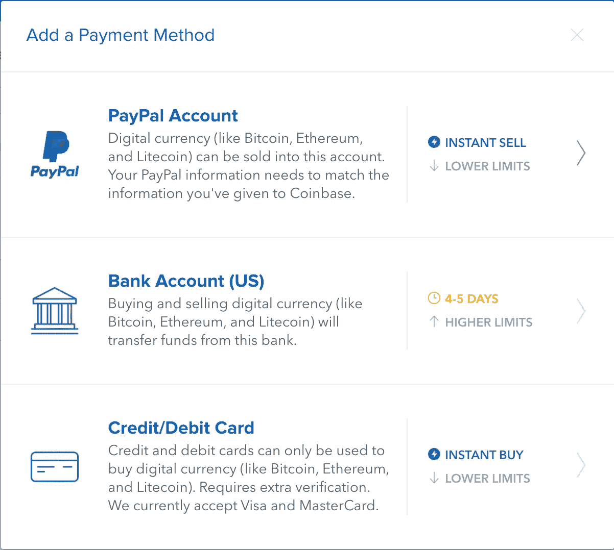
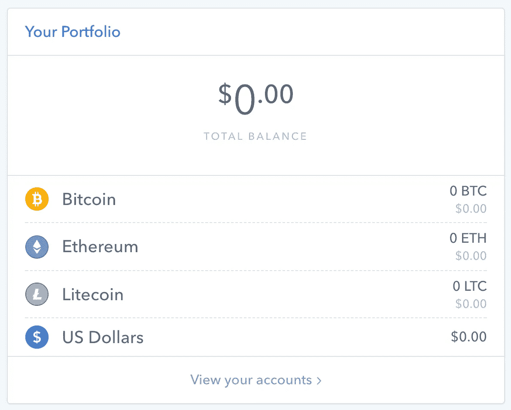
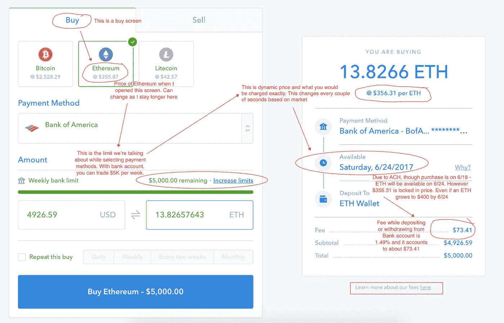
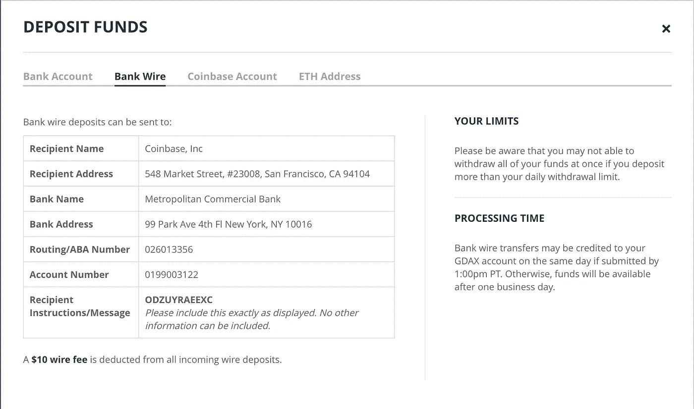

# 如何在美国、澳大利亚、欧洲和新加坡购买比特币

> 原文：<https://medium.com/hackernoon/a-beginners-guide-to-buying-bitcoin-8cf715421a9c>

我知道你们来这里是为了了解如何用当地货币，如美元、英镑、欧元或卢比，购买比特币。你在一个正确的地方找到了在哪里购买和如何购买比特币。让我们开始吧…

> 首先，这篇文章纯粹是为了教育和信息目的，而不是鼓励你购买加密货币。在进行投资之前，你应该总是做自己的研究 **(DYOR)** 、做出自己的决定**(迈德)**，并对风险感到放心。投资不稳定的加密货币包含一个风险因素:这些货币的价格会上下波动(通常以一种看起来不理性的方式)。

[这份 10 步指南将帮助你开始加密货币世界之旅](/@vvkr/10-baby-steps-to-start-cryptocurrency-trading-4e527d9d85c3)

不管怎样，如果你决定投资比特币(或任何加密货币)，你心里会有以下问题。

1.  买个比特币有什么靠谱的地方？
2.  相关的流程和选项是什么？
3.  钱包、存款和购买
4.  高级用户:稍微好一点的方式。

## 哪里可以买到我的比特币

[**比特币基地**](https://www.coinbase.com/join/5922da0103b62e7e9e6b9df8) —这是你可以将法定货币(美元)兑换成比特币或其他加密货币的地方。

> 我不为比特币基地工作。我只是觉得它们很方便。有很多可供选择的方案，但比特币基地是推荐的一个！
> 
> 永远——永远缴纳税款，永远不要试图逃税！

比特币不仅仅是一种值得购买的货币，还有其他基于区块链的货币，它们与比特币不同，在某些方面甚至优于比特币。很少是以太坊，瑞波，莫内罗。*如果比特币是黄金，莱特币就像白银*。

> 对什么是加密货币，什么是区块链技术感到困惑？前往我们由人工智能驱动的教育聊天机器人[https://m.me/confusedcoin](https://m.me/confusedcoin)

 [## 人工智能加密聊天机器人

### 回答您关于加密货币的基本问题

m.me/confusedcoin](https://m.me/confusedcoin) 

**为你提供了购买方式**

1.  **比特币(BTC)**
2.  **以太坊**
3.  **莱特币**

## **在比特币基地上购买的流程是什么？**

1.  **在[比特币基地](https://www.coinbase.com/join/5922da0103b62e7e9e6b9df8)注册**
2.  **验证您的身份**
3.  **选择付款方式**

****

## **选择哪种付款方式？**

**信用卡/借记卡显然有更高的相关费用，所以你可能不想去**

**在贝宝和银行账户中，如果您在美国，我建议您选择银行账户**

**这里的因素是相关的费用和允许转让的限制，正如你在这里的图像中所看到的。**

## **链接银行账户后，下一步是什么？**

**[比特币基地](https://www.coinbase.com/join/5922da0103b62e7e9e6b9df8)可将款项存入其美元钱包，也可直接购买 LTC 联邦医疗保险/LTC。将资金存入比特币基地需要一些时间，即 4-5 个工作日。这是因为乙酰胆碱从银行转账到比特币基地。这种延迟是存款时要考虑的因素之一，因为您需要考虑一下，看看您是想存款还是想直接购买——我们将在下一步讨论这个问题。在那之前，这些钱包是什么？**

## **这些钱包是什么？**

**[比特币基地](https://www.coinbase.com/join/5922da0103b62e7e9e6b9df8)为您提供 4 种钱包。本质上，每一种都是商店特有的货币。**

****

1.  **美元钱包:要存放美元，当您卖出任何一种货币时，请存放美元。从美元钱包购买这些硬币的交易是**即时。****
2.  **BTC 钱包:使用美元购买后，您的比特币将显示在这里。**
3.  **ETH Wallet:这是存放您的 Ethereum 的地方**
4.  **LTC 钱包:这是存放您的 LTC 币的钱包。**

## **存入美元钱包或直接购买**

**将钱从您的银行存入美元钱包大约需要 4-5 天。[您可以参考本文了解为什么需要这么长的时间](https://support.coinbase.com/customer/portal/articles/1392022-why-does-a-buy-take-so-long)。与此同时，许多事情都可能发生！这些密码货币波动性很大，价格可能在 4 天内飙升 100%。当我提到易变性时，同样可能的是，它可能在 4 天内下降 100%或更多！所以这一切都是关于你自己对这些硬币到底是什么，什么是正确的价格的研究——这些硬币的价格主要取决于供求关系，以及一些技术突破和合作。**

**即使是直接购买，您购买的货币也需要 4 天才能反映在您的钱包中。正是[同一篇文章](https://support.coinbase.com/customer/portal/articles/1392022-why-does-a-buy-take-so-long)解释了这一点。这是因为 ACH 汇款，银行需要 3-5 个工作日来处理该申请并将您的钱寄到比特币基地。然而，**如果您直接购买，所选硬币将有固定价格！****

**因此，如果你认为比特币或以太坊的价格在这个时间点是正确的，并且你认为如果价格可能在未来 2-3 天内上涨，并且确定在未来 4-5 天内不会下跌，那么直接购买你感兴趣的货币。**

****

**因此，当你点击蓝色大按钮“购买以太坊”时，你将把你的价格锁定在 coinbase 上的当前价值，并获得它。它会显示在你的 ETH 钱包上，显示你购买的以太坊数量。在这种情况下，它将显示为 13.82657643 ETH 于 2017 年 6 月 24 日星期六到达，并显示 5000 美元，而不考虑当前价格。**

**这样，如果对 ETH 的需求增加，价格在 6 月 24 日飙升至 450 美元，到那时你就已经获利了。亏损的情况也是如此——如果它在 6/24 的时候变成 200 美元，你仍然得到 13.82657643，但是价值是 200 美元。**

> **如果您正在寻找其他即将推出的 ico 的详细分析以及关于加密货币和区块链技术的一般信息，请查看 confusedcoin.com**

** [## 加密货币和区块链技术的困惑硬币初学者指南

### 加密货币和区块链技术初学者指南

《迷惑的硬币》解释了比特币、以太坊和其他加密货币的技术和投资细节——请访问 www.confusedcoin.com](http://confusedcoin.com) 

## 何时存入美元钱包？

如果你认为目前的价格很高或不合理，或者你还没有决定购买哪种硬币或不准备投资，那么把你的钱存入美元钱包，这样一旦你做出决定，你就可以立即从美元钱包中购买其中任何一种硬币。

> 关注我在[推特](https://twitter.com/confusedcoin)上关于加密货币&区块链的更新。

## 高级用户:有一个稍微好一点的方法

那是什么——通过交易所交易——GDAX

GDAX:全球数字资产交易所(前身为比特币基地交易所)是 Coinbase 旗下的加密货币交易所。这里的优势是你可以用你的 coinbase 凭证登录 GDAX。

如果你以前对股票感兴趣，你会很容易理解交易所——人们买卖东西的地方。在这种情况下，是 BTC、ETH 和 LTC——GDAX 是人们交易这三种货币的地方。

GDAX 允许您以 4 种方式存款

1.  通过 ACH 转账(需要 4 天)
2.  通过电汇(10 美元，如果在太平洋时间下午 1 点前存入，则当天可用)
3.  来自 coinbase 账户，可能是 BTC/瑞士法郎/美元。(即时和免费)
4.  从另一个地址(存放在另一个交易所或其他地方的钱包)

## 那么这里的关键是什么呢？

一旦你把钱存入 GDAX，你就可以以市价或限价购买一种货币(比如 ETH)。交易所是一个有人卖出一个货币单位，有人买入的地方。如果双方都同意一个价格，这将是当时的市场价格。

如果有人想以 300 美元的价格出售一个 ETH，而有人想以 299 美元的价格购买。除非其中一方妥协，或者另一个人以 300 美元的价格再次下单，否则销售永远不会发生。所以一个人不能卖出，除非有人以他所报的价格买入，反之亦然。

## 市场价

在上面的例子中，你说“以市场价买入”，你将以某人下达的最低卖单(即 300 美元)获得 ETH 所以你被称为 ***接受者*** ，因为某人*向*出价，而你*接受了*。

## 限价

如果你说了“以限价购买”，并设定限价为 299.23 美元；当有人以你要求的价格(即 299.23 美元)出售一个 ETH 时，你将被分配到一个 ETH——在这种情况下，你被称为 ***制作者*** ，因为你*向*出价，有人*接受了*。

这同样适用于销售。

## 尽管如此，这有什么好处呢？

在 GDAX 上，**出票人**的交易费用为 0%，收款人的交易费用在 BTC 账簿的 0.10%至 0.25%之间，在 ETH 账簿的 0.10%至 0.30%之间。因此，如果你了解交易是如何在交易所进行的，以及如何下达限价单进行买卖，你就可以节省交易费用。我们很快会有一篇文章介绍如何为初学者做到这一点。** 

**最后，如果你觉得这篇文章有用，请按以下地址留下任何金额的小费:**

*   **BTC:1p 8 zce 4 vubczd 4 evcvfxytyj 9 HP 1 gbe 38 f**
*   **ETH:0xc 347018 dbfcffba 91872635 AC 4 CFC 0521359 a 420**

> **你在学习购买加密货币的同时，也需要对加密货币交易**负责，纳税**。这里有一篇文章试图**减少混乱，并澄清**关于加密交易收益税的问题。**

** [## 如何使用 BearTax 对加密货币收益征税

### 比特币基地、GDAX、Gemini 等地的密码交易员迫切需要计算他们从比特币中获得的收益

hackernoon.com](https://hackernoon.com/how-to-pay-bitcoin-cryptocurrency-tax-reliable-tools-beartax-bfce8bbb81bc)  [## BearTax -您的加密税务助理

### 易于使用的平台，密码交易员进口交易，计算收益和文件税。

熊税](https://bear.tax)**