# 加密货币入门指南

> 原文：<https://medium.com/hackernoon/a-beginners-guide-to-getting-started-with-cryptocurrencies-76027bebb1b1>

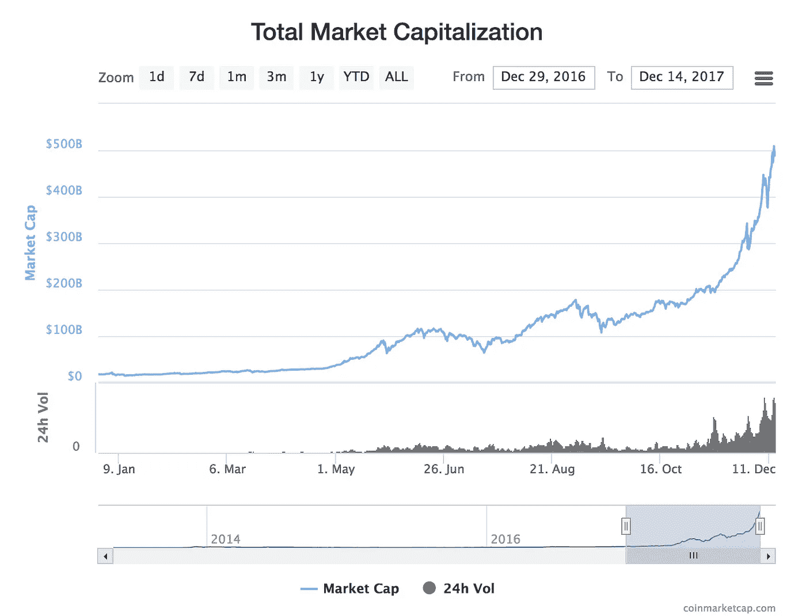

The meteoric rise of the Cryptocurrency market in 2017.

> 免责声明:本文旨在作为一般指南，并根据我投资加密货币的个人经验提供一些见解。它不构成财务建议。在投资或交易之前，你应该总是寻求你自己的专业财务顾问，做你自己的研究。

所以你已经吃了红色药丸，现在你要么正在寻求投资，要么已经开始投资加密货币。随着整个加密市场的价值在短短两周内增长超过 1000 亿美元(在撰写本文时)，该领域正在升温，并进入主流采用阶段。

但是你从哪里开始呢？现在 coinmarketcap.com 有超过 1300 种加密货币，几十个交易所，需要理解许多层技术。对于新手来说，密码世界可能是相当难以抗拒的，这需要大量的时间和研究来了解如何开始，并避免代价高昂的错误。

我将尝试分解每个投资者应该知道的基础和主要事情，包括什么是加密钱包以及如何使用它们，如何交易，在哪里交易，在好的项目中寻找什么，以及我个人从今年年初以来在这个领域的投资中学到的一般建议。

# 入门指南

以下是我将在本文中涉及的主题:

*   钱包钱包就像你代币的银行账户。我将介绍所有主要类型的钱包以及如何使用它们。
*   **交易所** 如何在热门交易所汇款入门。
*   如何开始交易，以及你应该了解的关于加密市场的事情。
*   **管理你的投资组合** 应用程序帮助你更好地了解你的收益&损失，以及如何观察代币和价格。
*   **安全性&安全性** 最大限度提高您的资产安全性的技巧、最佳实践以及如何避免网络钓鱼诈骗等。
*   **常见错误** 你应该避免的代价高昂的错误。
*   **一般提示&建议** 我从自己的经历中，从交易到研究等，发现这些建议很有帮助。
*   **资源** 

# 钱包

> 钱包就像你的加密银行账户，不同的钱包存储不同的令牌。

要交易任何加密货币，你首先需要一个钱包来存储它们，即:比特币需要放在比特币钱包中。钱包就像它们听起来一样，它们就像一个加密的银行账户。

## **如何得到一个钱包**

最简单的方法是注册一个允许你购买、交易或出售加密货币的交易所，他们允许你为他们交易的每个代币生成一个钱包，即使你没有任何代币。[比特币基地](https://coinbase.com)比如给你一个装比特币、以太坊、莱特币、比特币现金的钱包。

## 与实体钱包不同，加密钱包实际上并不包含任何东西。

需要理解的一件重要事情是，钱包只是一个进入区块链的安全“窗口”,因此您可以查看您的记录和交易。把它想象成 Gmail，你的钱包就是你的 Gmail 登录名和密码，但你实际上并不是在存储邮件，你只是在访问它。你的代币和交易被保存在一个区块链上，它分布在一个巨大的网络中。所以它总是在那里，不管你是不是丢了钱包。没有钱包，你就无法使用代币或对代币做任何事情。

## 如何在钱包之间发送和接收令牌

每个钱包都有自己唯一的地址，所以如果你在 3 个不同的交易所交易，你将有不同的钱包和地址用于每个交易所，用于每个代币。把它们想象成不同的网址或 URL。

钱包地址目前是一个很长的字符串，称为哈希。

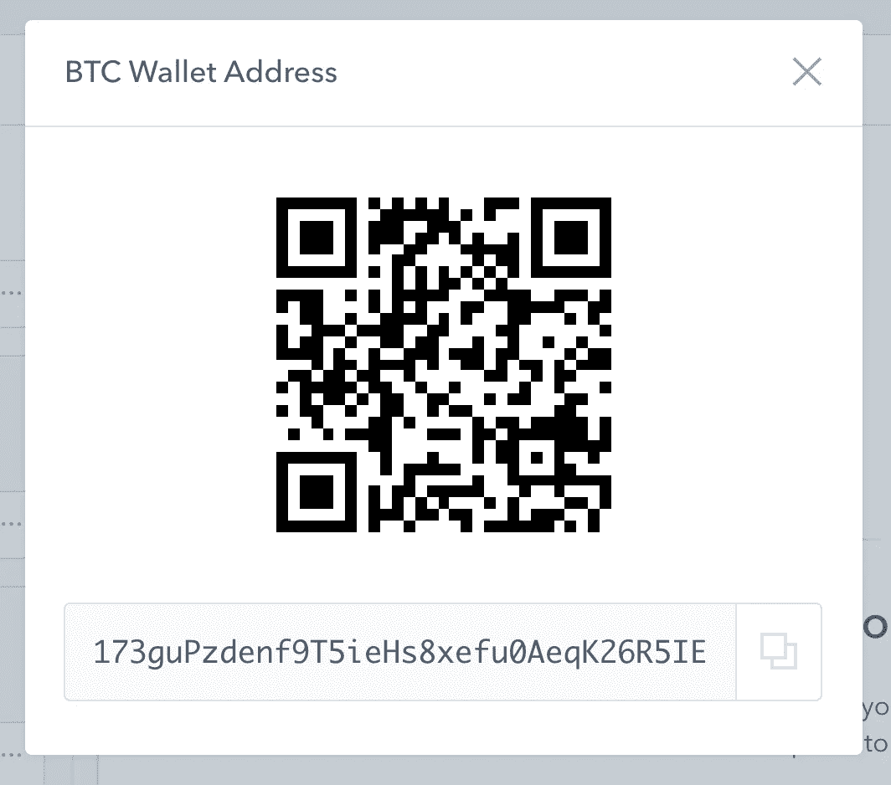

An example of what a Bitcoin Wallet Address looks like on Coinbase.

要在钱包之间发送代币，您需要首先复制接收地址，然后在发送时将地址输入收件人字段。下面是比特币基地上发送屏幕的一个例子:

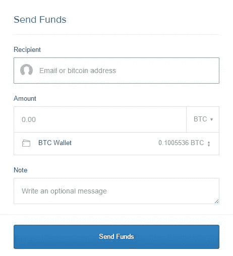

Sending Bitcoin from Coinbase.

## 钱包是特定货币的

也就是说，他们**只允许发送和接收他们自己的令牌。**理解这一点非常重要。在密码世界里，你不能向不同的钱包发送不同的硬币(也有例外)，否则**你将永远失去你的资金。**

## **ERC-20 基础代币(例外)**

再深入一点，有一些基于 ERC-20 协议(由以太坊区块链生成)的令牌，可以存储在同一个 ERC-20 兼容的钱包中。因此，举例来说，如果你有两个 ERC-20 代币，“苹果币”和“桔子币”，你可以将它们都发送到一个 ERC-20 钱包，如 MyEtherWallet.com 的钱包。

> * * *确保您总是仔细检查您正在访问的链接是正确的，有很多网站以令人困惑的相似拼写试图欺骗用户登录，认为这是真正的网站，因此“钓鱼”或窃取您的登录信息！**尽量不要搜索谷歌点击进入一个网站，总是直接进入或者从书签访问！*****

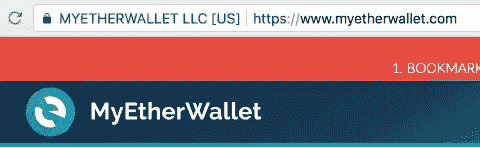

Always make sure you are on a secure connection, and double check it’s a legit web address.

## 不同类型的钱包

网上钱包通常被认为是最不安全的，尽管它最方便交易。如果你在交易所有你的代币，你可以立即用它们交易。然而，有几种主要类型的钱包:

*   桌面钱包
    这些钱包通常由代币开发者创建。例如，要找到官方支持的比特币钱包，你可以从[https://bitcoin.org/en/choose-your-wallet](https://bitcoin.org/en/choose-your-wallet)下载一个
*   **手机钱包** 这些是基于应用程序的钱包，你可以下载并安装到你的手机上，尽管更常见于基于 Android 的手机。例子包括 Android 的[区块链手机钱包](https://blockchain.info/wallet/android-app)。
*   **网上钱包** 所有交易所都提供网上钱包，让你收发代币。例如，[MyEtherWallet.com](https://coinbase.com)或者[比特币基地](https://www.myetherwallet.com/)。强烈建议离线存储令牌，以降低黑客攻击、网络钓鱼企图以及交易所崩溃的风险。虽然大多数交易所都有安全协议，但也有灾难发生，比如 2014 年臭名昭著的 [Mt Gox 黑客事件](https://www.wired.com/2014/03/bitcoin-exchange/)，价值 4.6 亿美元的比特币被盗。
*   纸质钱包基本上是打印出你钱包的公钥和私钥，以及一个你可以扫描的二维码。私钥基本上是一个字母和数字序列(很像一个长密码)，只有您应该知道，以便解锁您的钱包和访问您的令牌。Coindesk 提供了如何制作纸质钱包的指南。
*   这些是存放代币最安全的方式。硬件钱包完全离线(通常被称为冷存储)。硬件钱包并不支持所有的令牌，因此您需要了解硬件钱包是否支持您想要存储的令牌。流行的选择是 [Ledger Nano S](https://www.ledgerwallet.com/products/ledger-nano-s) 和 [Trezor 硬件钱包](https://trezor.io/)。

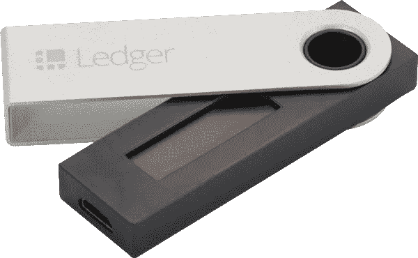

The Ledger Nano S hardware wallet. From [https://www.ledgerwallet.com](https://www.ledgerwallet.com)

要了解更多关于钱包的信息， [Coindesk 有一篇关于钱包选项的精彩文章](https://www.coindesk.com/information/how-to-store-your-bitcoins/)。

# 交换

> 与传统的股票市场不同，加密交易所从不睡觉，它是全球性的，全天候交易。

要开始交易加密货币，需要了解几个关键事项:

1.  只有少数交易所允许你用法定货币(你的本国货币，比如美元)购买比特币。
2.  比特币是目前最常见的交易对，这意味着为了投资其他代币或项目，你很可能只能用比特币交易/购买比特币。因此，你需要持有比特币才能进行大多数交易。以太坊也开始被更广泛地接受为交易对，所以你也可以用代币来交易以太坊。
3.  大多数交易所不受监管，投资风险自担。
4.  与传统的证券交易所不同，加密交易所没有开放和关闭时间，它们在全球范围内全天候开放。

考虑到这些，这里有一些最受欢迎的交流。

## 大众交流

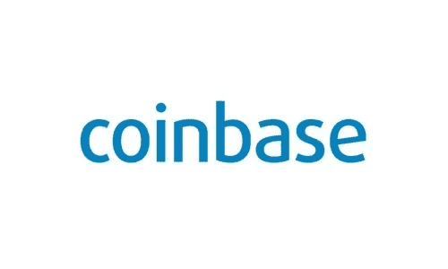

[**【比特币基地】**](https://www.coinbase.com)总部位于美国的比特币基地是全球最大的比特币交易所之一。比特币基地目前只允许你购买四种加密货币:比特币、比特币现金、以太坊和莱特币。你可以用信用卡直接购买，每周限额 250 美元。如果您完成了一些身份验证要求，此限制可以增加。他们收取 4%的手续费。

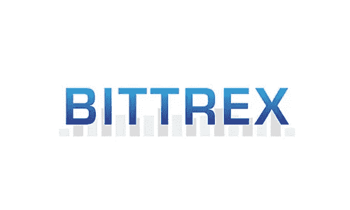

[**Bittrex**](https://www.bittrex.com)也是一家总部位于美国的交易所，bit trex 是加密领域最受欢迎的交易所之一，因为它可以交易 1300 多种替代加密货币中的一小部分(或通常称为 alt coins)。你不能将法定货币直接存入 Bittrex，所以你首先需要购买比特币或以太坊，并在开始交易前将它们转移到 Bittrex。

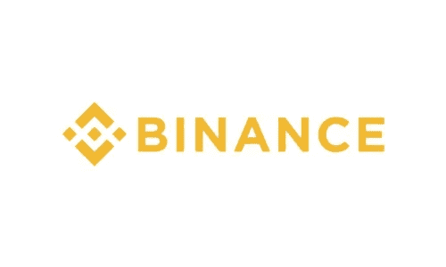

**总部位于香港的币安于 2017 年初才推出，但他们很快就将其平台转向了西方，并迅速成为全球交易量最大的交易所之一。我个人推荐币安，因为他们优越的用户界面，易于使用，较低的费用(使用他们的币安代币来促进交易)，以及他们交易的代币/alt 币的选择。**

**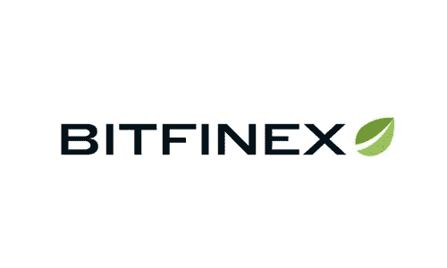**

**[**Bitfinex**](https://www.bitfinex.com)也位于香港，Bitfinex 是最大的交易所之一，为一家面向北美交易商的交易所处理最多的比特币交易量。它还提供一系列的另类硬币，尽管没有 Bittrex 或币安那么多。**

****

**[**Poloniex**](https://poloniex.com/)也是一家总部位于美国的交易所，Poloniex 是另一家流行的交易所，交易几十种加密货币。**

# **交易加密货币**

**现在，您已经了解了钱包的工作原理，并且发现了可以进行交易的交易所，是时候了解加密世界中的交易机制是如何工作的，以及一般提示和要避免的常见错误了。**

## **交易对——了解如何在 BTC 价值中交易**

**所有交易所的大多数交易界面都是相似的，有几个主要概念需要理解，这与传统的股票交易所非常相似。唯一的关键区别是，大多数代币是与比特币交易的，在某些情况下，是与以太坊交易的。**

> **比特币和大多数代币都是可分的。比特币本身可以分割成 1000 万个单位。你不必买卖一整枚比特币。**

**这需要一点时间来适应，但这是一个好习惯，在进行交易时，不仅要参考本国法定货币，还要参考比特币或以太坊的价值。例如，截至今天，1 美元相当于 0.00006246 BTC(或比特币)。所有以比特币作为交易对交易代币的交易所，都将接受针对比特币价值的买卖订单。[这是一个完整的图表](https://en.bitcoin.it/wiki/Units)分解了各个单元。**

**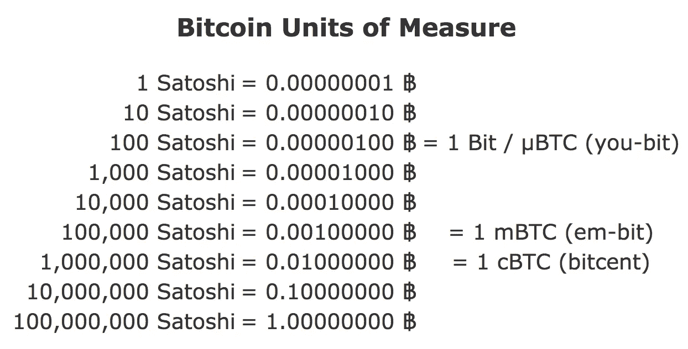**

**One Bitcoin is divisible up to 100 million units, and 1 Satoshi is the unit name for 100 millionth of 1 BTC.**

## **进行交易**

**交易有三种方式:**

**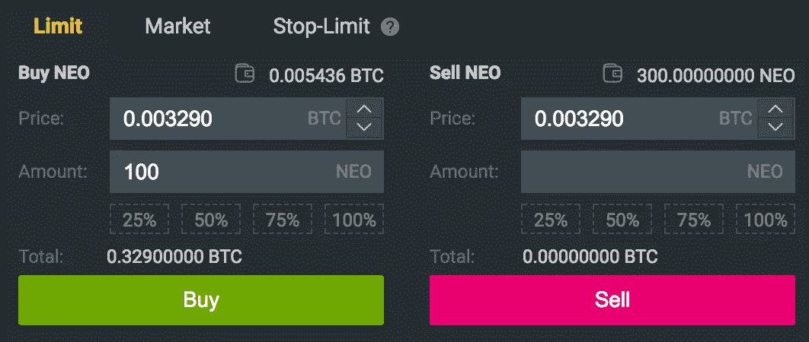**

**An example of the trading interface on Binance.**

1.  ****限价交易**这是一个很好的方法，可以在将来代币价格达到您的目标价格时，自动完成买入或卖出订单。**
2.  **T21 有些交易所，比如币安，会允许你以市场价格买入。在 Bittrex 上，这被称为“要价”，即市场上的要价。如果您想立即购买或出售代币，这是在市场上购买的最快方式。**
3.  ****止损限价** 止损限价基本上可以让你以设定的价格，或者更好的价格自动触发订单。例如，如果你设置了一个 5 美元的“止损点”,那么当价格低于 5 美元时，你会自动开始买入。当你设置止损限价单时，反之亦然。**

**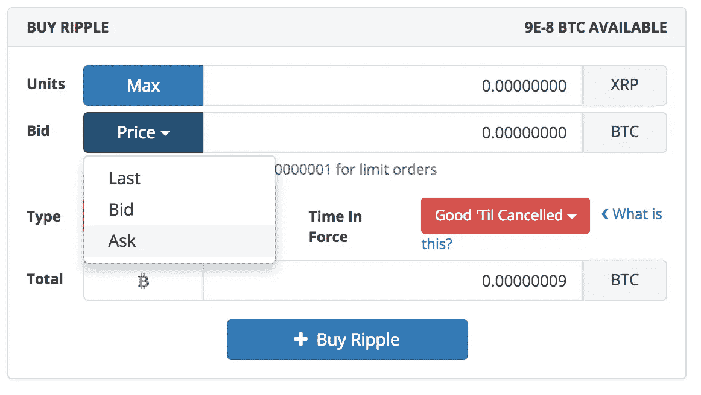**

**Bittrex’s trading interface. Clicking “Bid” allows you to fill in the last market sell or buy price.**

> **提示:为了快速检查你输入的比特币金额是否正确，你可以在[http://preev.com/](http://preev.com/)上粘贴金额，将其转换成美元。**

**要了解更多关于交易的知识，这里有一个由@humanpuck 撰写的关于如何在比特币基地购买 crypto 的详细指南:**

** [## 购买加密货币的初学者指南

### 简介我已经有几个人联系我开始使用 crypto，所以我把这个方便的小…

steemit.com](https://steemit.com/cryptocurrency/@humanpuck/a-beginners-guide-to-buying-crypto-currency)** 

# **管理您的投资组合**

**现在我们已经讨论了交易，让我们继续讨论如何管理你的投资组合。在当前的加密生态系统中，你可能会发现自己分散在各个交易所和几十个钱包中。坦率地说，记住你投资了哪些代币，买了多少，以什么价格买入，跨越众多的地址和地点可能是一件非常麻烦的事情。**

**其中一种方法是建立一个 excel 电子表格，但是与实时数据保持同步被证明是一个挑战。幸运的是，有一些应用程序可以帮助你记录交易，显示你的盈亏。**

## **帮助您管理投资组合的应用程序**

**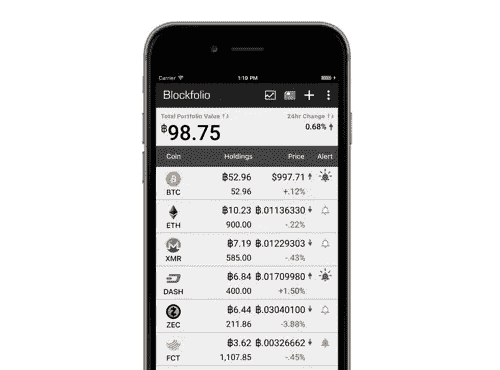**

**If only Bitcoin was still $997…**

## **[单行本](https://www.blockfolio.com/)**

**Blockfolio 是首批专门用于管理加密投资的应用程序之一。这是更受欢迎的选项之一，因为它已经推出了一段时间，并且它在 iOS 和 Android 上都可用。**

**首先，需要进行一些设置，因为您需要手动输入所有交易。设置完成后，它会显示你的投资组合余额和收益/损失，你可以在用 BTC 或你的默认法定货币查看值之间切换。它通常很好地向你展示了你的投资组合概况和你持有的硬币的价格。然而，要查看你每枚硬币赚了多少有点棘手，因为你需要点击硬币，然后点击“持有”标签来查看你的利润，这有点像 UX 的烦恼。**

**你还可以设置价格提醒，它还可以从 cointelegraph.com 等与加密相关的新闻网站获取最新消息。**

****优点:****

*   **Blockfolio 跟踪超过 2000 枚替代硬币，使其成为最全面的投资组合应用程序之一**
*   **价格提醒**
*   **基本的新闻提要**
*   **支持多种法定货币**
*   **可在 iOS 和 Android 上使用**

****缺点:****

*   **输入交易会变得非常繁琐，因为它只允许您手动输入交易**
*   **图表不是交互式的**
*   **应用程序加载速度非常慢，出现了一些服务器问题，特别是在过去两周，随着加密市场受到越来越多的主流关注，Blockfolio 完全崩溃了。**
*   **有时，数据(代币价格)与实际汇率似乎不准确**
*   **这个设计非常简单，UX 有时会让人有点困惑**

**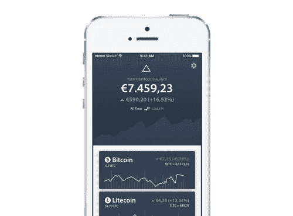**

**Delta presents your data in a better UI.**

## **[增量](https://getdelta.io/)**

**Delta 是一个较新的应用程序，它也管理你的加密投资，并显示你的收益和损失。像 Blockfolio 一样，你也需要手动输入你的交易来计算你的利润。**

**达美航空的 UX 比 Blockfolio 设计得更好，一般来说也更方便用户使用。我还喜欢这样一个事实，即它向您显示每个令牌的前期利润，而不需要进入几个屏幕。这是一个小小的吹毛求疵，但是我认为它在可用性方面有很大的不同。**

****优点:****

*   **还跟踪超过 2000 个代用币，所以你交易的大部分代币应该是可用的**
*   **价格提醒**
*   **支持多种法定货币**
*   **UX 比单行本好多了**
*   **iOS 和 Android 上都有**

****缺点:****

*   **像投资组合一样，交易的输入也是手动的，所以如果你交易很多，就很难追踪你的确切交易，以获得你持有的准确视图**
*   **图表不是交互式的**
*   **没有像 Blockfolio 这样的新闻部分**

## **[矩阵组合(开发中)](http://matrixportfolio.com)**

**Matrix 是我在尝试了一系列投资组合应用程序后启动的一个项目，我发现它们中的大多数都缺乏功能，而 UX 也缺乏完善。所以我开始建立自己的网站，让跟踪投资变得更容易。**

**我发现具有挑战性的一件关键事情是，从你交易的交易所自动拉进你的持仓，令人惊讶的是，没有多少应用程序提供这种功能。这是将被构建到矩阵中的东西。**

**开发正在进行中，我们希望在下个月推出测试版。这是最新设计的预览:**

****

**A preview of our latest design prototypes. Signup for beta access at [http://matrixportfolio.com](http://matrixportfolio.com)**

****特性&矩阵的主要区别:****

*   **精心制作的设计和简单的用户体验，UX 是一个高优先级(设计完成)**
*   **对大多数硬币的全面支持(开发中)**
*   ****安全同步**与交易所自动拉入您的交易和余额，计算您的利润和损失，无需手动输入(开发中)**
*   **如果愿意，也可以手动输入交易(已完成)**
*   **漂亮的、移动友好的、交互式图形(正在开发中)**
*   **多产品组合支持(已完成)**
*   **多货币支持(开发中)**
*   **新闻源(计划中)**

**加上许多其他令人兴奋的功能，计划，但我们还不能宣布！**

****Matrix 的早期测试版注册** 如果你认为 Matrix 可能对你有用，我已经设置了一个早期测试版访问的注册页面，一旦它准备好就可以试用这个应用:[http://matrixportfolio.com](http://matrixportfolio.com)**

# **安保和安全**

**我相信你们中的许多人可能听说过许多关于丢失私钥、被盗比特币、被黑交易所等的恐怖故事。当有这么多钱处于危险之中时，采取一切可能的安全措施是很重要的，即使这可能会增加一些额外的不便。你的投资和辛苦赚来的钱安全无虞，这种安心是无价的。**

**以下是每个投资者应该做的几件事，以确保他们的投资安全:**

**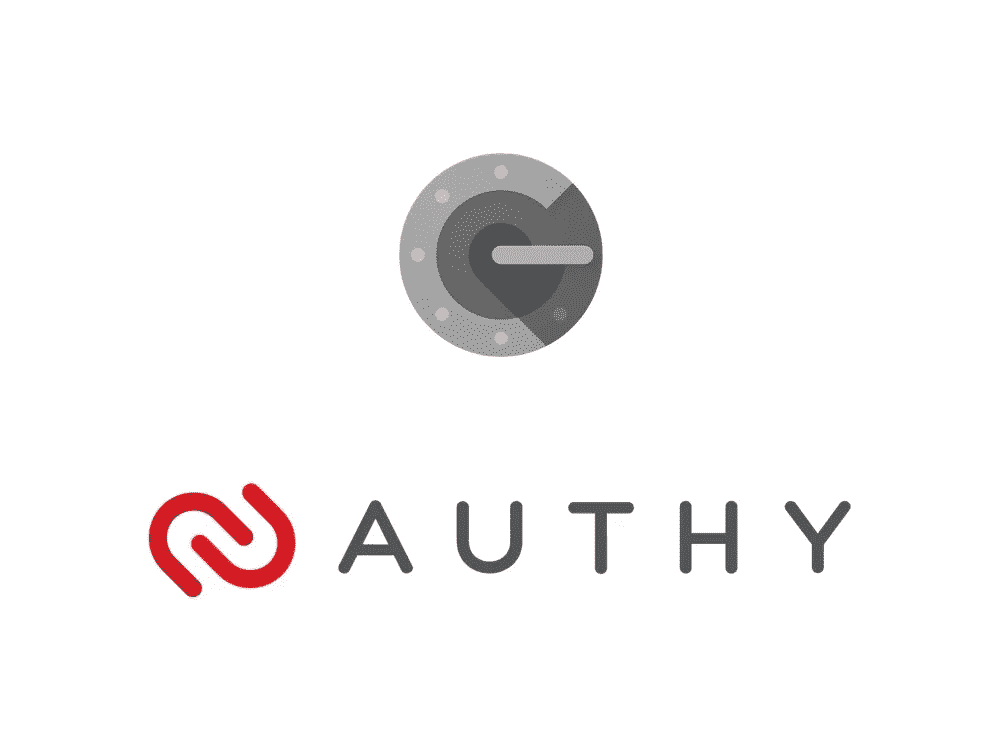**

****启用双因素认证(2FA)**
这是任何投资者在交易所或任何存放代币的地方注册后应立即启用的第一件事。所有交易所都有这个选项，所以启用它！2FA 确保即使您的登录和密码被泄露，黑客也无法进入您的帐户，除非他们也输入一个时间敏感的 6 位数字代码，只有您可以在您的手机上访问。**

**要设置双因素身份验证:**

1.  **下载[谷歌认证器](https://itunes.apple.com/ca/app/google-authenticator/id388497605?mt=8)或[认证器](https://authy.com)**
2.  **导航到您可以在 exchange/网站上为您的帐户启用 2FA 的位置**
3.  **你应该看到一个二维码，用应用程序简单扫描一下**
4.  **就是这样！**

**之后，每次你登录到你的帐户，它会额外要求你一个 6 位数字，时间敏感的代码作为额外的安全，然后访问你的帐户被授予。**

**一个常见的误解是必须使用 Google Authenticator 来启用 2FA。这不是真的。我个人推荐使用 [Authy](https://authy.com/) 来管理你的 2FA，因为它可以与多个设备同步，如果你更换或丢失了你的手机/设备，你可以随时恢复你的 2FA 代码。**

**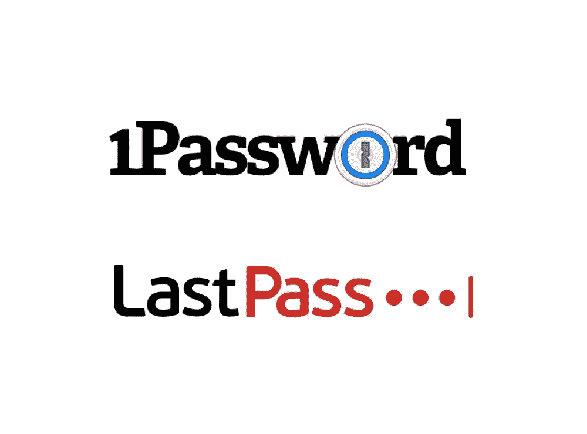**

**使用长而安全的密码(还有一个密码管理器，它们是免费的！)
每次你想登录交易或查看你的余额时，挖掘它可能有点麻烦，但如果你利用安全的密码管理器，它可以帮助你生成并记住你交易的所有交易所的每次登录/密码，这一过程将更加无缝。**

**我推荐[1 password](https://1password.com)(1 台设备免费)，或者 [LastPass](https://lastpass.com) (多台设备免费)。**

> **提示:在密码管理器中保存您的 2FA 备份代码以及您的钱包地址也很有用，这样您就可以在转移令牌时轻松地复制和粘贴它们！**

****不要重复使用密码和登录名**
这个不言而喻。如果你的一个账户被入侵，不难想象黑客可以很容易地在各种交易所找到你的其他账户。在你意识到之前，你辛苦赚来的投资将会完全消失。**

# **要避免的常见错误**

1.  ****向错误的钱包地址发送代币** 这一点要记住超级重要！一旦你把你的硬币寄到一个错误的地址，就无法恢复。请务必仔细检查发送/接收地址。**
2.  ****发送错误数量的比特币**
    由于比特币的可分性高达 1 亿分之一，很难跟踪你实际发送了多少钱。使用类似于[http://preev.com/](http://preev.com/)的网站来仔细检查你发送/接收的 BTC 的价值。**

# **一般提示和建议**

> **“将时间投入市场是一种更安全、更有利可图的策略，而不是试图把握市场时机。”**

1.  ****投资你能承受的损失** 加密货币是一种全新的资产类别，也是一个全新的市场。这是一项超高风险的投资，你应该抱着这样的心态投资:你投入的资金有一天很可能一文不值。所以投资不要超过你能承受的损失。**
2.  ****买入一枚上涨的硬币**
    通常，当一枚硬币价格飙升或处于牛市时，人们很容易想买入并赶上这波行情。我强烈建议不要急于买入交易，因为最有可能的是，当你买入时，价格将开始调整，你将亏本持有代币。**
3.  ****不要试图为市场计时** 在交易加密货币时，市场不仅比传统市场波动更大(一天内波动 20%-50%是常事)，而且更不可预测。你不能总是卖顶买底。将时间投入市场是一个更安全、更有利可图的策略，而不是试图去把握市场。**
4.  ****HODL** 你交易加密货币越多，你就越会注意到人们说“只是 HODL”。最初是比特币论坛上的一个错别字，现在它已经成为一个迷因和一种普遍的交易策略，意味着长期持有。这是明智的建议，也是我个人遵循并发现有效的建议。只要在高点和低点都坚持你的投资，避免日内交易。随着时间的推移，市场会增长，你的投资也会增长，不要太贪婪，不要试图让你的投资过早地翻倍。**
5.  ****逢低买入** 随着时间的推移，你会开始注意到加密市场的模式，通常会有牛市(价格强劲上涨)的时期，然后是回调。这些调整(或下跌)是加仓和向投资组合注入更多资金的最佳时机。**
6.  ****分散您的投资组合**
    有几类项目与区块链的技术有天然的协同作用和近期应用，而其他的则是更具长期潜力或可能性的项目。除了降低风险，分散你的投资组合也很重要，以确保你在不同的类别中投下更大的网，以确保你不会错过任何机会。我个人建议查看以下类别:货币(BTC，VTC 等)，平台(ETH，NEO，QTUM)，供应链(WTC，VEN，WaBi，MOD 等)，隐私聚焦(XMR，ZCash，XVG，HUSH 等)，区块链不可知(ARK，LINK)。**
7.  **总是做你自己的研究
    由于加密市场目前不受监管，有很多诈骗项目或简单的抢钱活动。这是狂野的西部，在投资你辛苦赚来的钱之前，你应该**永远**做好自己的尽职调查。在判断一个令牌/项目是否是一项好的投资时，有许多因素需要考虑，以下是其中的一些:**

*   **团队——团队是否有经验，他们是否有良好的背景？他们是真实的，经过验证的身份吗？**
*   **技术——他们是否在开发真正的技术来满足需求或解决问题？他们的方法有什么不同？他们正在积极发展吗？他们有自己的区块链吗？是不是另一个令牌的克隆？**
*   **令牌——虽然一些项目可能有一个好的概念，但这并不一定意味着它将是一个好的投资。重要的是要了解你购买的代币是否会随着时间的推移而增值。你投资于价格会上涨的希望，所以代币应该有激励它这样做，有真正的效用。**
*   **时间表——项目是否有路线图？他们有真正的、明确的目标吗？他们已经有工作产品了吗？他们设定了什么样的目标，什么时候推出？了解时间线对于知道现在是否是投资的正确时机非常重要。如果一年后才有可预见的里程碑，短期内投资其他地方会更明智。**

# **最后**

**截至今天，区块链技术和加密货币仍处于起步阶段，要完全理解这个领域还需要一点学习曲线。我个人觉得这很迷人，目睹这种财富、创新和技术的爆炸令人肃然起敬。这让人想起了互联网的早期，没有比现在更好的时机来投资你相信的项目，因为投资回报可能会改变生活。**

**所以，系好安全带，下赌注，了解所有不同的项目，并观察行业在未来几年达到主流采用。祝你好运！**

## **感谢阅读！**

**接下来我应该覆盖什么？下面留言评论！**

# **觉得这个帖子有帮助吗？为能见度鼓掌！**

**想看更多这样的帖子吗？可以捐助:
BTC:1 mfh eg 8 vbasxetlvhsnydz 19 vtr 8 whamav
ETH:0x 467 FEC 405423 CBE 45443380126 f 2150 e 9 ede 7281
LTC:LPA BF 8 zq 7 ojutdj 2 rqyccfyx 6 majcdevu 5**

****或注册我的推荐链接:****

**注册我的推荐链接:[https://www.coinbase.com/join/5a29dfd8f971bc0139813b5b](https://www.coinbase.com/join/5a29dfd8f971bc0139813b5b)获得 **$10** 投资比特币基地**

 **https://www.binance.com/?ref=10027623[或者币安](https://www.binance.com/?ref=10027623)**

# **资源和延伸阅读**

**@humanpuck 关于如何在比特币基地购买加密的详细指南:**

** [## 购买加密货币的初学者指南

### 简介我已经有几个人联系我开始使用 crypto，所以我把这个方便的小…

steemit.com](https://steemit.com/cryptocurrency/@humanpuck/a-beginners-guide-to-buying-crypto-currency) 

[Stephen McKeon](https://medium.com/u/d1b00c9f1ea7?source=post_page-----76027bebb1b1--------------------------------) 在这里也有一个很棒的、深入的指南，有更多的资源和影响者值得关注:

 [## 比特币、区块链和加密资产入门

### 朋友和家人经常问我从哪里开始学习比特币和区块链。随着最近价格的上涨…

hackernoon.com](https://hackernoon.com/getting-started-with-bitcoin-blockchains-and-cryptoassets-2e9c1c685576) 

用 Preev 快速获得比特币在菲亚特的价值:

 [## 比特币汇率-比特币 Live 转换器- Preev

### 查看现场比特币价格。用这个简单的比特币计算器在美元和其他货币之间转换金额。

preev.com](http://preev.com/) 

/r/crypto currency Reddit——这是一个很好的新闻来源，可以让您随时了解加密世界:

 [## 加密货币新闻和讨论。* r/加密货币

### 加密货币新闻和讨论。比特币，莱特币，以太坊，瑞波，Monero，Dash，NEO，IOTA 闪电网…

www.reddit.com](https://www.reddit.com/r/CryptoCurrency/) 

Coindesk —最大的加密货币新闻网站之一:

 [## 区块链新闻的领导者。

### 区块链新闻的领导者。

news.www.coindesk.com 区块链的领导者](https://www.coindesk.com/)**