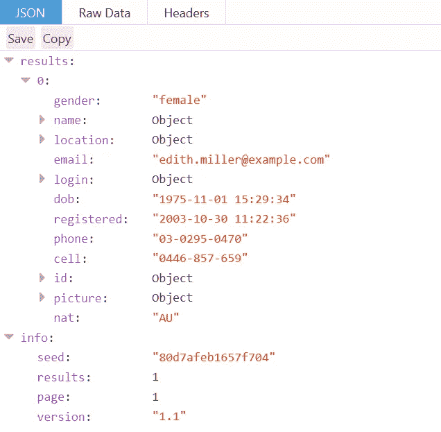
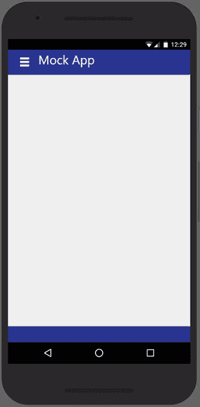
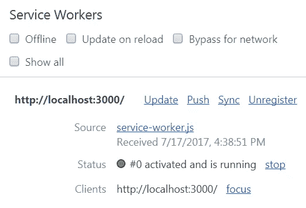
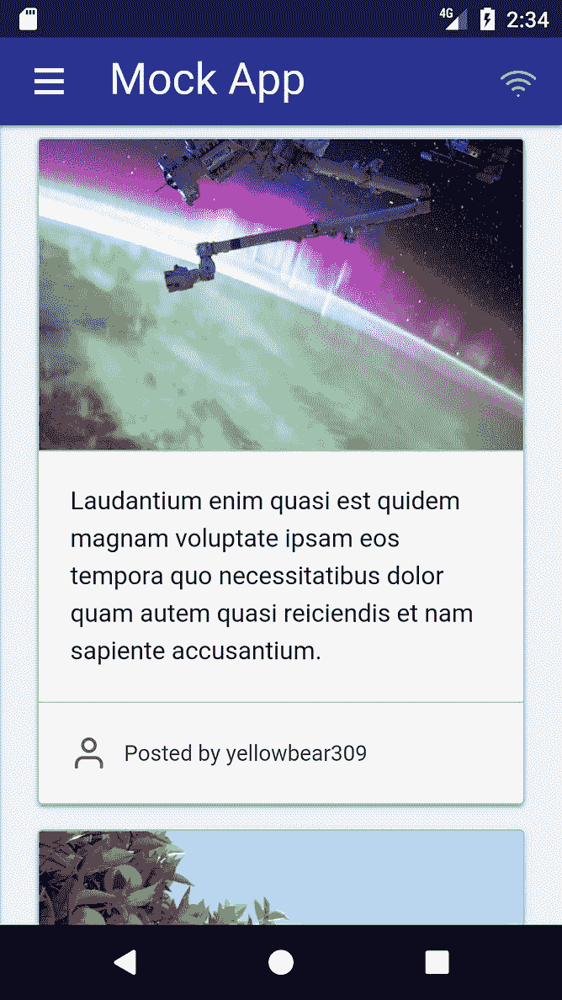
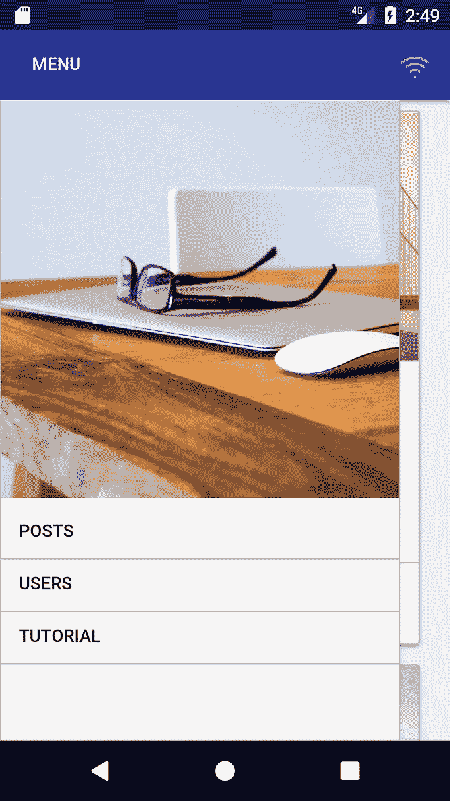

# 渐进式网络应用入门指南&前端网络

> 原文：<https://medium.com/hackernoon/a-beginners-guide-to-progressive-web-apps-the-frontend-web-424b6d697e35>


Photo by [Craig Garner](http://unsplash.com/photos/YoadQb46v6k?utm_source=unsplash&utm_medium=referral&utm_content=creditCopyText) on [Unsplash](https://unsplash.com/?utm_source=unsplash&utm_medium=referral&utm_content=creditCopyText)

为前端 web 开发并跟上 Javascript 生态系统以及所有新术语和华而不实的框架至少可以说是令人生畏的。我想试着在一篇文章中尽可能多地回顾它，现在我终于鼓起勇气这样做了。在这篇文章的最后，我希望你已经学到了一些新的东西或者磨练了一点你的 web 开发技能。具有讽刺意味的是，这篇文章的长度和内容也可能令人生畏，但我强烈建议你至少花时间阅读你感兴趣的部分。每个部分都有一个**TL；博士在最后，所以你可以快速浏览，直到你发现一些有趣的东西。**

## RESTful APIs

我要介绍的第一件事是**RESTful API**的概念。术语 REST 或 RESTful API 在 web 开发人员的大多数对话中出现得很多，这是有充分理由的。REST(表述性状态转移)API 和 web 服务提供了一种与后端架构进行通信的简单方法，无需理解或弄乱架构本身。

更简单地说，作为一名前端开发人员，你将与一个或多个端点(即 **URIs** )进行交互，这些端点是驻留在服务器、集群或类似后端的 API 的一部分，是别人为你创建的。如果 API 设计得很好，你将会得到关于如何在后端请求、创建和编辑资源的清晰而简明的文档(假设你有适当的授权)，而不必用 PHP 编写代码或接触驻留在所述后端的 SQL 数据库。

RESTful APIs 有多种形式，最流行的是返回 **JSON** 对象的 API，这可以在客户端用 Javascript 非常容易地操作，有效地允许前端开发人员只处理**视图**和**控制器**部分的 **MVC** (模型-视图-控制器)模式。

> **TL；DR:**RESTful API 非常受欢迎，它为前端开发人员提供了一种与 web 上的资源进行通信的方式，有效地允许他们专注于前端开发，而不用担心底层架构。

## 创建交互式、快速动态网页应用的网页开发技术

AJAX(asynchronous JavaScript 和 XML)已经存在很多年了，每个 web 开发人员都以这样或那样的方式使用过它(我们大多数人通过 jQuery)。我不打算在这里深入讨论 AJAX，因为网上有数百种更好的资源，但是我想花一点时间来欣赏一下它给前端开发人员带来的强大功能。

[](https://developer.mozilla.org/en-US/docs/AJAX/Getting_Started) [## 入门指南

### 本文将引导您了解 AJAX 基础知识，并给出两个简单的实际例子来帮助您入门。

developer.mozilla.org](https://developer.mozilla.org/en-US/docs/AJAX/Getting_Started) 

使用 AJAX，我们可以随时从一个或多个在线位置(或者本地，如果您的页面与您请求的 URI 驻留在同一个服务器上)请求资源，而我们的 web 应用程序不会变慢，也不需要获取所有数据来开始呈现。事实上，我们可以避免在页面上加载任何内容，然后在加载完空的 HTML 页面后立即请求它。这与前面提到的 RESTful APIs 相结合，为 web 应用程序提供了大量的灵活性、可移植性和可维护性。

> **TL；DR:** AJAX 是一个非常强大的工具，它可以与 RESTful APIs 相结合来创建真正动态的 web 应用程序，这些应用程序可以快速加载并显示来自 web 资源的内容。

## 从 web 获取内容

一开始创建你的第一个 web 应用似乎有点困难，所以让我们一步一步来，从使用 AJAX 调用从 RESTful API 获取内容开始**。**

第一步是**找到一个高质量的 API** ，最好是输出到 JSON 的 API。以下是我在网上搜索时找到的一些资源，它们输出占位符内容，我们可以用它们来构建一个示例 web 应用程序:

*   [JSON 占位符](http://jsonplaceholder.typicode.com/) —占位符**文本**以 JSON 格式输出，涵盖了很多常见用例。非常容易上手，非常适合填充一个模拟的 web 应用程序，比如我们将要制作的这个。
*   [取消占位符](https://unsplash.it/) —没有**图像**的占位符内容是不完整的，这是获取它们的最终位置。文档非常清晰，易于理解，因此您可以立即开始使用。
*   [随机用户生成器](https://randomuser.me/) —另一种高质量资源，为您提供生成的**用户档案**，可根据您的需求进行定制。它允许过多的选择，但在这篇文章中，我们只需要选择几个。

我们将使用这三个 API，但是您可以随意查看文章末尾的列表，以获得更多有趣的 API，您可以使用它们来为您的页面生成占位符内容。

所以，在你写任何代码之前，你想做的第一件事实际上是**访问其中一个的端点**，看看你得到了什么。让我们向[随机用户生成器](https://randomuser.me/api/)发送一个 GET 请求，只需访问它。您将得到的结果应该与此类似:



Results from visiting the Random User Generator

您在浏览器和上图中看到的是一个 JSON (JavaScript Object Notation)文件，如果您曾经在 JavaScript 中使用过对象，应该会很熟悉。因此，让我们以编程方式请求相同的资源:

A simple way to send a GET request to an API

上面的代码片段正是这样做的，它只需要 10 行代码(9 行，没有注释)。现在唯一要做的就是给它一个与我们的 API 端点匹配的`url`和一个用于`callback`的函数，这样我们就可以看到一些内容了。让我们试一试。假设您已经创建了一个空的 HTML 页面并链接到上面的 Javascript 代码，只需从浏览器的开发工具中运行它:

```
httpGetAsync(
  'https://randomuser.me/api/',
  function(e){console.log(e)}
);
```

您应该得到的是一个与前一个类似的结果，只是现在它用双引号括起来了。自然，结果是一个字符串。更自然的是，我们可以**使用`JSON.parse()`将它转换成 Javascript 对象**，然后像预期的那样使用它。

我们只是从一个 API 中获取了一些内容，并将其打印到控制台上。在我们继续之前，让我们更深入地研究一下这个特定的 API，这样我们就可以在本文的剩余部分更好地利用它。

具体来说，我想把重点放在[种子](https://randomuser.me/documentation#seeds)和[结果](https://randomuser.me/documentation#results)参数上，我们可以将它们嵌入到我们的 url 中，以便每次都能获得相同的用户群。要添加这些参数，我们只需在输出 url 后添加一个`?`，然后添加`{parameter_name}={value}`，用一个`&`分隔多个参数。我想这是常识，但可能值得一提。在这篇文章中，我还将使用[nationals](https://randomuser.me/documentation#nationalities)参数来确保没有非拉丁字符出现在我的 HTML 中，使我的生活变得困难。从现在开始，我获取用户的目标端点将是 [this](https://randomuser.me/api?seed=%22ph%27nglui%20mglw%27nafh%20Cthulhu%20R%27lyeh%20wgah%27nagl%20fhtagn%22&results=25&nat=US) ，允许我在这篇文章的剩余部分获取同样的 25 个用户，全部来自美国。

> **TL；DR:** 要开始开发一个 web 应用，你必须找到一个高质量的 JSON API。使用 10 行 Javascript 代码，您可以轻松地从输出随机用户的 RESTful API 请求资源，并将它们转换为 Javascript 对象。

## 表示和 CSS 框架难题

已经设法从 API 中获取了一些内容，现在我们必须将它呈现给用户。然而，处理 CSS 样式和选择器真的很麻烦，所以大多数人求助于使用一个 **CSS 框架**。流行的选择似乎是 [Bootstrap](http://getbootstrap.com/) ，它有很好的文档，有一个很好的大型社区，功能丰富。然而，我将使用 [mini.css](http://minicss.org/) ，这是我自己开发的，我比 Bootstrap 更了解它。如果你想了解更多，我写了几篇关于如何开始使用它以及为什么它值得一试的文章。

[](https://hackernoon.com/5-reasons-to-try-out-mini-css-62ddb47b9370) [## 试用 mini.css 的 5 个理由

### 在这篇文章中，我将解释为什么 mini.css 是 css 框架生态系统的一个有价值的补充，以及…

hackernoon.com](https://hackernoon.com/5-reasons-to-try-out-mini-css-62ddb47b9370) 

关于如何使用框架的类和选择器的指南只适用于 mini.css，但是稍加调整，它们也应该适用于 Bootstrap(将 web 应用程序的演示视为您的家庭作业，因为我不会在这里深入讨论 css)。

在我们可以在屏幕上呈现任何东西之前，我们应该**创建一个应用程序外壳**。除了应用程序的导航栏和标题以及页脚之外，没有什么特别的东西。我将使用由 mini.css 预先设计好的`<header>`元素，但是您可以按照自己认为合适的方式来解决这个问题。我还将在我的导航栏中添加一个`.drawer`，可以用一些按钮替换，最后添加一个`<footer>`，让它看起来更好更干净。下面是我的应用程序外壳的样子:



A simple application shell consisting of a navigation bar and a footer

稍后我会向你展示我的代码(在我们添加了用户卡之后)，但是在我们继续之前，让我告诉你**为什么使用 CSS 框架是个好主意**。简而言之，当构建 web 时，有太多的测试用例需要你考虑，一些设备/操作系统/浏览器的组合比其他的更古怪。CSS 框架以它认为合适的方式处理这些怪癖，同时也为你提供了一个很好的线框，可以帮助你制作出响应性很强的应用程序。在开发移动设备时，响应能力是非常重要的，所以一定要花时间仔细阅读。

假设我们对我们的应用程序外壳满意，让我们继续,**呈现我们从随机用户生成器得到的数据**。我将保持简单，并呈现每个用户的图像，姓名，用户名，电子邮件，位置和生日，但你可以让它变得复杂。记住在解析 JSON 数据后访问对象的`.results`键，因为所有东西都包装在里面。为了让一切看起来漂亮，我将使用奇妙的[羽毛图标包](https://feathericons.com/)，以及来自 mini.css 的`.card`类和一些简洁的 css 技巧。

Our sample application with its random users rendered as cards

我们的 web 应用程序现在动态填充了使用 Javascript 和 HTML 呈现的内容。我们刚刚创建了我们的第一个视图**，这可以说是我们已经创建了上一步从 API 请求的数据的可视化表示。**

> ****TL；DR:** 对于任何 web 应用程序来说，响应性和样式都非常重要，所以使用 CSS 框架创建一个简单的 HTML 应用程序外壳，然后使用一些 Javascript 呈现我们从 API 获得的数据是一个好主意。**

## **Javascript 库**

**到目前为止，我们的模拟 web 应用程序运行良好，但是 Javascript 代码，尤其是`renderUsers()`方法有点混乱，似乎很难维护。谢天谢地，有一个更好的方法来做同样的事情，使用现在所有酷孩子都使用的工具— [React](https://facebook.github.io/react/) 。对于那些没有听说过它的人来说，它是一个非常强大的 Javascript 库，使用虚拟 DOM 和 diffing 技术使页面的渲染和更新变得更加容易。我不打算深入解释这两个，因为你可以在网上找到大量有价值的资源。**

**[](/@gethylgeorge/how-virtual-dom-and-diffing-works-in-react-6fc805f9f84e) [## 虚拟世界和差异是如何起作用的

### 我一直在试图理解虚拟 DOM 是如何工作的，虽然从高层次上来说，这是很清楚的。我在找…

medium.com](/@gethylgeorge/how-virtual-dom-and-diffing-works-in-react-6fc805f9f84e) 

将我们现有的代码转换成 React 并不那么困难。事实上，我们所要做的就是将循环移出渲染过程，这样我们就可以**提取一个函数，一次渲染一个用户**，然后迭代我们的用户数组，像以前一样渲染每个用户。这里有几个 React 特有的注意事项，比如我们的新函数名必须以大写字母开头，我们必须向它传递一个参数`props`，元素列表必须用[键控](https://facebook.github.io/react/docs/lists-and-keys.html#keys)。这听起来可能很多，但老实说，这并不太难处理。

React 还支持 JSX，这让我们可以在 Javascript 中编写 HTML，而不需要用引号括起来。所以，我们现有的代码可以稍微清理一下。但是，请记住，需要进行一些转换，例如从`class`到`className`，但是随着时间的推移，您会习惯这些转换，控制台中的调试消息在帮助您修复这些问题方面非常有用。

我也擅自将三个内联 SVG 转换成它们自己的函数，所以现在整个渲染过程应该看起来像这样:

Rendering a list of users using React

我们只是从之前的代码中提取了一个**功能组件**，本质上使它成为一个可重用的实体。值得看一看在引擎盖下发生了什么，因为 **Babel** 将我们提供的 HTML 转换为`React.createElement()`调用，使它看起来像这样:

The transpiled code for the SvgMapPin functional component

另外，如果你想开始使用 React 的一个轻量级版本，而不需要 JSX 和一些更花哨更复杂的东西，我会强烈建议检查一下 [Preact](https://preactjs.com/) ，因为它是一个很好的选择，可以减少一两秒钟的加载时间。

> **TL；DR:** 使用 React 将非结构化的 HTML 呈现调用转换为功能组件非常简单，而且更易于维护，同时它给了开发人员更多的代码控制权，并允许重用。

## 添加第二个视图

大多数 web 应用程序都有不止一个视图，所以这是我们接下来要做的。我们将利用上面提到的另外两个 API 来创建第二个视图，这个视图是动态填充的，包含每次重新加载页面时都会出现的文本和图像。假设你在集中注意力，你应该能够在没有很多指导的情况下做到这一点，但我会给你一个大纲:

*   我们将向`https://jsonplaceholder.typicode.com/comments?postId={id}`发送 GET 请求，这将允许我们一次获得 JSON 格式的 5 段文本，随着我们的进行，`{id}`将递增。
*   我们还将向`https://unsplash.it/800/800?image={id}`发送 GET 请求，每次都会得到一个特定的图像。我们将使用一些代码为每个图像请求生成一个随机的`{id}`。在我的 Codepen 示例中，我还添加了一个从 API 中提取的无效的`{id}`值的数组，这样就不会有没有图像的响应返回。
*   两个请求完成后，我们将为每个帖子创建一个卡片，从我们的列表中随机指定一个用户作为作者，最后使用 React 进行渲染。
*   我们还想添加一个在两个视图之间切换的按钮，这样我们仍然可以查看用户列表。我会把它放在我的抽屉菜单里，但是你可以随意调整它。

在仔细编写了上面提到的所有代码并对其进行了润色之后，您应该最终得到一个类似于**单页应用程序(SPA)** 的东西:

Our mock web application now has two views

> **TL；DR:** 添加第二个视图和一些交互元素就是你所需要的，让你的模型 web 应用感觉像一个真正的 web 应用。

## 加载更多内容

如果你最近花了一些时间在网络上，你会立刻发现这个网络应用程序到底缺少了什么:**无限滚动**。如果你不熟悉这个概念，它指的是当页面在纵轴上滚动超过某个阈值时，加载更多的内容。在我们的示例中，我们将阈值设置为 80%，但是您可以根据自己的需要和偏好进行调整。为此，我们需要一个非常简单的方法来计算页面的滚动百分比。

Simple method to get the page’s scroll percentage

上面介绍的方法非常简单，考虑了所有情况，并返回一个在`[0,100]`范围内的值。通过绑定到`window`的`scroll`和`resize`事件，我们可以可靠地知道用户何时将到达页面末尾并加载更多内容。[这是在帖子视图中添加了无限滚动后，我们的 web 应用程序的样子。](https://codepen.io/chalarangelo/pen/ZyZXMw?editors=0010)

> **TL；DR:** 无限滚动是任何现代 web 应用程序的主要特点，并且非常容易实现，在必要时可以动态加载内容。** 

> **注意 **:** 如果你一直在阅读和关注整篇文章，现在是休息 10 分钟的好时机，如果你愿意的话，然后回来，因为最后几个部分相当复杂，要求有点高。**

## **Web 应用程序清单**

**在我们真正可以说我们已经构建了一个 web 应用程序(更不用说一个渐进式 web 应用程序)之前，我们需要处理 **manifest.json** 文件，它由我们的应用程序的`name`、`short_name`、`icons`和一系列其他属性组成，向客户端的浏览器提供关于我们的 web 应用程序的信息。然而，在我们开始处理它之前，我们需要借助 [npm](https://www.npmjs.com/) 和 [React 的提示](https://facebook.github.io/react/docs/installation.html#creating-a-new-application)让我们的 web 应用程序在`localhost`上启动并运行。**

**我假设您对前者比较熟悉，而后者不会给您带来任何麻烦，所以我将继续为我们的 web 应用程序设置清单。根据我的经验，你只需要填写这么多字段就可以创建一个工作的 web 应用程序，所以我建议你前往 [Web 应用程序清单生成器](https://tomitm.github.io/appmanifest/)，填写你想要的信息。如果你有时间用图标润色一切，你可以利用 [Favicon & App 图标生成器](http://www.favicon-generator.org/)来确保你的网络应用程序有一个漂亮的图标。**

**在完成了所有的工作之后，您的清单应该看起来像这样:**

**A sample web application manifest**

**通过创建清单，我们正在完善我们的 web 应用程序，并使它的行为更像它应该的那样。然而，这仅仅是网络应用成为一个**进步的网络应用**的开始。**

> ****TL；DR:**manifest . JSON 文件用于定义 web 应用程序的某些属性，有效地为渐进式 web 应用程序的创建铺平了道路。**

## **服务人员**

**构建渐进式 web 应用程序的最后一步是创建一个**服务工作者**。服务人员是渐进式 web 应用程序的核心需求之一，也是让我们的 web 应用程序在某种程度上能够离线工作的原因。虽然他们已经存在了相当长的一段时间，但关于服务人员的文档感觉有点太过技术化和复杂，但最近这种情况开始改变。如果你真的想了解更多关于渐进式网络应用和服务人员的信息，请查看帖子末尾的参考资料，因为我相信你可以找到一些有用的链接。**

**出于本文的目的，我们将创建一个最基本形式的服务工作者，允许我们缓存请求响应，然后在它们可用时提供服务。第一步是创建一个 **service-worker.js** 文件，它将作为我们的服务工作者。**

**[](https://developers.google.com/web/fundamentals/instant-and-offline/service-worker/lifecycle) [## 服务人员生命周期| Web | Google 开发人员

### 深入了解服务人员的生命周期。

developers.google.com](https://developers.google.com/web/fundamentals/instant-and-offline/service-worker/lifecycle) 

在我们真正让我们的服务人员做任何有用的事情之前，我们需要了解我们将要处理的三个核心事件:

*   `install`在**第一次加载**时被触发，用于执行服务工作者的**初始设置**，例如设置离线缓存。
*   服务人员注册并成功安装后`activate`被触发**。**
*   每当**一个 AJAX 请求通过网络**发送时`fetch`就会被触发，并可用于提供缓存资源(离线时尤其有用)。

在安装过程中，我们要做的第一件事是利用 **CacheStorage Web API** 为我们的 Web 应用程序创建一个缓存，并在其中存储任何静态内容(如图标、HTML、CSS 和 Javascript 文件)。使用下面的语法可以很容易地做到这一点:

Opening a cache using the caches global variable

我们可以快速创建一个简单的`install`事件处理程序来缓存我们的`index.html`、Javascript 文件和`manifest.json`，但是在此之前，我们必须为缓存指定一个名称。这允许我们从应用程序外壳中分离相同文件或数据的版本。我们不会在这里详细讨论缓存，但是如果你感兴趣的话，你可以在文章末尾找到关于缓存的参考资料。除了为我们的缓存定义一个名称之外，我们应该使用一个数组来指定哪些文件应该被缓存。让我们看看我们的`install`处理程序是什么样子的:

A typical Service Worker’s install event handler

在不到 20 行代码中，我们让我们的 web 应用程序**为其资源**利用缓存。不过，让我澄清一件事。`./static/js/bundle.js`文件是我们的 Javascript 代码在开发过程中被编译的内容。这是我们开发/生产环境的一个怪癖，我们将在下一步处理这个问题。

`activate`处理程序也很简单，它的主要目的是在应用程序外壳发生变化时更新缓存的文件。然而，如果我们想要更新任何文件，我们将不得不改变`cacheName` (最好是以一种[永远](http://semver.org/)兼容的方式)。最后，`fetch`处理程序将检查请求的资源是否存储在缓存中。如果找到资源，它将从缓存中为其提供服务，否则它将照常请求资源并将响应存储在缓存中，以便将来可以重用。将所有内容放在一起，对于这两个处理程序，您应该有类似于下面的代码:

Our Service Worker’s activate and fetch handlers

我们已经构建了我们的服务工作者，但是我们需要从我们的 web 应用程序中实际注册它，以便能够从它的功能中获益。我们只需要在主 Javascript 文件中添加几行代码，就可以将我们的 web 应用程序转变为渐进式 web 应用程序了:

Registering our Service Worker

设置好所有这些之后，你应该在你的 **Chrome Dev Tools** 上打开**应用**面板，看看一切是否如预期的那样工作。您应该看到一个正确注册、激活并运行的服务人员。如果你滚动一点，然后勾选 Chrome 开发工具中的离线复选框并刷新，你将得到一个使用缓存资源的离线版本的页面。



Our Service Worker running on Chrome Dev Tools

我们刚刚把我们的网络应用程序变成了一个渐进式网络应用程序，但是我们仍在开发中。在我们准备好与世界分享它之前的最后一步是**生产**。

> **TL；DR:** 服务人员允许 web 应用程序设置缓存，并利用它们在不使用网络的情况下加载资源，本质上将 web 应用程序转变为渐进式 web 应用程序。** 

## **生产捆绑**

**到目前为止，我们所做的一切在托管在`localhost`上时都工作得很好，但是在快速的`npm run build`之后检查生产文件会发现一大堆我们需要解决的错误。首先也是最重要的，我们的许多文件没有正确地链接到我们的 HTML 页面。为了处理这个问题，我们需要在我们的 **package.json** 中添加一行代码，如下所示:**

```
"homepage" : "."
```

**在浏览器中重建并打开我们的 HTML 页面后，我们可以看到它基本上正常工作。添加带有`"homepage"`属性的这一行，我们告诉构建脚本更改引用`.`的所有路径，这意味着它们现在是相对路径。**

**我们的下一个问题是我们的服务人员指向了错误的 Javascript 文件，因为不再有`static/js/bundle.js`了。如果我们仔细观察构建文件，我们会发现我们的 Javascript 已经被转换成了一个`main.{hash}.js` 文件，其中的`{hash}`部分在每个构建中都是不同的。我们想要的是一个名为`main.js`的文件，这样我们就可以从我们的服务人员那里加载它。因此，我们需要重命名文件，这反过来会破坏我们的`index.html`中的引用，这是我们绝对不希望的。为了解决这两个问题，我们将不得不使用 npm 注册表中的一些**构建工具**，即[重命名器](https://www.npmjs.com/package/renamer)和[替换器](https://www.npmjs.com/package/replace)。我们还想缩小我们的`service-worker.js`，因为默认情况下它没有被压缩，因为它是我们的`public`文件夹的一部分，所以我们应该继续抓取 [uglify-js](https://www.npmjs.com/package/uglify-js) 。**

```
npm install --save-dev renamer
npm install --save-dev replace
npm install --save-dev uglify-js
```

**三个简单的命令，我们得到了我们需要的工具。现在要好好利用它们。同样，在浏览了工具的文档之后，这应该是相当容易的，所以我将继续向您展示在创建了所有必要的脚本之后，我的 **package.json** 的`"scripts"`属性是什么样子的。**

**The list of scripts that we will be using for building**

**让我们继续解释每件事的作用:**

*   **`build-rename`运行两个脚本，每个脚本替换用期望的名字生成的 Javascript 和 CSS 文件的名字(分别是`main.js`和`main.css`)。**
*   **`build-replace`运行两个脚本，用重命名的版本替换对 Javascript 和 CSS 文件的引用。**
*   **`build-rename-replace`将前两者捆绑在一个命令中。**
*   **`build-sw`更新服务人员对`static/js/bundle.js`的引用，现在指向新的`main.js`文件，它还添加了对`main.css`的引用，以便更好地测量。之后，它会裁减服务人员。**
*   **最后，`build`将以上所有内容捆绑在一起，连同我们默认的构建过程，这样无论什么最终出现在`build`文件夹中，现在都可以发布到网站上了。**

**运行`npm run build`现在应该会产生一个 progressive web 应用程序的生产就绪版本，我们现在可以在任何地方托管它，只需简单地复制`build`文件夹中的文件。**

> ****TL；DR:** 为生产构建一个 web 应用程序提出了一些有趣的问题，这些问题需要使用构建工具和脚本来解决。在我们的例子中，简单地更新名字和引用就可以了。**

## **最后的步骤**

**这是一条漫长而曲折的道路，但我们的 web 应用程序最终成为了一个可用于生产的渐进式 web 应用程序。在像 Github 页面这样的东西上与世界分享它之前的最后一步是**评估它的质量**，使用[灯塔](https://developers.google.com/web/tools/lighthouse/)，一个帮助我们评估我们的网络应用和处理问题的工具。**

**在我基于`localhost`的开发构建上运行它之后，我发现了一些需要修复的东西，比如没有`alt`属性的图像、没有`rel="noopener"`属性的外部链接以及我的 web 应用程序缺少一个地标区域，使用`<main>` HTML 标签可以很容易地修复这个问题。在修复了我能修复的一切之后，下面是我的灯塔得分:**

****

**Lighthouse scores for our progressive web app**

**如你所见，它优化得非常好，是一款进步的网络应用。我现在可以自豪地将它发布在 Github 页面上。[这里的](https://chalarangelo.github.io/mock-pwa/)是指向已完成的 web 应用程序本身的链接，[这里的](https://github.com/Chalarangelo/mock-pwa)是指向 Github 上源代码库的链接。我也擅自添加了在线/离线指示器，但是您可以跳过这些或者只查看我的代码。现在，我终于可以**把它安装在我的手机**上，并向我的朋友们炫耀了！**

************

**Our completed progressive web app installed on an Android device**

> ****TL；DR:** 在一个 web 应用程序准备发布之前，用 Lighthouse 测试它的质量并尽可能地优化它是值得的。**

> **这就是全部，从零到进步的 web app。我希望你在这个过程中学到了一些东西。非常感谢您的宝贵时间！**

## **资源**

*   **[MDN 的 AJAX 入门](https://developer.mozilla.org/en-US/docs/AJAX/Getting_Started)是一个很好的起点，如果您有兴趣了解更多关于 **AJAX** 以及如何在 web 应用程序中使用它的话。**
*   **就**JSON API**而言，这里还有一些您可能会感兴趣的:
    [UI Names](https://uinames.com/)——生成**随机用户**的另一个资源，可以进行大量定制以满足您的需求。
    [Robohash](https://robohash.org/) —从给定字符串生成**机器人头像**，用于创建用户资料或占位符图像。
    [可爱的头像](http://avatars.adorable.io/)——从给定的字符串生成**看起来滑稽的头像**，与 Robohash 相比变化稍小，但它确实有用。**
*   **在庞大的 **CSS 框架**生态系统之外， [Bootstrap](http://getbootstrap.com/) ，[语义 UI](http://semantic-ui.com/) ，[布尔玛](http://bulma.io/)和[基础](http://foundation.zurb.com/)似乎还蛮受欢迎的。我也建议我自己的替代方案， [mini.css](http://minicss.org/) ，以防你想使用稍微轻松一点的东西。**
*   **对于 **UI 图标**， [FontAwesome](http://fontawesome.io/) 通常是确定的选择，但我个人推荐[羽毛](https://feathericons.com/)，它更轻便，更简约。**
*   **如果你想了解更多关于**区分和虚拟 DOM** 的知识，我强烈建议你花时间阅读[这篇文章](/@gethylgeorge/how-virtual-dom-and-diffing-works-in-react-6fc805f9f84e)。**
*   **在所有现代的 **Javascript 库**中， [React](https://facebook.github.io/react/) 是迄今为止最受欢迎的，但是 [Preact](https://preactjs.com/) 和 [VueJS](https://vuejs.org/) 中也有一些价值，所以你可能想看看这些。**
*   ****Web 应用清单**在 [MDN](https://developer.mozilla.org/en-US/docs/Web/Manifest) 和 [Google 开发者](https://developers.google.com/web/fundamentals/engage-and-retain/web-app-manifest/)上都有很好的记录。请记住，如果您想方便快捷地为您的 Web 应用程序生成 manifest.json，您也可以使用 [Web 应用程序清单生成器](https://tomitm.github.io/appmanifest/)。**
*   **关于**服务人员**和**渐进式网络应用**的话题，我强烈建议你花点时间构建你的第一个渐进式网络应用，如这里的[和这里的](https://developers.google.com/web/fundamentals/getting-started/codelabs/your-first-pwapp/#use_service_workers_to_pre-cache_the_app_shell)或[所述。你还应该看看](/samsung-internet-dev/a-beginners-guide-to-making-progressive-web-apps-beb56224948e)[服务人员的生命周期](https://developers.google.com/web/fundamentals/instant-and-offline/service-worker/lifecycle)，如果你想更深入一点，你可能想读读[指示离线](https://justmarkup.com/log/2016/08/indicating-offline/)(我自己用它来为这篇文章的渐进式网络应用程序建立在线/离线指标)和[服务人员离线食谱](https://hacks.mozilla.org/2015/11/offline-service-workers/)。**
*   **关于缓存和 **CacheStorage Web API** ，我推荐阅读[这篇文章](/dev-channel/offline-storage-for-progressive-web-apps-70d52695513c)，并随时将 [MDN 文档](https://developer.mozilla.org/en-US/docs/Web/API/CacheStorage)放在身边。**
*   **如果你想**评估你的网络应用**并解决它的问题，你应该使用 [Lighthouse](https://developers.google.com/web/tools/lighthouse/) 和谷歌的[移动速度测试。](https://testmysite.withgoogle.com/intl/en-gb)**
*   **最后，你应该在 **Github** 上查看一下这篇帖子的[源代码](https://github.com/Chalarangelo/mock-pwa)和[现场演示](https://chalarangelo.github.io/mock-pwa/)。**