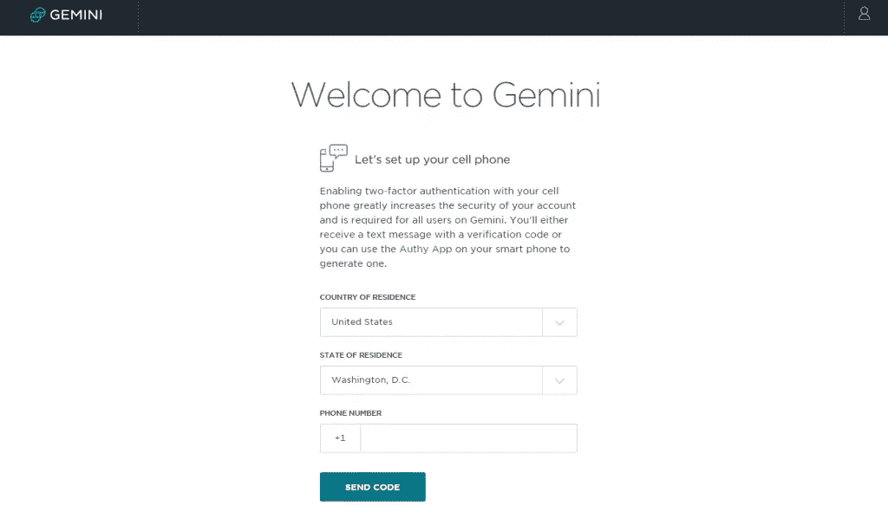
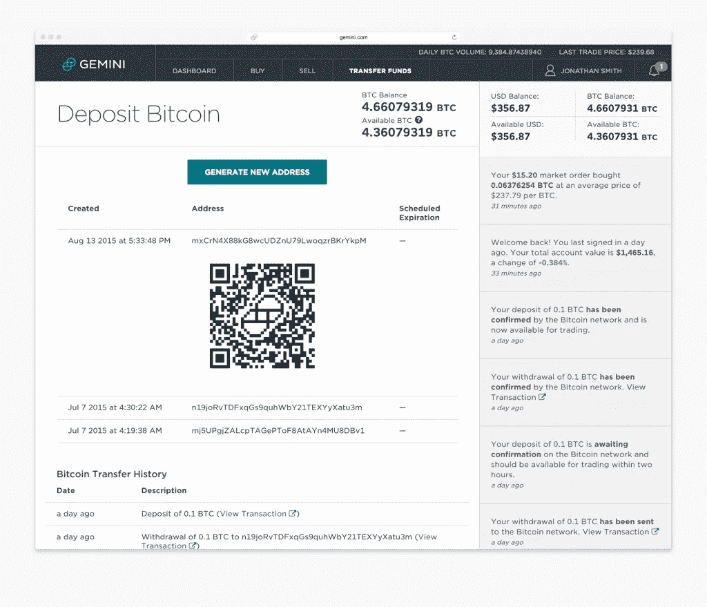
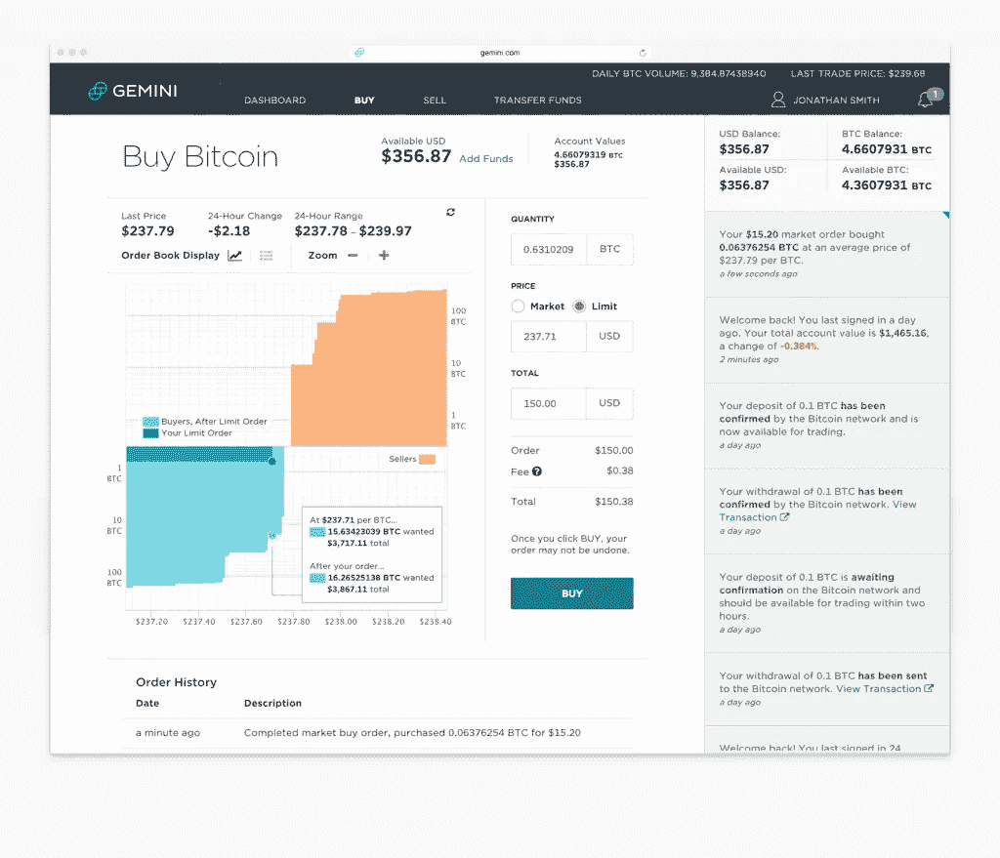

# 双子座交易初学者指南

> 原文：<https://medium.com/hackernoon/a-beginners-guide-to-trading-on-gemini-2c76eda7d58>

Learn how to trade on Gemini

**Gemini** 是一个[加密货币交易所](https://cryptodigestnews.com/heard-about-cryptocurrency-exchange-579cef5fc5fb)平台，投资者可以用美元购买比特币(BTC)和以太网(ETH)——或者只是在 BTC 和以太网之间进行交易。对于更高级的交易者来说，这是一个强大的工具，但它也有干净、易用的界面，即使是完全的初学者也能很快掌握。

这个加密硬币交易所可能因其臭名昭著的创始人文克莱沃斯双胞胎而闻名，他们在 2008 年起诉马克·扎克伯格窃取了他们关于脸书的想法。他们从那场诉讼中获得的 6500 万美元的意外之财肯定得到了很好的利用——到 2013 年，兄弟俩已经积累了价值 1100 万美元的比特币，当时比特币的价值约为 120.00 美元。

自那以后，他们的比特币储备急剧增加，现在这种数字货币的价值比当时高出几千倍。事实上，据说这对双胞胎在 2017 年 12 月比特币突破 11000 美元大关时成为了第一批“比特币亿万富翁”。

文克莱沃斯双胞胎发射了双子座(现在你知道名字了吗？)2015 年末。

## 一种不同的交换

Gemini 与其他交易所的不同之处在于它对监管和合规的支持——它是第一家获得以太网和比特币交易正式许可的美国交易所。这是一个与金融法律机构结盟的交易所，这种合法性使其比其他平台具有一定的优势。

Gemini 由纽约州金融服务局(NYSDFS)监管，该局将其视为一家信托公司——这意味着它可以迎合像你我这样的普通加密货币交易者，以及一流的机构投资者。该平台采用非常干净、现代和流线型的设计，与华尔街巨头的品牌相呼应。

吸引高交易量交易者的不仅仅是这个交易所吸引人的视觉效果，还有它的价格。根据你 30 天的交易量，费用(交易的发送者和接收者)从 **0.00%到**0.25%不等:交易量大的交易者得到的费用最少。

如果你刚刚开始投资比特币或以太网，你将支付价格区间的高端——但与其他交易所相比，0.25%的价格并不算低。Gemini 还有一个非常简单的注册流程和一个易于使用的交易界面，任何初学者都可以掌握。

## 以前从未在双子座交易过？以下是您需要了解的入门知识:

*   如何创建帐户
*   如何存放资金
*   如何执行基本交易

**注册账户**

在 Gemini.com 开设新账户很简单——只需进入主页，点击**开设个人账户。**

输入您的全名、电子邮件地址并创建密码，然后选择**创建我的帐户**

打开一个新标签页，检查您的电子邮件中的激活码，将其复制并粘贴到之前的标签页，然后选择**提交**

现在开始一个**的三步身份验证**过程:

1.  将您的手机号码与您的帐户关联起来——这使得接收登录验证码变得容易。对于很多交易来说，这是一个相当标准的要求，因为双因素身份认证极大地增强了您的帐户安全性。

2.使用您的普通网上银行登录凭据链接您的银行帐户—只需使用您的普通用户名和密码登录即可。银行账户必须与新的 Gemini 账户持有人同名。不要担心，您的用户名和密码是安全的，这一步只是让存款变得快捷和容易。如果你不想交你的登录信息，你可以用电汇来验证你的银行账户。

3.最后，他们会要求你提交证明你的身份和地址的文件，比如一份清楚地印有你地址的银行对账单。

## 存款

一旦你完成了注册过程，你就可以**向你的账户中注入资金**。

首先，点击主菜单栏上的**转账**。有了 Gemini，有几种方法可以将资金存入您的 exchange 帐户:

使用您的**银行账户**:

**ACH 存款:**

这仅适用于美国用户。ACH 存款最酷的一点是它们是即时的——你可以马上开始用这些资金进行交易。然而，在提款时，资金会被冻结。4-5 个工作日之后，存款将完全结清，您可以从您的帐户中提取这些资金。

**电汇:**

电汇存款更简单:因为电汇是不可逆的，一旦双子座收到钱，你就可以开始交易和提取资金。如果您在下午 3:00 之前存款，您的资金将在下一个营业日准备好进行交易，不允许提取。

如果你想使用**外部比特币或以太坊钱包**:

你可以将比特币或乙醚存入你的 Gemini 账户，对于这两种加密货币来说，这是同样简单的过程。只需选择**存款 BTC** 或**存款 ETH** ，双子就会为你生成一个存款地址。

如果你在移动设备上使用以太网或比特币钱包，你可以简单地从你的外部钱包发起转账，并扫描 Gemini 为你提供的二维码。如果你没有使用移动设备，只需复制比特币或以太坊地址，并在外部钱包询问你要将数字货币发送到哪里时粘贴即可。

转账必须从你的外部钱包里完成——而不是从双子座那边。哦，双子座收取**零存取费**！

取款也很简单:只需选择**取款 BTC** 或**取款 ETH** ，输入您的外部钱包地址，即可完成转账。

请记住:每个双子座账户都有一个“钱包”，你可以在这里存放你在交易所的资金。它不同于外部钱包，外部钱包是一个更安全的地方来存储您的[加密货币](https://hackernoon.com/cryptocurrency-how-does-it-work-f8e70ad911ce)。大多数明智的加密货币投资者习惯于尽可能将硬币放在外部钱包中，只有在他们积极交易时才放在交易所钱包中。

一旦你的双子账户有了资金，你就可以开始交易了。

## 执行交易

双子座交易界面真的很容易使用，它有一个简化的设计，使学习如何下单变得轻而易举。只需在主菜单栏上选择**购买**，并选择您想要购买的加密货币——如果您想要使用美元、BTC 或瑞士法郎完成购买。

在屏幕顶部附近，它会显示您的账户中有多少钱，包括美元价值和比特币价值，让您在进行交易之前有一个更完整的视角。

在您点击**购买**并确认您的购买之前，您可以看到将收取的确切费用，以及将从您的帐户中提取的美元、BTC 或瑞士法郎总额，以完成交易。

要完成购买，只需点击**购买**。真的就那么简单。

销售也一样简单。如果你想去掉一些 BTC 或乙烯醚，这是完全相同的过程。只需选择**卖出**并输入您想要卸载的硬币数量。然后，它会告诉你多少美元，BTC 或瑞士法郎将记入你的交流。

## 超越简单的交易

双子座的买卖很简单，但我们只讨论了简单的交易。Gemini 也是为更高级的交易者设计的——它是一个复杂的交易平台。经验丰富的交易者在 Gemini 上总共有六种不同的订单类型可供选择(例如，只限拍卖)。

当你在基本的加密货币交易中变得更加老练之后，你可以开始探索更高级的交易技术。

___________

rak hee Pal
[**fund yourself now**](http://fundyourselfnow.com/)(加入我们的 [**电报**](https://t.me/fundyourselfnow) & [**推特**](https://www.twitter.com/fundyourselfnow) )