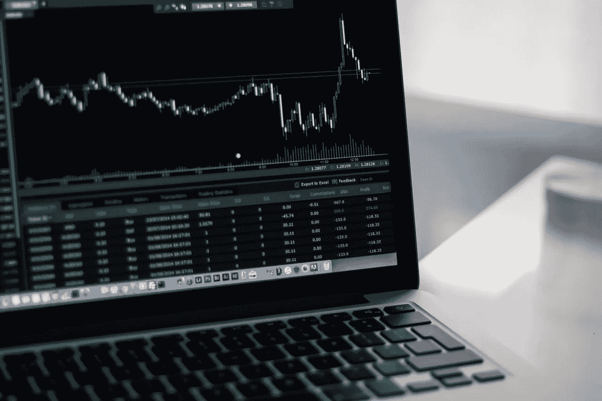

# 一个更好的问题——投资加密货币

> 原文：<https://medium.com/hackernoon/a-better-question-investing-in-cryptocurrencies-d039a9b950c9>

## 不是该不该投资的问题，而是该怎么投资的问题

最近，围绕加密货币出现了大量炒作--这是有充分理由的。毕竟，很少有方法能让一项投资产生四位数的季度回报。

我喜欢它，加密货币是我最喜欢的话题之一。事实上，在进入市场之前，我花了六个多月的时间研究一切，从基础技术、技术的应用、技术的历史、市场中的成熟和新兴参与者，以及从风投到华尔街的成熟投资者对市场的不同看法。

最重要的是，近一年来，我一直在积极投资加密货币。因此，当我开始谈论加密货币时，我几乎总是会被问到同一个问题，“我应该投资于[比特币](https://hackernoon.com/tagged/bitcoin)吗？”

这是一个很好的问题，但我不认为这是一个正确的问题。

*在我继续之前，让我先说两件事。首先，我不是投资顾问…这篇文章只是概述了我是如何进入这个市场的。第二，这个市场不受监管，未经测试……没有联邦存款保险公司的保险，没有政府的支持，也没有足够的数据来论证一种投资策略的可行性。*

# 每个人都应该知道的几件事

**首先，不要被术语货币**误导——截至目前，几乎所有加密货币的估值都基于两个因素，货币的供给和需求，以及基于未来潜力的内在价值。不像美元，它没有 GDP 的支持，也不像黄金，它在世界任何地方都不保值。

**其次，炒作是真实的** —有了这些疯狂的隔夜回报，就有了立即投资的巨大压力。不要陷入其中。慢慢来，学习技术，观察市场，如果你以 1 万美元买了一个比特币，一年后它涨到了 10 万美元，那太好了。但也有一个很好的机会，你以 10，000 美元买了一个，它变成了 1 美元。你晚上睡觉的唯一方法是知道你是基于你自己的原因做出的决定。

**最后，它是半生不熟的** —加密投资界没有人会告诉你这一点，但事实是，只有不到 1%的人真正使用加密货币进行交易，只有大约 0.001%的企业接受它。这项技术真正被采用还有很长的路要走。

# 这不是是否…而是如何

当谈到投资加密货币时，对我来说，这不是你是否应该投资的问题，而是你应该如何投资的问题。

## 1.管理您的风险

问自己最重要的问题是你愿意冒多大的风险？好的投资组合旨在实现平衡，并专注于不亏损。糟糕的投资组合一般是不平衡的，只关注赚钱。在我看来，加密货币风险如此之大，以至于我几乎宁愿用赌博这个术语，而不是投资这个术语。为了管理这一风险，我将自己的敞口限制在投资组合的 5%以内。如果我的投资组合损失了 5%，那就是糟糕的一年，但我可以恢复。

## 2.不要变得贪婪

因为我把自己的投资组合限制在 5%以内，所以我几乎每两周就要调整一次。如此频繁的重新平衡让我在短短几个月内收回了我的全部原则和一些原则。对我来说，这意味着如果我的投资变成 0 美元，我什么也没损失，因为我的原则被安全地藏在低风险投资中。

## 3.低买高卖

加密货币市场波动极大，实际上几乎每天都有+10%的跳水。如果你真的想进入市场，慢慢来，看图表，逢低买入。这可能需要几天甚至一周，但它会发生。

正如我上面提到的，如果你赚了很多钱，那很好，但是如果你失去了所有的钱，那就完全是另一回事了。

## 4.了解你买了什么

最后，加密货币有上千种，它们并不都是平等的，有些(大部分)是骗局。如果你打算购买一种加密货币，请花些时间了解你正在购买的东西。不是所有的货币都像比特币一样，也不是所有的货币都被设计成增值甚至保值。(你可以在这里阅读更多关于那个

# 最后

我想确保你明白，尽管我在加密货币上做多，**我在现有市场上做空，我相信明年这个时候它会看起来非常不同。**如果这篇文章有什么作用的话，我希望它能让一些人不那么心痛，甚至能帮助你在这波疯狂的牛市中获利。

我的最后一条建议是警告潜在投资者，加密货币几乎总是处于牛市。**这意味着每个人都在赚钱，每个人都认为自己是天才投资者**。但是用沃伦·巴菲特的话来说，*“只有当潮水退去，你才发现谁在裸泳。”*

别做那种人。尽情享受公牛吧，因为它会结束…这只是时间问题。更重要的是，不要用你离不开的钱去赌博。

**作者简介:****是一位年轻的企业家、丈夫、父亲、技术专家，以及 SaaS 营销专家。你可以在*[*Twitter*](http://twitter.com/j_r_wi11iams)*上关注他，在这里* *了解更多关于他和他的项目* [。](http://jesse-williams.com/about)*

# *更多来自作者:*

* [## 建立更好的个人品牌

### 我个人旅程的收获

blog.markgrowth.com](https://blog.markgrowth.com/building-a-better-personal-brand-e7a42036ae71)  [## 未来属于那些敢于抛弃过去的人

### 为什么你的未来取决于放下你的过去

theascent.pub](https://theascent.pub/the-future-belongs-to-those-who-dare-to-leave-the-past-c5bd2b9201e3)  [## 你不需要更多的功能。你需要更多的数据。

### 最佳产品负责人如何利用数据打造最佳产品

theascent.pub](https://theascent.pub/you-dont-need-more-features-you-need-more-data-237cdbfb92a4)*