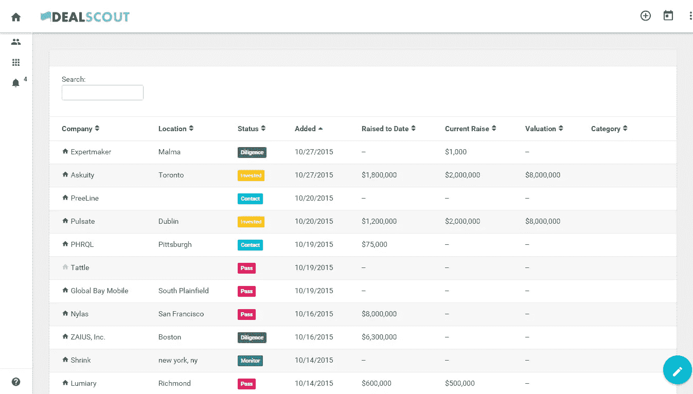
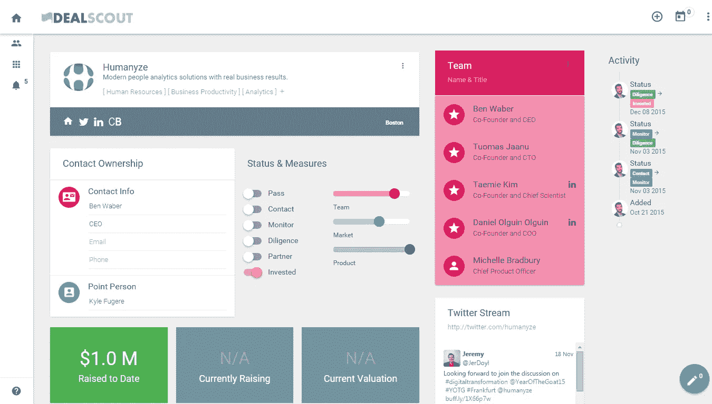
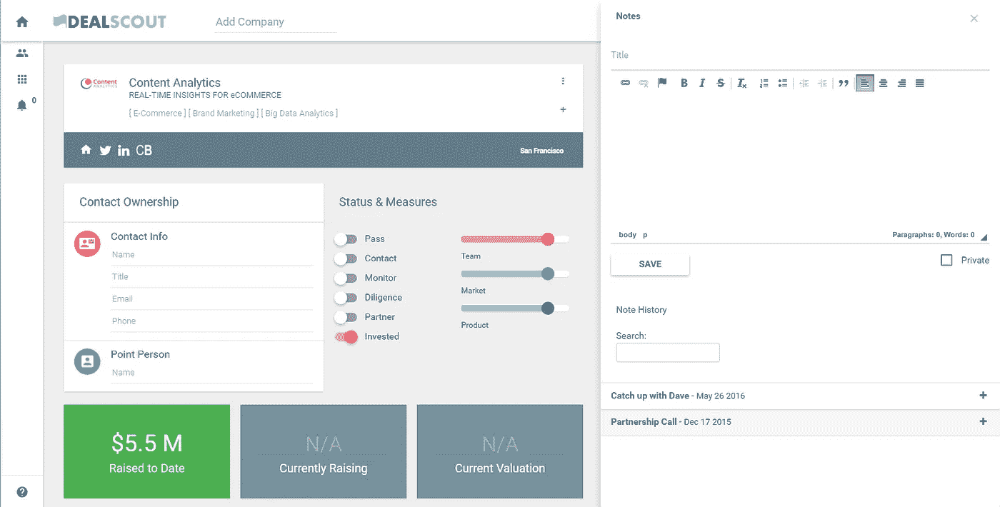

# 跟踪交易流程的更好方法

> 原文：<https://medium.com/hackernoon/a-better-way-to-track-deal-flow-b520514b9101>

## 因为数据输入很糟糕

我鄙视低效率。这种厌恶让我建造一些东西来让我的生活更轻松。碰巧的是，跟踪交易流程，作为我作为投资者工作的一部分，是非常低效的，也是一种痛苦……我开始研究这个问题，*慢慢地，*在过去的两年里。每一次迭代都会变得更加高效，加入各种 API 和其他有趣的东西，直到有一天我意识到我已经构建了一个产品。

> 这里可以看到:**[**http://dealscout.co/**](http://dealscout.co/)**

**我想过尝试出售这个，但出售给天使和风险投资听起来很悲惨。**免费更好。****

****

**Main Page (Numbers and status’s shown are mostly not real)**

# **下面是它解决的问题。**

****数据输入:**忘记在随机电子表格中手动输入交易或在 Salesforce 或 Pipedrive 的各个字段中插入数据。相反，使用您的 VC CrunchBase 许可证密钥并开始自动提取所有数据(它也从 AngelList 提取)。**

**输入任何一家公司，按下回车键，就会得到该公司的一页明细，并自动添加到你的交易列表中。或者更好的是，将一封公司的电子邮件转发给 track@dealscout.co，系统会自动创建一份记录，并将邮件正文保存为注释！**

****

**Individual Company Page**

****记笔记:** Evernote 很棒，但仍然是一个独立的系统，与公司本身或你的交易清单没有直接联系。为什么不在实际交易页面上做笔记，让它们易于搜索，按公司组织笔记，而不是分散在各处？**

****

**Company Page with Note Sidebar**

****协作:**邀请整个团队，它允许无限的用户，并让每个人在交易发生时输入和更新交易状态。查看彼此的笔记，更好地记录正在发生的事情。大多数字段都可以个性化，如果您对交易流程的每个阶段都有不同的名称，没问题，它们可以在设置页面中轻松编辑。**

**该系统也适用于企业创新团队。我帮助邓汉比管理投资、合伙企业和 M&A，并将其用于所有 3。**

**如果你是一个有上进心的年轻合伙人，或者任何人，想要进一步发展，请联系我。否则，开始使用它，并保留一个更好的记录或你实际交谈的公司。**

# **[http://dealscout.co/](http://dealscout.co/)**

************

> **[黑客中午](http://bit.ly/Hackernoon)是黑客如何开始他们的下午。我们是 [@AMI](http://bit.ly/atAMIatAMI) 家庭的一员。我们现在[接受投稿](http://bit.ly/hackernoonsubmission)，并乐意[讨论广告&赞助](mailto:partners@amipublications.com)机会。**
> 
> **如果你喜欢这个故事，我们推荐你阅读我们的[最新科技故事](http://bit.ly/hackernoonlatestt)和[趋势科技故事](https://hackernoon.com/trending)。直到下一次，不要把世界的现实想当然！**

****