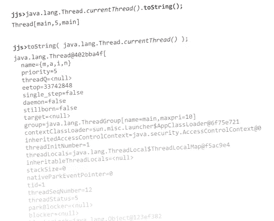
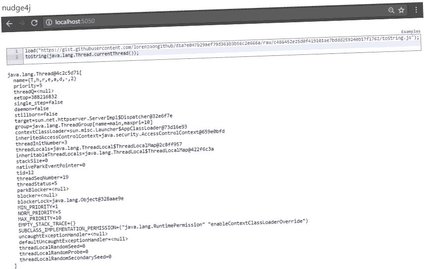

# 给我们其余的人一个极好的爪哇串

> 原文：<https://medium.com/hackernoon/a-blooming-good-java-tostring-for-the-rest-of-us-50dca980a462>



**你有没有** *System-d 点出*一个对象，并得到它的类名@它的十六进制 hashcode？

很有可能:这不是你所希望的，也没有给你带来什么帮助。

问题是，在 Java 中，我们缺少一个为任何 Java 对象生成良好且一致的文本表示的函数。

如果我们有，我们会写:

```
System.out.println( **toString**.apply(myObject) ); 
```

代替

```
System.out.println( myObject**.toString()** ); *// finger crossed, we 
                                           // have a good toString.*
```

然后我们将停止诅咒开发者没有实现一个好的 *toString* 。

如果你决定忽略一些边缘情况，破解一个通用的 toString 很容易。

它只需要您使用反射 API 迭代对象的所有字段来打印它们。

[我写了一个](https://gist.github.com/lorenzoongithub/d1a7e047b29aef79d363b3b56c2e666a)，你可以用 [Nashorn jjs](https://docs.oracle.com/javase/8/docs/technotes/guides/scripting/nashorn/shell.html) ，用 [nudge4j](https://lorenzoongithub.github.io/nudge4j/) 和任何 Java 8 程序使用。

它是作为 Nashorn JavaScript 函数编写的。该函数几乎将所有工作委托给了名不副实的*ReflectionToStringBuilder*(Apache Commons Lang 的一部分)。

您的类路径中不需要 Apache Commons Lang(我也没有)。我讨厌依赖，我不会要求你仅仅为了这个而添加它。代码附带了[一个很好的技巧](http://stackoverflow.com/questions/60764/how-should-i-load-jars-dynamically-at-runtime)从 maven repo 按需加载它。

我们如何使用 toString 函数？

在 Nashorn jjs 和 nudge4j 中，您加载它并准备好开始:

```
load("[https://gist.githubusercontent.com/lorenzoongithub/d1a7e047b29aef79d363b3b56c2e666a/raw/c486452e25d0f419101ae7bddd259240b17f1762/toString.js](https://gist.githubusercontent.com/lorenzoongithub/d1a7e047b29aef79d363b3b56c2e666a/raw/c486452e25d0f419101ae7bddd259240b17f1762/toString.js)")
toString(java.lang.Thread.currentThread());
```

在 Java 中，你需要写一些模板来把它包装成一个 Java 函数:

```
Function<Object, String> toString = new Function<Object,String>() {
  private ScriptEngine engine;

  {
    try {
      engine = new ScriptEngineManager().
                      getEngineByName("JavaScript");
      try (InputStream is = new URL("[https://gist.githubusercontent.com/lorenzoongithub/d1a7e047b29aef79d363b3b56c2e666a/raw/c486452e25d0f419101ae7bddd259240b17f1762/toString.js](https://gist.githubusercontent.com/lorenzoongithub/d1a7e047b29aef79d363b3b56c2e666a/raw/c486452e25d0f419101ae7bddd259240b17f1762/toString.js)").openStream()) { engine.eval(new InputStreamReader(
          is, StandardCharsets.UTF_8));
      }
    } catch (ScriptException | IOException e) {
      throw new RuntimeException(e);
    }
  } public String apply(Object oj) {
    try {
      return ""+
        ((Invocable)engine).invokeFunction("toString", oj);
    } catch (NoSuchMethodException | ScriptException e) {
      throw new RuntimeException(e);
    }
  }
};System.out.println(toString.apply(Thread.currentThread()));
```

**就是这样**:字符串化任何 Java 对象的通用函数。

这不会对你的日常工作产生影响，但在调试的某一天，它可能会派上用场。

少调试。



loading toString.js in [nudge4j](https://lorenzoongithub.github.io/nudge4j/)

[](http://bit.ly/HackernoonFB)[](https://goo.gl/k7XYbx)[](https://goo.gl/4ofytp)

> [黑客中午](http://bit.ly/Hackernoon)是黑客如何开始他们的下午。我们是 [@AMI](http://bit.ly/atAMIatAMI) 家庭的一员。我们现在[接受投稿](http://bit.ly/hackernoonsubmission)，并乐意[讨论广告&赞助](mailto:partners@amipublications.com)机会。
> 
> 如果你喜欢这个故事，我们推荐你阅读我们的[最新科技故事](http://bit.ly/hackernoonlatestt)和[趋势科技故事](https://hackernoon.com/trending)。直到下一次，不要把世界的现实想当然！

