# 适合 GitHub 流程的分支和发布策略

> 原文：<https://medium.com/hackernoon/a-branching-and-releasing-strategy-that-fits-github-flow-be1b6c48eca2>

自从我学习 Git 以来，我一直试图遵循成功的 Git 分支模型。毕竟总比想即兴发挥好。写得很好。它甚至有一个图表，充满了颜色和箭头——非常时尚。

然而，我发现它并不完全适合 GitHub 流，在 GitHub 流中，我们使用拉请求和发布。我希望我们的 Git 分支和合并变得简单，并让它与我们的 Github 流一起工作。

# 拉取请求

我们采用拉请求，让每个开发人员在他们自己的回购分支中工作。这允许开发人员创建他们想要的任何分支，而不会污染存储库的主分支。

在此之前，我们在不属于任何人的主存储库中有几十个分支。现在，每个开发人员管理自己的分支，不会用一堆旧的或不完整的分支来迷惑项目新人。

Pull Requests [包括请求另一个开发人员进行审查的能力](https://help.github.com/articles/about-pull-request-reviews/)，甚至强制执行在 PR 可能被合并之前需要审查的规则。

# GitHub 发布

我们使用 [GitHub Releases](https://github.com/blog/1547-release-your-software) ，并且将我们的持续部署系统设置为仅在我们创建标签(比如“v2.0.0”)时才部署到产品中。当在 GitHub 中创建一个版本时，它会创建一个 git 标签，指向您选择的分支的头。

发布包括文档，文档通常是已经合并的 PRs 的列表。

# 修补程序

修补程序需要自己的过程。这个想法是，你需要修补一些已经在生产中的东西，并且它需要马上被淘汰。如果有一个新特性在“主”分支中，但还没有被批准发布，我们需要一个补丁来投入生产。(不推未经测试的新功能！)

# "版本碰撞"

我们改用 Github 版本的原因之一是为了在我们的 Rails 项目中获得一个更有意义的版本号。

(我们使用[语义版本化](http://semver.org)，这样我们的发布就有了一个标准模式。)

通过对我们的部署过程进行一些更改，我能够让 Git 标记对部署的应用程序可用。现在我们的工具如 [Sentry](https://www.getsentry.com/) 、 [New Relic](https://newrelic.com) 和 [Instrumental](https://instrumentalapp.com) 包含了我们的真实版本号，而不是 Git commit hash。

对于我们的 Ember 开发团队来说，这是以不同的方式解决的。他们使用 [npm 版本命令](https://docs.npmjs.com/cli/version)来修改存储在项目中的版本。(这个世界从此转向了 Yarn，我强烈推荐它，它有 [yarn 版本](https://yarnpkg.com/lang/en/docs/cli/version/)命令。)

这在实践中意味着，在他们将拉请求合并到开发中，并将开发合并到主文档中之后，他们签出主文档，“修改版本”，提交，然后*将其合并回开发*。这导致使用新代码和旧版本号部署主分支，然后使用新版本号部署新代码。不是最干净的工作流程，但它做的工作。

# 目标

总体目标是

*   持续交付！
*   简单到可以记住。
*   足够简单，容易理解，不会出错。

# 我建议一个新策略

如果你使用一个单独的“开发”分支，那就去掉它。把它从过程中剔除。

拥有一个单独的变更分支会使事情变得更简单，工具也会表现得更好。

## 所有你想要的图表

这是我们的示例存储库。我只显示主分支中最近的提交。我们将其标记为“v2.0.0 ”,因此我们知道，假设测试通过，提交“m”在生产中是活动的。

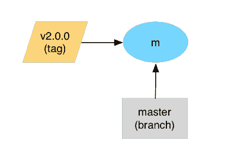

Our repository with its most recent commit.

现在一名工程师创建了一个特征分支。

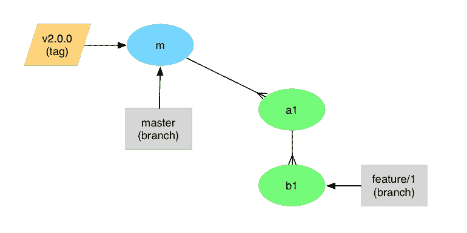

A new feature branch has been added.

## 钥匙

在下一节中，我将使用一些视觉辅助工具来展示一个示例 Git 存储库以及我们对 pull 请求和发布的使用。以下是以下图表的关键:

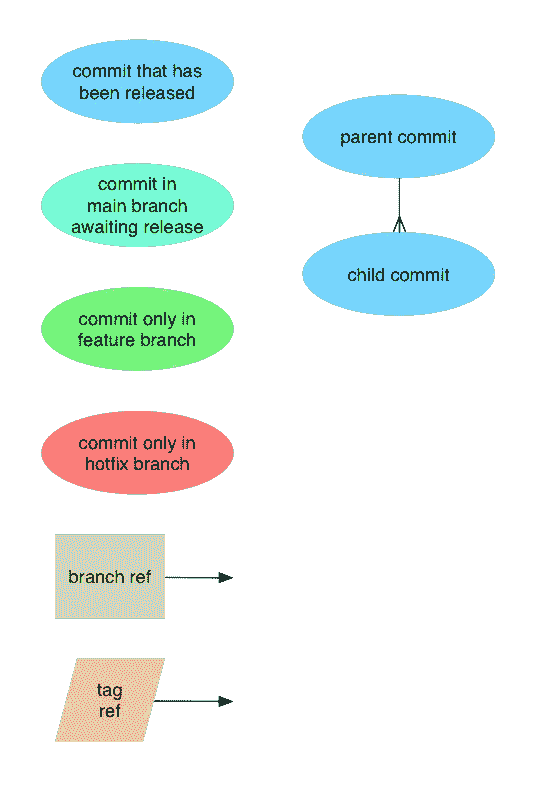

回到我们的故事，更多的功能分支被打开。我们有许多工作同时进行。

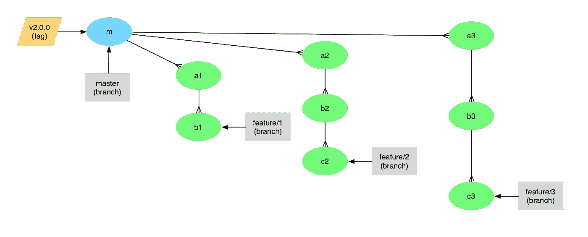

Two more feature branches.

当“特性 1”中的工作完成时，工程师打开一个拉请求，它被合并到主分支中。

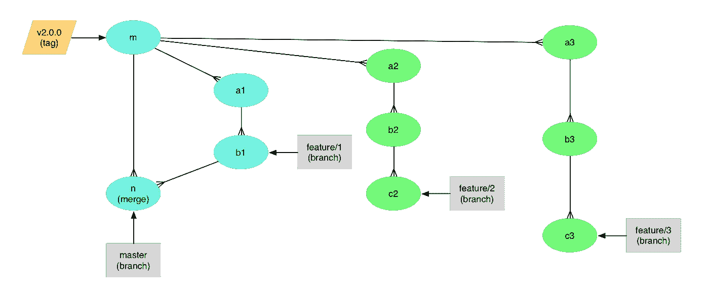

Feature 1 has been merged.

而“feature 2”也准备好了，所以它的 pull 请求也合并到 master 分支。

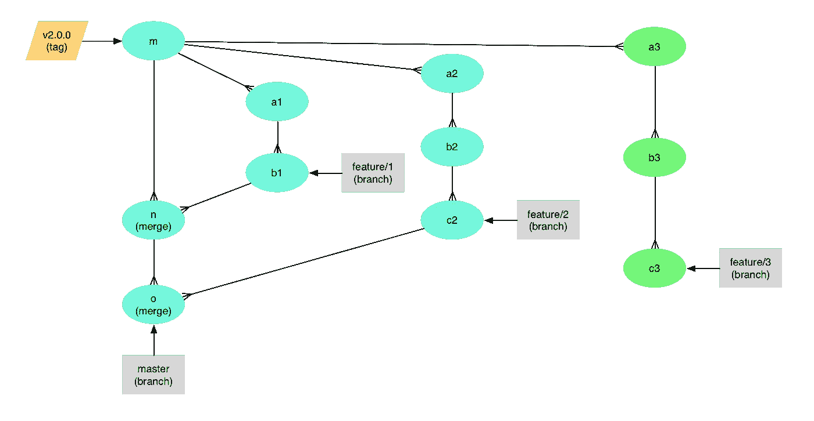

Feature 2 has been merged.

我们喜欢保持我们的存储库整洁，所以一旦拉请求被合并，我们就点击拉请求中的“删除分支”按钮。

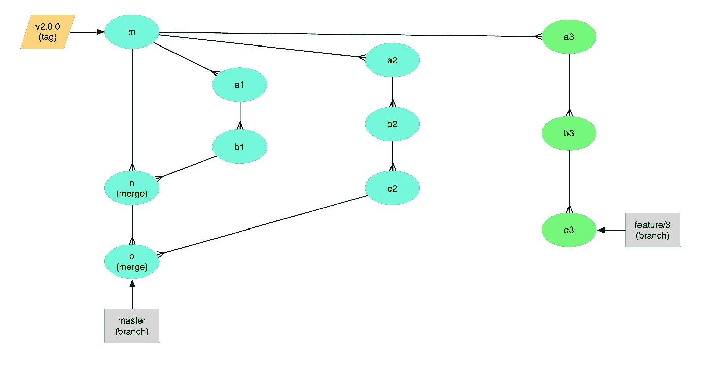

Once merged, we delete the branch references to the feature branches.

现在是时候发布这些新功能了。如果这是我们的 EmberCLI 项目之一，我们运行“npm version ”,这将添加一个碰撞版本号的提交。

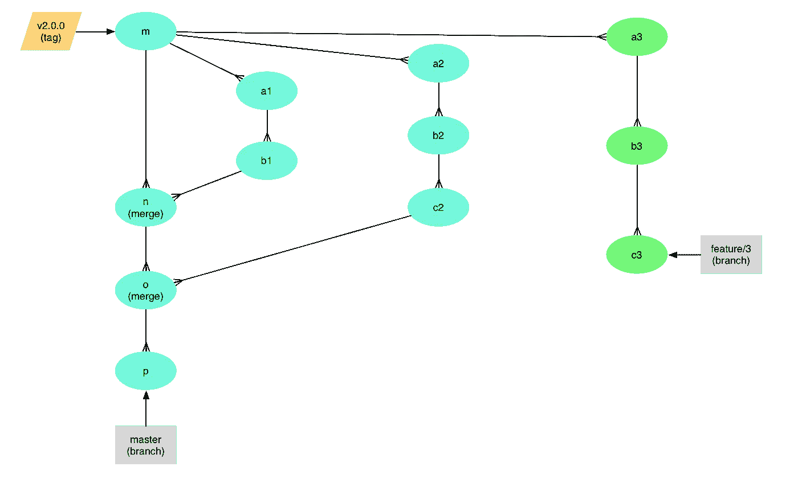

A new commit has been added to the master branch that changes the embedded version number.

“npm 版本”也为版本创建一个标记。但是对于非 npm 项目，我们使用 GitHub 网站创建一个发布。

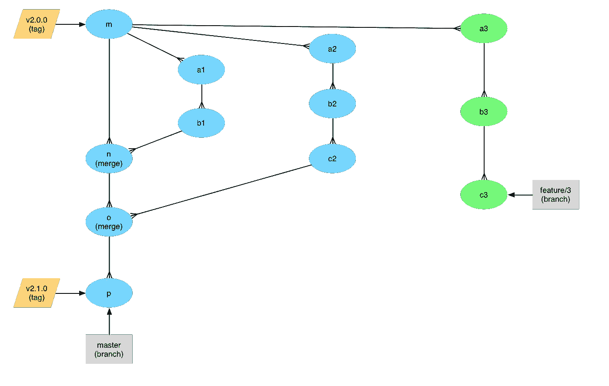

Release tag v2.1.0 has been added, releasing the contents of the master branch.

我们的持续部署利用了这一点，并将 2.1.0 版本投入生产。

我们继续工作，我们得到“功能 3”合并到主。我们不想一下子上线太多东西，所以这个功能一直在等 v2.1.0 上线。

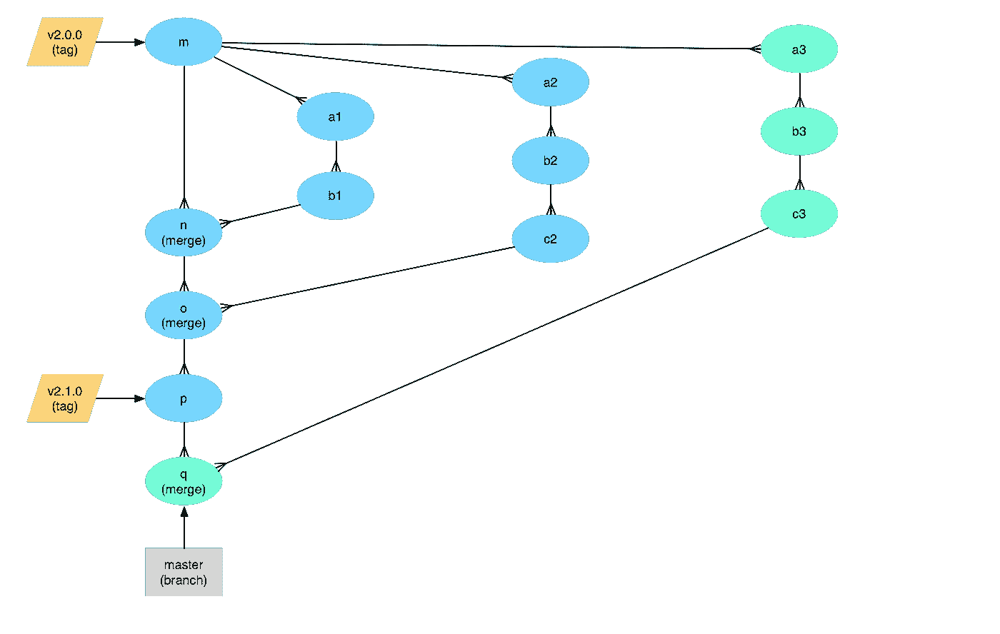

Feature 3 has been merged into the master branch and its branch reference has been deleted.

一旦特性 3 被合并，主分支被自动部署到阶段站点，在那里我们的团队可以开始评估新的特性。

但是我们刚刚在生产中发现了一个错误！根据 Sentry 的说法，v2.1.0 是第一个出现这个 bug 的版本。

一名工程师从生产版本标记(v2.1.0)创建了一个修补程序分支，并编写了一个问题的修复程序。

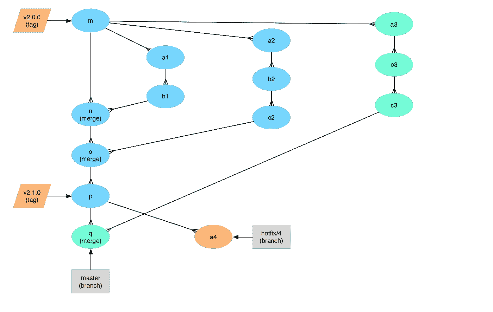

A hotfix branch has been created using the most recent release tag as its base.

工程师为该问题添加了一个测试(当然)，并针对“master”打开了一个 pull 请求。一旦为这个修补程序分支运行了测试(我们可以在 pull 请求中看到结果)，我们就知道合并并发布到生产环境是安全的。

对于我们基于 npm 的项目，是时候修改版本了。

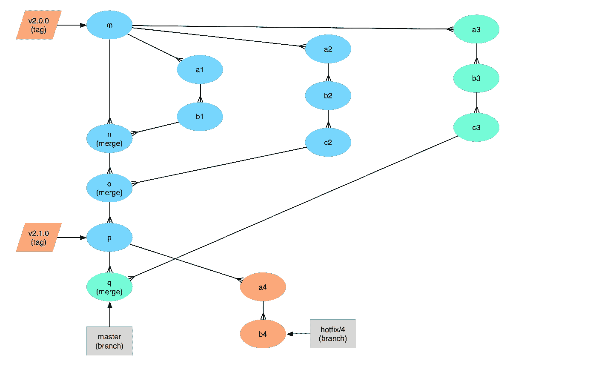

The commit has been added to the hotfix branch, changing the embedded version number.

我们可以合并“拉”请求，在主分支中获得此修补程序。

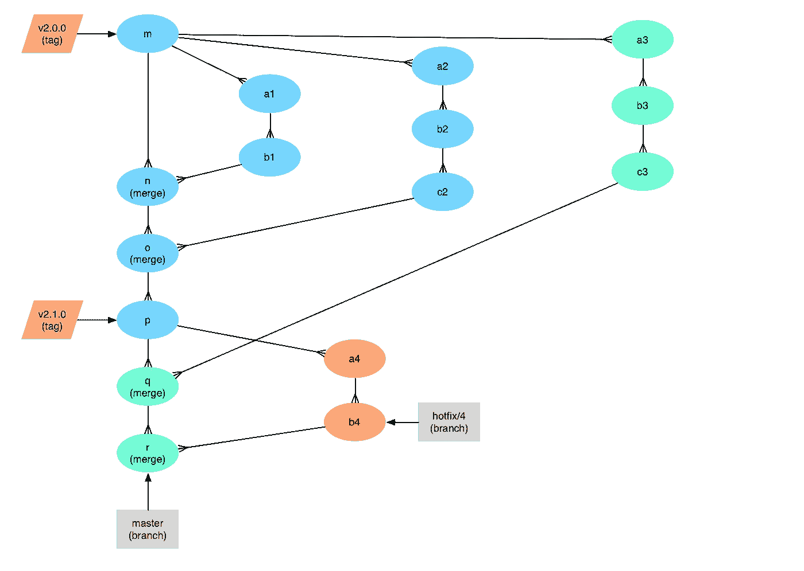

Our hotfix branch has been merged into the master branch.

但是为了让这个修补程序投入生产，它需要被标记。我们不想标记主分支，因为除了修补程序之外，它还有“特性 3 ”,它正在等待验收测试。

我们需要标记热修复分支的负责人，以便将其投入生产。所以我们创建了一个 GitHub 版本。

附注:因为我们的每个开发人员都在他们自己的存储库分支中打开分支，所以热修复分支是在他们的分支中，而不是在主存储库中。(如果我们在这个项目中使用“npm 版本”，它会在开发者的 fork 中添加一个标签，而不是主 fork。)所以要创建一个指向修复分支负责人的发布，我们必须:

1.  *先把它合并成主人。*
2.  *从“最近提交”列表中选择作为热修复分支负责人的提交。这不是最近一次提交，可能是列表中的第二次提交。*

这是我在提议中看到的最大缺陷。GitHub 可以改进这一点，但我不确定具体如何改进。

现在已经为 v2.1.1 创建了一个标记，修复程序会自动部署。

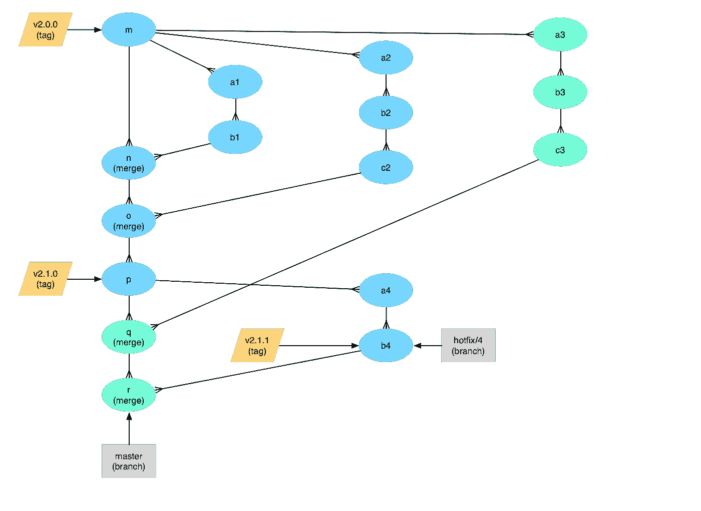

Release tag v2.1.1 has been added, releasing the contents of the hotfix branch.

我们可以删除我们的热修复分支。它的工作已经完成，我们仍然有指向相同提交的 v2.1.1 标签。

The branch reference to the hotfix branch has been deleted.

因为我们的修补程序也合并到主分支中，所以它已经部署到试运行中，并且包含在我们的试运行验收测试中。

一旦我们的验收测试完成，我们就可以发布版本 2.2.0 了。

(如果在 v2.2.0 发布之前必须制作另一个修补程序，将从 v2.1.1 标记创建一个新的修补程序分支。)

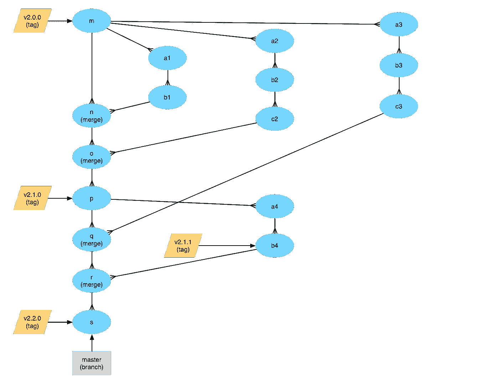

Release tag v2.2.0 has been added, releasing the contents of the master branch.

我就是这么做的。我欢迎任何反馈！

> [黑客中午](http://bit.ly/Hackernoon)是黑客如何开始他们的下午。我们是 [@AMI](http://bit.ly/atAMIatAMI) 家庭的一员。我们现在[接受投稿](http://bit.ly/hackernoonsubmission)并乐意[讨论广告&赞助](mailto:partners@amipublications.com)机会。
> 
> 如果你喜欢这个故事，我们推荐你阅读我们的[最新科技故事](http://bit.ly/hackernoonlatestt)和[趋势科技故事](https://hackernoon.com/trending)。直到下一次，不要把世界的现实想当然！

