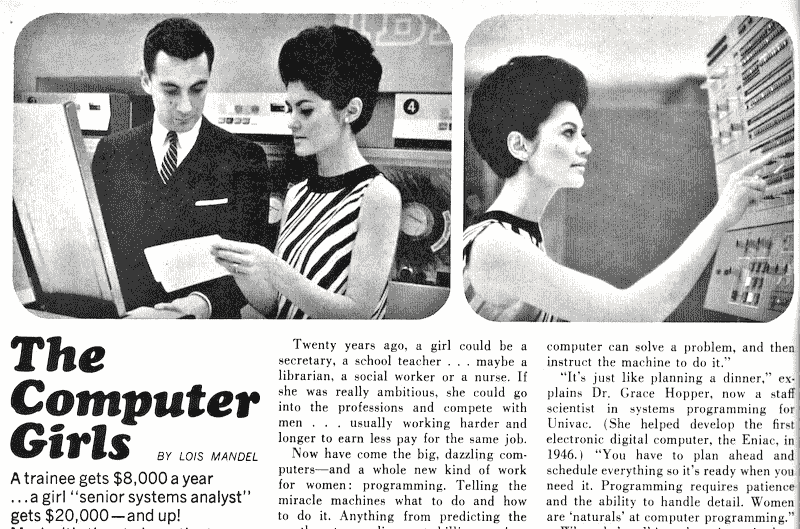
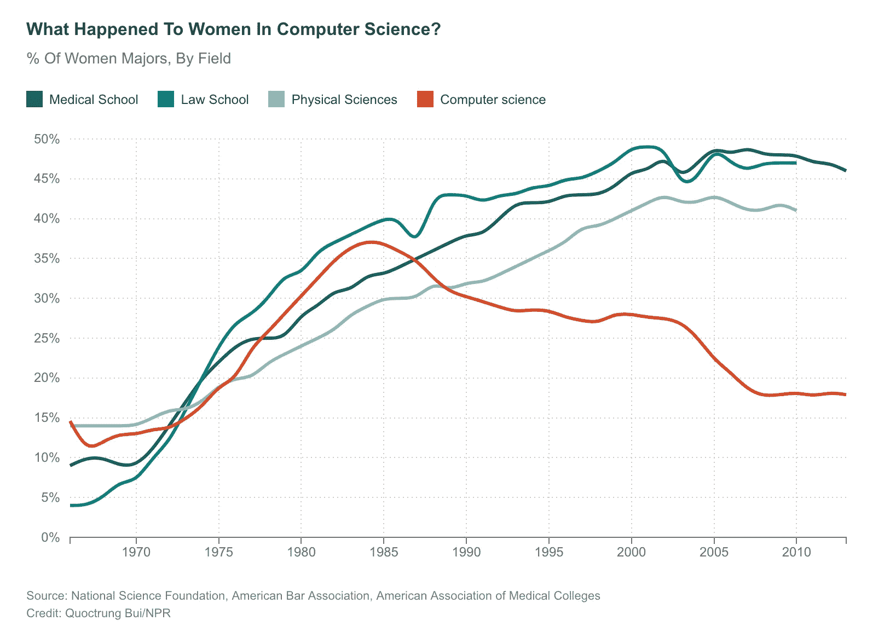

# 女性在计算机领域的简史

> 原文：<https://medium.com/hackernoon/a-brief-history-of-women-in-computing-e7253ac24306>

## 女人发明了这个领域。然后人们把他们推了出去。

在本周《丑闻:硅谷》的混搭剧集中，[新被解雇的谷歌工程师詹姆斯·达莫尔写了一份 10 页的备忘录，认为公司改善多样性的努力是被误导的。达莫尔的论文基于进化心理学和](https://www.recode.net/2017/8/7/16110696/firing-google-ceo-employee-penned-controversial-memo-on-women-has-violated-its-code-of-conduct)[五大人格特质](https://en.wikipedia.org/wiki/Big_Five_personality_traits)的观点，他认为，从本质上来说，因为男女之间存在心理差异(真的)，所以这些差异必然与生物学有关(脆弱的)，因此解释了男女在计算机科学和编程领域的兴趣和随后的表现方面的差异(没有提供证据，并且是历史的——见下文)。

好奇的头脑可以[阅读完整的备忘录](https://assets.documentcloud.org/documents/3914586/Googles-Ideological-Echo-Chamber.pdf)(包括其引文，这些引文在[泄露给 Gizmodo](/hackernoon/gizmodo.com/exclusive-heres-the-full-10-page-anti-diversity-screed-1797564320) 时被省略了)。

## 关于进化心理学与“科学”的一点注记

虽然我在最初的 twitter 风暴中把这个领域描述为“BS”(主要是为了简洁，因为 Twitter 是细微差别的死亡)，但大约有六个人反对这种一概而论的解雇。我对讨论 evo-psych 的优点或有效性不感兴趣；你可以完全相信它，这没什么坏处。

然而。

当你试图用这些信念来证明歧视性或有害的观点时，这种信念就会成为一个问题。“听起来很学术”并采用它的语言可能会帮助动摇一些骑墙派，蒙住天真者的眼睛，或者让你的主张看起来更有分量。但这既不是好的科学，也不是提议辩论的建设性方式。

你不能挑选一些你喜欢的科学研究，并用它们来证明你反对多样性项目的论点，同时小心翼翼地*忽略*堆积如山的其他[科学研究](https://hbr.org/2016/11/why-diverse-teams-are-smarter)，这些研究表明[如何以及为什么多样性项目是好的](http://blogs.lse.ac.uk/businessreview/2017/03/13/gender-quotas-and-the-crisis-of-the-mediocre-man/)、[对所有人都有益](https://www.scientificamerican.com/article/how-diversity-makes-us-smarter/)以及[值得投资](https://www.entrepreneur.com/article/240550)。

这并不是说多元化项目普遍都很好，不会有任何问题；除非小心行事，否则他们可能会失败。但如果你采用科学或学术语言来听起来更权威，你的方法和论点必须通过科学和学术的审查。使用来自支持你的意识形态的研究的脆弱链接，同时忽略那些坚定地反驳意识形态未通过这个基本测试的研究。

无论进化心理学如何证明性别间的差异，都没有任何证据表明这些生物差异是对计算机科学感兴趣的原因。否则，任何借口都只是从科学发现到证明一种意识形态的巨大飞跃。此外，这样的证据必须说明*并且解释掉*强烈暗示相反情况的历史证据。这让我们想到:

## 历史强烈反对 Damore 的断言，即女性在“生理上”对编程不感兴趣

达莫尔，又名 *M. Night Broamalan，*断言女性对科技不太感兴趣的“生物学原因”。大量记载的历史告诉我们并非如此。

一堂计算机科学的历史课，不经常在计算机科学课上讲授:女性是第一批软件工程师，直到男性主动将她们挤出。

1843 年，阿达·洛芙莱斯设计了第一个计算机算法，并解释了它如何在巴贝奇提出的(但并不存在的)分析引擎上工作，从而成为第一个计算机程序员。

1942 年第二次世界大战期间，[海迪·拉马尔发明了跳频技术](https://www.theguardian.com/theguardian/shortcuts/2011/dec/04/hedy-lamarr-wifi)，这一技术后来使得无线信号如 Wi-Fi 和蓝牙的发明成为可能。

1945 年至 1946 年， [Jean Bartik 和其他五名女性在 ENIAC 工作期间开发并编写了许多软件编程的基础。这六名女性的软件工作对公司的运营和成功至关重要，但她们没有被邀请参加 ENIAC 的竣工晚宴。](http://www.witi.com/center/witimuseum/halloffame/298369/ENIAC-Programmers-Kathleen-McNulty,-Mauchly-Antonelli,-Jean-Jennings-Bartik,-Frances-Synder-Holber-Marlyn-Wescoff-Meltzer,-Frances-Bilas-Spence-and-Ruth-Lichterman-Teitelbaum/)

1952 年，[少将·格蕾丝·赫柏(在业余时间)创造了世界上第一批编译器](http://www.bbc.com/news/business-38677721)。她设想代码使用基于英语的指令，她的编程语言设计工作导致了 COBOL 的产生，并沿用至今。

进入战后时代和 20 世纪 60 年代，软件工程被认为是“女人的工作”，因为它被认为是文书工作。硬件是一项艰难的工作，也就是说，“对男人来说”。《Cosmopolitan》在 1967 年刊登了一期关于“电脑女孩”的著名文章，海军上将霍普说，女性在电脑编程方面是“天生的”。(应该指出的是，霍普所说的“天生”并不是指生物学，而是指女性社会化的责任，比如计划晚餐，在适当的时间准备好一切。)

Partial scan of the 1967 Cosmopolitan article on The Computer Girls.

从 20 世纪 60 年代末开始，人们意识到编程实际上很难，因此很有声望。这意味着这是有利可图和有价值的，而且(一些)男人不希望女人享受所有的好处。正如研究人员和历史学家内森·恩斯门格帮助揭示的那样，专业组织、诽谤营销和广告活动的出现阻碍了女性进入计算机科学和编程领域。与此同时,(由男性)进行倾向于男性的能力测试，这些测试的*答案*在像兄弟会这样的男性团体中流传。(值得注意的是:[通过广告让女性感到羞愧或无地自容](http://www.collectorsweekly.com/articles/selling-shame-40-outrageous-vintage-ads-any-woman-would-find-offensive/)有着巨大的历史先例。)

但是这种半敌意收购并不是唯一发生的事情。像《T2》战争游戏和*怪异科学*这样的电影帮助建立了“计算机程序员”作为笨拙的男性书呆子的刻板印象。由于这些不同的因素，到 1986 年，主要由女性发明的工作领域已经从大约 50%的性别比例下降到 37%。

在 20 世纪 80 年代早期至中期，另一个主要因素加剧了这一点:视频游戏控制台进入市场，当它们作为玩具销售时，它们的制造商被要求决定它们将在商店的哪个(性别)部分销售。开发者没有争辩说每个人都应该热爱电子游戏，而是选择了男孩——市场营销也随之跟进。快进 20 到 30 年，这个时代的孩子已经长大成人，带着他们小时候被告知的那些错误信息:“技术是男孩的，不是女孩的。”

达莫尔就是这样一个例子。他的备忘录显示，他仍然这样认为，尽管他的工作领域主要是由女性发明的，而且是女性主导的。

## 达莫尔的“生物学”论点奇迹般地局限于国界

尼克·科格兰提醒说，这些性别比例因国家而异。2011 年，在美国计算机科学与工程专业的本科生中，女性仅占 18%，而在印度，这个数字是 42%。2005 年在印度，单看计算机科学，女性获得了 55%的理科学士学位。

文化差异是关键:在美国，计算机科学在文化上被视为“男性”领域，但在印度，男性和女性都认为该领域适合所有性别，因此人们渴望在其中工作。但是让我们来看一个更近的比较，我们北方的邻居:在加拿大，2006 年至 2010 年间，女性占计算机专业学生总数的 27%。在美国，这一数字低于 20%。

但是根据达莫尔和其他为了自己的意识形态目的滥用进化心理学领域的人的观点，女性的兴趣是生物学上的。他们的论点完全无法解释这种进化心理学是如何如此精确地尊重我们任意划定的国界的。进化是什么时候学会读懂我们的地图的？

## “逼出来的”还是“不被吸引来的”？

看似语义上的差异实际上是这场辩论中颇有争议的关键点。据我们所知，真相在中间的某个地方。

虽然我引用了一些积极推动女性走出去的努力的证据，但这些努力本身并不能解释[攻读计算机科学专业的女性比例大幅下降](http://www.npr.org/sections/money/2014/10/21/357629765/when-women-stopped-coding)(与男性相比——绝对数字仍然上升)。

% of women pursuing CS degrees started dropping dramatically in the 1980's.

这就是我们理解大局观点变得重要的地方:**多重因素复合，而不是全盘否定。**

男性花费了一些精力和精力积极地将女性排挤出去，营销决策对性别陈规定型观念产生了一些影响，这些陈规定型观念对该领域对女性吸引力的下降产生了一些影响，工作场所的性别歧视、敌意和不公平待遇对女性产生了一些威慑作用，整个社会的劳动实践变化对女性在劳动力中的存在产生了一些影响，我们有一个非常累积的画面

这些变量中没有一个能单独解释我们今天的情况，但没关系:我们不应该为它寻找一个“银弹”解释。期望“为什么计算机科学领域的女性如此之少？”这个问题只有一个答案既是对复杂的现实和历史的还原，也是科学上不合理的。

但是所有这些因素告诉我们的是，生物学从来不是女性在该领域的先天兴趣的相关因素。

## 资料来源和补充阅读:

[斯坦福大学克莱曼性别研究所:研究人员揭示了“电脑极客”是如何取代“电脑女孩”的](http://gender.stanford.edu/news/2011/researcher-reveals-how-%E2%80%9Ccomputer-geeks%E2%80%9D-replaced-%E2%80%9Ccomputergirls%E2%80%9D)

时间轴:女性开创了计算机编程。然后男人接管了他们的产业

[当女性停止编码时](http://www.npr.org/sections/money/2014/10/17/356944145/episode-576-when-women-stopped-coding)

[哈佛商业评论:为什么多元化的团队更聪明](https://hbr.org/2016/11/why-diverse-teams-are-smarter)

[性别配额和平庸男人的危机](http://blogs.lse.ac.uk/businessreview/2017/03/13/gender-quotas-and-the-crisis-of-the-mediocre-man/)

[科学美国人:多样性如何让我们更聪明](https://www.scientificamerican.com/article/how-diversity-makes-us-smarter/)

[工作场所多元化的诸多好处](https://www.entrepreneur.com/article/240550)

[计算印度女性的自我效能](http://www.unm.edu/~varma/print/JWMSE_CS%20Self%20Efficacy.pdf)

[解读印度计算机科学中的女性气质](http://www.unm.edu/~varma/print/CACM_Indian%20Women.pdf)

[加拿大:按研究领域和性别分列的大学入学人数](http://www.statcan.gc.ca/daily-quotidien/100714/t100714a2-eng.htm)

伊恩·博格斯为《大西洋月刊》撰稿:为什么科技如此糟糕？

[爱丽丝·戈德福斯关于男性对谷歌宣言的责任的推特帖子](https://twitter.com/alicegoldfuss/status/893961445934645248)

[哈里斯·欧玛利(又名德纳第洛夫)解释了为什么谷歌兄弟对这场“辩论”的定位是对其同事的敌意行为](https://twitter.com/DrNerdLove/status/894199877214896128)

[推特用户 Ariane @nahratzah 在一长串推文中分解(并揭穿)了整个备忘录](https://twitter.com/nahratzah/status/894148438518005760)

杰克·汉比谈谷歌的招聘实践和文化氛围

[前谷歌高级工程师 Yonatan Zunger 解释了为什么 Damore 毒害了自己的工作环境，并宣告了自己的末日](/@yonatanzunger/so-about-this-googlers-manifesto-1e3773ed1788)

[*本帖原载于 FarukAt.es*](http://farukat.es/journal/2017/08/a-brief-history-of-women-in-computing/) *。*