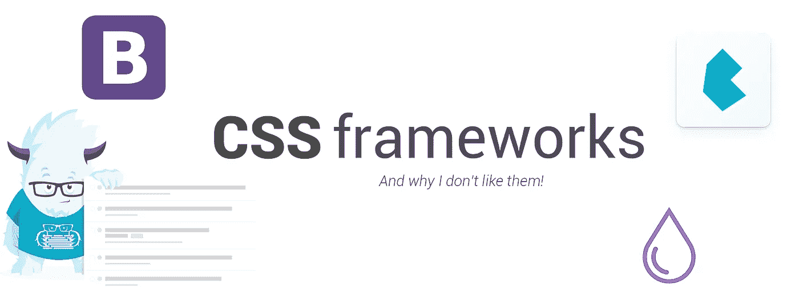

# 反对 CSS 框架的案例

> 原文：<https://medium.com/hackernoon/a-case-against-css-frameworks-bea9a6997f8e>

我不喜欢 CSS 框架。我总是在实际构建之前用草图设计我的 web 应用程序，我可能会认为我对某个登录页面应该是什么样子有一个很好的想法，但是当我首先进入代码时，最终结果总是以我预想的设计的淡化版本结束。这是因为它一部分是由我塑造的，一部分是由默认的 CSS 值和限制决定的，这些限制决定了 HTML 和 CSS 的易用性和易用性。当前的 CSS 框架让这个问题变得更加糟糕。

布尔玛、Bootstrap、Foundation、Pure……我不得不为他们所有人建立网站，还有一些网站。有些比其他的更糟糕，但是他们都有一些共同点:他们把你实际上不知道的设计哲学和代码带进你的项目。

我不是在这里谈论像配色方案或字体系列这样的事情，我是在谈论一些小事情，你的注册按钮上的空白，你的透明按钮上的边框的厚度，你的非活动元素的不透明度，这些事情已经为你定义好了，它们本身似乎没有足够的意义去修改。

通常，当一个网站是用某个框架设计的，有这个框架经验的前端开发人员会立刻感觉到它被使用了。我之所以写 feel，是因为 Bootstrap 隐藏在那些时髦的超大输入元素之下可能不会立即被视觉察觉，但对于使用过 Bootstrap 的人来说，这再明显不过了。

这本身并不令人愉快，但当人们开始将这些 CSS 框架集成到 JS 框架中时，真正的乐趣就开始了！由于不成熟和古怪的必需实践，这些过于固执己见的框架经常充满错误，使得激发真正属于你自己的重要创造性输入变得令人疲惫不堪。

我可能完全错了，我可能完全误解了一切，如果有人能说服我，我会很高兴有另一个好的外观，特别是因为我的客户似乎喜欢这些框架(有一些好的理由)。但是我绝对不建议一个初级前端开发人员开始使用这些东西，不关心设计并且已经在这个行业工作了 10 年？如果你愿意，那就继续吧，但是如果你只是在学习 CSS 和 HTML，那就离得越远越好！你可以根据需要创建自己的`.float-right`类。