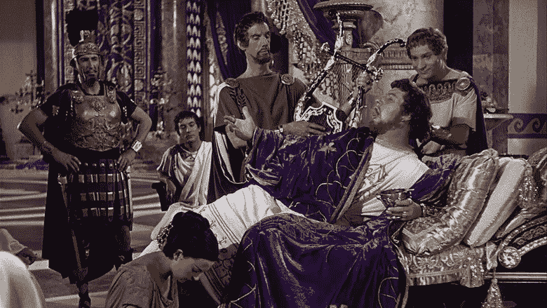

# 一个关于做手脚和引火烧身的警示性商业故事

> 原文：<https://medium.com/hackernoon/a-cautionary-business-tale-about-fiddling-and-getting-burned-550bff126cd4>

八年前，我接手了一家初创公司的客户，为他的新网站撰写文案。他正在为美食家开发一个在线门户网站，美食家可以在这里众包和回顾餐厅体验，然后获得优惠和奖励。这不是一个特别复杂的工作，坦率地说，我对这个概念非常兴奋，以至于写第一稿根本没花我多少时间。花了太长时间的是我的客户。他支支吾吾，要求进行无关紧要的编辑，然后消失几周或几个月，重新露面告诉我业务的这个或那个方面发生了变化，或者标志正在重新设计，或者名称重新评估。一年半的时间里，我不停地用破旧的手指敲敲打打，之后就再也没有他的消息了。我的电子邮件和电话无人回复，我也从未得到全额报酬。

在那段时间里，Yelp 在社交媒体意识中爆发了。

也许我客户的想法最终会失败。也许它从来没有和 Yelp 竞争过。或者它会把 Yelp 当午餐吃掉。我们永远也不会知道，因为我的委托人无法振作起来。

据说，完美是好的敌人。或者去屠杀一个著名的习语，当罗马在他周围建立起来的时候，我的委托人拨弄着被烧死了。

当我在 2002 年开始我的第一份自由写作业务时，我在不到三周的时间里就建立了我的网站。我从来没有建过网站。我不知道我所做的一切是对的还是有用的。(回头看，我注意到我的标志与断头台惊人地相似。我的错。)但就在那一刻，我需要一个路标，告诉人们我的存在，还需要一个广告牌，如果有人想看我的作品集，可以建立信誉。如果它需要调整，我可以稍后再修改——我也这么做了。毕竟这是个网站，不是纹身或拉什莫尔山。

当然，尽职调查是明智之举。让你的产品或服务走出家门也是如此。这两者并不相互排斥。如果你正在创业，尤其是与服务相关的、不需要太多管理费用或物流的小企业，做好你的功课，打造你认为需要的工具，与你的律师和会计师交谈，决定如何推销自己，然后让这个宝贝运转起来——在几周内，而不是几个月或几年内，上帝保佑你。除非你很有钱，否则你需要开始赚钱，如果可能的话，比你的竞争对手更好地建立你的信誉和关系网。

我知道耐克的著名广告语已经过时了。但是“照做就是了”是有原因的产生共鸣的不仅仅是“多想想，多思考一些，把事情考虑得久一点。”

> [黑客中午](http://bit.ly/Hackernoon)是黑客如何开始他们的下午。我们是 [@AMI](http://bit.ly/atAMIatAMI) 家庭的一员。我们现在[接受投稿](http://bit.ly/hackernoonsubmission)，并乐意[讨论广告&赞助](mailto:partners@amipublications.com)机会。
> 
> 如果你喜欢这个故事，我们推荐你阅读我们的[最新科技故事](http://bit.ly/hackernoonlatestt)和[趋势科技故事](https://hackernoon.com/trending)。直到下一次，不要把世界的现实想当然！

