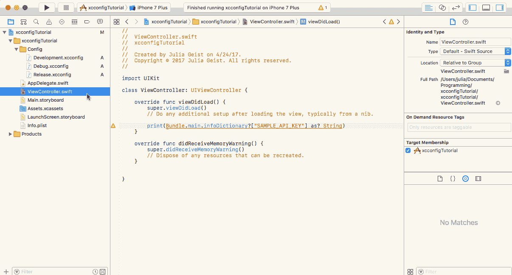
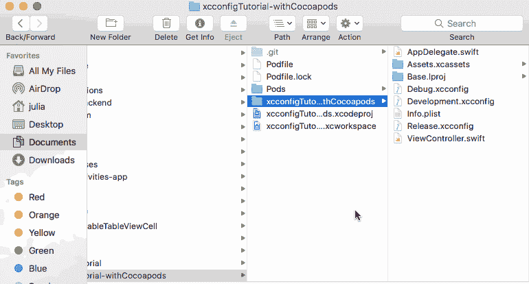
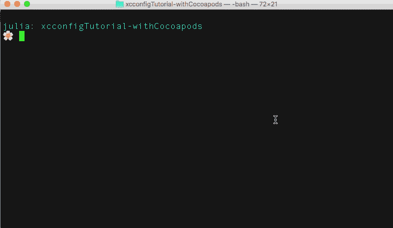
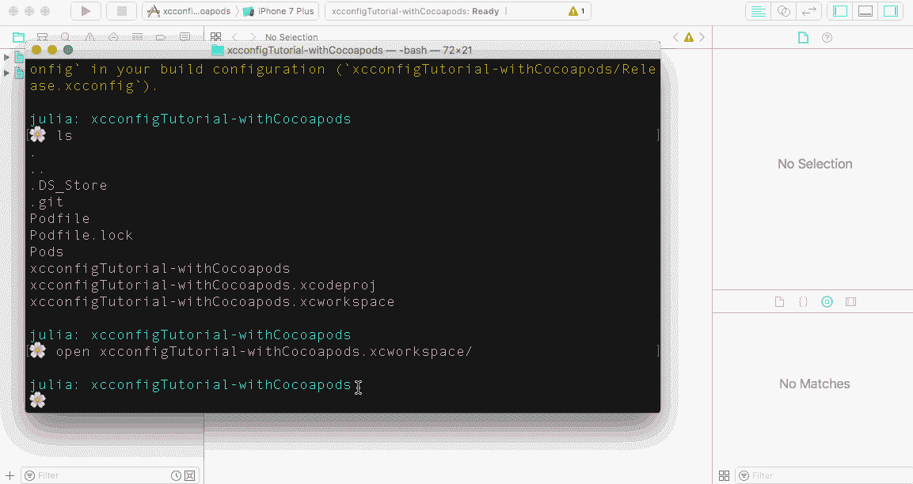
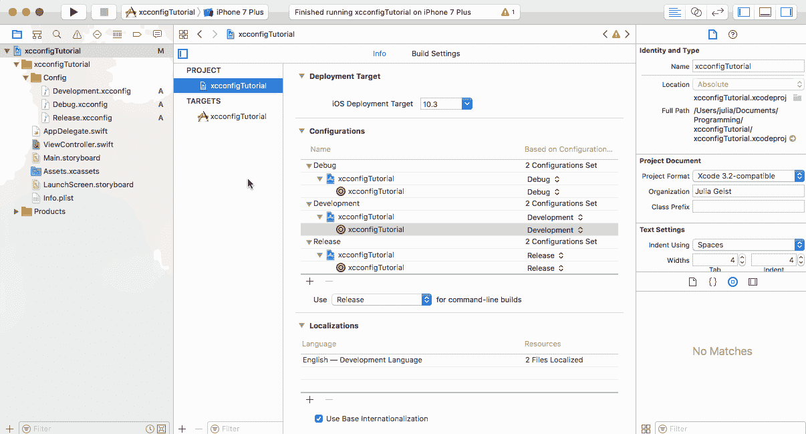
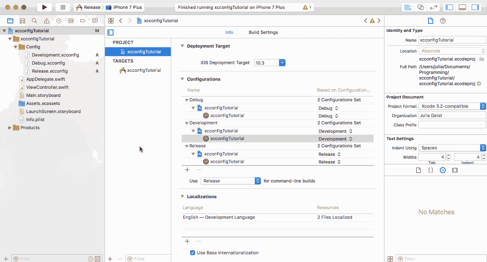
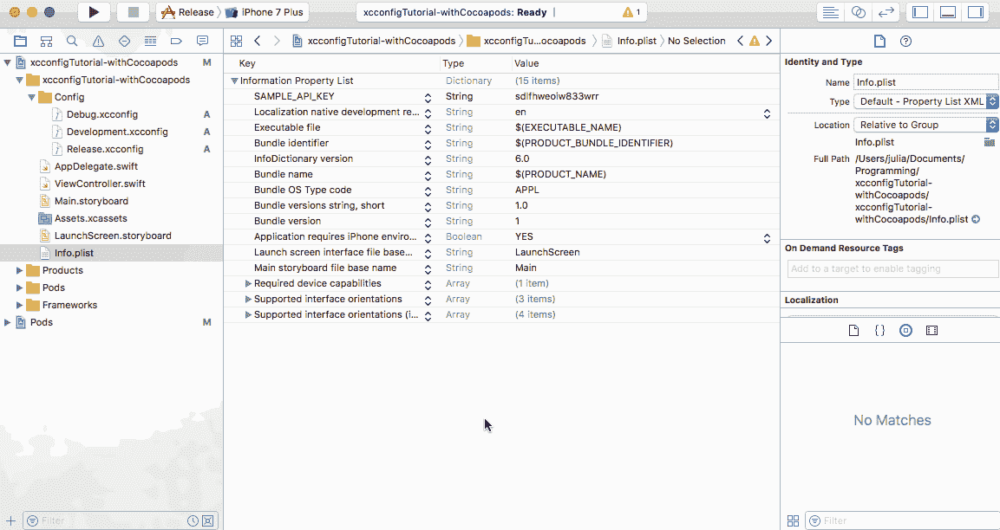

# 使用组织 iOS 调试、开发和发布状态的指南。xcconfig 文件

> 原文：<https://medium.com/hackernoon/a-cleaner-way-to-organize-your-ios-debug-development-and-release-distributions-6b5eb6a48356>

## 在 Swift 3 中存储 API 密钥和其他常量

## 介绍

当你的应用程序在 App Store 上线后，你至少要维护你的应用程序的两种状态:在 App Store 上的应用程序，以及你在[开发](https://hackernoon.com/tagged/development)中主动添加功能的应用程序。

如果你有一个运行在后台的服务器，你肯定会有一个用于生产的服务器和一个用于主动开发的服务器。在 iOS 开发方面，我们需要某种方式来组织我们的代码库，以防止应用程序的生产版本崩溃。

一个`Constants`文件或`info.plist`文件通常用于存储变量，这些变量不仅包含敏感数据，还可能根据应用程序的状态而改变，比如服务器 URL 和 API 密钥。

这是一个通过应用程序的不同状态设置不同配置的指南:`Debug`、`Development`和`Release`——并在`Project Settings`中指定我们的配置。

## 如何添加。xcconfig 文件添加到 XCode 项目中

如果你没有使用 Cocoapods，可以在这里下载启动项目[，如果你正在使用，可以在这里](https://github.com/juliascript/xcconfigTutorial/commit/053528c6ce8df9a50fdbf575bbaaae8fe1b9caf0)[下载](https://github.com/juliascript/xcconfigTutorial-withCocoapods/commit/f58e5821dee2c8101d9ae6bea36159c8eae8cbe4)。

1.  在您的 XCode 项目中创建一个新文件夹——我将我的文件夹命名为`Config`。我正在添加三个`.xcconfig`文件:`Development`、`Debug`和`Release`。

2.将配置文件添加到项目设置中。您很可能需要为`Development`创建一个额外的配置。

如果你没有使用 Cocoapods，你可以跳到第三步。如果你正在使用 Cocopods，你必须删除`.xcworkspace`文件、`Podfile.lock`和`Pods/`目录。**不要删除 Podfile。**

然后，去你的终端。确保您在项目目录中并运行`pod install`。

现在，打开新生成的`.xcworkspace`文件，并在您自己的`.xcconfig`文件中添加 Cocoapods 的`.xcconfig`路径。

3.将新方案添加到您的项目中，并确保您的目标是您的 XCode 项目名称。根据您的配置设置您的方案。

4.现在您可以在配置文件中设置变量，并通过您的`info.plist`文件访问它们。

## 警告和常见陷阱

*   注意不要将字符串作为键值放在`.xcconfig`文件中——它会自动将任何值字符串化。
*   在这些例子中，我将我的`.xcconfig`文件推送到我的 repo 中，这样你就可以下载并运行这个项目。在真实的工作环境中，您应该将这些文件放在您的`.gitignore`中，然后拥有一个私有的存储库来跟上配置文件中的更新。

如果你没有使用 Cocoapods，你可以在这里找到工作代码,如果你使用了，可以在这里找到。如果您有任何问题，请告诉我！

> [黑客中午](http://bit.ly/Hackernoon)是黑客如何开始他们的下午。我们是阿妹家庭的一员。我们现在[接受投稿](http://bit.ly/hackernoonsubmission)并乐意[讨论广告&赞助](mailto:partners@amipublications.com)机会。
> 
> 如果你喜欢这个故事，我们推荐你阅读我们的[最新科技故事](http://bit.ly/hackernoonlatestt)和[趋势科技故事](https://hackernoon.com/trending)。直到下一次，不要把世界的现实想当然！

