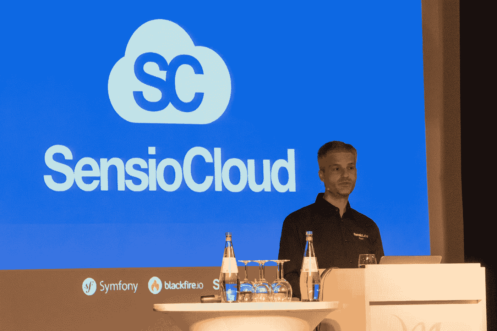
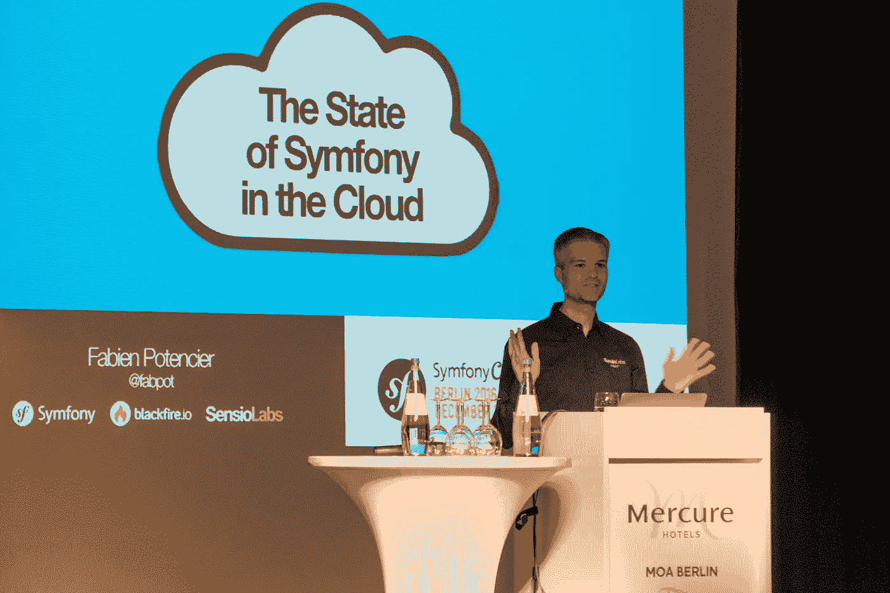
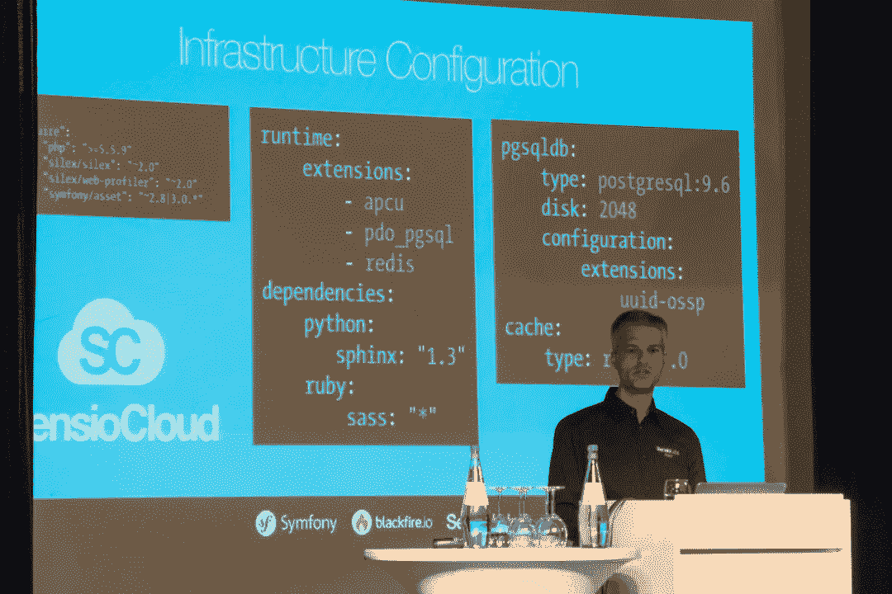
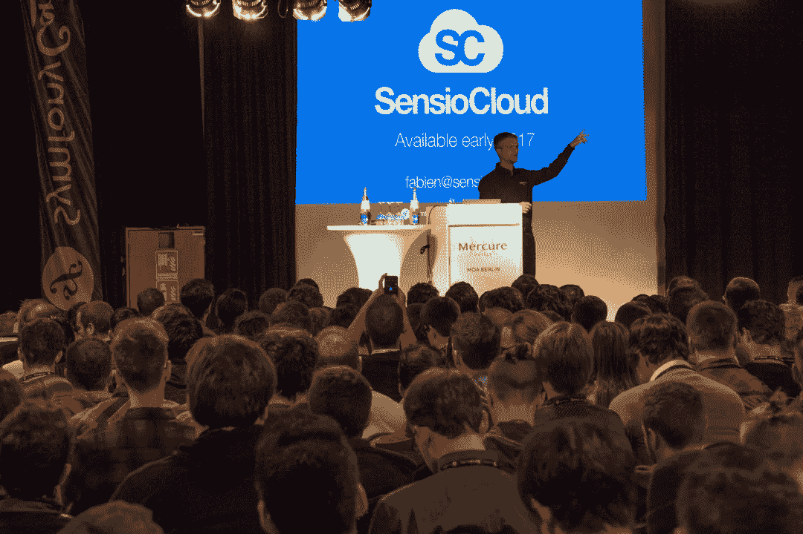
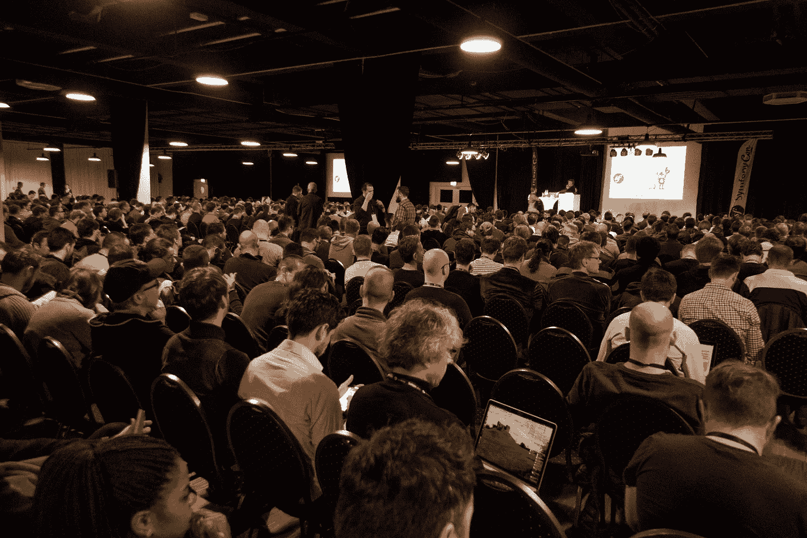
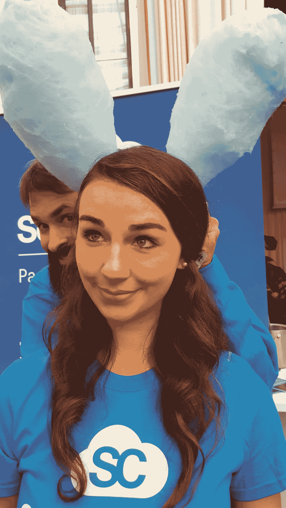

# Symfony 的云

> 原文：<https://medium.com/hackernoon/a-cloud-for-symfony-401ae6daad6c>

Fabien Potencier, CEO of SensioLabs announcing SensioCloud, a Platform-as-a-Service for Symfony

在 2016 年柏林 SymfonyCon 的主题演讲中，SensioLabs 的首席执行官兼创始人杨奇煜·波登西尔宣布推出 [SensioCloud，这是一款全新的完整云产品，专注于 Symfony 应用程序的开发和运行时间](https://sensio.cloud)。该报价将 [Platform.sh](https://platform.sh) 、 [Blackfire.io](https://blackfire.io) 、[、Fastly.com](https://fastly.com)和 [SensioLabs 自己的支持服务](https://sensiolabs.com)组合成一个全面的套餐。

> 触手可及的全面维护堆栈
> 
> 通过 YAML 文件中的几个配置行启用任何服务。SensioCloud 支持 PHP 5 和 7。每个服务都部署在自己定制的轻量级 LXC 容器中，以获得最佳性能、稳定性和灵活性。
> 
> 在列表中没有看到您的服务？提出要求，我们会让它发生。

一些关键优势包括一组多样化的托管服务、基于 Composer 的构建流程、Symfony 优化的运行时、巨大的可扩展性(顶层可以为一个应用提供超过 300 个 CPU 和近 6TB 的 RAM)，以及整个堆栈(从 CDN 到 PHP 到数据库/缓存/搜索服务)99.99%的正常运行时间保证。杨奇煜指出，其他 PaaS 产品只能在组件上提供单独的 SLA，而不是整个产品。

SensioCloud 的上市迫在眉睫——主题演讲中给出的指导是 2017 年初。SensioCloud 团队随后在展会现场向数百名感兴趣的 Symfony 开发者进行了演示。

The title of the Keynote: “The State of Symfony in the Cloud”

Fabien Potencier introduced SensioCloud by showing the history of Symfony’s efforts to be prepared for Cloud-first development and deployment.

SensioCloud supports the provisioning, orchestration, configuration of rich services, such as PostgreSQL (example shown).

SensioCloud will be available in early 2017

Showtime!

1,200 Symfony developers in attendance. A seriously hard-core technical crowd.

Frédéric Plais, CEO of Platform.sh, tweeting the good news

Anne-Sophie Bachelard of SensioLabs greeting the crowd and introducing Fabien.

The Sulu team, long friends of Platform.sh, in attendance.

The SensioCloud team sweetened up visitors to the booth by serving cotton candy.

> [黑客中午](http://bit.ly/Hackernoon)是黑客如何开始他们的下午。我们是阿妹家庭的一员。我们现在[接受投稿](http://bit.ly/hackernoonsubmission)并乐意[讨论广告&赞助](mailto:partners@amipublications.com)机会。
> 
> 如果你喜欢这个故事，我们推荐你阅读我们的[最新科技故事](http://bit.ly/hackernoonlatestt)和[趋势科技故事](https://hackernoon.com/trending)。直到下一次，不要把世界的现实想当然！

