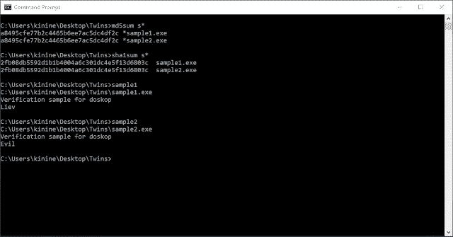
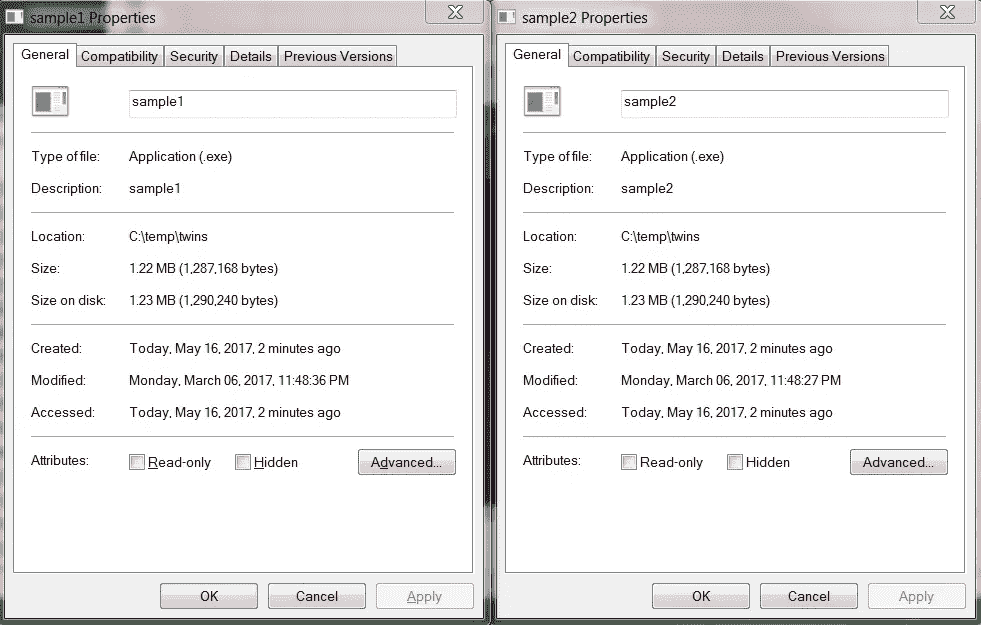
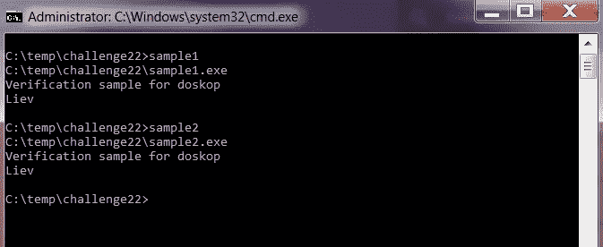

# 碰撞太完美了

> 原文：<https://medium.com/hackernoon/a-collision-too-perfect-279a47fb5d42>

厚脸皮的可执行文件，MD5 和 SHA1 哈希是平等的，不同的运行输出(“吃更多的哈希”挑战写)


Licensed cc-by Anonymous [http://openwalls.com/image?id=399](http://openwalls.com/image?id=399)

在[第一次实际的 SHA1 碰撞攻击](https://shattered.io/)公开后不久，一个有点简短扼要的[挑战](https://roastingbugs.blogspot.co.il/2017/03/eat-more-hashes.html)悬而未决，一个完全意识到我对挑战上瘾的团队成员向我释放了它(谢谢，柳文欢)，可以理解的是，我不得不服从。

前提很简单——两个 PE 可执行文件，相同的 MD5 和 SHA1 散列相互对抗**但是**如承诺的那样——有一点扭曲。一旦运行，它们会有完全不同输出。



Same hash values, different output. (Screengrab from challenge’s blogpost)

# 魔法，这是唯一的解释，对吗？

马上——你可以想象我在自己的环境中用内置工具 certutil.exe 测试了它，以证实这一说法。意识到这是一个可靠的[哈希](https://hackernoon.com/tagged/hash)计算，引导我们讨论这里会发生什么。

显然，两个可执行文件在字节到字节的比较中是相同的，但是运行时使它们不同——这使我们得出一个不可避免的结论，即一些额外的东西，可能是文件元数据(不会影响散列和)。

让我们看一下它的交付机制—它是一个 7z 归档。关于 7z 和其他归档方案，需要注意的重要一点是，它们保留了包含在其中的文件的一些属性。

在给定的存档情况下，保存[安全](https://hackernoon.com/tagged/security)信息是不合适的，比如对压缩文件的权限(Windows 上的 ACE/ACL 和任何适用于其他环境的权限方案)。在整个压缩(解压缩)过程中保持的几个重要元数据是*修改/访问日期*，当然还有——*文件名*。

# “位碰撞”文件属性(原谅误用)

为了解决问题，你希望节省时间，而“玩阴的”是公平的，一般来说，当我们遵循上面的逻辑时，我们从尝试一些可能的解决方案开始。

因此，我们从更改名称开始—不幸的是，输出没有任何变化，这并没有完全否定不同的流程，但从“布丁的证明”来看—这没有影响任何东西。

接下来，让我们一起来看看这些日期。



通过比较，我们可以发现时间上的差异，因此假设更改这些日期以适应另一个日期会导致另一个日期的适当控制流。

> 另一个重要的事实是，文件时间都是可塑的。

现在，如果你只是尝试许多现成的工具，你可能会在互联网上找到，并试图匹配这些时间，你注定会失败。我尝试了 6 种不同的解决方案，但没有一种能够完成任务。


Matching times try-out using Nirsoft’s File Date Changer

幸运的是，我知道问题出在哪里，但是我太懒了，没有从编写自己的工具来完成这个显而易见的选择开始。

# 你漏了一点


You can’t miss what you never realized you never had

事情是这样的 [Windows 文件时间结构](https://msdn.microsoft.com/en-us/library/windows/desktop/ms724284(v=vs.85).aspx):

```
typedef struct _FILETIME {
  DWORD dwLowDateTime;
  DWORD dwHighDateTime;
} FILETIME, *PFILETIME;
```

NTFS 上的每个文件都遵循这种精心设计的时间结构，这使得一次滴答正好为 100 纳秒，它是一个 64 位值，可以分为两个 DWORD(x86-Windows 上的 32 位),高和低，所以粒度数据是存在的，只是在文件经历的大多数进程中不需要它。

因此，控制流不仅受一般日期和时间的影响，还需要更加精确，因为它测试的是较低的纳秒定义位。

这个问题的最终解决方案是通过设置一个简短的 PowerShell 脚本来完成的，因为我对那个该死的脚本语言不太熟悉，所以我并不急于从一开始就使用它。

最后，挑战被解决了。我玩得很开心，谢谢 Kinine 给我这个美丽而有见地的谜语。期待下一个。



Both files are going through the same control flow. WIN!