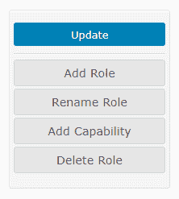
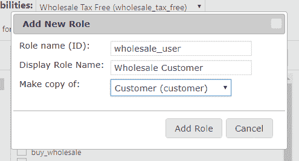
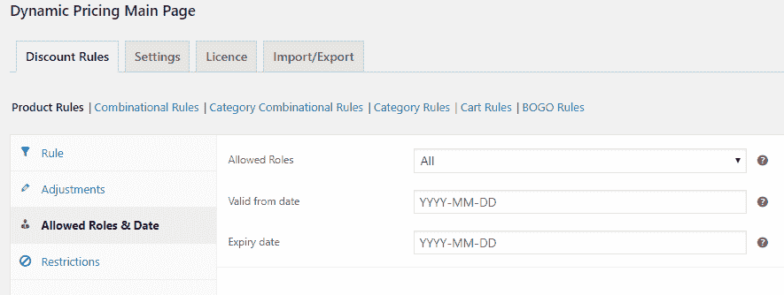
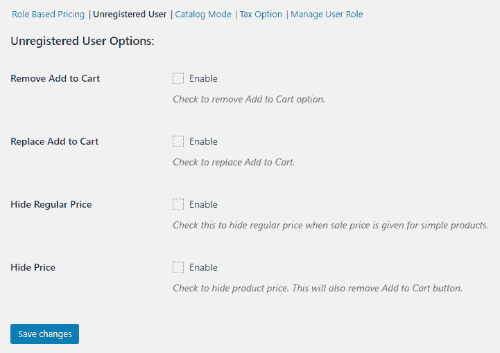
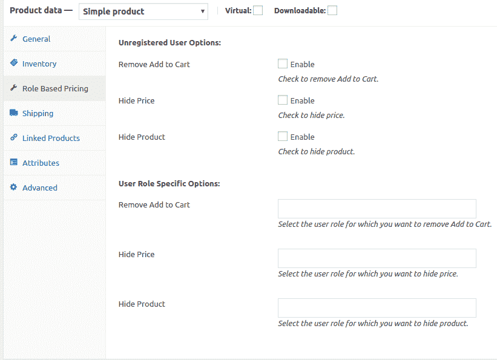

# WooCommerce 批发策略完全指南

> 原文：<https://medium.com/hackernoon/a-complete-guide-to-woocommerce-wholesale-strategies-d69babdcec3a>

[WooCommerce](https://hackernoon.com/tagged/woocommerce) 牛逼到可以构成你店铺的基本架构。然而，随着商店的发展，它的功能也应该进步。这就是 WooCommerce 扩展的由来。WooCommerce 提供了几种建立[批发](https://hackernoon.com/tagged/wholesale)系统的方法。

多亏了大量有用的 WooCommerce 扩展，使得商店既可以只卖批发产品，也可以既卖普通产品又卖批发产品。

为了理解使其工作的整个过程，我们需要首先理解用户角色。

**预定义的 WordPress 和 WooCommerce 用户角色**

安装 WordPress 时，可用的角色有

1.  **管理员。**
2.  **编辑。**
3.  **作者。**
4.  **投稿人。**
5.  **订户。**

安装 WooCommerce 时，会创建两个额外的角色

1.  **客户**
2.  **店铺老板。**

此外，管理员还增加了其他功能

1.  Manage_woocommerce 设置页面。
2.  查看 _ woocommerce _ 报告。

一篇关于如何理解用户角色和能力的文章会给你关于所有用户角色及其能力的详细信息。

当在您的商店购买新商品时，顾客需要为此创建一个账户。默认情况下，此类帐户会关联到“客户”用户角色。这确保他们的能力仅限于从前端更新他们的帐户信息。

**创建批发角色并为其分配能力**

为了**创建和编辑用户角色**，有一个免费插件 [**用户角色编辑器**](https://wordpress.org/plugins/user-role-editor/) 。这个插件将允许你创建新的角色，赋予它能力，甚至编辑现有 WordPress/WooCommerce 角色的能力(除了管理员)

安装并激活插件后，进入**用户**->-用户角色编辑器。您将获得以下选项

1.  更新
2.  添加角色
3.  重命名角色
4.  添加功能
5.  删除角色

由于您现在需要创建一个新角色，因此单击“添加角色”。这会打开这个弹出窗口-

这将使您能够创建一个用户，并为其分配另一个角色的能力。在上面的例子中，我给了**批发客户**，与**客户**相同的能力。

如果您想赋予它一组不同的功能，您可以选择“无”。

**创建批发定价**

为了使用批发定价系统，可以使用 [**动态定价和折扣插件**](https://www.xadapter.com/product/dynamic-pricing-discounts-woocommerce/) 。使用这个插件，你可以为你的批发客户创造特殊的折扣。

在“**允许的角色**下拉列表中，您将获得所有可用的角色，甚至是使用**用户角色编辑器插件**创建的角色。当您不提及任何用户角色时，折扣将适用于所有客户。

有关如何配置不同折扣和价格的详细信息，您可以参考另一篇关于[如何用动态价格和折扣给客户带来惊喜的文章](/learnwoo/how-to-surprise-your-customers-with-dynamic-pricing-and-discounts-6cff15d51a2)。

**创建批发产品目录**

到目前为止，您已经为批发客户设置了不同的价格。如果你的要求只是对批发客户有不同的价格，那么你就不需要在这篇文章中继续了。但是，如果您需要以下功能，您可以这样做。你需要插件 [**WooCommerce 目录模式，批发&基于角色定价。**](https://adaptxy.com/plugin/woocommerce-catalog-mode-wholesale-role-based-pricing/)

1.  隐藏未注册用户的**“添加到购物车”**按钮，并替换为文本“**登录以购买**”。
2.  对**未注册用户**隐藏**常规价格**，并替换为文字“**登录了解价格**”。

1.  为某些**特定用户角色**隐藏“添加到购物车”和“正常价格”。这也可以在产品层面做到。如果您的一些产品是专门为批发客户设计的，您可以为其他客户隐藏“添加到购物车”按钮。
2.  根据用户角色分配税收类别和**税收显示选项**。
3.  全局隐藏价格并禁用商店和产品页面上的“添加到购物车”按钮。
4.  控制产品对特定用户的可见性。您可能希望某些产品只提供给批发客户。您可以选择不向普通客户显示这些产品，而不是隐藏“添加到购物车”按钮。

1.  **区分用户角色的优先级**。特定用户可能有多个用户角色。因此，您需要控制将遵循的基于角色的定价。(注意:这也可以使用动态定价插件来控制)

因此，使用这个插件，你可以根据客户角色在产品级别调整产品可见性、按钮和价格可见性。

**批发策略的其他有用扩展**

一个购物车通知插件将帮助你的客户了解所有可用的折扣。您可以选择在购物车页面触发特定于**产品的**、**类别的**消息，以便向您的客户传达重要信息。关于这方面的深入文章，请参考这篇关于使用购物车通知插件和动态定价插件的文章。

动态定价允许您设置**最小/最大数量**或**金额**以获得适用的折扣。但是，您可能还想设置最小/最大采购数量或金额。在这种情况下，[最小/最大数量](https://woocommerce.com/products/minmax-quantities/)扩展会有所帮助。如果您的客户的购物车没有达到阈值数量/金额，该插件将限制您的客户在结账过程中继续操作。该插件还允许您对某些产品进行例外处理。

这样，几个插件和一些基本设置，你的批发商店就准备好了！