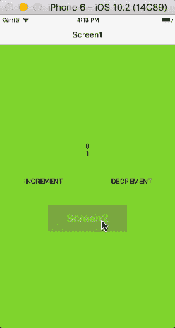
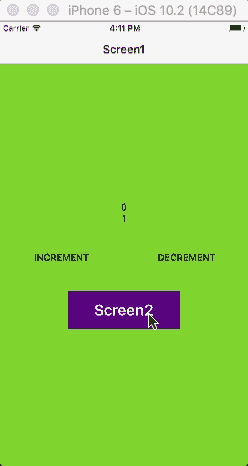

# 集成 React-Navigation 和 Redux 的全面指南，包括认证流程

> 原文：<https://medium.com/hackernoon/a-comprehensive-guide-for-integrating-react-navigation-with-redux-including-authentication-flow-cb7b90611adf>


# [***我在这篇文章的最后添加了一个更新，请查看一下***](#68a2)

React-Native 社区最终接受了 React-Navigation 作为默认导航解决方案。React-Navigation 有一个庞大而强大的 API，最好的一点是 React-Navigation 为 redux 提供了非常好的支持，但我个人认为的坏消息是缺乏适当的文档。在本文中，我试图解释将 React-Navigation 与 Redux 集成的基础知识，并最终将*认证*流程引入到应用程序中。我将本文分为两部分，第 1 部分包含集成 redux & react-navigation 的基本设置，第 2 部分包含认证的逻辑流程。*这两部分都包含在本文*中。

# 先决条件

要继续阅读，你至少应该有 React-Native、React-Navigation、Redux 的经验。我没有在演示应用程序中使用任何身份验证 API(这在演示中不是问题，流程将与真实应用程序相同)。在现实世界中，你需要像 redux-thunk 这样的东西。我使用 Redux-Persist 来模拟持久化用户会话的真实行为。

## 第 1 部分:用 redux 设置反应导航

将 React-Navigation 与 redux 集成的整体思想是在 redux 中管理导航状态。因此，我们可以从全局 redux 商店轻松管理所有的应用程序状态。

在第 1 部分中，我们将通过创建一个导航缩减器来集成 redux 和 React-navigation，导航缩减器将处理导航的状态，并添加 redux 的 dispatch 方法来处理通过 redux 分派的动作。为了更好地逐步理解，我创建了一些小的可演示的要点，了解这些小部分如何集成到当前的第 1 部分中的整个项目代码可在此处获得(回购的主分支):

[](https://github.com/shubhnik/redux-react-navigation) [## shubhnik/redux-react-导航

### Redux-React-Navigation-React-Native+Redux+Redux-Persist+React 导航

github.com](https://github.com/shubhnik/redux-react-navigation) 

首先让我们熟悉一些 react-navigation 的 API，我们将在集成 redux 时使用这些 API:

1.  这个 API 帮助我们将自己的`navigation`道具传递给导航器。传递给导航器的`navigation`道具将覆盖默认的`navigation`道具。
2.  `[getActionForPathAndParams](https://reactnavigation.org/docs/routers/api#getActionForPathAndParams-path-params)(path, params)`:这个 API 接收`path(the key defined for a route in Navigator`和`params`，并返回一个更新导航状态所需的动作。用简单的话它告诉我们"*嘿！您需要执行此操作来导航到此路径。*考虑下面的例子，参见下面的 *console.log* ，它表示对`routeName: ‘screen1’`执行一个`NAVIGATE` *动作*:

3.`[getStateForAction(action, state)](https://reactnavigation.org/docs/routers/api#getStateForAction-action-state)`:我们已经计算了使用`getActionForPathAndParams`导航到特定路线的动作，现在我们需要更新导航器的状态以实际导航到该路线。为此，`getStateForAction`派上了用场。它接收操作和导航器的当前状态，并返回新的更新状态。简单地说，它说*嘿！我将根据您提供给我的操作和当前状态，给您一个新的导航状态。如果不能理解提供的*动作*，将返回 null。考虑一下这个示例演示代码，以便理解`getStateForAction`是如何工作的:*

*NewStateOfNavigator* containing the new route “screen2” and index for new navigation state updated to 2.

我们已经计算了新的状态，现在我们想把这个状态传递给导航器。因此，让我们来完成整合 redux 和 react 导航的工作:

*   让我们创建一个缩减器 *navigationReducer* 来处理导航状态:

上面的缩减器为导航器返回新的状态。`newState`将会是`null`如果提供给`getStateForAction`的动作不可理解，那么这种情况可能是当我们试图导航到一条未在我们的导航器`AppNavigator`中定义的路线时。

*   现在让我们将计算出的新状态从 reducer 传递到 navigator(*app navigator*)。我们还会将调度传递给导航器。为此，我们将使用上面讨论过的`addNavigationHelpers` API。下面是我们将用来将新的`navigation`道具(包含`state`和`dispatch`)传递给导航器( *AppNavigator* )的基本代码:

在上面代码片段的第 17 行，我们将`dispatch`和`state`传递给了导航器。在`AppNavigator`中定义的所有路线将接收这些`state`和`dispatch`。

*   现在怎么办？我们如何导航到新路线(屏幕)？我们要做的是分派一个动作，然后`[basicNavigationReducer](https://gist.github.com/shubhnik/b55602633aaeb5919f6f3c15552d1802)`会计算新的状态并将其传递给导航器。导航状态将被更新，我们将导航到新的路线。假设我们目前在*屏幕 1 上，*下面是一个演示，演示如何分派一个操作来导航到*屏幕 2* :

`[NavigationActions](https://reactnavigation.org/docs/navigators/navigation-actions)`react-navigation 的 API 返回一个动作对象，如上面的 gist 所示。返回的对象与`getActionForPathAndParams`返回的对象相同。

现在我们已经检查了所有的部分:一个处理导航状态的缩减器，将我们自己的导航属性传递给导航器，调度操作来更新导航状态。我们在 gists 中看到了它们，现在您应该检查所有这些部件的组装和协同工作，理解这里的流程:

[](https://github.com/shubhnik/redux-react-navigation) [## shubhnik/redux-react-导航

### Redux-React-Navigation-React-Native+Redux+Redux-Persist+React 导航

github.com](https://github.com/shubhnik/redux-react-navigation) 

## 第 2 部分:实现认证流程

在这一部分中，我们将使用 redux 和 react-navigation 创建一个认证流。我们将关注该导航器以供参考:

```
const AppNavigator = StackNavigator({
  login: {
    screen: Login
  },
  screen1: {
    screen: Screen1
  },
  screen2: {
    screen: Logout
  }
});
```

下面是我们的身份验证流程的工作方式:

*   如果用户没有登录，他/她将被显示`login`屏幕，他/她不能访问`screen1`或`screen2`。
*   已登录的用户必须注销才能返回登录屏幕。
*   如果用户登录，关闭应用程序，然后重新打开应用程序，将显示`screen1`，而不是`login`屏幕。

我们将使用这个可演示的最小 loginReducer 来管理我们的登录状态:

管理身份验证流状态的最重要的逻辑是由我们的导航缩减器管理的。我们的`[basicNavigationReducer](https://gist.github.com/shubhnik/b55602633aaeb5919f6f3c15552d1802)`已经变成了一个小的[更有能力的 reducer](https://gist.github.com/shubhnik/9f7bafd3145e66434705cd1e995d1356) ，它可以处理认证流，让我们来看看我们新的 [navigationReducer](https://gist.github.com/shubhnik/9f7bafd3145e66434705cd1e995d1356) :

navigationReducer.js

让我们一步步度过这个`navigationReducer`:

*   在第 4 行，我们正在计算`ActionForLoggedOut`，当用户没有登录时，我们需要导航到`login`屏幕的动作。在第 7 行，我们正在计算`stateForLoggedOut`,它将返回注销用户的导航状态，即*登录屏幕将被显示。*
*   在第 5 行，我们正在计算`ActionForLoggedIn`，当用户登录时，我们需要导航到`screen1`的动作。在第 8 行，我们正在计算`stateForLoggedIn`，它将返回登录用户的导航状态，即*屏幕 1 将被显示。*
*   在第 9 行，我们正在将`stateForLoggedOut`和`stateForLoggedIn`组装成`initialState`。根据用户是否登录，我们将传递`stateForLoggedIn`，如果没有登录，我们将从`initialState`传递`stateForLoggedOut`到我们的导航器`AppNavigator`:

conditionally passing state to navigator based on if user is logged in or not

*   在`[navigationReducer.js](https://gist.github.com/shubhnik/9f7bafd3145e66434705cd1e995d1356)`的第 19 行，考虑`Login`的情况。在调度`LOGIN`动作时，在`[loginReducer.js](https://gist.github.com/shubhnik/55cb0a9f82d6eeb20004e43ee6b3e746)`中`isLoggedIn`字段被设置为`true`，相应地我们将更新`stateForLoggedIn`，现在我们的导航堆栈将由两条路线组成:`screen1`堆叠在`login`屏幕上。因此，我们将导航至`screen1`。我们将通过禁用手势和后退按钮来配置`screen`，因为我们希望在注销情况下将`login`路线保留在导航堆栈中。
*   在`[navigationReducer.js](https://gist.github.com/shubhnik/9f7bafd3145e66434705cd1e995d1356)`的第 25 行，考虑`Logout`的情况。在调度`LOGOUT`动作时，`isLoggedIn`字段被设置为假，这导致`stateForLoggedOut`被提供给导航器。因此，我们必须更新导航状态的`stateForLoggedOut`块，并将其重置为仅包含`login`路线。
*   在`[navigationReducer.js](https://gist.github.com/shubhnik/9f7bafd3145e66434705cd1e995d1356)`的第 36 行，除了`LOGIN`和`LOGOUT`之外的所有调度动作都是默认情况下处理的。目前在演示应用中，这里处理的唯一动作是导航到`screen2`。由于`screen2`只能由登录用户访问，因此我们只需要更新`stateForLoggedIn`。
*   还有一个未决案件正在处理行动`@@redux/INIT`。这个动作是 redux 在 app 打开时自动调度的。我们在这种情况下考虑这个动作:假设我们没有考虑这个动作，那么，如果用户已经登录，那么将向用户显示`screen1`。当前导航栈将只包含`screen1`。现在用户导航到`screen2`，并从那里调度`LOGOUT`动作。因为对于`LOGOUT`动作`login`屏幕需要显示，但它不在我们当前的导航堆栈中。因此，一个不太流畅的动画将会发生(见下面左 gif 标题动画)。但是由于我们正在处理`@@redux/INIT`，并且我们正在导航栈 [*(见第 16 行)*](https://gist.github.com/shubhnik/9f7bafd3145e66434705cd1e995d1356#file-navigationreducer-js-L16) *，*的底部插入`login`路线，因此我们启用了注销的平滑过渡动画(右下图)。考虑以下两个动画(有无处理`@@redux/INIT`):



On left we aren’t handling the “@@redux/INIT” and hence the unpleasant header animation, on right we are handling the “@@redux/INIT” action and hence a more natural and a pleasant header animation.

到目前为止，我们已经研究了处理认证流的`navigationReducer`。现在已经建立了身份验证流程。我使用 Redux-Persist 来持久化用户会话。React-Navigation 和 redux 最终找到了与认证流的和谐😃。

要检查完整的认证流程及其运行方式，请查看此 repo 的 *authFlow 分支，以便更好地理解:*

[](https://github.com/shubhnik/redux-react-navigation/tree/authFlow) [## shubhnik/redux-react-导航

### Redux-React-Navigation-React-Native+Redux+Redux-Persist+React 导航

github.com](https://github.com/shubhnik/redux-react-navigation/tree/authFlow) 

## 在 Android 中处理硬件返回按钮

因为我们用 redux 处理导航状态，所以 react-navigation 失去了对管理状态的控制。因此，我们必须自己处理 Android 中的后退按钮。react-navigation 的官方文档中有一个关于在 Android 中处理后退按钮的很好的文档，在这里:

 [## Redux 集成指南| React 导航

### 编辑描述

reactnavigation.org](https://reactnavigation.org/docs/guides/redux#Handling-the-Hardware-Back-Button-in-Android) 

## 下一步是什么？

集成 redux 和 react-navigation 的最重要部分已经完成。添加更复杂的嵌套导航现在不会是什么困难的任务。我将为 github repo 添加更多的嵌套导航演示。[别忘了开始关注回购，了解更多更新](https://github.com/shubhnik/redux-react-navigation)。你也可以分叉回购，与社区分享你的解决方案。

如果这个指南碰巧对你有用，那么请用掌声表达你的爱，不要忘记与他人分享🔔 🎉。你可以在 [***推特***](https://twitter.com/shubhniksingh) 上关注我，有时我的推文有些意义。

# 更新

1.  最初我使用了`[**@@redux/INIT**](https://github.com/shubhnik/redux-react-navigation/blob/authFlow/src/Reducers/navigationReducer.js#L25)`，这不是一种好的做法。我们不应该剥夺 redux 自身的行为😢。您可以不使用 [***nestedNavigators 分支***](https://github.com/shubhnik/redux-react-navigation/tree/nestedNavigators) ***中的`@@redux/Init`来检查我是如何管理状态的。***

2.自从我发表这篇文章以来，我又增加了两个分支 [*nestedTabs*](https://github.com/shubhnik/redux-react-navigation/tree/nestedTab) 和[*nested navigators*](https://github.com/shubhnik/redux-react-navigation/tree/nestedNavigators)*演示更复杂的导航结构。*

*3.欢迎讨论/反馈😄。*