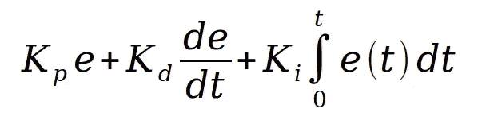
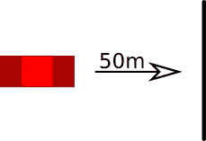
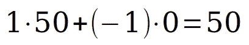
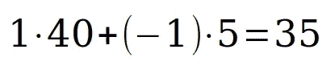

# PID 控制器的概念分解

> 原文：<https://medium.com/hackernoon/a-conceptual-breakdown-of-pid-controllers-9fa072a140a5>

# 介绍

关于 PID 如何工作有很多解释，其中很多都很棒。主要问题归结到如何解释它。当我对[数学](https://hackernoon.com/tagged/mathematics)知之甚少的时候，我试图拾起 PID 方程的概念，并且非常努力地寻找一个没有用我理解的符号解释它的教程。符号很可怕，好吗？

我肯定你们中的很多人都很擅长阅读数学符号(我现在也是，在有限的程度上)，但是作为一个不习惯的人，我发现这些符号和符号非常吓人。

我想在这里用尽可能少的数学来解释 PID，更喜欢概念而不是方程。它们适用于大量的应用程序，我认为任何人(甚至除了程序员)学习都非常有用。

# 什么是 PID 控制器？

PID 控制器本质上是一种稳定系统的方法，无论是四轴飞行器、核反应堆中的燃料棒，还是生物机械狗挽具的臂的[角](https://www.youtube.com/watch?v=8KrNaFFhhw0)。

PID 采用一定量的误差(稍后将详细介绍)和减少所述误差的方法，并计算出逐步解决误差的速率。例如，它是从陀螺仪获取角度数据并告诉每个转子旋转速度的方法。

P、I 和 D 代表比例、微分和积分增益。稍后还会有更多内容！

# 问题

你在一辆可以向前或向后靠近白线的车里。你唯一的指示是写一个计算机程序直接停在那条白线上，同时尽可能快地到达它。你的程序所能做的就是对汽车施加一个负的或正的加速度。

我想到的最简单的想法是，好吧，如果你在线后，踩油门！如果你在这条线的前面，就向后油门！

很容易看出这是一个有缺陷的解决方案。当你到达终点线时，你会开得太快，然后越过终点线。所以，也许你的下一个解决方案是根据你离线的距离成比例地踩下油门**。离得越近，推气越少。**

**现在，这个方法的问题是，它会导致与之前方法相同的现象。你振荡，越过这条线，反向，以另一种方式越过它。这将总是达到均匀振荡(类似于正弦波)。**

**虽然这不是我们的解决方案，但这是它的一部分。这是我们的 **P** ID 的**比例**部分。**

# **(部分)解决方案**

**如果你有办法在接近终点线时减速会怎么样？一种甚至在你到达目标之前就先发制人放慢速度的方法。**

**这就是圆周率中的**D****D**出现的地方。那些在高中或大学学过微积分的人(如果没有也不用担心！)可能知道什么是导数。不用太深入，它只是一个描述*某事*变化率的方程。例如，你可以把它看作汽车的速度。速度是汽车位置的变化率。**

**如果我们监控汽车移动的速度，那么这就给了我们第二个工具，在那条线上停下来。当我们接近这条线时，我们希望移动得更慢，所以把π**D**中的**导数**想象成一种阻力。我们移动得越快，这个值就越大。随着比例增益水平的降低，我们越接近，这就越容易实现。当误差接近零时，导数增益会降低整体函数。**

**这可能有点令人困惑，所以让我们添加一些数字！**

# **带上数学！**

**假设我们从距离我们试图到达的线 50 米处开始。由于我们距离 50 米，这意味着我们的**误差**等于 50。**

****

**I know. It’s hard to believe that I don’t do art for a living.**

**PID 控制器的每个成员都有一个所谓的**增益**。这是一个简单的数字乘以它改变多少成员影响方程作为一个整体。例如，如果我们的收益都是 1，那么每个成员(P，I 和 D)对等式的影响是相等的。为了简单起见，让我们假设目前我们的增益都是 1。**

**让我们来计算我们的 P 和 D(我们稍后再考虑 I)。我们的比例增益是 50，因为它直接基于我们的误差。现在，我们还没有移动，所以我们的导数增益为零。它直接基于我们的误差变化。让我们把它写出来(K 代表收益，不要问为什么):**

****

**Slam that accelerator!**

**现在我们要走了！也许有点太快了...不管怎样，我们现在正试图把车加速到 50 米/秒。也许这有点太苛刻了？这就是收益的来源。PID 增益的平衡通常是手动完成的，因为它只需要做一次(除非对系统进行改变)。**

**对于眼尖的人来说，你会发现导数的增益是负的。这是因为我们希望它能抵抗比例增益。越接近终点，我们越想走得慢。因此，我们希望速度对整个加速度值产生负面影响。**

**你可以看到，随着我们加速并减小误差，比例增益会降低，导数增益会升高(因为我们在加速)。这甚至意味着，当我们接近这条线时，如果我们走得太快(因为导数增益太高)，它实际上会将我们拉进负加速度，告诉我们的系统减速。**

**假设下一次我们进行数据轮询时，我们现在的速度是 5m/s，我们的汽车距离我们的对象 40 米。让我们看看我们现在加速有多快:**

****

**你可以看到，我们的导数增益，让我们离目标越近，速度越快。它甚至可能把我们的方程式变成负数，导致我们在到达目的地之前放慢速度。这就像当你接近红灯线时按下刹车。**

# **那个 I 呢？**

**现在，我把整数元素留到了最后，因为它通常是最不重要的，也最难看出它的价值。很多系统甚至不包括它！**

**I 代表积分增益。积分就是一段时间内的总和。本质上，如果你有一个映射物体速度的方程，这个方程的积分将映射物体的位置。这是因为它记录了每一瞬间的速度总和，从而得出物体移动的距离。**

**你可能会问，这对 PID 有什么帮助。好了，现在我们有了比例和导数增益，你可能会问如果我们稍微超调会发生什么？问题是现在纠正这个小错误非常慢(很可能会有一些)。当比例增益试图产生一个微小的速度时，导数就开始抵抗。**

**如果我们对总误差求和，那么这将把我们拖回到零误差的黄金地带，解决在非常接近零误差的点上加速缓慢的问题。**

**编辑:正如 Reddit 上一些伟人指出的那样，我遗漏了积分项最重要的用法。积分项用于消除系统误差。**

**例如，假设转弯时有一些小阻力(在现实应用中总是存在)，或者你的四轴飞行器增加了一些重量。**

**积分项由于其积累水平，能够把它拉回正轨。**

# **计算收益**

**没有增益，系统将不能正确反应。它可能振荡，或者导数和比例元素可能相互抵消。平衡它们会使系统达到平衡。**

**不幸的是，没有方法可以直接计算出你想要使用的增益。有很多方法可以根据系统的反应动态地找到好的值，但是有很多论文都是关于如何做到这一点的，我发现这是一个非常难以非数学方式解释的概念。**

**幸运的是，有很好的手动操作方法，除非对系统进行任何更改，否则您不必重复操作。**

**我发现最有用的方法是调整比例增益，直到你有稳定的振荡，并找到一个理想的速度，其中你达到零误差。**

**从那里你要调整导数增益，直到振荡停止。如果系统现在太慢，重复循环。**

# **附录**

**自从我学会了 PID，我就一直对它们着迷。他们很酷，因为他们几乎拥有智慧。只要你能找到错误的来源和减少错误的方法，PID 就能解决这个问题。**

**想通过改变平台的倾斜度来防止球滚出平台吗？使用 PID！想计算一个四轴飞行器倾斜多少才能阻止它横向移动？PID 非常适合这种情况。**

**这非常有趣，也是一个非常广泛适用的概念。**

**如果你做到了这一步，非常感谢你的阅读。这是我一直喜欢与人分享的一个概念，纯粹是因为我发现它很容易解释。如果你觉得有什么困惑，请给我发消息、评论或推文给我 [@bittneradave](https://twitter.com/bittneradave) ，我会尽力回答你的问题/修改这篇文章！**